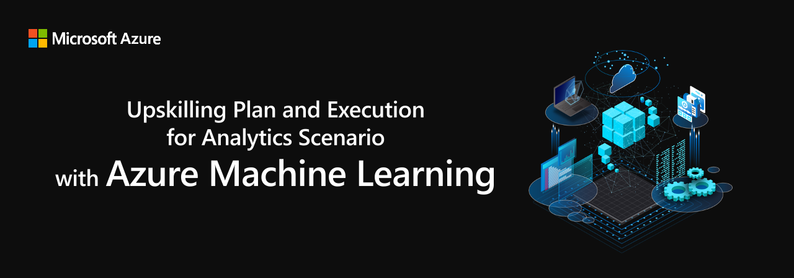

# Upskilling Plan and Execution for Analytics Scenario with Azure Machine Learning

- [Upskilling Plan and Execution for Analytics Scenario with Azure Machine Learning](#upskilling-plan-and-execution-for-analytics-scenario-with-azure-machine-learning)
  - [ゴール](#ゴール)
  - [前提条件 (Prerequisites)](#前提条件-prerequisites)
    - [必須事項 (Required)](#必須事項-required)
    - [あることが望ましい (Preferred)](#あることが望ましい-preferred)
    - [無いことを想定 (Not required)](#無いことを想定-not-required)
  - [モジュール](#モジュール)
  - [スケジュール](#スケジュール)
  - [免責](#免責)
  - [お願い](#お願い)
  - [その他](#その他)

---

## ゴール

* Azure における機械学習について理解を得る。
    - スコープ:
        - L100 (初学者レベル)
            - [AI-900](https://learn.microsoft.com/ja-jp/certifications/exams/ai-900) - [Microsoft Certified: Azure AI Fundamentals](https://learn.microsoft.com/ja-jp/certifications/azure-ai-fundamentals/)
        - L200 (中級者レベル)
            - [DP-100](https://learn.microsoft.com/ja-jp/certifications/exams/dp-100) - [Microsoft Certified: Azure Data Scientist Associate](https://learn.microsoft.com/ja-jp/certifications/azure-data-scientist/)
            - [AI-102](https://learn.microsoft.com/ja-jp/certifications/exams/ai-102) - [Microsoft Certified: Azure AI Engineer Associate](https://learn.microsoft.com/ja-jp/certifications/azure-ai-engineer/) のうち一部 (Computer Vision, Anomaly Detector)
        - 上記はレベル感の目安として示したものであり、本ワークショップ自体は試験との関係性・連動性はありません。また、ワークショップ内で全てをカバーすることを保証するものではありません。
    - スコープ外
        - L300 (経験者レベル)
        - L400 (エキスパートレベル)

---

## 前提条件 (Prerequisites)

### 必須事項 (Required)

* Azure サブスクリプション
* Azure Portal にインターネットアクセス可能な環境
    - ブラウザは Edge や Chrome 等の Chromium 系を推奨
* Visual Studio Code 等のエディタ

### あることが望ましい (Preferred)

* N/A

### 無いことを想定 (Not required)

* 機械学習の知識・経験
* データサイエンスの知識・経験
* プログラミングのスキル

---

## モジュール

| No.  | タイトル | 形式 | 所要時間 |
| ----:| ---- | ---- | ---- |
| 1 | イントロダクション 1 | 座学 | 15分 |
| 2 | ディスカバリー 1 | インタラクティブ | 55分 |
| 3 | AI 概論 | 座学 | 15分 |
| 4 | データサイエンス概論 | 座学 | 30分 |
| 5 | 機械学習概論 | 座学 | 50分 |
| 6 | データエンジニアリング概論 | 座学 | 20分 |
| 7 | AI/ML の事例 | 座学 | 100分 |
| 8 | 今日から始めるために | 座学 | 15分 |
| 9 | Azure における AI/ML の概要 | 座学 | 15分 |
| 10 | Appendix 1: Azure Applied AI Services 紹介 | 座学 | 25分 |
| 11 | Appendix 2: Azure Cognitive Services 紹介 | 座学 | 40分 |
|||||
| 12 | イントロダクション 2 | インタラクティブ | 15分 |
| 13 | ディスカバリー 2 | インタラクティブ | 45分 |
| 14 | Azure Machine Learning 概要 | 座学 | 100分 |
| 15 | Azure Machine Learning 入門 (L100) | 座学/ハンズオン | 160分 |
| 16 | デザイナーを触ってみよう | ハンズオン | 60分 |
|||||
| 17 | イントロダクション 3 | インタラクティブ | 15分 |
| 18 | Azure Machine Learning 実践 (L200) | 座学/ハンズオン | 200分 |
| 19 | コードを動かしてみよう | ハンズオン | 60分 |
| 20 | 参照アーキテクチャ | 座学 | 30分 |
| 21 | Appendix 3: データサイエンス・プロセス | 座学 | 30分 |
| 22 | Appendix 4: Microsoft 製品との連携 | 座学 | 30分 |
| 23 | クロージング | インタラクティブ | 15分 |

---

## スケジュール

| DAY  | 内容 | 所要時間合計 (うち実働時間合計:休憩時間(昼休み60分除く)合計) |
| ---- | ---- | ---- |
| [1](./doc/agenda/DAY1.md) | モジュール No.1 - 11 | 約7時間(425分) (380分:45分) |
| [2](./doc/agenda/DAY2.md) | モジュール No.12 - 16 | 約7時間(425分) (380分:45分) |
| [3](./doc/agenda/DAY3.md) | モジュール No.17 - 23 | 約7時間(425分) (380分:45分) |

---

## 免責

* 進行によって、モジュールの内容が前後したり、一部の内容をスキップする可能性があります。
* 録画等のオペレーションのため、空白の時間が発生する場合があります。
* 本コンテンツの内容には一部最新ではない記述が含まれる可能性があります。 (例えば、プレビュー/GA のステータスや、各種バージョンなど。) 最新の情報を確認する際には [公式のドキュメント](https://learn.microsoft.com/ja-jp/docs/) を参照してください。
* 本コンテンツで示すコマンド, コード, 設定ファイル等はサンプルです。動作の保証はしておりません。

---

## お願い

* 開催中は集中をお願いします。他の業務対応や関係のないスマホ操作等はご遠慮ください。
* 講義形式で進めますので、原則マイクとカメラはオフでお願いします。オンにしていただきたい場合は、その時に別途ご案内いたします。
* 質問は原則チャット欄に書き込んでください。ワークショップの各 DAY 終了後に順次回答します。
  * 質問の意図や背景が分かる端的な内容で記述いただけると大変助かります。例:
    * ○ 初学者でプログラミングも未経験ですが、手元にあるテーブルデータを使って機械学習で回帰分析をはじめる場合のベストプラクティスは何ですか？ (← 具体的な回答ができます。)
    * △ 初学者が機械学習をはじめる場合のベストプラクティスは何ですか？ (← 一般論でざっくりとした回答はできますが、的を射るかどうかは分かりません。あるいは、質問の意図や背景について考え得る限りの場合分けをして回答するため、回答の分量が多くなります。)
    * × 機械学習のベストプラクティスは何ですか？ (← 回答に困ります。質問に対して質問で答えることになってしまいます。)
* ワークショップの改善やご意見・ご要望のヒアリングのため、終了後のアンケートにご協力をお願いします。(別途ご案内します。)

---

## その他

* Teams 会議のURLは別途ご案内します。
* 会議は録画され、後から見直していただけます。
  * 参加人数が少ない場合はオンラインで見直していただけるようにしますが、参加人数が多い場合は動画ファイルを配布する形式になります。
  * 万一録画またはその配付に問題が発生した場合は、ご容赦ください。
* 会議への入退室は自由です。その際の挨拶やメッセージ等は不要です。
* GitHub 上のドキュメントは無期限で共有します。それ以外の資料がある場合はワークショップ後に共有します。
  - ダウンロード, git clone, Fork, PDF等へのプリント, 再配布、すべて OK です。
  - ライセンスは [MIT ライセンス](https://ja.wikipedia.org/wiki/MIT_License)です。
