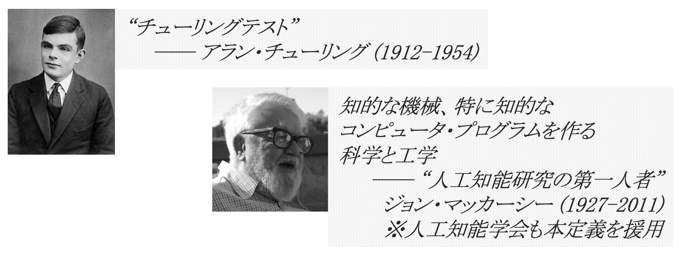
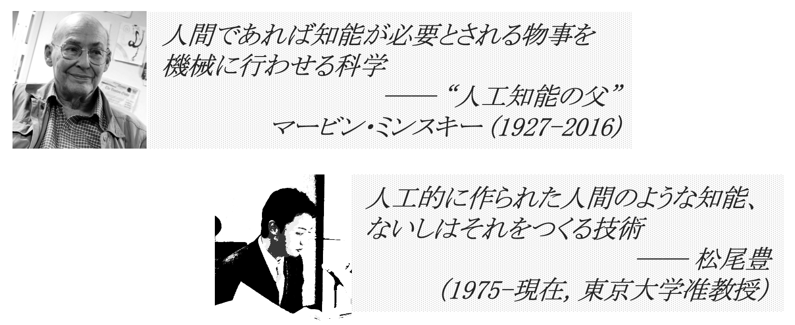
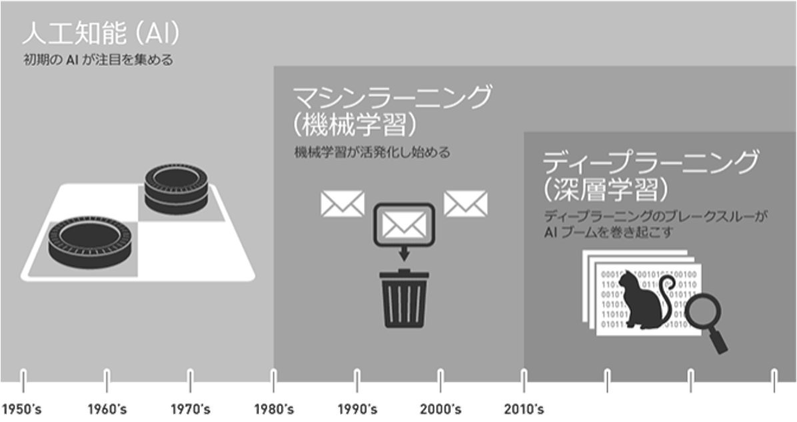
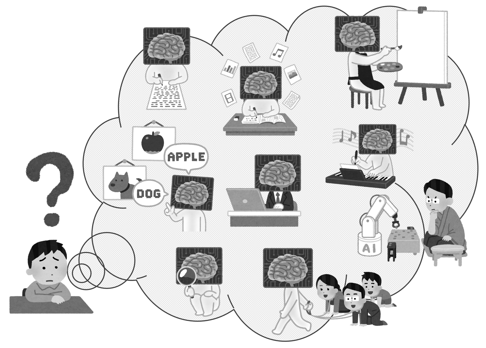
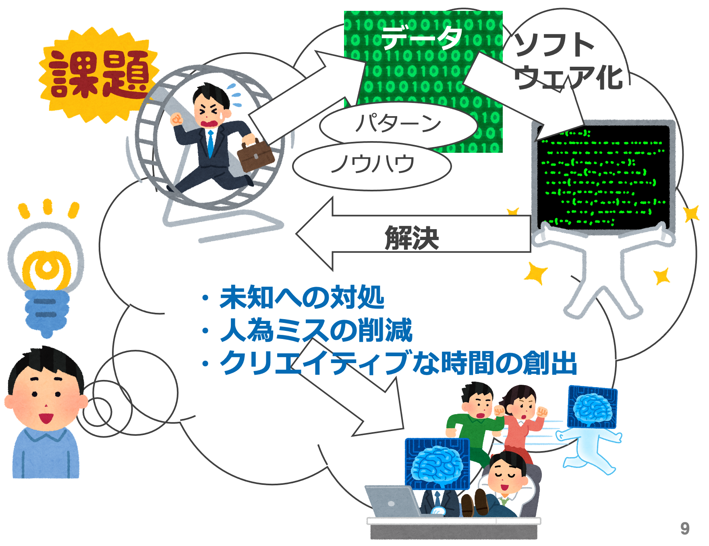

# 3. AI 概論

- [3. AI 概論](#3-ai-概論)
  - [1. AI とは](#1-ai-とは)
    - [1.1. 強い AI と 弱い AI](#11-強い-ai-と-弱い-ai)
      - [1.1.1. 強い AI](#111-強い-ai)
      - [1.1.2. 弱い AI](#112-弱い-ai)
  - [2. AI を実現する要素技術](#2-ai-を実現する要素技術)
  - [3. 大事なこと](#3-大事なこと)

---

## 1. AI とは

* 人工知能 (AI: Artificial Intelligence) の定義は、専門家の間でも定まっていない。(つまり、人それぞれ。)
  * [アラン・チューリング](https://ja.wikipedia.org/wiki/%E3%82%A2%E3%83%A9%E3%83%B3%E3%83%BB%E3%83%81%E3%83%A5%E3%83%BC%E3%83%AA%E3%83%B3%E3%82%B0)(a.k.a. [チューリング・テスト](https://ja.wikipedia.org/wiki/%E3%83%81%E3%83%A5%E3%83%BC%E3%83%AA%E3%83%B3%E3%82%B0%E3%83%BB%E3%83%86%E3%82%B9%E3%83%88)), [ジョン・マッカーシー](https://ja.wikipedia.org/wiki/%E3%82%B8%E3%83%A7%E3%83%B3%E3%83%BB%E3%83%9E%E3%83%83%E3%82%AB%E3%83%BC%E3%82%B7%E3%83%BC), [マービン・ミンスキー](https://ja.wikipedia.org/wiki/%E3%83%9E%E3%83%BC%E3%83%93%E3%83%B3%E3%83%BB%E3%83%9F%E3%83%B3%E3%82%B9%E3%82%AD%E3%83%BC), [松尾豊](https://ja.wikipedia.org/wiki/%E6%9D%BE%E5%B0%BE%E8%B1%8A), etc.
* AI は "強い AI" と "弱い　AI" に分類される。(ここから先は __"弱い AI"__ を扱う。)

### 1.1. 強い AI と 弱い AI

#### 1.1.1. 強い AI

* [汎用人工知能](https://e-words.jp/w/%E6%B1%8E%E7%94%A8%E4%BA%BA%E5%B7%A5%E7%9F%A5%E8%83%BD.html)
* [合成知能](https://www.weblio.jp/content/%E5%90%88%E6%88%90%E7%9F%A5%E8%83%BD)
* [人工意識](https://ja.wikipedia.org/wiki/%E4%BA%BA%E5%B7%A5%E6%84%8F%E8%AD%98)

#### 1.1.2. 弱い AI

* [ルールベース](https://aisaas.pkshatech.com/cx-journal/article/rule-based/)
* [エキスパートシステム](https://ja.wikipedia.org/wiki/%E3%82%A8%E3%82%AD%E3%82%B9%E3%83%91%E3%83%BC%E3%83%88%E3%82%B7%E3%82%B9%E3%83%86%E3%83%A0)
* [機械学習](https://ja.wikipedia.org/wiki/%E6%A9%9F%E6%A2%B0%E5%AD%A6%E7%BF%92)

---

## 2. AI を実現する要素技術

* AI は包括的な概念および分類であり、今日では機械学習を内包する。
* [機械学習 (Machine Learning)](https://ja.wikipedia.org/wiki/%E6%A9%9F%E6%A2%B0%E5%AD%A6%E7%BF%92) は、特定のタスクに関するトレーニングや確率論的アルゴリズムの適用により、未知のデータに対しても既知のデータと同様に結果を出すことができる技術。物事の特徴は人間が定義する。
* [深層学習 (Deep Learning)](https://ja.wikipedia.org/wiki/%E3%83%87%E3%82%A3%E3%83%BC%E3%83%97%E3%83%A9%E3%83%BC%E3%83%8B%E3%83%B3%E3%82%B0) は、機械学習の一種であり応用。物事の特徴を (人間ではなく) コンピュータ・プログラムが抽出するものであり、この技術的なブレークスルーにより高い精度を出すことができるようになった。

[出典](https://blogs.nvidia.co.jp/2016/08/09/whats-difference-artificial-intelligence-machine-learning-deep-learning-ai/)

---

## 3. 大事なこと

* AI の本質を理解し、__自分の課題と照らし合わせて考える__。
* 自分の課題を構成するパターンやノウハウ (経験知) が、データと __[データサイエンス](https://ja.wikipedia.org/wiki/%E3%83%87%E3%83%BC%E3%82%BF%E3%82%B5%E3%82%A4%E3%82%A8%E3%83%B3%E3%82%B9)__ を使ってソフトウェア化できる可能性があるかどうかを考える。あるいは、既に同じことを実現している AI サービスやソリューションが世の中にあるかどうかを調べる。
* 課題を解決することで、仕事をコンピュータに任せ、自分自身のクリエイティブな時間を作り出す。

