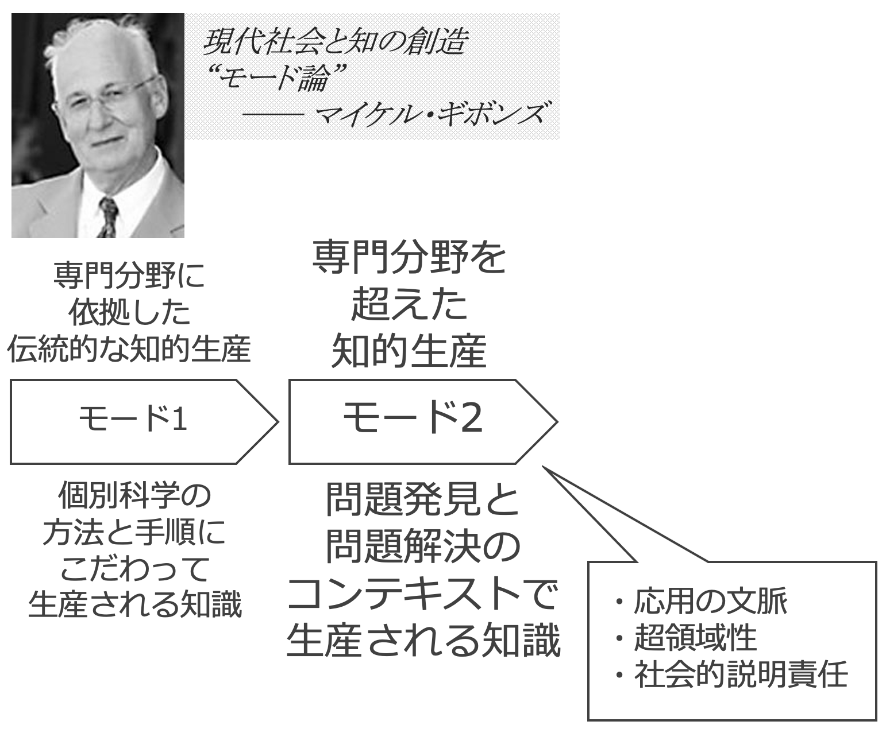
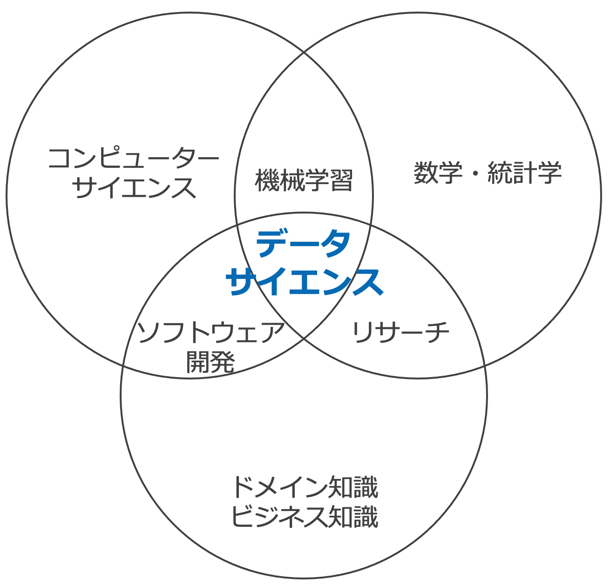
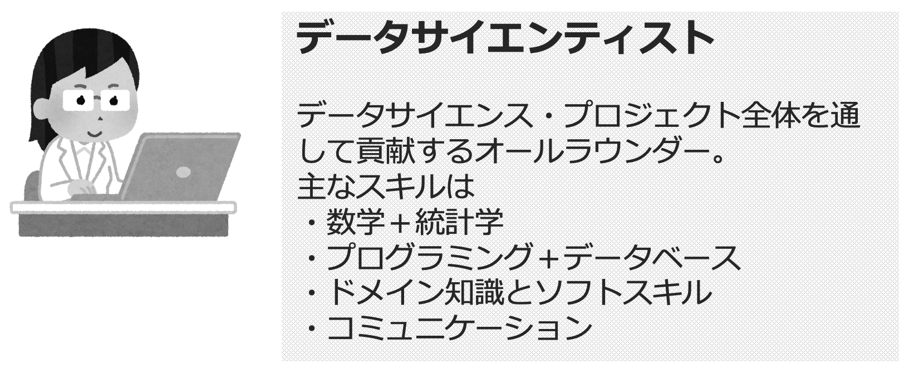
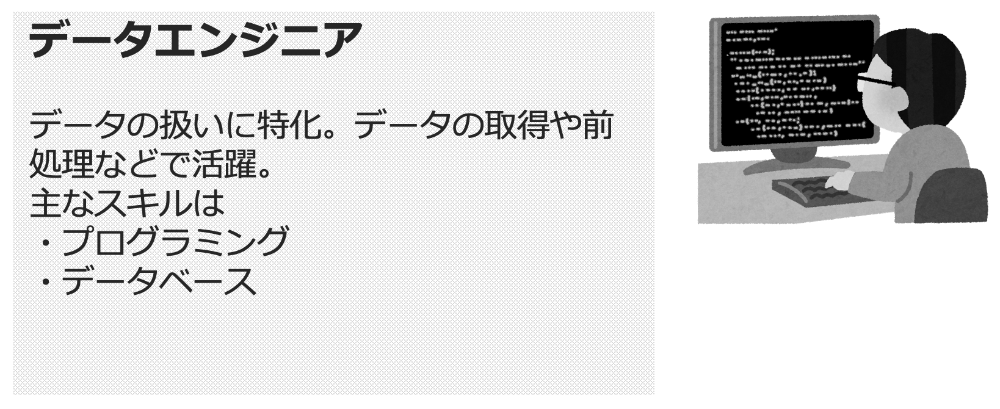
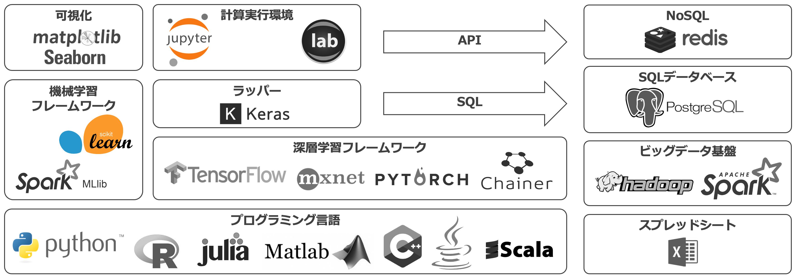
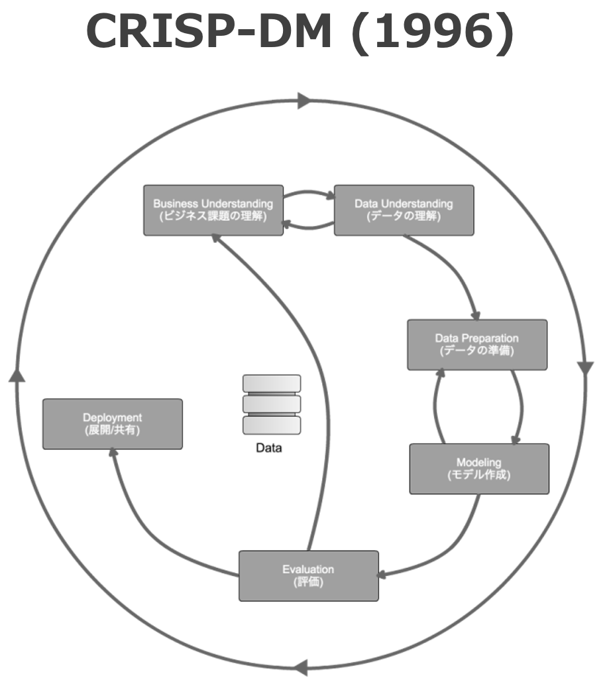
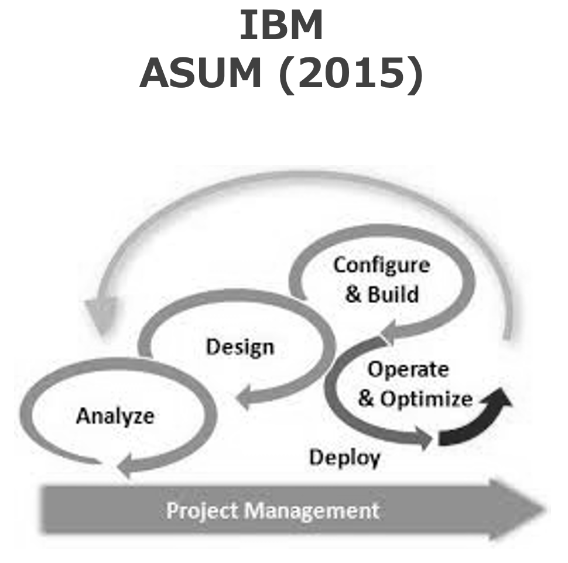
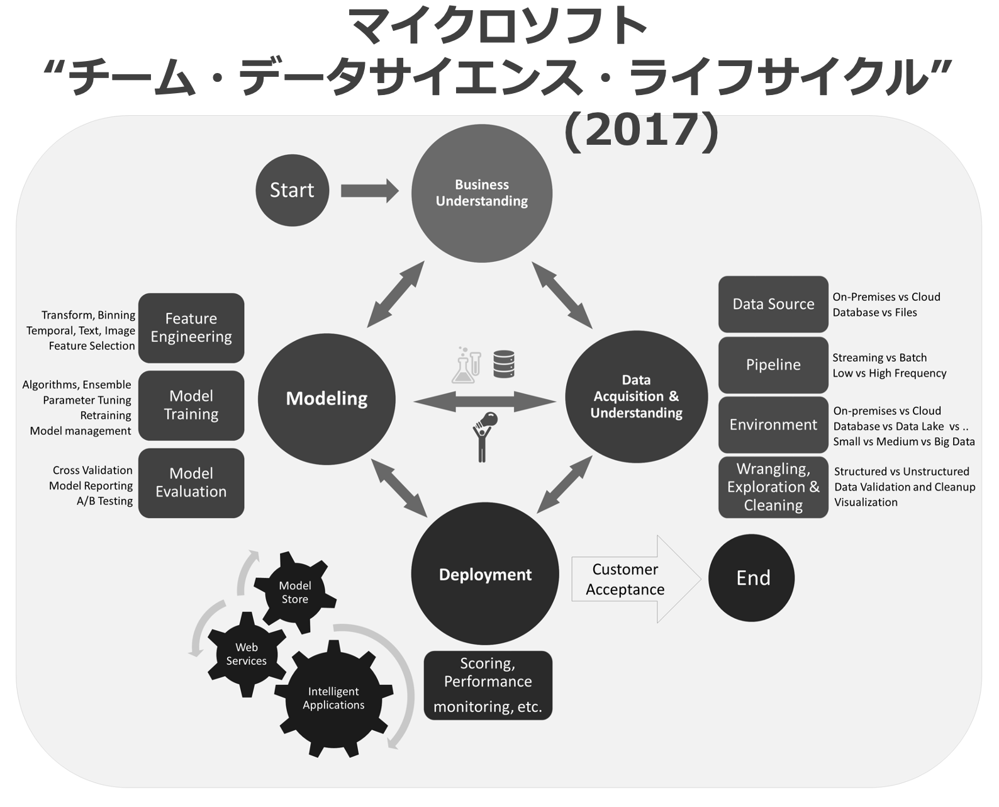
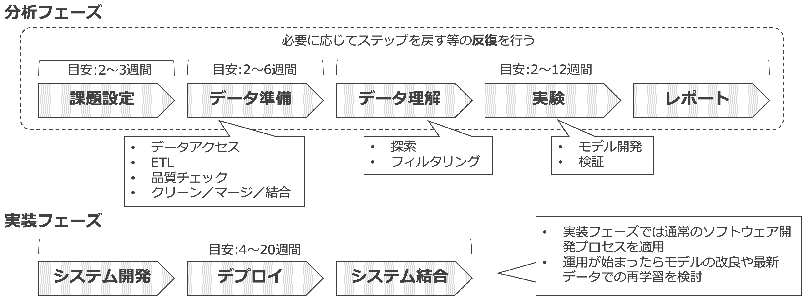

# 4. データサイエンス概論

- [4. データサイエンス概論](#4-データサイエンス概論)
  - [1. データサイエンスとは](#1-データサイエンスとは)
    - [1.1. モード1 と モード2](#11-モード1-と-モード2)
    - [1.2. データサイエンスの 3つの領域](#12-データサイエンスの-3つの領域)
    - [1.3. データサイエンスの課題](#13-データサイエンスの課題)
    - [1.4. データサイエンスの関連分野](#14-データサイエンスの関連分野)
  - [2. データサイエンスにおける登場人物](#2-データサイエンスにおける登場人物)
    - [2.1. データサイエンティスト](#21-データサイエンティスト)
    - [2.2. ビジネスアナリスト](#22-ビジネスアナリスト)
    - [2.3. データエンジニア](#23-データエンジニア)
    - [2.4. 機械学習エンジニア](#24-機械学習エンジニア)
  - [3. データサイエンスを支える技術](#3-データサイエンスを支える技術)
    - [3.1. 典型的な技術](#31-典型的な技術)
      - [3.1.1. 可視化](#311-可視化)
      - [3.1.2. 計算実行環境](#312-計算実行環境)
      - [3.1.3. 機械学習フレームワーク](#313-機械学習フレームワーク)
      - [3.1.4. 深層学習フレームワーク](#314-深層学習フレームワーク)
      - [3.1.5. ラッパー](#315-ラッパー)
      - [3.1.6. プログラミング言語](#316-プログラミング言語)
      - [3.1.7. NoSQL](#317-nosql)
      - [3.1.8. SQLデータベース](#318-sqlデータベース)
      - [3.1.9. ビッグデータ基盤](#319-ビッグデータ基盤)
      - [3.1.10. スプレッドシート](#3110-スプレッドシート)
  - [4. データサイエンスのプロセス](#4-データサイエンスのプロセス)
  - [5. データサイエンスのワークフロー](#5-データサイエンスのワークフロー)
    - [5.1. 分析フェーズ](#51-分析フェーズ)
    - [5.2. 実装フェーズ](#52-実装フェーズ)

---

## 1. データサイエンスとは

* データサイエンスは、科学的手法、プロセス、アルゴリズム、システムを駆使し、構造化と非構造化、 __様々な形式のデータから知識や洞察を得る、超領域分野__ 。いわゆるモード2科学の一種。
* 一般的に、データサイエンスは __3つの領域__ から成り立っていると説明されることが多い。
* 関連する分野がいくつかある。特に __データエンジニアリング__ は __データサイエンティスト__ に求められるスキルの1つとされている。

### 1.1. モード1 と モード2

| | モード1 | モード2 |
| --- | --- | --- |
| 知的生産活動 | 専門分野に依拠した伝統的なもの | 専門分野を超越 (超領域性) |
| 生産される知識 | 個別科学の方法と手順にこだわって生産 | 問題発見と問題解決のコンテキストで生産 (応用の文脈) |

### 1.2. データサイエンスの 3つの領域

* コンピューターサイエンス
* 数学・統計学
* ドメイン知識・ビジネス知識

| x   | y   | z   | xyz |
| --- | --- | --- | --- |
| コンピューターサイエンス | 数学・統計学 | - | 機械学習 |
| コンピューターサイエンス | - | ドメイン知識・ビジネス知識 | ソフトウェア開発 |
| - | 数学・統計学 | ドメイン知識・ビジネス知識 | リサーチ |
| コンピューターサイエンス | 数学・統計学 | ドメイン知識・ビジネス知識 | データサイエンス |

### 1.3. データサイエンスの課題

人手不足。そのため、関連領域のプロがデータサイエンスを行うケースも多い。

### 1.4. データサイエンスの関連分野

* データエンジニアリング
* データアナリシス
* データガバナンス
* データセキュリティ

---

## 2. データサイエンスにおける登場人物

* データサイエンスにおけるメインのプレイヤーは __データサイエンティスト__ である。プロジェクトのライフサイクルの中で、必要に応じて他のプレイヤーとの連携を行う。
* 最初データサイエンティスト1名で始めたチームは、データサイエンティスト、 __ビジネスアナリスト__ 、 __データエンジニア__ の順でメンバーを追加していくことで、プロジェクトのライフサイクルに合った強化を行うことができる。
* 要求次第では、データサイエンティストから __機械学習エンジニア__ にバトンタッチした方が良い場合もある。

### 2.1. データサイエンティスト

<!--
データサイエンス・プロジェクト全体を通して貢献するオールラウンダー。

#### 主なスキル

* 数学＋統計学
* プログラミング＋データベース
* ドメイン知識とソフトスキル
* コミュニケーション
-->

### 2.2. ビジネスアナリスト

<!--
課題を引き出し、要求を分析する。

#### 主なスキル

* Excel, データマイニング
* 基本的な統計学
* 課題解決のスキルとマインド
-->

### 2.3. データエンジニア

<!--
データの扱いに特化。データの取得や前処理などで活躍。

#### 主なスキル

* プログラミング
* データベース
-->

### 2.4. 機械学習エンジニア

<!--
機械学習アルゴリズムの実装に特化。

#### 主なスキル

* プログラミング（特に高速な言語）
* データベース
* 機械学習
-->

---

## 3. データサイエンスを支える技術

* __プログラミングによる調査検証環境__ 、 __データストア__ 、データへアクセスするための __クエリ言語__ が主な技術である。典型的なプロジェクトの開始時に用いられるミニマムなセットとしては、[Python](https://www.python.org/), [scikit-learn](https://scikit-learn.org/stable/), [Jupyter](https://jupyter.org/)。
* ツールはすべてオープンソースのものを利用可能であり、それをオンプレミスとクラウドのどちらの基盤で利用するかという選択がある。
* プログラミング言語と機械学習/深層学習フレームワークは必須。それぞれいずれか1つ以上に関して、エキスパートレベルが求められる。ビッグデータ基盤，SQL，Excelについても、高度な経験が求められる。

### 3.1. 典型的な技術

#### 3.1.1. 可視化

* [matplotlib](https://matplotlib.org/)
* [Seaborn](https://seaborn.pydata.org/)

#### 3.1.2. 計算実行環境

* [Jupyter](https://jupyter.org/)
* [JupyterLab](https://jupyterlab.readthedocs.io/en/stable/)

#### 3.1.3. 機械学習フレームワーク

* [scikit-learn](https://scikit-learn.org/stable/)
* [Spark MLlib](https://spark.apache.org/mllib/)

#### 3.1.4. 深層学習フレームワーク

* [TensorFlow](https://www.tensorflow.org/?hl=ja)
* [PyTorch](https://pytorch.org/)
* [Chainer](https://tutorials.chainer.org/ja/)
* [Apache MXNet](https://mxnet.apache.org/)

#### 3.1.5. ラッパー

* [Keras](https://keras.io/ja/)

#### 3.1.6. プログラミング言語

* [Python](https://www.python.org/)
* [R](https://www.r-project.org/)
* [Julia](https://julialang.org/)
* [Matlab](https://jp.mathworks.com/products/matlab.html)
* [Scala](https://docs.scala-lang.org/ja/)
* [Java](https://www.java.com/ja/)

#### 3.1.7. NoSQL

* [Redis](https://redis.io/)

#### 3.1.8. SQLデータベース

* [PostgreSQL](https://www.postgresql.org/)

#### 3.1.9. ビッグデータ基盤

* [Apache Hadoop](https://hadoop.apache.org/)
* [Apache Spark](https://spark.apache.org/)

#### 3.1.10. スプレッドシート

* [Excel](https://www.microsoft.com/ja-jp/microsoft-365/excel)

---

## 4. データサイエンスのプロセス

* 一般的に、データマイニングをはじめとするデータ分析プロセスにおいて、KDD (Knowledge Discovery in Databases) やEU発の標準化されたプロセスモデルとして [CRISP-DM (Cross-industry standard process for data mining)](https://dev.classmethod.jp/articles/data-analysis-crisp-dm/) が広く用いられている。
* 2015年、IBMはCRISP-DMを刷新し拡張するものとして、[ASUM (Analytics Solutions Unified Method)](ftp://ftp.software.ibm.com/software/data/sw-library/services/ASUM.pdf) を発表。CRISP-DMに対して開発と運用の観点を加えた。
* マイクロソフトはデータサイエンスに関する体系化された文書として Team Data Science Process Documentation を公開。その中でより発展的なプロセスモデル [TDSP (Team Data Science Process)](https://learn.microsoft.com/ja-jp/azure/architecture/data-science-process/overview) ライフサイクルを提示している。

---

## 5. データサイエンスのワークフロー

* データサイエンス・プロジェクトは、分析と実装の2つのフェーズに分けることができる。主戦場は __分析フェーズ__ 。
* 分析フェーズは1巡するのに __目安として概ね6〜21週間（1〜4ヶ月強）__ を要する。精度やその目標値によってはステップを戻す等をする必要があり、 __期間や工数を見積ることは難しい__ （あくまでエンジニアリングではなくサイエンス）。
* 全体としては目安として2〜10ヶ月。案件の性質から、データサイエンスというアプローチが妥当であるかどうかを検討し、妥当である場合は、 __品質（精度）よりも時間とコストを優先して判断__ をすることで、ステップを進めやすくなる。

### 5.1. 分析フェーズ

| No. | ステップ | 目安の期間 | 代表的なタスクの例 |
| --- | --- | --- | --- |
| 1 | 課題設定 | 2〜3週間 | - |
| 2 | データ準備 | 2〜6週間 | データアクセス, ETL, 品質チェック, クリーン/マージ/結合 |
| 3 | データ理解 | ※1 | 探索, フィルタリング |
| 4 | 実験 | ※1 | モデル開発, 検証 |
| 5 | レポート | ※1 | - |

* ※1 合計で 2〜12週間
* 必要に応じてステップを戻す等の __反復__ を行う。

### 5.2. 実装フェーズ

| No. | ステップ | 目安の期間 | 代表的なタスクの例 |
| --- | --- | --- | --- |
| 1 | システム開発 | ※2 | - |
| 2 | デプロイ | ※2 | - |
| 3 | システム結合 | ※2 | - |

* ※2 合計で 4〜20週間
* 実装フェーズでは通常のソフトウェア開発プロセスを適用
* 運用が始まったらモデルの改良や最新データでの再学習を検討
