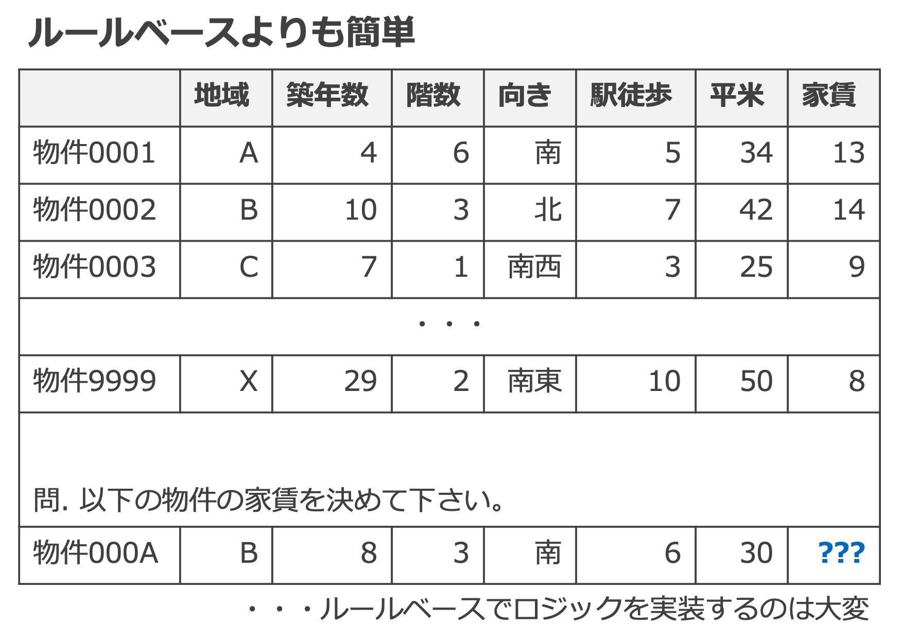

# 5. 機械学習概論

- [5. 機械学習概論](#5-機械学習概論)
  - [1. 機械学習とは](#1-機械学習とは)
  - [2. 機械学習の種類](#2-機械学習の種類)
  - [3. 教師あり学習](#3-教師あり学習)
  - [4. 汎化性能と過学習](#4-汎化性能と過学習)
    - [4.1. 参考](#41-参考)
  - [5. 再現率と適合率](#5-再現率と適合率)
    - [5.1. 例](#51-例)
      - [5.1.1. 再現率 (Recall)](#511-再現率-recall)
      - [5.1.2. 適合率 (Precision)](#512-適合率-precision)
      - [5.1.3. F値](#513-f値)
    - [5.2. 参考文献](#52-参考文献)
  - [6. 深層学習](#6-深層学習)
  - [7. 機械学習の適・不適](#7-機械学習の適不適)
    - [7.1. 機械学習に適するケース](#71-機械学習に適するケース)
    - [7.2. 機械学習に適さないケース](#72-機械学習に適さないケース)

---

## 1. 機械学習とは

* 機械学習は、 __データとアルゴリズムからロジックを生成する技術__ の総称。多くの場合、データを学習することでパターンを抽出し、未知のデータに対して判定を行うことができるモデルを生成することができる。
* ルールベースでも同じようなことはできるが、パターンが複雑になるほど、ロジックの定義・実装が困難になる。既存のルールとの整合性も課題。
* 人間が行っている判定を（機械学習の）システムに代替させることで、 __大量__ の新規データを高速に、 __安定__ した精度で処理することができる。

---

## 2. 機械学習の種類

* 機械学習は、大別して「 __[教師あり学習](https://www.stat.go.jp/teacher/dl/pdf/c4learn/materials/fourth/dai3.pdf)__ 」「 __[教師なし学習](https://www.stat.go.jp/teacher/dl/pdf/c4learn/materials/fourth/dai4.pdf)__ 」「 __[強化学習](https://ja.wikipedia.org/wiki/%E5%BC%B7%E5%8C%96%E5%AD%A6%E7%BF%92)__ 」に分類できる。「教師あり学習」は、問題の性質に応じて「 __[回帰](https://ja.wikipedia.org/wiki/%E5%9B%9E%E5%B8%B0%E5%88%86%E6%9E%90)__ 」と「 __[分類](https://ja.wikipedia.org/wiki/%E5%88%86%E9%A1%9E_(%E7%B5%B1%E8%A8%88%E5%AD%A6))__ 」とを使い分ける。
* 教師あり学習はデータから統計的・確率的にモデルを生成するのに対し、教師なし学習はデータから幾何学的にモデルを生成する。
* 強化学習はゲームAIに用いられるほか、自動運転車にも応用されている。

<!--
| No. | 大分類 | 小分類 | 概要 | 代表的なアルゴリズム | 活用例 |
| --- | --- | --- | --- | --- | --- |
| 1-1 | 教師あり学習 | 回帰 | 入力データに対して、数値の予測を行う。 | 線形回帰, ロジスティック回帰, ニューラルネットワーク | 売上予測, 電力予測, トラフィック予測 |
| 1-2 | 教師あり学習 | 分類 | 入力データに対して、クラス分類を行う。 | SVM (サポートベクターマシン), 決定木 | 画像分類, 不正検知, スパムフィルター |
| 2 | 教師なし学習 | - | 似ているクラスタに分類する (クラスタリング) | K-means, 主成分分析 | レコメンド, 類似検索, 顧客セグメンテーション |
| 3 | 強化学習 | - | 環境に対して、取るべき行動を決定する。 | Q学習, DQN | 対戦ゲーム, ロボット制御 |
-->

---

## 3. 教師あり学習

* 教師あり学習の実行は、 __学習と推論の2つのフェーズ__ に分けて行う。学習フェーズでは教師データからの学習を通してモデルを生成する。推論フェーズでは入力値を生成されたモデルにあてはめて、結果（予測値）を出力する。
* 学習フェーズにおいて、モデルは教師データとの __(訓練)誤差が小さくなるようパラメータの更新__ を行いながら生成される。
* 例えば、𝑦 = 𝑎𝑥 + 𝑏 という[線形回帰](https://ja.wikipedia.org/wiki/%E7%B7%9A%E5%BD%A2%E5%9B%9E%E5%B8%B0)モデルを生成するにあたって、学習フェーズでは 𝑎 と 𝑏 を求めるために、学習データと生成中のモデルとの間の誤差が最小になるよう、 𝑎 と 𝑏 を更新していく。どのアルゴリズムに基づくモデルにするかは人が決める。

---

## 4. 汎化性能と過学習

* 学習したモデルを評価するための指標としては様々あるが、その一つに __汎化性能__ がある。汎化性能は、未知の入力データに対する性能。
* 機械学習では（学習データに含まれていない）未知のデータを使って推論を行いたいので、汎化性能が高いモデルが良い。
* 汎化性能が低い状態、すなわち学習データに適合しすぎてしまっていて未知の入力データに対する精度が低下する状態を、 __過学習__ という。

### 4.1. 参考

* [(超重要)過学習と汎化性能を理解する(hold-out法を解説)【機械学習入門7】](https://datawokagaku.com/holdout/)

---

## 5. 再現率と適合率

* 例えばスパムメールの2クラス分類において、不正解は2種類存在する（「 __誤検知__ 」と「 __検知漏れ__ 」）。
* 実際にスパムメールであったうち、スパムであると判定した割合を「 __再現率__ 」といい、 𝑇𝑃/(𝑇𝑃+𝐹𝑁) で表すことができる。
* スパムメールと判定したうち、実際にスパムメールである割合を「 __適合率__ 」といい、 𝑇𝑃/(𝑇𝑃+𝐹𝑃) で表すことができる。
* 基本的には、再現率と適合率は __トレードオフ__ の関係であり、どちらを優先するかは課題設定次第である。

<!--
| (混同行列) | 判定 "スパムである" | 判定 "スパムではない" |
| -- | -- | -- |
| データ "実際のスパムメール" | True Positive ( __TP__ ): 実際にスパムであり、それを __正しく__ 判定 | False Negative ( __FN__ ): 実際はスパムであるが、スパムではないと __誤って__ 判定 = __検知漏れ__ |
| データ "実際にスパムではないメール" | False Positive ( __FP__ ): 実際はスパムではないが、スパムであると __誤って__ 判定 = __誤検知__ | True Negative ( __TN__ ): 実際はスパムではなく、それを __正しく__ 判定 |
-->

### 5.1. 例

* 全データ(A): 12
* 実際のスパムメール(S): 5
* 実際にはスパムではないメール(N): 7
* スパムであると判定したメール(C): 4
* 実際のスパムメールのうちスパムであると判定したメール(S∪C): 3

#### 5.1.1. 再現率 (Recall)

$$
R = \dfrac{S\bigcup C}{S}
  = \dfrac{3}{5}
  = 0.6
$$

#### 5.1.2. 適合率 (Precision)

$$
P = \dfrac{S\bigcup C}{C}
  = \dfrac{3}{4}
  = 0.75
$$

#### 5.1.3. F値

分類器を評価する単一の (R と P のトレードオフを考慮しなくてよい) 評価指標。逆数の算術平均の逆数で求める。

$$
F = \dfrac{2}{\dfrac{1}{R}+\dfrac{1}{P}}
  = \dfrac{2RP}{R+P}
  = \dfrac{2 \times \dfrac{3}{5} \times \dfrac{3}{4}}{\dfrac{3}{5} + \dfrac{3}{4}}
  = 0.666...
$$

### 5.2. 参考文献

* [分類器の評価指標〜Accuracy, Precision, Recall, Specificity〜【機械学習入門20】](https://datawokagaku.com/classifier_metrics1/)
* [F値とPrecisionとRecallのトレードオフを理解する(超重要!!)【機械学習入門21】](https://datawokagaku.com/f1score/)

---

## 6. 深層学習

* 機械学習のうち、[ニューラルネットワーク](https://ja.wikipedia.org/wiki/%E3%83%8B%E3%83%A5%E3%83%BC%E3%83%A9%E3%83%AB%E3%83%8D%E3%83%83%E3%83%88%E3%83%AF%E3%83%BC%E3%82%AF)による学習・推論を多層化したものが [深層学習（ディープラーニング）](https://ja.wikipedia.org/wiki/%E3%83%87%E3%82%A3%E3%83%BC%E3%83%97%E3%83%A9%E3%83%BC%E3%83%8B%E3%83%B3%E3%82%B0) 。
* 機械学習では特徴選択を人間が行う必要があるが、深層学習では __特徴選択も含めて__ 多層ニューラルネットワークで実現できる。
* 深層学習における人間の仕事は __[ハイパーパラメータ](https://ja.wikipedia.org/wiki/%E3%83%8F%E3%82%A4%E3%83%91%E3%83%BC%E3%83%91%E3%83%A9%E3%83%A1%E3%83%BC%E3%82%BF)設計と[(ニューラル) ネットワーク](https://ja.wikipedia.org/wiki/%E3%83%8B%E3%83%A5%E3%83%BC%E3%83%A9%E3%83%AB%E3%83%8D%E3%83%83%E3%83%88%E3%83%AF%E3%83%BC%E3%82%AF)設計__ になる点が、機械学習と異なる。
* __複雑な行列計算が可能なデータで真価を発揮__ するため、高度なことはできるが、何でもできるわけではない（単純なデータには向かない）。

[出典](https://semiengineering.com/deep-learning-spreads/)

---

## 7. 機械学習の適・不適

* 機械学習を適用し、課題を解決できるかを検討するにあたり、 __機械学習というアプローチが適しているかどうかを事前に検討__ することは重要。
* 適していないケースであっても、機械学習とは別のアプローチ（ルールベースなど）で課題を解決できる可能性はある。

### 7.1. 機械学習に適するケース

* 課題が明確
* 人間（専門家）がデータを見ている/知っている
    - 例）店舗の売上データ
* データに相関がありそう
    - 例）気温とアイスクリーム屋の売上
* 多様性のあるデータが十分に取得可能
* 精度よりも大量処理や処理速度が課題解決のキーになる

### 7.2. 機械学習に適さないケース

* 課題が曖昧
* 人間（専門家）がデータを見ても分からない
    - 例）初めて来たユーザがどの商品を買うか
* データに相関がなさそう（正も負も）
    - 例）ロンドンの人口と東京の湿度
* データが偏っている/不十分/無い
    - 例）スパムメール判定をしたいがスパムメールのデータが少ない
    - 例）1年周期の季節性があるのに、データが3ヶ月分しかない
* 100%に近い精度が求められる
    - 機械学習以外の手法を検討するか、組み合わせる
