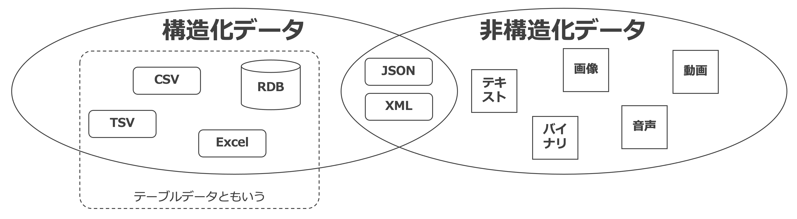
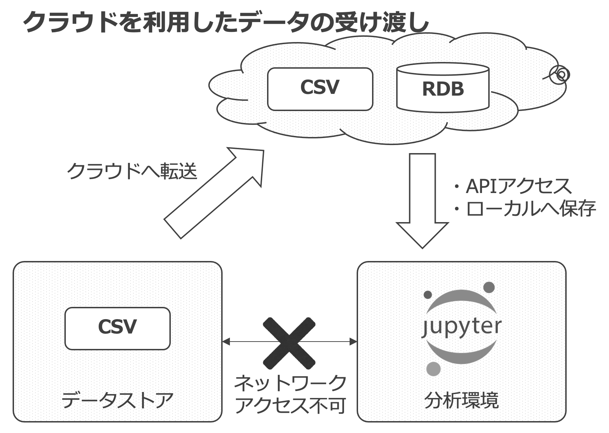
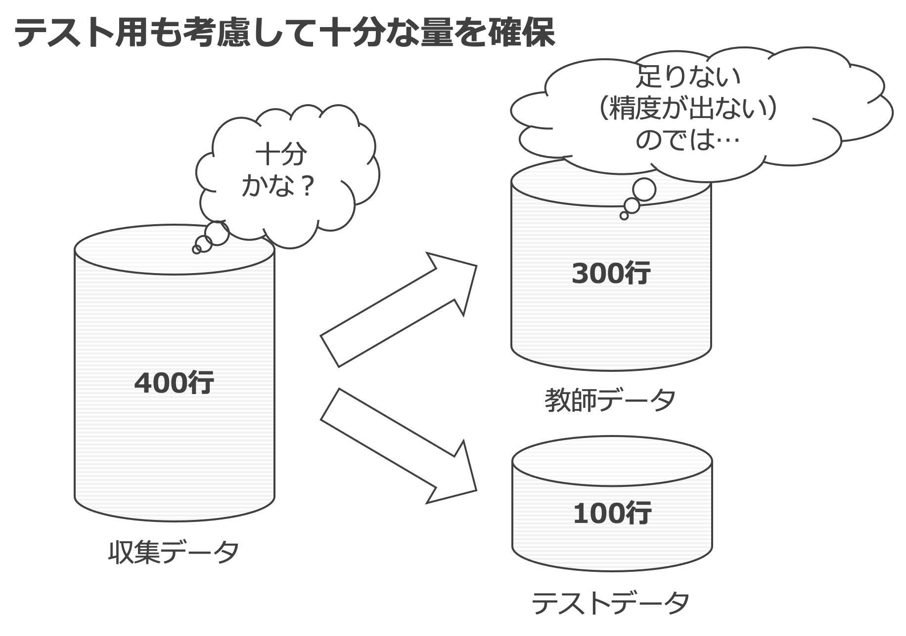
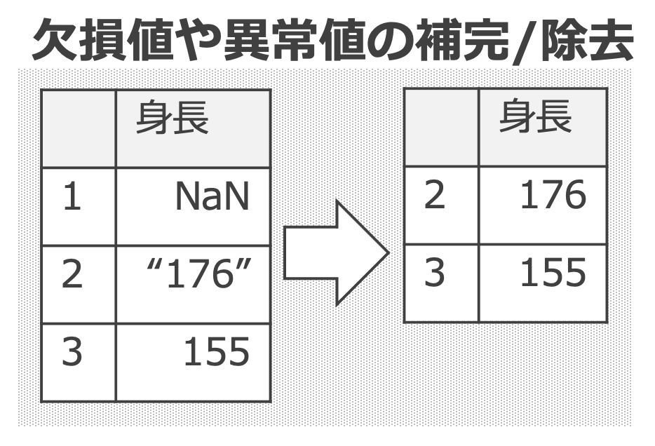
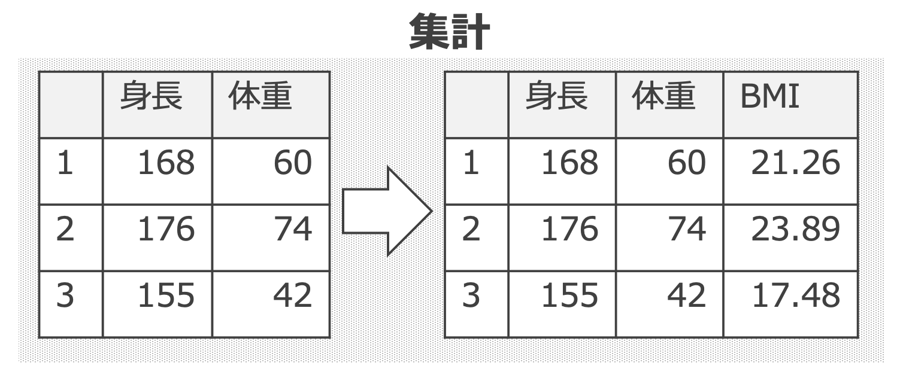
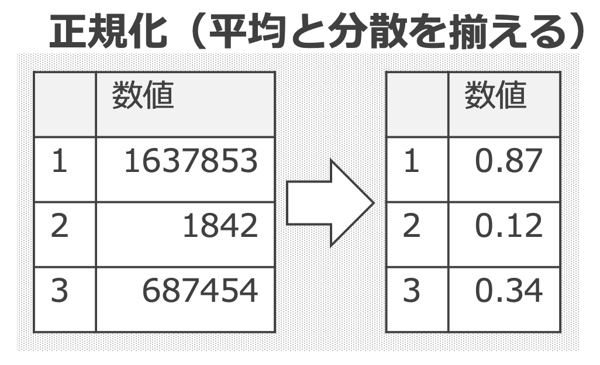
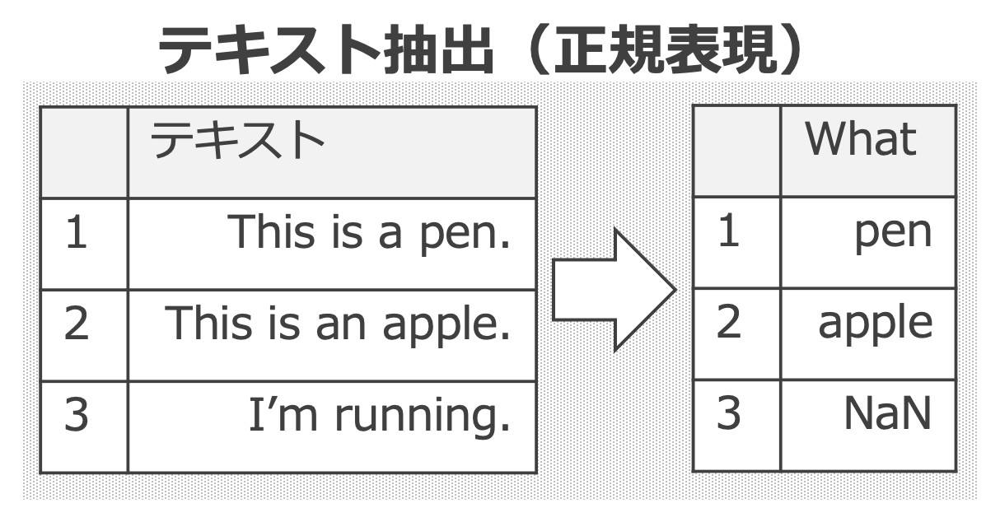
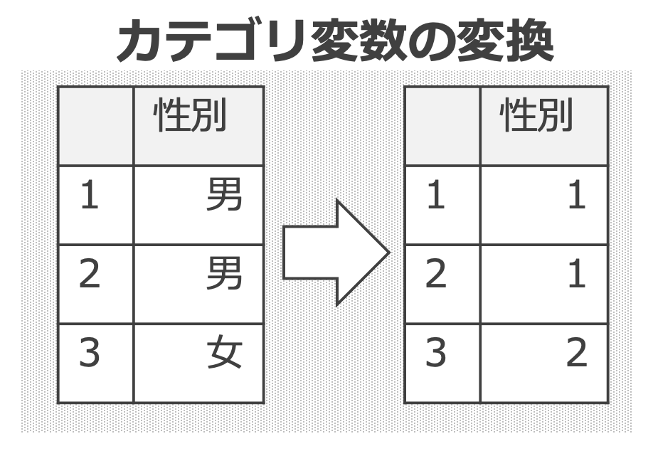
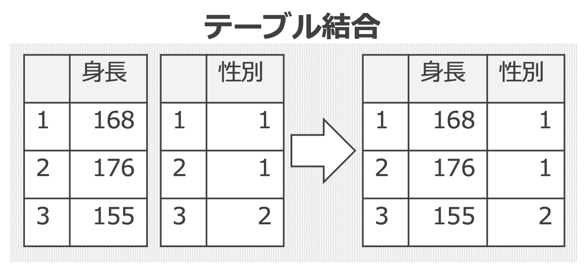

# 6. データエンジニアリング概論

- [6. データエンジニアリング概論](#6-データエンジニアリング概論)
  - [1. データの種類](#1-データの種類)
  - [2. データの準備](#2-データの準備)
  - [3. 前処理](#3-前処理)
    - [3.1. 典型的な前処理](#31-典型的な前処理)
      - [3.1.1. 欠損値や異常値の補完/除去](#311-欠損値や異常値の補完除去)
      - [3.1.2. 集計](#312-集計)
      - [3.1.3. 正規化 (平均と分散を揃える)](#313-正規化-平均と分散を揃える)
      - [3.1.4. テキスト抽出 (正規表現)](#314-テキスト抽出-正規表現)
      - [3.1.5. カテゴリ変数の変換](#315-カテゴリ変数の変換)
      - [3.1.6. テーブル結合](#316-テーブル結合)

---

## 1. データの種類

* ここで言うところのデータは電子データを指し、コンピュータ内にあるか、コンピュータに取り込める形になったデータをいう。
* データには __構造化データ__ と __非構造化データ__ に分類される。
    - 構造化データは、一般的には「列」と「行」の概念のあるデータを指す。テーブルデータともいう。
    - 非構造化データにはこのような規則性がない。
* 構造化データのような明確な「列」と「行」の対応関係が揃っているわけではないが、規則性が成立しているデータとして、[JSON](https://developer.mozilla.org/ja/docs/Learn/JavaScript/Objects/JSON) や [XML](https://ja.wikipedia.org/wiki/Extensible_Markup_Language) がある。ツールやライブラリが対応していれば、テーブルデータと同様に扱うことができる。半構造化データとも呼ばれる。

<!--
| 種類 | 例 |
| -- | -- |
| 構造化データ | RDB, CSV, TSV, Excel |
| 半構造化データ | XML, JSON |
| 非構造化データ | テキスト, 画像, 音声, 動画, バイナリ |
-->

---

## 2. データの準備

* 分析環境からアクセス可能な場所にデータが存在する必要がある（データへのアクセシビリティ）
* よくある状況として、ネットワークが異なるためにデータを受け取るのが困難な場合がある。このような場合、 __クラウドを利用するのが便利__ 。新規システムを設計する場合は、 __データ収集も考慮したシステム設計／ネットワーク設計__ をすることが重要。
* 収集すべきデータの量はケース・バイ・ケース。教師あり学習においては、収集されたデータは学習用とテスト用とに分ける必要があり、この観点でも十分かどうかチェックする。

---

## 3. 前処理

* ソースとなるデータ（生データ）は、テーブルデータに変換した上で、前処理を行う。前処理を行うことで、機械学習で扱える形に揃えるだけでなく、精度の向上にも貢献できる。一般的に、 __データ分析に必要な時間の多くが前処理__ であると言われている。
* 基本的な前処理については、Python の場合は __pandas__ で一通り実行できる。他にも前処理に特化したGUIツールなどもある。

### 3.1. 典型的な前処理

#### 3.1.1. 欠損値や異常値の補完/除去

<!--
| ID | 身長 |
| --:| --:|
| 1 | NaN |
| 2 | "176" |
| 3 | 155 |

↓

| ID | 身長 |
| --:| --:|
| 2 | 176 |
| 3 | 155 |
-->

#### 3.1.2. 集計

<!--
| ID | 身長 | 体重 |
| --:| --:| --:|
| 1 | 168 | 60 |
| 2 | 176 | 74 |
| 3 | 155 | 42 |

↓

| ID | 身長 | 体重 | BMI |
| --:| --:| --:| --:|
| 1 | 168 | 60 | 21.26 |
| 2 | 176 | 74 | 23.89 |
| 3 | 155 | 42 | 17.48 |
-->

#### 3.1.3. 正規化 (平均と分散を揃える)

<!--
| ID | 数値 |
| --:| --:|
| 1 | 1637853 |
| 2 | 1842 |
| 3 | 687454 |

↓

| ID | 数値 |
| --:| --:|
| 1 | 0.87 |
| 2 | 0.12 |
| 3 | 0.34 |
-->

#### 3.1.4. テキスト抽出 (正規表現)

<!--
| ID | テキスト |
| --:| --:|
| 1 | This is a pen. |
| 2 | This is an apple. |
| 3 | I'm running. |

↓

| ID | What |
| --:| --:|
| 1 | pen |
| 2 | apple |
| 3 | NaN |
-->

#### 3.1.5. カテゴリ変数の変換

<!--
| ID | 性別 |
| --:| --:|
| 1 | 男 |
| 2 | 男 |
| 3 | 女 |

↓

| ID | 性別 |
| --:| --:|
| 1 | 1 |
| 2 | 1 |
| 3 | 2 |
-->

#### 3.1.6. テーブル結合

<!--
| ID | 身長 |
| --:| --:|
| 1 | 168 |
| 2 | 176 |
| 3 | 155 |

| ID | 性別 |
| --:| --:|
| 1 | 1 |
| 2 | 1 |
| 3 | 2 |

↓

| ID | 身長 | 性別 |
| --:| --:| --:|
| 1 | 168 | 1 |
| 2 | 176 | 1 |
| 3 | 155 | 2 |
-->

