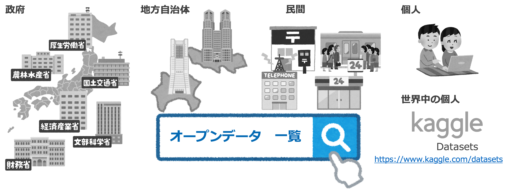
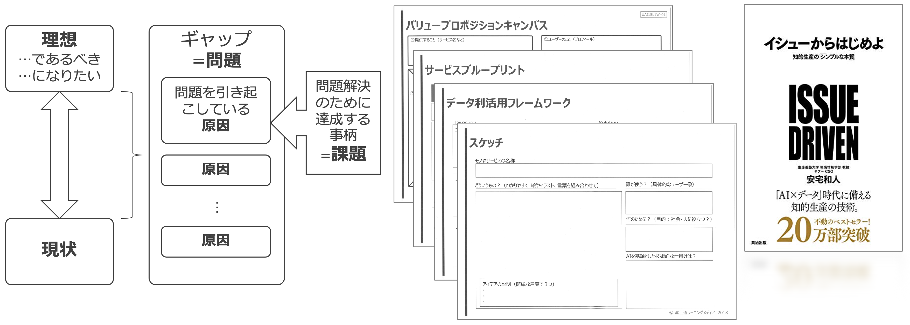

# 8. 今日から始めるために

- [8. 今日から始めるために](#8-今日から始めるために)
  - [1. SNS で最新動向をウォッチしよう](#1-sns-で最新動向をウォッチしよう)
  - [2. コミュニティイベントで世界を広げよう](#2-コミュニティイベントで世界を広げよう)
  - [3. 書籍でじっくり学んでみよう](#3-書籍でじっくり学んでみよう)
  - [4. 資格を目標に勉強してみよう](#4-資格を目標に勉強してみよう)
  - [5. ツールを揃えよう](#5-ツールを揃えよう)
  - [6. オープンデータを活用しよう](#6-オープンデータを活用しよう)
  - [7. 課題を見つけよう](#7-課題を見つけよう)

---

## 1. SNS で最新動向をウォッチしよう

* AIやデータ分析の最新動向に日常的に触れるにあたり、Twitterは有益な情報源。
* 下記の日本語アカウントをフォローするだけでも十分であるが、英語圏までスコープに含めると、非常に多くの最新情報をタイムリーに得ることができる。

| 名前 | Twitter アカウント |
| -- | -- |
| Wolfram Japan | [@WolframJapan](https://twitter.com/WolframJapan) |
| AIポータルメディア「AIsmiley」 | [@AIsmiley_inc](https://twitter.com/AIsmiley_inc) |
| AINOW編集部 | [@AINOW_ai](https://twitter.com/AINOW_ai) |
| 人工知能のニュースや話題 | [@aibiblio](https://twitter.com/aibiblio) |
| AI 人工知能ニュース | [@ai_news_jp](https://twitter.com/ai_news_jp) |
| 人工知能・機械学習ニュース | [@A_I_News](https://twitter.com/A_I_News) |
| AIデータベースメディア@アイブン | [@AIBoom_net](https://twitter.com/AIBoom_net) |
| AI 人工知能・機械学習 最新ニュース | [@AI_news_nd](https://twitter.com/AI_news_nd) |
| ステート・オブ・AI ガイド | [@stateofai_ja](https://twitter.com/stateofai_ja) |
| DLHacks | [@DL_Hacks](https://twitter.com/DL_Hacks) |

---

## 2. コミュニティイベントで世界を広げよう

* 東京で開催される、データ分析や機械学習に関するメジャーなコミュニティイベントをピックアップ。
* 最新動向を知るだけでなく、モチベーションを高めたり、懇親会でつながりをつくる等、役立てて下さい。

| 名前 | URL |
| -- | -- |
| PyData Tokyo | https://pydatatokyo.connpass.com/ |
| 丸の内アナリティクス | https://marunouchi-analytics.connpass.com/ |
| Machine Learning Casual Talks | https://mlct.connpass.com/ |
| DEEP LEARNING LAB | https://dllab.connpass.com/ |

---

## 3. 書籍でじっくり学んでみよう

* 入門レベルの”読み物”から中級レベルの”教科書”まで、メジャーな書籍をピックアップ。
* 「はじめてのパターン認識」「統計学入門」は高校数学がある程度できることが前提。

| 名前 | 著者 | 出版社 | 発売日 |
| -- | -- | -- | -- |
| 人工知能は人間を超えるか ディープラーニングの先にあるもの | 松尾豊 | KADOKAWA/中経出版 | 2015/3/11 |
| データサイエンティスト養成読本 機械学習入門編 | - | 技術評論社 | 2015/9/10 |
| はじめてのパターン認識 | 平井有三 | 森北出版 | 2012/7/31 |
| 統計学入門 (基礎統計学Ⅰ) | 東京大学教養学部統計学教室 | 東京大学出版会 | 1991/7/9 |

---

## 4. 資格を目標に勉強してみよう

* [統計検定](https://www.toukei-kentei.jp/)と[ディープラーニングG検定](https://www.jdla.org/certificate/general/)をピックアップ。
* 資格の取得がモチベーションになる方は、ぜひトライしてみて下さい。

---

## 5. ツールを揃えよう

* プログラミング言語は __Python__ がおすすめ。体系的な情報はもちろん、Q&Aも多く出回っており、やりたいことや問題解決がスムーズにできる。テーブルデータは __Pandas__ で扱い、機械学習は __scikit-learn__ を使うのがベーシックなやり方。実装フェーズへの移行も楽。
* データ分析環境は __Jupyter__ がおすすめ。但し自分で構築するには少しだけサーバ系の知識が必要になるが、Docker を使うことができれば構築も簡単。
* Excel でもある程度のデータ分析はできる。

---

## 6. オープンデータを活用しよう

* 手っ取り早く使えるデータとして、 __オープンデータ__ がある。
* オープンデータは主に公共性の高い団体等が公開している。中にはAPIを備えているものもある。
* 提供元や種類は様々であるが、整理しリスト化しているサイトがあるので、それを使うと便利。
* 英語圏では、分析コンペサイト ”Kaggle” に個人がデータを公開する場所があり、多種多様なデータが手に入る。

---

## 7. 課題を見つけよう

* 出発点は「課題」。これを明確にするための営みを行う。
* 「バリュープロポジションキャンバス」「サービスブループリント」といった、既存の思考フレームワークを活用するのも手。
* ロジカル・シンキング系の書籍も役に立つ。

