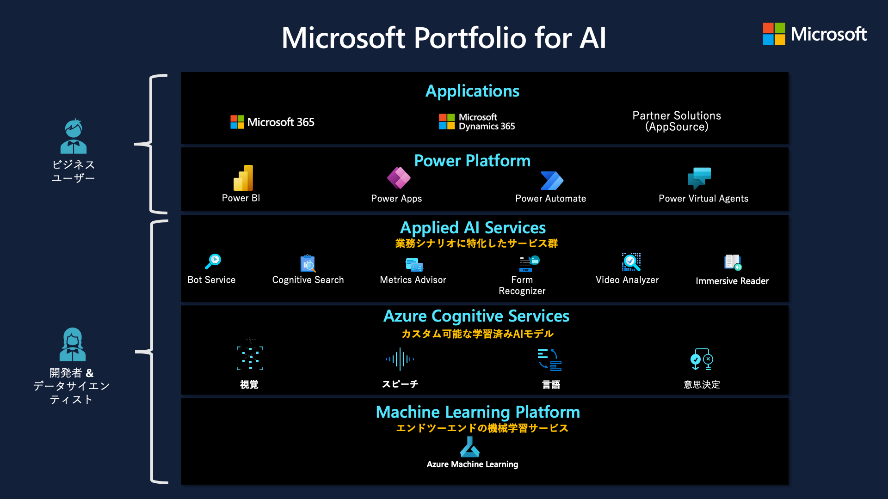
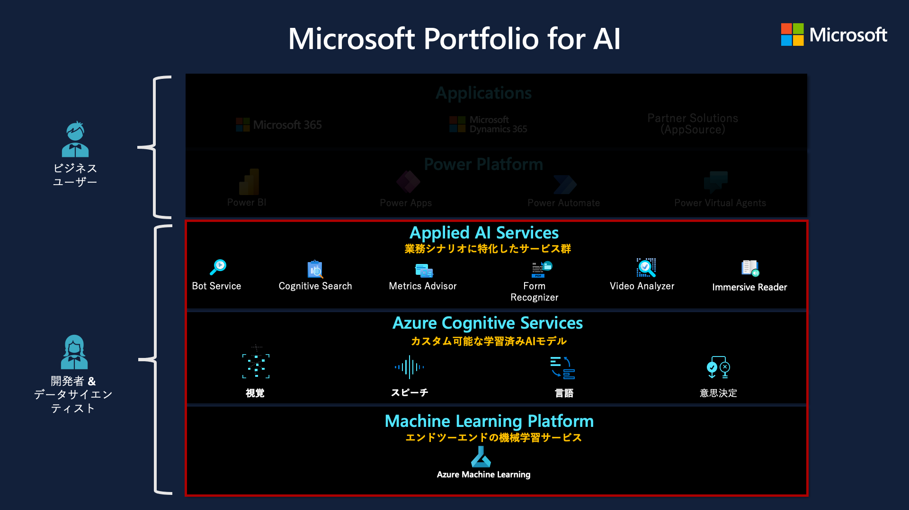
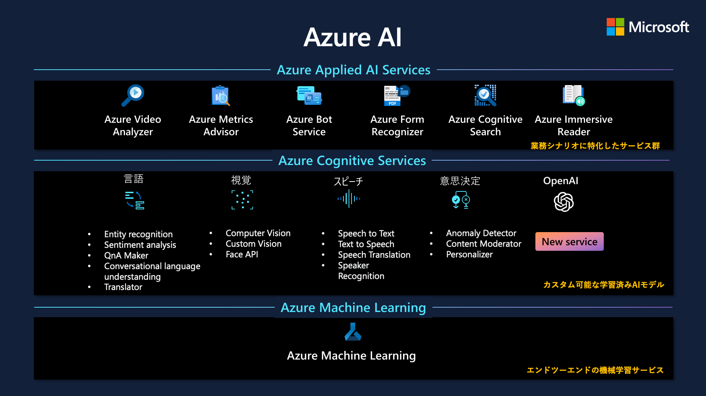

# 9. Azure における AI/ML の概要

- [9. Azure における AI/ML の概要](#9-azure-における-aiml-の概要)
  - [1. Azure における AI/ML](#1-azure-における-aiml)
    - [1.1. 概要](#11-概要)
    - [1.2. Azure Applied AI Services](#12-azure-applied-ai-services)
    - [1.3. Azure Cognitive Services](#13-azure-cognitive-services)
    - [1.4. Azure Machine Learning](#14-azure-machine-learning)
    - [1.5. その他](#15-その他)
      - [1.5.1. Azure Databricks (Databricks Machine Learning)](#151-azure-databricks-databricks-machine-learning)
      - [1.5.2. Azure Synapse Analytics (MLlib / SparkML / SynapseML)](#152-azure-synapse-analytics-mllib--sparkml--synapseml)
      - [1.5.3. Power BI](#153-power-bi)
  - [2. ラーニング](#2-ラーニング)
  - [3. 参考リンク](#3-参考リンク)

---

## 1. Azure における AI/ML

### 1.1. 概要

* [Azure Applied AI Services](https://learn.microsoft.com/ja-jp/azure/applied-ai-services/)
    - 特定のビジネス シナリオ向けの特殊な AI サービス
        - タスクに特化した AI でビジネス プロセスを最新化し、一般的なシナリオを解決することができます。
        - 組み込みのビジネス ロジックで開発を加速し、数か月ではなく数日でソリューションを立ち上げることができます。
        - クラウドからインテリジェント エッジまで広がるセキュリティで、どこでも責任を持って実行できます。
* [Azure Cognitive Services](https://learn.microsoft.com/ja-jp/azure/cognitive-services/)
    - 視覚、音声、言語、意思決定のためのカスタマイズ可能なコグニティブ API の包括的なファミリ
        - 市場で最も包括的な AI 機能のポートフォリオを活用して、OpenAI モデルを含む高度な AI モデルに簡単にアクセスできます。
        - 最初の AI サービスを自信を持って作成し、人間並みの視覚、音声、言語をコンピューターで実現しましょう。
        - クラウドからエッジまで、コンテナーを使用すればどこでもデプロイできます。
        - すぐに始められ、お客様独自の要件に合わせてソリューションをカスタマイズできます。
* [Azure Machine Learning](https://learn.microsoft.com/ja-jp/azure/machine-learning/)
    - 機械学習モデルを構築、トレーニング、デプロイするためのエンドツーエンドのプラットフォーム
        - Jupyter Notebook、ドラッグ アンド ドロップのデザイナー、自動機械学習など、お好みのツールで開発できます。
        - 自動化され再現可能な機械学習ワークフローを使用して、大規模なモデルを作成し、デプロイすることができます。
        - データ、モデル、プロセスを理解、保護、制御するための機能豊富で主体的な組み込みの機能セットを使用して、責任を持ってイノベーションを起こすことができます。
        - オープンソース フレームワークと MLflow、Kubeflow、ONNX、PyTorch、TensorFlow、Python、R などの言語に対する最高レベルのサポートを受けることで、お客様の方法で構築できます。
* その他
    - [Azure Databricks](https://learn.microsoft.com/ja-jp/azure/databricks/) ([Databricks Machine Learning](https://learn.microsoft.com/ja-jp/azure/databricks/scenarios/ml/))
    - [Azure Synapse Analytics](https://learn.microsoft.com/ja-jp/azure/synapse-analytics/) ([MLlib](https://learn.microsoft.com/ja-jp/azure/synapse-analytics/machine-learning/what-is-machine-learning#train-models-on-spark-pools-with-mllib) / [SparkML](https://learn.microsoft.com/ja-jp/azure/synapse-analytics/spark/apache-spark-machine-learning-training#apache-sparkml-and-mllib) / [SynapseML](https://learn.microsoft.com/ja-jp/azure/synapse-analytics/machine-learning/what-is-machine-learning#synapseml))

### 1.2. Azure Applied AI Services

* [Azure From Recognizer](https://learn.microsoft.com/ja-jp/azure/applied-ai-services/what-are-applied-ai-services#azure-form-recognizer)
    - ドキュメント分析モデル
        - [読み取り OCR モデル](https://learn.microsoft.com/ja-jp/azure/applied-ai-services/form-recognizer/concept-read)
        - [一般ドキュメント モデル](https://learn.microsoft.com/ja-jp/azure/applied-ai-services/form-recognizer/concept-general-document)
        - [レイアウト分析モデル](https://learn.microsoft.com/ja-jp/azure/applied-ai-services/form-recognizer/concept-layout)
    - 事前構築済みのモデル
        - [W-2 フォーム モデル](https://learn.microsoft.com/ja-jp/azure/applied-ai-services/form-recognizer/concept-w2)
        - [請求書モデル](https://learn.microsoft.com/ja-jp/azure/applied-ai-services/form-recognizer/concept-invoice)
        - [領収書モデル](https://learn.microsoft.com/ja-jp/azure/applied-ai-services/form-recognizer/concept-receipt)
        - [身分証明書 (ID) モデル](https://learn.microsoft.com/ja-jp/azure/applied-ai-services/form-recognizer/concept-id-document)
        - [名刺モデル](https://learn.microsoft.com/ja-jp/azure/applied-ai-services/form-recognizer/concept-business-card)
    - カスタム モデル
        - [カスタム モデル](https://learn.microsoft.com/ja-jp/azure/applied-ai-services/form-recognizer/concept-custom)
        - [作成済みモデル](https://learn.microsoft.com/ja-jp/azure/applied-ai-services/form-recognizer/concept-model-overview#composed-models)

* [Azure Metrics Advisor](https://learn.microsoft.com/ja-jp/azure/applied-ai-services/what-are-applied-ai-services#azure-metrics-advisor)

* [Azure Cognitive Search](https://learn.microsoft.com/ja-jp/azure/applied-ai-services/what-are-applied-ai-services#azure-cognitive-search)
    - [インデックス作成機能](https://learn.microsoft.com/ja-jp/azure/search/search-features-list#indexing-features)
    - [AI エンリッチメントとナレッジ マイニング](https://learn.microsoft.com/ja-jp/azure/search/search-features-list#ai-enrichment-and-knowledge-mining)
    - [クエリとユーザー エクスペリエンス](https://learn.microsoft.com/ja-jp/azure/search/search-features-list#query-and-user-experience)
    - [セキュリティ機能](https://learn.microsoft.com/ja-jp/azure/search/search-features-list#security-features)
    - [ポータルの機能](https://learn.microsoft.com/ja-jp/azure/search/search-features-list#portal-features)
    - [プログラミング支援](https://learn.microsoft.com/ja-jp/azure/search/search-features-list#programmability)

* [Azure Immersive Reader](https://learn.microsoft.com/ja-jp/azure/applied-ai-services/what-are-applied-ai-services#azure-immersive-reader)
* [Azure Bot Service](https://learn.microsoft.com/ja-jp/azure/applied-ai-services/what-are-applied-ai-services#azure-bot-service)
* [Azure Video Analyzer](https://learn.microsoft.com/ja-jp/azure/applied-ai-services/what-are-applied-ai-services#azure-video-analyzer)
    - [ビデオ モデル](https://learn.microsoft.com/ja-jp/azure/azure-video-indexer/video-indexer-overview#video-models)
    - [オーディオ モデル](https://learn.microsoft.com/ja-jp/azure/azure-video-indexer/video-indexer-overview#audio-models)
    - [オーディオとビデオのモデル (マルチチャンネル)](https://learn.microsoft.com/ja-jp/azure/azure-video-indexer/video-indexer-overview#audio-and-video-models-multi-channels)

### 1.3. Azure Cognitive Services

* [Vision API](https://learn.microsoft.com/ja-jp/azure/cognitive-services/what-are-cognitive-services#vision-apis) (視覚)
    - [Computer Vision](https://learn.microsoft.com/ja-jp/azure/cognitive-services/computer-vision/)
        - [光学式文字認識 (OCR)](https://learn.microsoft.com/ja-jp/azure/cognitive-services/computer-vision/overview-ocr)
        - [画像分析](https://learn.microsoft.com/ja-jp/azure/cognitive-services/computer-vision/overview-image-analysis)
        - [Face](https://learn.microsoft.com/ja-jp/azure/cognitive-services/computer-vision/overview-identity)
        - [空間分析](https://learn.microsoft.com/ja-jp/azure/cognitive-services/computer-vision/intro-to-spatial-analysis-public-preview)
    - [Custom Vision](https://learn.microsoft.com/ja-jp/azure/cognitive-services/custom-vision-service/)
        - [画像分類](https://learn.microsoft.com/ja-jp/azure/cognitive-services/custom-vision-service/getting-started-build-a-classifier)
        - [物体検出](https://learn.microsoft.com/ja-jp/azure/cognitive-services/custom-vision-service/get-started-build-detector)
* [Speech API](https://learn.microsoft.com/ja-jp/azure/cognitive-services/what-are-cognitive-services#speech-apis) (音声)
    - [Speech Service](https://learn.microsoft.com/ja-jp/azure/cognitive-services/speech-service/)
        - [音声テキスト変換](https://learn.microsoft.com/ja-jp/azure/cognitive-services/speech-service/index-speech-to-text)
        - [テキスト読み上げ](https://learn.microsoft.com/ja-jp/azure/cognitive-services/speech-service/index-text-to-speech)
        - [音声翻訳](https://learn.microsoft.com/ja-jp/azure/cognitive-services/speech-service/speech-translation)
        - [言語識別](https://learn.microsoft.com/ja-jp/azure/cognitive-services/speech-service/language-identification?tabs=once&pivots=programming-language-python)
        - [話者認識](https://learn.microsoft.com/ja-jp/azure/cognitive-services/speech-service/speaker-recognition-overview)
        - [発音評価](https://learn.microsoft.com/ja-jp/azure/cognitive-services/speech-service/how-to-pronunciation-assessment?pivots=programming-language-python)
        - [意図認識](https://learn.microsoft.com/ja-jp/azure/cognitive-services/speech-service/index-intent-recognition)
        - [キーワード認識](https://learn.microsoft.com/ja-jp/azure/cognitive-services/speech-service/keyword-recognition-overview)
* [Language API](https://learn.microsoft.com/ja-jp/azure/cognitive-services/what-are-cognitive-services#language-apis) (言語)
    - [Azure Cognitive Service for Language](https://learn.microsoft.com/ja-jp/azure/cognitive-services/language-service/)
        - [名前付きエンティティの認識 (NER)](https://learn.microsoft.com/ja-jp/azure/cognitive-services/language-service/named-entity-recognition/overview)
        - [個人を特定できる情報 (PII) と健康に関する情報 (PHI) の検出](https://learn.microsoft.com/ja-jp/azure/cognitive-services/language-service/personally-identifiable-information/overview)
        - [言語検出](https://learn.microsoft.com/ja-jp/azure/cognitive-services/language-service/language-detection/overview)
        - [感情分析とオピニオン マイニング](https://learn.microsoft.com/ja-jp/azure/cognitive-services/language-service/sentiment-opinion-mining/overview)
        - [要約処理](https://learn.microsoft.com/ja-jp/azure/cognitive-services/language-service/summarization/overview?tabs=document-summarization)
        - [キー フレーズの抽出](https://learn.microsoft.com/ja-jp/azure/cognitive-services/language-service/key-phrase-extraction/overview)
        - [エンティティ リンク設定](https://learn.microsoft.com/ja-jp/azure/cognitive-services/language-service/entity-linking/overview)
        - [Text Analytics for Health](https://learn.microsoft.com/ja-jp/azure/cognitive-services/language-service/text-analytics-for-health/overview?tabs=ner)
        - [カスタム テキスト分類](https://learn.microsoft.com/ja-jp/azure/cognitive-services/language-service/custom-text-classification/overview)
        - [カスタム固有表現認識 (カスタム NER)](https://learn.microsoft.com/ja-jp/azure/cognitive-services/language-service/custom-named-entity-recognition/overview)
        - [会話言語理解](https://learn.microsoft.com/ja-jp/azure/cognitive-services/language-service/conversational-language-understanding/overview)
        - [質問応答](https://learn.microsoft.com/ja-jp/azure/cognitive-services/language-service/question-answering/overview)
* [Decision API](https://learn.microsoft.com/ja-jp/azure/cognitive-services/what-are-cognitive-services#decision-apis) (決定)
    - [Anomaly Detector API](https://learn.microsoft.com/ja-jp/azure/cognitive-services/anomaly-detector/)
        - [一変量異常検出](https://learn.microsoft.com/ja-jp/azure/cognitive-services/anomaly-detector/overview#univariate-anomaly-detection)
        - [多変量異常検出](https://learn.microsoft.com/ja-jp/azure/cognitive-services/anomaly-detector/overview#multivariate-anomaly-detection)
    - [Azure Content Moderator API](https://learn.microsoft.com/ja-jp/azure/cognitive-services/content-moderator/)
        - [テキスト モデレーション](https://learn.microsoft.com/ja-jp/azure/cognitive-services/content-moderator/text-moderation-api)
        - [カスタム用語リスト](https://learn.microsoft.com/ja-jp/azure/cognitive-services/content-moderator/try-terms-list-api)
        - [画像モデレーション](https://learn.microsoft.com/ja-jp/azure/cognitive-services/content-moderator/image-moderation-api)
        - [カスタム画像リスト](https://learn.microsoft.com/ja-jp/azure/cognitive-services/content-moderator/try-image-list-api)
        - [ビデオ モデレーション](https://learn.microsoft.com/ja-jp/azure/cognitive-services/content-moderator/video-moderation-api)
* [Azure OpenAI Service](https://learn.microsoft.com/ja-jp/azure/cognitive-services/openai/)

### 1.4. Azure Machine Learning

* [Azure Machine Learning とは](https://learn.microsoft.com/ja-jp/azure/machine-learning/overview-what-is-azure-machine-learning)

### 1.5. その他

#### 1.5.1. Azure Databricks (Databricks Machine Learning)

* [Azure Databricks とは](https://learn.microsoft.com/ja-jp/azure/databricks/introduction/)
* [Databricks Machine Learning とは](https://learn.microsoft.com/ja-jp/azure/databricks/scenarios/what-is-azure-databricks-ml)

#### 1.5.2. Azure Synapse Analytics (MLlib / SparkML / SynapseML)

* [Azure Synapse Analytics とは](https://learn.microsoft.com/ja-jp/azure/synapse-analytics/overview-what-is)
* [チュートリアル:Apache Spark MLlib と Azure Synapse Analytics を使用して機械学習アプリを構築する](https://learn.microsoft.com/ja-jp/azure/synapse-analytics/spark/apache-spark-machine-learning-mllib-notebook)
* [SynapseML とは](https://learn.microsoft.com/ja-jp/azure/synapse-analytics/machine-learning/synapse-machine-learning-library)

#### 1.5.3. Power BI

* [Power BI とは](https://learn.microsoft.com/ja-jp/power-bi/fundamentals/power-bi-overview)
* [チュートリアル:Power BI で機械学習モデルを構築する](https://learn.microsoft.com/ja-jp/power-bi/connect-data/service-tutorial-build-machine-learning-model)

---

## 2. ラーニング

| # | ラーニング パス | 所要時間 |
| --- | --- | --- |
| 1 | [Microsoft Azure AI Fundamentals: 人工知能の概要](https://learn.microsoft.com/ja-jp/training/paths/get-started-with-artificial-intelligence-on-azure/) | 34分 |
| 2 | [Microsoft Azure AI Fundamentals: 機械学習用のビジュアル ツールについて調べる](https://learn.microsoft.com/ja-jp/training/paths/create-no-code-predictive-models-azure-machine-learning/) | 3時間31分 |
| 3 | [Microsoft Azure AI Fundamentals: Computer Vision について調べる](https://learn.microsoft.com/ja-jp/training/paths/explore-computer-vision-microsoft-azure/) | 2時間59分 |
| 4 | [Microsoft Azure AI Fundamentals: 自然言語処理について調べる](https://learn.microsoft.com/ja-jp/training/paths/explore-natural-language-processing/) | 2時間42分 |
| 5 | [Microsoft Azure AI Fundamentals: 意思決定支援について調べる](https://learn.microsoft.com/ja-jp/training/paths/explore-fundamentals-of-decision-support/) | 38分 |
| 6| [Microsoft Azure AI Fundamentals: ナレッジ マイニングについて調べる](https://learn.microsoft.com/ja-jp/training/paths/explore-fundamentals-of-knowledge-mining/) | 1時間5分 |

※ 所要時間合計: 11時間29分

---

## 3. 参考リンク

* [データ サイエンティストのための機械学習ソリューション | Microsoft Azure](https://azure.microsoft.com/ja-jp/solutions/ai/data-scientist-resources/)
* [Master the basics with the Azure AI Fundamentals certification - Microsoft Community Hub](https://techcommunity.microsoft.com/t5/microsoft-learn-blog/master-the-basics-with-the-azure-ai-fundamentals-certification/ba-p/1666578)
