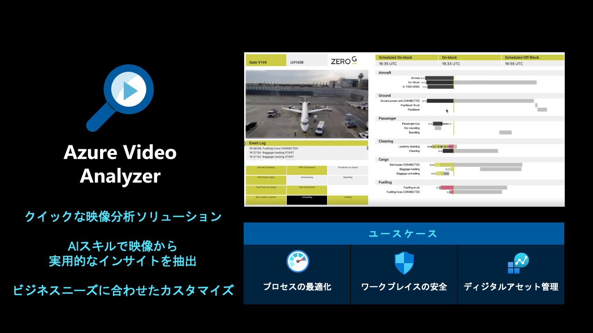

# Appendix 1: Azure Applied AI Services 紹介

- [Appendix 1: Azure Applied AI Services 紹介](#appendix-1-azure-applied-ai-services-紹介)
  - [Azure From Recognizer](#azure-from-recognizer)
    - [ドキュメント分析モデル](#ドキュメント分析モデル)
    - [事前構築済みのモデル](#事前構築済みのモデル)
    - [カスタム モデル](#カスタム-モデル)
  - [Azure Metrics Advisor](#azure-metrics-advisor)
  - [Azure Cognitive Search](#azure-cognitive-search)
  - [Azure Immersive Reader](#azure-immersive-reader)
  - [Azure Bot Service](#azure-bot-service)
  - [Azure Video Analyzer](#azure-video-analyzer)

---

> * [Azure Applied AI Services](https://learn.microsoft.com/ja-jp/azure/applied-ai-services/)
>     - 特定のビジネス シナリオ向けの特殊な AI サービス
>         - タスクに特化した AI でビジネス プロセスを最新化し、一般的なシナリオを解決することができます。
>         - 組み込みのビジネス ロジックで開発を加速し、数か月ではなく数日でソリューションを立ち上げることができます。
>         - クラウドからインテリジェント エッジまで広がるセキュリティで、どこでも責任を持って実行できます。

---

## [Azure From Recognizer](https://learn.microsoft.com/ja-jp/azure/applied-ai-services/what-are-applied-ai-services#azure-form-recognizer)

### ドキュメント分析モデル

- [読み取り OCR モデル](https://learn.microsoft.com/ja-jp/azure/applied-ai-services/form-recognizer/concept-read)
- [一般ドキュメント モデル](https://learn.microsoft.com/ja-jp/azure/applied-ai-services/form-recognizer/concept-general-document)
- [レイアウト分析モデル](https://learn.microsoft.com/ja-jp/azure/applied-ai-services/form-recognizer/concept-layout)

### 事前構築済みのモデル

- [W-2 フォーム モデル](https://learn.microsoft.com/ja-jp/azure/applied-ai-services/form-recognizer/concept-w2)
- [請求書モデル](https://learn.microsoft.com/ja-jp/azure/applied-ai-services/form-recognizer/concept-invoice)
- [領収書モデル](https://learn.microsoft.com/ja-jp/azure/applied-ai-services/form-recognizer/concept-receipt)
- [身分証明書 (ID) モデル](https://learn.microsoft.com/ja-jp/azure/applied-ai-services/form-recognizer/concept-id-document)
- [名刺モデル](https://learn.microsoft.com/ja-jp/azure/applied-ai-services/form-recognizer/concept-business-card)

### カスタム モデル

- [カスタム モデル](https://learn.microsoft.com/ja-jp/azure/applied-ai-services/form-recognizer/concept-custom)
- [作成済みモデル](https://learn.microsoft.com/ja-jp/azure/applied-ai-services/form-recognizer/concept-model-overview#composed-models)

---

## [Azure Metrics Advisor](https://learn.microsoft.com/ja-jp/azure/applied-ai-services/what-are-applied-ai-services#azure-metrics-advisor)

---

## [Azure Cognitive Search](https://learn.microsoft.com/ja-jp/azure/applied-ai-services/what-are-applied-ai-services#azure-cognitive-search)

- [インデックス作成機能](https://learn.microsoft.com/ja-jp/azure/search/search-features-list#indexing-features)
- [AI エンリッチメントとナレッジ マイニング](https://learn.microsoft.com/ja-jp/azure/search/search-features-list#ai-enrichment-and-knowledge-mining)
- [クエリとユーザー エクスペリエンス](https://learn.microsoft.com/ja-jp/azure/search/search-features-list#query-and-user-experience)
- [セキュリティ機能](https://learn.microsoft.com/ja-jp/azure/search/search-features-list#security-features)
- [ポータルの機能](https://learn.microsoft.com/ja-jp/azure/search/search-features-list#portal-features)
- [プログラミング支援](https://learn.microsoft.com/ja-jp/azure/search/search-features-list#programmability)

---

## [Azure Immersive Reader](https://learn.microsoft.com/ja-jp/azure/applied-ai-services/what-are-applied-ai-services#azure-immersive-reader)

---

## [Azure Bot Service](https://learn.microsoft.com/ja-jp/azure/applied-ai-services/what-are-applied-ai-services#azure-bot-service)

---

## [Azure Video Analyzer](https://learn.microsoft.com/ja-jp/azure/applied-ai-services/what-are-applied-ai-services#azure-video-analyzer)

- [ビデオ モデル](https://learn.microsoft.com/ja-jp/azure/azure-video-indexer/video-indexer-overview#video-models)
- [オーディオ モデル](https://learn.microsoft.com/ja-jp/azure/azure-video-indexer/video-indexer-overview#audio-models)
- [オーディオとビデオのモデル (マルチチャンネル)](https://learn.microsoft.com/ja-jp/azure/azure-video-indexer/video-indexer-overview#audio-and-video-models-multi-channels)

