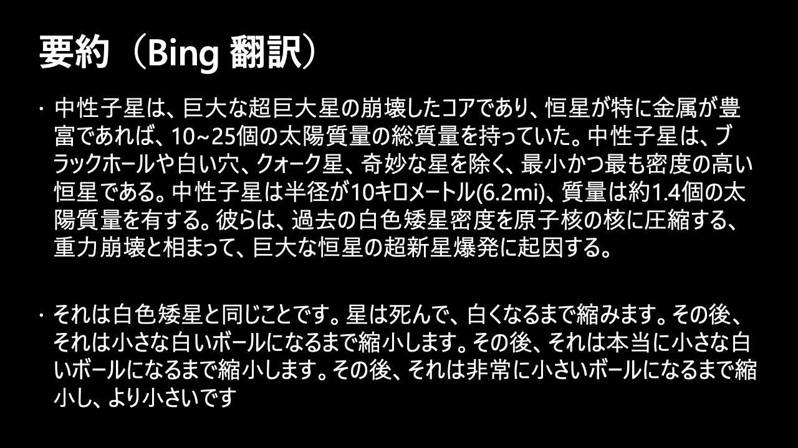

# Appendix 2: Azure Cognitive Services 紹介

- [Appendix 2: Azure Cognitive Services 紹介](#appendix-2-azure-cognitive-services-紹介)
  - [Vision API (視覚)](#vision-api-視覚)
    - [Computer Vision](#computer-vision)
    - [Custom Vision](#custom-vision)
  - [Speech API (音声)](#speech-api-音声)
    - [Speech Service](#speech-service)
  - [Language API (言語)](#language-api-言語)
    - [Azure Cognitive Service for Language](#azure-cognitive-service-for-language)
  - [Decision API (決定)](#decision-api-決定)
    - [Anomaly Detector API](#anomaly-detector-api)
    - [Azure Content Moderator API](#azure-content-moderator-api)
  - [Azure OpenAI Service](#azure-openai-service)

---

> * [Azure Cognitive Services](https://learn.microsoft.com/ja-jp/azure/cognitive-services/)
>     - 視覚、音声、言語、意思決定のためのカスタマイズ可能なコグニティブ API の包括的なファミリ
>         - 市場で最も包括的な AI 機能のポートフォリオを活用して、OpenAI モデルを含む高度な AI モデルに簡単にアクセスできます。
>         - 最初の AI サービスを自信を持って作成し、人間並みの視覚、音声、言語をコンピューターで実現しましょう。
>         - クラウドからエッジまで、コンテナーを使用すればどこでもデプロイできます。
>         - すぐに始められ、お客様独自の要件に合わせてソリューションをカスタマイズできます。

---

## [Vision API](https://learn.microsoft.com/ja-jp/azure/cognitive-services/what-are-cognitive-services#vision-apis) (視覚)

### [Computer Vision](https://learn.microsoft.com/ja-jp/azure/cognitive-services/computer-vision/)

- [光学式文字認識 (OCR)](https://learn.microsoft.com/ja-jp/azure/cognitive-services/computer-vision/overview-ocr)
- [画像分析](https://learn.microsoft.com/ja-jp/azure/cognitive-services/computer-vision/overview-image-analysis)
- [Face](https://learn.microsoft.com/ja-jp/azure/cognitive-services/computer-vision/overview-identity)
- [空間分析](https://learn.microsoft.com/ja-jp/azure/cognitive-services/computer-vision/intro-to-spatial-analysis-public-preview)

### [Custom Vision](https://learn.microsoft.com/ja-jp/azure/cognitive-services/custom-vision-service/)

- [画像分類](https://learn.microsoft.com/ja-jp/azure/cognitive-services/custom-vision-service/getting-started-build-a-classifier)
- [物体検出](https://learn.microsoft.com/ja-jp/azure/cognitive-services/custom-vision-service/get-started-build-detector)

---

## [Speech API](https://learn.microsoft.com/ja-jp/azure/cognitive-services/what-are-cognitive-services#speech-apis) (音声)

### [Speech Service](https://learn.microsoft.com/ja-jp/azure/cognitive-services/speech-service/)

- [音声テキスト変換](https://learn.microsoft.com/ja-jp/azure/cognitive-services/speech-service/index-speech-to-text)
- [テキスト読み上げ](https://learn.microsoft.com/ja-jp/azure/cognitive-services/speech-service/index-text-to-speech)
- [音声翻訳](https://learn.microsoft.com/ja-jp/azure/cognitive-services/speech-service/speech-translation)
- [言語識別](https://learn.microsoft.com/ja-jp/azure/cognitive-services/speech-service/language-identification?tabs=once&pivots=programming-language-python)
- [話者認識](https://learn.microsoft.com/ja-jp/azure/cognitive-services/speech-service/speaker-recognition-overview)
- [発音評価](https://learn.microsoft.com/ja-jp/azure/cognitive-services/speech-service/how-to-pronunciation-assessment?pivots=programming-language-python)
- [意図認識](https://learn.microsoft.com/ja-jp/azure/cognitive-services/speech-service/index-intent-recognition)
- [キーワード認識](https://learn.microsoft.com/ja-jp/azure/cognitive-services/speech-service/keyword-recognition-overview)

---

## [Language API](https://learn.microsoft.com/ja-jp/azure/cognitive-services/what-are-cognitive-services#language-apis) (言語)

### [Azure Cognitive Service for Language](https://learn.microsoft.com/ja-jp/azure/cognitive-services/language-service/)

- [名前付きエンティティの認識 (NER)](https://learn.microsoft.com/ja-jp/azure/cognitive-services/language-service/named-entity-recognition/overview)
- [個人を特定できる情報 (PII) と健康に関する情報 (PHI) の検出](https://learn.microsoft.com/ja-jp/azure/cognitive-services/language-service/personally-identifiable-information/overview)
- [言語検出](https://learn.microsoft.com/ja-jp/azure/cognitive-services/language-service/language-detection/overview)
- [感情分析とオピニオン マイニング](https://learn.microsoft.com/ja-jp/azure/cognitive-services/language-service/sentiment-opinion-mining/overview)
- [要約処理](https://learn.microsoft.com/ja-jp/azure/cognitive-services/language-service/summarization/overview?tabs=document-summarization)
- [キー フレーズの抽出](https://learn.microsoft.com/ja-jp/azure/cognitive-services/language-service/key-phrase-extraction/overview)
- [エンティティ リンク設定](https://learn.microsoft.com/ja-jp/azure/cognitive-services/language-service/entity-linking/overview)
- [Text Analytics for Health](https://learn.microsoft.com/ja-jp/azure/cognitive-services/language-service/text-analytics-for-health/overview?tabs=ner)
- [カスタム テキスト分類](https://learn.microsoft.com/ja-jp/azure/cognitive-services/language-service/custom-text-classification/overview)
- [カスタム固有表現認識 (カスタム NER)](https://learn.microsoft.com/ja-jp/azure/cognitive-services/language-service/custom-named-entity-recognition/overview)
- [会話言語理解](https://learn.microsoft.com/ja-jp/azure/cognitive-services/language-service/conversational-language-understanding/overview)
- [質問応答](https://learn.microsoft.com/ja-jp/azure/cognitive-services/language-service/question-answering/overview)

---

## [Decision API](https://learn.microsoft.com/ja-jp/azure/cognitive-services/what-are-cognitive-services#decision-apis) (決定)

### [Anomaly Detector API](https://learn.microsoft.com/ja-jp/azure/cognitive-services/anomaly-detector/)

- [一変量異常検出](https://learn.microsoft.com/ja-jp/azure/cognitive-services/anomaly-detector/overview#univariate-anomaly-detection)
- [多変量異常検出](https://learn.microsoft.com/ja-jp/azure/cognitive-services/anomaly-detector/overview#multivariate-anomaly-detection)

### [Azure Content Moderator API](https://learn.microsoft.com/ja-jp/azure/cognitive-services/content-moderator/)

- [テキスト モデレーション](https://learn.microsoft.com/ja-jp/azure/cognitive-services/content-moderator/text-moderation-api)
- [カスタム用語リスト](https://learn.microsoft.com/ja-jp/azure/cognitive-services/content-moderator/try-terms-list-api)
- [画像モデレーション](https://learn.microsoft.com/ja-jp/azure/cognitive-services/content-moderator/image-moderation-api)
- [カスタム画像リスト](https://learn.microsoft.com/ja-jp/azure/cognitive-services/content-moderator/try-image-list-api)
- [ビデオ モデレーション](https://learn.microsoft.com/ja-jp/azure/cognitive-services/content-moderator/video-moderation-api)

---

## [Azure OpenAI Service](https://learn.microsoft.com/ja-jp/azure/cognitive-services/openai/)

