###### Azure Machine Learning 入門 (L100)

# 1. イントロダクション

- [1. イントロダクション](#1-イントロダクション)
  - [1. アーキテクチャ](#1-アーキテクチャ)
  - [2. 使い方](#2-使い方)
  - [3. 概念](#3-概念)
    - [3.1. リソース](#31-リソース)
      - [3.1.1. ワークスペース](#311-ワークスペース)
      - [3.1.2. コンピューティング](#312-コンピューティング)
      - [3.1.3. データストア](#313-データストア)
    - [3.2. アセット](#32-アセット)
      - [3.2.1. 環境](#321-環境)
        - [3.2.1.1. キュレーション環境](#3211-キュレーション環境)
        - [3.2.1.2. カスタム環境](#3212-カスタム環境)
      - [3.2.2. 実験](#322-実験)
      - [3.2.3. データ および データセット](#323-データ-および-データセット)
      - [3.2.4. モデル](#324-モデル)
      - [3.2.5. パイプライン](#325-パイプライン)
      - [3.2.6. コンポーネント](#326-コンポーネント)
      - [3.2.7. エンドポイント](#327-エンドポイント)
  - [4. 環境構築](#4-環境構築)
    - [4.1. CLI のインストールと設定](#41-cli-のインストールと設定)
    - [4.2. Python 開発環境の構築](#42-python-開発環境の構築)
      - [サポートされる Python のバージョン](#サポートされる-python-のバージョン)
    - [4.3. Visual Studio Code 拡張機能のセットアップ](#43-visual-studio-code-拡張機能のセットアップ)
  - [5. 参考資料](#5-参考資料)

## 1. アーキテクチャ

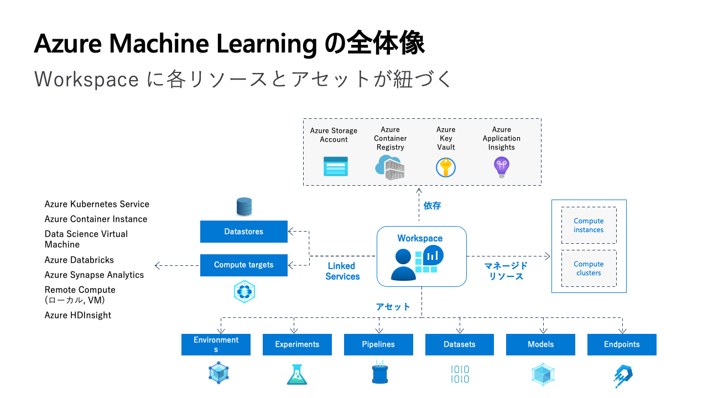

---

## 2. 使い方

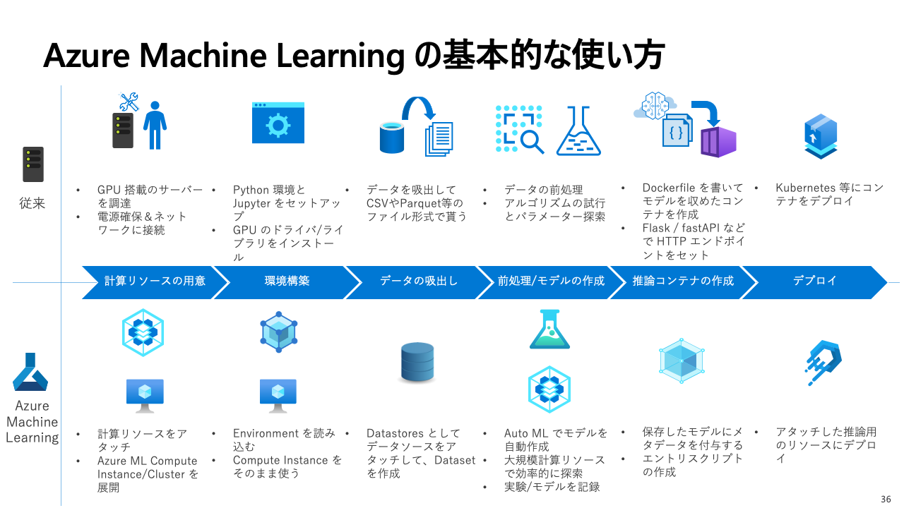

---

## 3. 概念

### 3.1. [リソース](https://learn.microsoft.com/ja-jp/azure/machine-learning/concept-azure-machine-learning-v2)

> 機械学習ワークフローを実行するために必要なセットアップ リソースやインフラストラクチャ リソース。

#### 3.1.1. [ワークスペース](https://learn.microsoft.com/ja-jp/azure/machine-learning/azure-machine-learning-glossary#workspace)

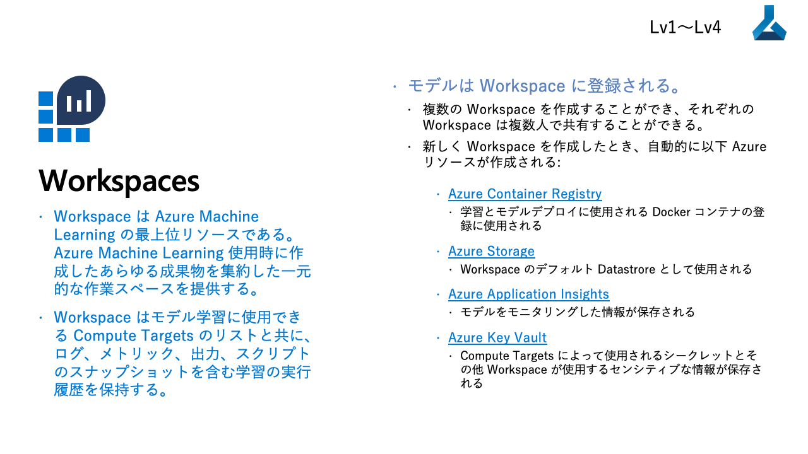

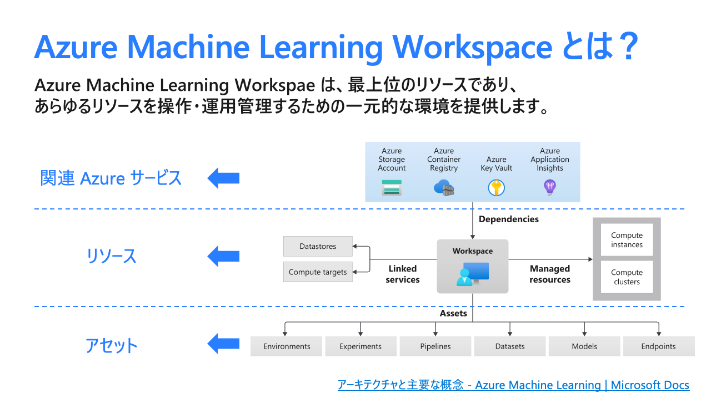

> ワークスペースは、Azure Machine Learning の最上位のリソースで、Azure Machine Learning を使用するときに作成するすべての成果物を操作するための一元的な場所を提供します。 ワークスペースには、スクリプトのログ、メトリック、出力、スナップショットなど、すべてのジョブの履歴が保持されます。 ワークスペースには、データストアやコンピューティングなどのリソースへの参照が格納されます。 また、モデル、環境、コンポーネント、データ アセットなど、すべてのアセットも保持されます。

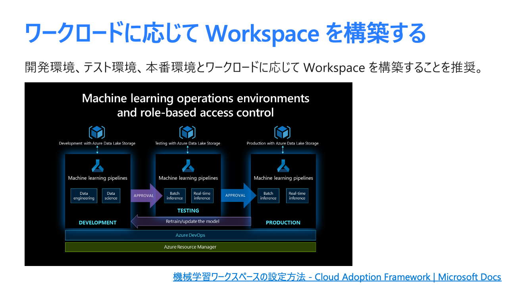

#### 3.1.2. [コンピューティング](https://learn.microsoft.com/ja-jp/azure/machine-learning/azure-machine-learning-glossary#compute)

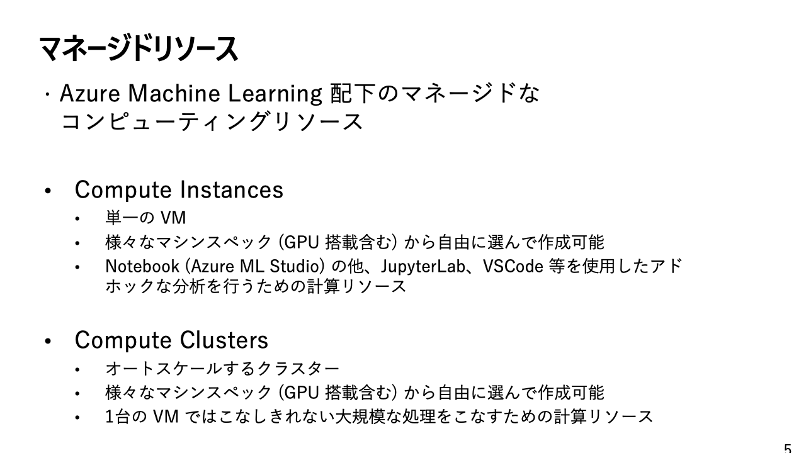

> コンピューティングとは、ジョブを実行したり、エンドポイントをホストしたりする、指定されたコンピューティング リソースのことです。 Azure Machine Learning では、コンピューティングの種類として以下がサポートされています。
> 
> * **コンピューティング クラスター** - [クラウド](https://azure.microsoft.com/ja-jp/resources/cloud-computing-dictionary/what-is-the-cloud/)上に CPU または GPU コンピューティング ノードのクラスターを簡単に作成できる、マネージド コンピューティング インフラストラクチャ。
> * **コンピューティング インスタンス** - 完全に構成および管理される、クラウド上の開発環境。 このインスタンスは、トレーニングまたは推論コンピューティングとして、開発やテストに使用できます。 これは、クラウド上の[仮想マシン](https://azure.microsoft.com/ja-jp/resources/cloud-computing-dictionary/what-is-a-virtual-machine/)のようなものです。
> * **[Kubernetes](https://kubernetes.io/ja/docs/concepts/overview/what-is-kubernetes/) クラスター** - トレーニング済みの機械学習モデルを [Azure Kubernetes Service](https://azure.microsoft.com/ja-jp/products/kubernetes-service/) にデプロイするために使用されます。 Azure ML ワークスペースから [Azure Kubernetes Service (AKS) クラスター](https://learn.microsoft.com/ja-jp/azure/aks/concepts-clusters-workloads#kubernetes-cluster-architecture)を作成するか、既存の AKS クラスターをアタッチすることができます。
> * **アタッチ型コンピューティング** - 独自のコンピューティング リソースをワークスペースにアタッチし、トレーニングと推論に使用できます。

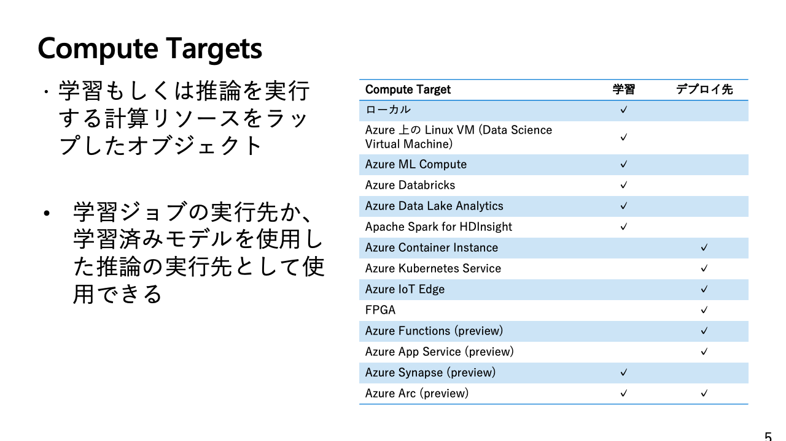

#### 3.1.3. [データストア](https://learn.microsoft.com/ja-jp/azure/machine-learning/azure-machine-learning-glossary#datastore)

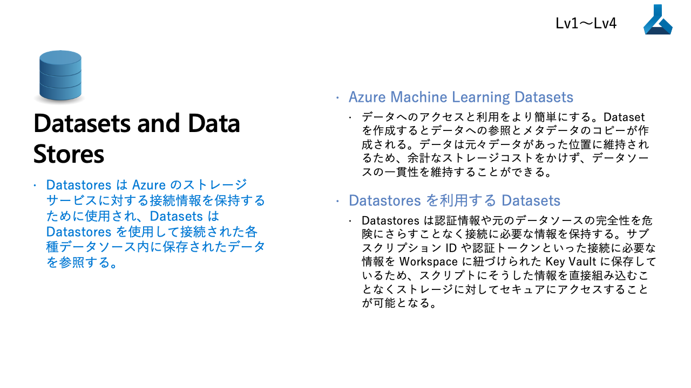

> Azure Machine Learning データストアでは、Azure のデータ ストレージへの接続情報が安全に保持されるため、ご自身のスクリプトでそのコードを書く必要はありません。 データストアを登録および作成すると、ストレージ アカウントに簡単に接続し、基になるストレージ サービスのデータにアクセスできます。 [CLI v2](https://learn.microsoft.com/ja-jp/azure/machine-learning/how-to-configure-cli?tabs=public) と [SDK v2](https://learn.microsoft.com/ja-jp/azure/machine-learning/how-to-manage-workspace?tabs=python) では、次の種類の[クラウドベース ストレージ](https://azure.microsoft.com/ja-jp/resources/cloud-computing-dictionary/what-is-cloud-storage/) サービスがサポートされています。
> 
> * [Azure BLOB](https://learn.microsoft.com/ja-jp/azure/storage/blobs/storage-blobs-introduction) [コンテナー](https://learn.microsoft.com/ja-jp/azure/storage/blobs/storage-blobs-introduction#containers)
> * [Azure ファイル共有](https://learn.microsoft.com/ja-jp/azure/storage/files/storage-how-to-use-files-portal?tabs=azure-portal)
> * [Azure Data Lake](https://learn.microsoft.com/ja-jp/azure/data-lake-store/data-lake-store-overview)
> * [Azure Data Lake Gen2](https://learn.microsoft.com/ja-jp/azure/storage/blobs/data-lake-storage-introduction)

### 3.2. [アセット](https://learn.microsoft.com/ja-jp/azure/machine-learning/concept-azure-machine-learning-v2)

> Azure ML コマンドを使用して、またはトレーニング/スコアリングの実行の一部として作成されます。 アセットはバージョン管理され、Azure ML ワークスペースに登録できます。

#### 3.2.1. [環境](https://learn.microsoft.com/ja-jp/azure/machine-learning/azure-machine-learning-glossary#environment)

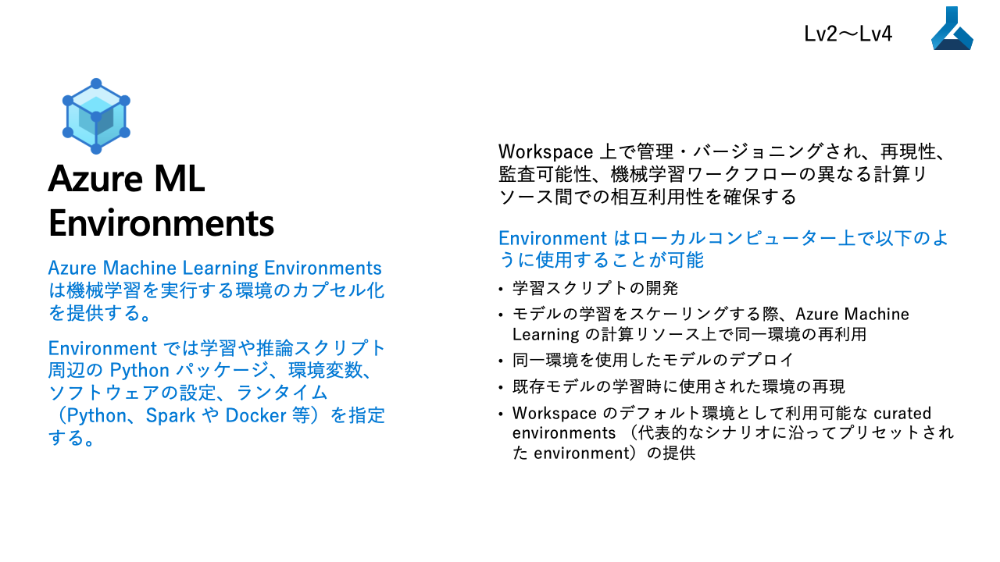

> Azure Machine Learning 環境は、[機械学習](https://azure.microsoft.com/ja-jp/resources/cloud-computing-dictionary/what-is-machine-learning-platform/)タスクが行われる環境をカプセル化したものです。 そこでは、トレーニングとスコアリングのスクリプトに関連する、ソフトウェア パッケージ、環境変数、およびソフトウェア設定を指定します。 環境は、Machine Learning ワークスペース内で管理およびバージョン管理されるエンティティです。 環境を使用することで、さまざまなコンピューティング先で再現、監査、移植できる機械学習ワークフローを実現できます。

##### 3.2.1.1. キュレーション環境

> キュレートされた環境は Azure Machine Learning から提供され、既定でお使いのワークスペースで利用できます。 これらには、現状のまま使用する目的で、Python のパッケージと設定のコレクションが含まれていて、さまざまな機械学習フレームワークの使用を開始する助けとなります。 これらの事前に作成された環境を利用すると、デプロイ時間の短縮も可能です。 完全な一覧については、[キュレーションされた環境に関する記事](https://learn.microsoft.com/ja-jp/azure/machine-learning/resource-curated-environments)を参照してください。

##### 3.2.1.2. カスタム環境

> カスタム環境では、環境のセットアップはお客様の責任となります。 コンピューティングでトレーニングまたはスコアリング スクリプトに必要なパッケージとその他の依存関係を必ずインストールしてください。 Azure ML では以下のものを使用して独自の環境を作成できます
> 
> * [Docker](https://docs.docker.jp/get-started/overview.html) [イメージ](https://docs.docker.jp/get-started/overview.html#id16)
> * さらにカスタマイズするための [conda](https://ja.wikipedia.org/wiki/Anaconda_(Python%E3%83%87%E3%82%A3%E3%82%B9%E3%83%88%E3%83%AA%E3%83%93%E3%83%A5%E3%83%BC%E3%82%B7%E3%83%A7%E3%83%B3)) YAML を含んだ基本 Docker イメージ
> * Docker ビルドのコンテキスト

#### 3.2.2. 実験

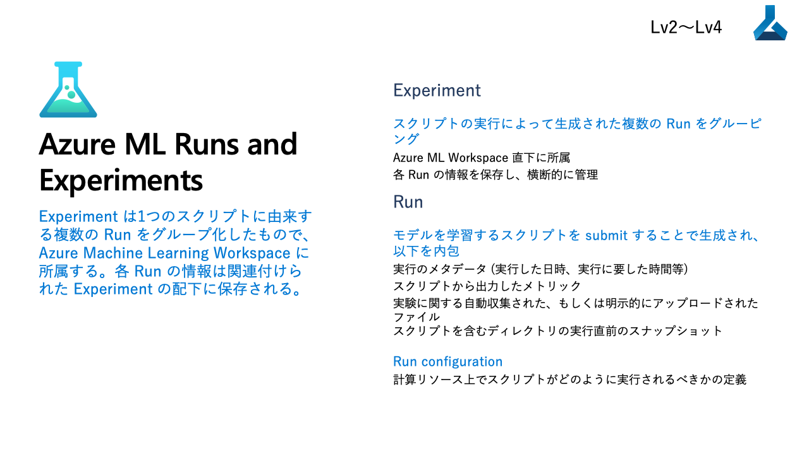

#### 3.2.3. [データ](https://learn.microsoft.com/ja-jp/azure/machine-learning/azure-machine-learning-glossary#data) および データセット

> Azure Machine Learning では、さまざまな種類のデータを利用できます。
> 
> * URI (ローカル/クラウド ストレージ内の場所)
>   * `uri_folder`
>   * `uri_file`
> * テーブル (表形式データの抽象化)
>   * `mltable`
> * プリミティブ
>   * `string`
>   * `boolean`
>   * `number`
> 
> ほとんどのシナリオでは、URI (`uri_folder` および `uri_file`) を使用します。これは、ストレージをマウントするか、ノードにダウンロードすることで、ジョブ内のコンピューティング ノードのファイルシステムに簡単にマップできるストレージ内の場所です。
> 
> `mltable` は、AutoML ジョブ、並列ジョブ、およびいくつかの高度なシナリオで使用される表形式データの抽象化です。 Azure Machine Learning を使用し始めたばかりで、AutoML を使用していない場合は、URI から始めることを強くお勧めします。

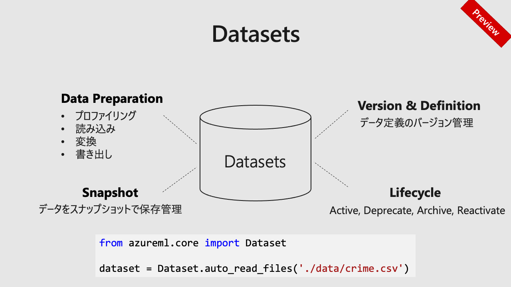

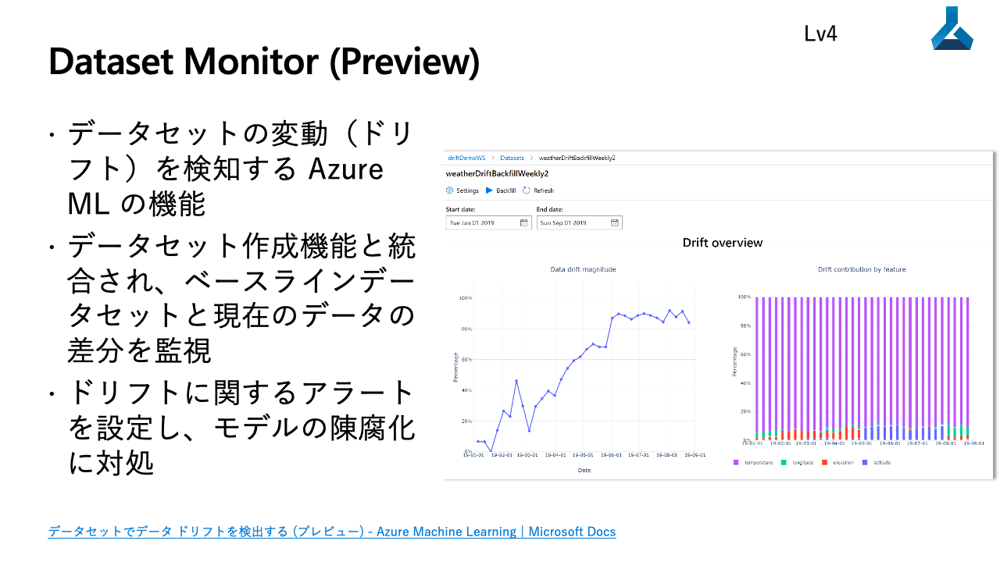

#### 3.2.4. [モデル](https://learn.microsoft.com/ja-jp/azure/machine-learning/azure-machine-learning-glossary#model)

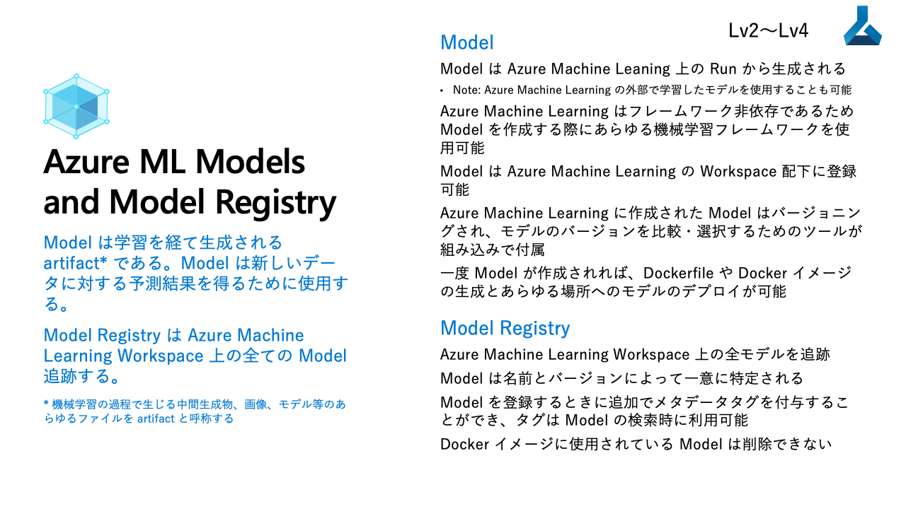

> Azure 機械学習モデルは、機械学習モデルと対応するメタデータを表すバイナリ ファイルで構成されます。 モデルは、ローカルまたはリモートのファイルやディレクトリから作成できます。 リモートの場所としては、`https`、`wasbs`、および`azureml` がサポートされています。 作成されたモデルは、指定された名前とバージョンでワークスペース内で追跡されます。 Azure ML では、モデルのストレージ形式として次の 3 種類がサポートされています。
> 
> * `custom_model`
> * `mlflow_model`
> * `triton_model`

#### 3.2.5. [パイプライン](https://learn.microsoft.com/ja-jp/azure/machine-learning/concept-ml-pipelines)

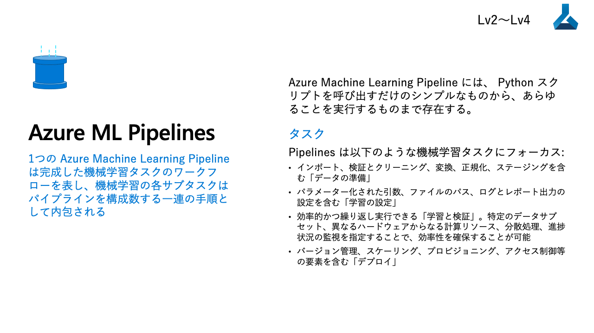

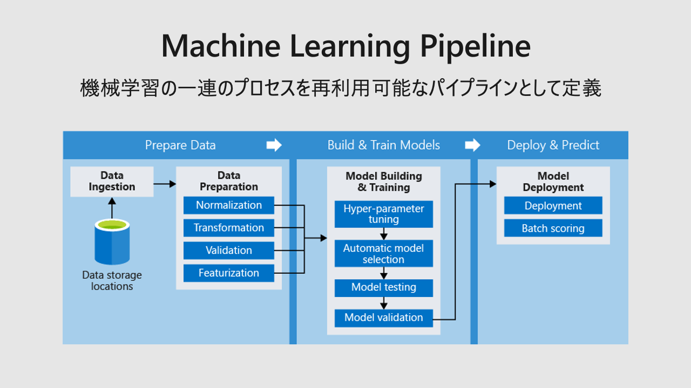

> Azure Machine Learning パイプラインは、独立して実行できる完全な機械学習タスクのワークフローです。 Azure Machine Learning パイプラインは、機械学習モデルを生成する上でのベスト プラクティスを標準化するのに役立ち、チームが規模に応じて実行できるようにし、モデル構築の効率を向上させます。

#### 3.2.6. [コンポーネント](https://learn.microsoft.com/ja-jp/azure/machine-learning/azure-machine-learning-glossary#component)

> Azure Machine Learning コンポーネントは、機械学習[パイプライン](https://learn.microsoft.com/ja-jp/azure/machine-learning/concept-ml-pipelines)で 1 つのステップを実行する自己格納型のコードです。 コンポーネントは、高度な機械学習パイプラインの構成要素です。 コンポーネントは、データ処理、モデル トレーニング、モデル スコアリングなどのタスクを実行できます。 コンポーネントは関数に類似しており、名前とパラメーターを持ち、入力を予想し、出力を返します。

#### 3.2.7. [エンドポイント](https://learn.microsoft.com/ja-jp/azure/machine-learning/concept-endpoints)

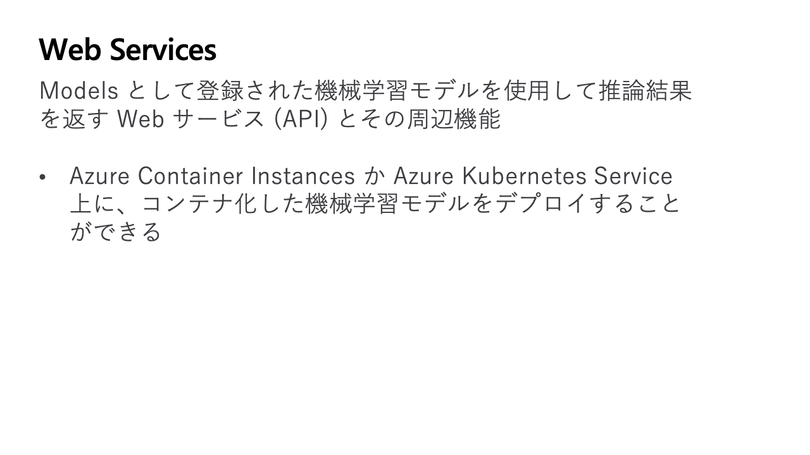

> 機械学習モデルをトレーニングした後、他のユーザーがそのモデルを使用して推論を実行できるようにするために、それをデプロイする必要があります。 Azure Machine Learning では、エンドポイントとデプロイを使用して、そうすることができます。
> 
> この文脈でのエンドポイントは、クライアントで要求 (入力データ) を送信し、トレーニングされたモデルの推論 (スコアリング) 出力を受信するためのインターフェイスを提供する HTTPS パスになります。

> デプロイは、実際の推論を実行するモデルをホストするのに必要なリソースのセットです。
> 
> 1 つのエンドポイントに複数のデプロイを含めることができます。 

> Azure Machine Learning では、[オンライン エンドポイント](https://learn.microsoft.com/ja-jp/azure/machine-learning/concept-endpoints#what-are-online-endpoints)と[バッチ エンドポイント](https://learn.microsoft.com/ja-jp/azure/machine-learning/concept-endpoints#what-are-batch-endpoints)の両方を実装できます。

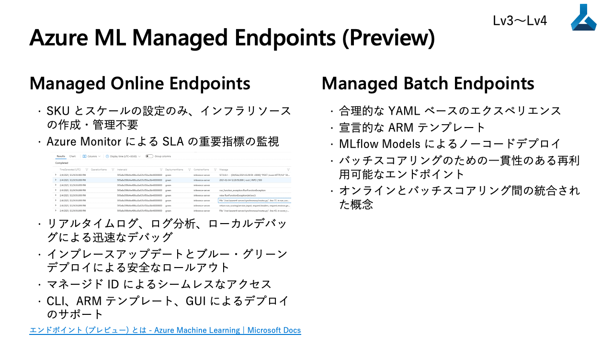

---

## 4. 環境構築

### 4.1. CLI のインストールと設定

https://learn.microsoft.com/ja-jp/azure/machine-learning/how-to-configure-cli?tabs=public

### 4.2. Python 開発環境の構築

https://learn.microsoft.com/ja-jp/azure/machine-learning/concept-azure-machine-learning-v2?tabs=sdk

#### サポートされる Python のバージョン

* [Azure Machine Learning Python SDK v2](https://learn.microsoft.com/ja-jp/python/api/overview/azure/ai-ml-readme?view=azure-python)
  * Python 3.7 以上 (3.7、3.8、3.9、3.10)
* [Azure Machine Learning Python SDK v1](https://learn.microsoft.com/ja-jp/python/api/overview/azure/ml/install?view=azure-ml-py)
  * Python 3.7 以上
  * 但し azureml-automl パッケージは 3.7 または 3.8 のみ

### 4.3. Visual Studio Code 拡張機能のセットアップ

https://learn.microsoft.com/ja-jp/azure/machine-learning/how-to-setup-vs-code

---

## 5. 参考資料

* [Azure 用語集 - Azure 辞書 | Microsoft Learn](https://learn.microsoft.com/ja-jp/azure/azure-glossary-cloud-terminology)
* [クラウド コンピューティングの用語 | Microsoft Azure](https://azure.microsoft.com/ja-jp/resources/cloud-computing-dictionary/)
* [Azure 基礎の概念 - Cloud Adoption Framework | Microsoft Learn](https://learn.microsoft.com/ja-jp/azure/cloud-adoption-framework/ready/considerations/fundamental-concepts)
* [環境イメージのトラブルシューティング - Azure Machine Learning | Microsoft Learn](https://learn.microsoft.com/ja-jp/azure/machine-learning/how-to-troubleshoot-environments)
