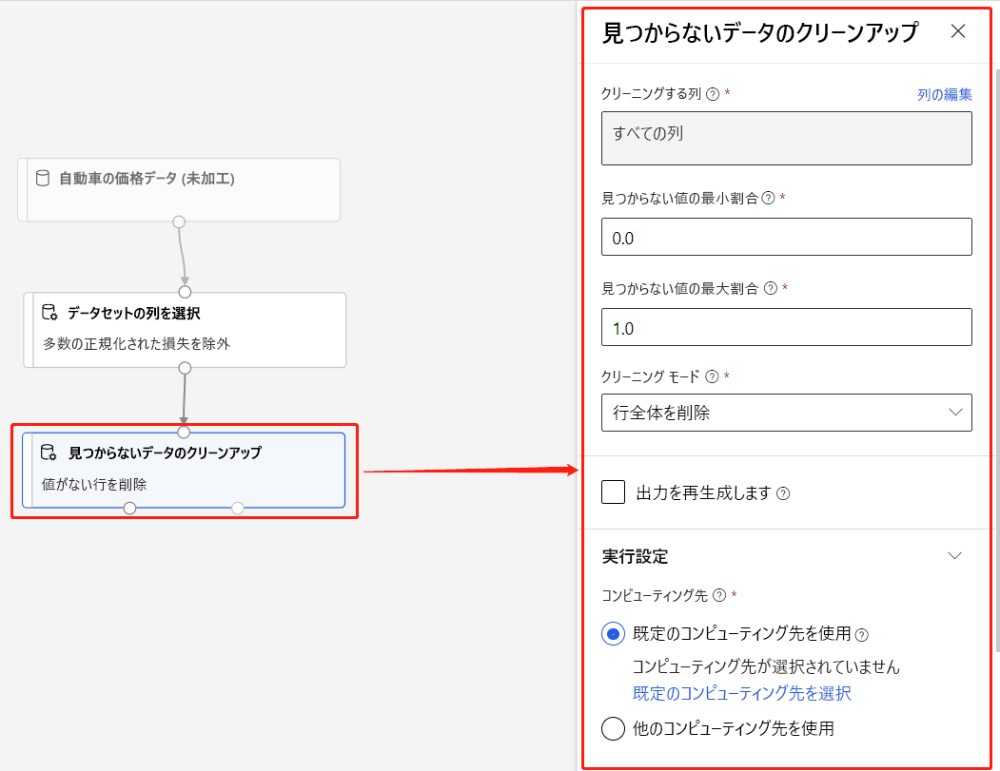

###### Azure Machine Learning 入門 (L100)

# 4. デザイナー

- [4. デザイナー](#4-デザイナー)
  - [1. パイプライン](#1-パイプライン)
    - [1.1. 関連キーワード](#11-関連キーワード)
  - [2. データ](#2-データ)
    - [2.1. 関連キーワード](#21-関連キーワード)
  - [3. (事前構築済み)コンポーネント](#3-事前構築済みコンポーネント)
    - [3.1. データ準備コンポーネント](#31-データ準備コンポーネント)
      - [3.1.1. データの入力と出力](#311-データの入力と出力)
      - [3.1.2. データの変換](#312-データの変換)
      - [3.1.3. 特徴選択](#313-特徴選択)
      - [3.1.4. 統計関数](#314-統計関数)
    - [3.2. 機械学習のアルゴリズム](#32-機械学習のアルゴリズム)
      - [3.2.1. 回帰](#321-回帰)
      - [3.2.2. クラスタリング](#322-クラスタリング)
      - [3.2.3. 分類](#323-分類)
    - [3.3. モデルを構築および評価するためのコンポーネント](#33-モデルを構築および評価するためのコンポーネント)
      - [3.3.1. モデル トレーニング](#331-モデル-トレーニング)
      - [3.3.2. モデルのスコアリングと評価](#332-モデルのスコアリングと評価)
      - [3.3.3. Python 言語](#333-python-言語)
      - [3.3.4. R スクリプトの実行](#334-r-スクリプトの実行)
      - [3.3.5. Text Analytics](#335-text-analytics)
      - [3.3.6. Computer Vision](#336-computer-vision)
      - [3.3.7. レコメンデーション](#337-レコメンデーション)
      - [3.3.8. 異常検出](#338-異常検出)
    - [3.4. Web サービス コンポーネント](#34-web-サービス-コンポーネント)
      - [3.4.1. Web サービスの入出力](#341-web-サービスの入出力)
  - [4. 組み込みサンプル](#4-組み込みサンプル)
    - [4.1. サンプル パイプライン](#41-サンプル-パイプライン)
      - [4.1.1. 回帰](#411-回帰)
      - [4.1.2. 分類](#412-分類)
      - [4.1.3. Computer Vision](#413-computer-vision)
      - [4.1.4. レコメンダー](#414-レコメンダー)
      - [4.1.5. ユーティリティ](#415-ユーティリティ)
    - [4.2. サンプル データセット](#42-サンプル-データセット)
  - [5. コンピューティング リソース](#5-コンピューティング-リソース)
  - [6. チュートリアル](#6-チュートリアル)
    - [6.1. 回帰モデルのトレーニング](#61-回帰モデルのトレーニング)
    - [6.2. モデルのデプロイ](#62-モデルのデプロイ)
      - [6.2.1. 制限事項](#621-制限事項)
  - [7. ラーニング](#7-ラーニング)
  - [8. 参考資料](#8-参考資料)

---

## 1. [パイプライン](https://learn.microsoft.com/ja-jp/azure/machine-learning/concept-designer#pipeline)

> パイプラインは、ユーザーによって接続された **データ資産** と **分析コンポーネント** で構成されます。 パイプラインには多くの用途があります。1 つのモデルをトレーニングするパイプラインや、複数のモデルをトレーニングするパイプラインを作成できます。 リアルタイムまたはバッチで予測を行うパイプラインや、データをクリーンアップするだけのパイプラインを作成できます。 パイプラインを使用して、作業を再利用し、プロジェクトを整理することができます。

### 1.1. 関連キーワード

* [ドラフト](https://learn.microsoft.com/ja-jp/azure/machine-learning/concept-designer#pipeline-draft)
* [ジョブ](https://learn.microsoft.com/ja-jp/azure/machine-learning/concept-designer#pipeline-job)
* [デプロイ(配置)](https://learn.microsoft.com/ja-jp/azure/machine-learning/concept-designer#deploy)
    - [チュートリアル: デザイナー - コードのないモデルをデプロイする - Azure Machine Learning | Microsoft Learn](https://learn.microsoft.com/ja-jp/azure/machine-learning/tutorial-designer-automobile-price-deploy)
* [発行](https://learn.microsoft.com/ja-jp/azure/machine-learning/concept-designer#publish)

---

## 2. [データ](https://learn.microsoft.com/ja-jp/azure/machine-learning/concept-designer#data)

> 機械学習データ資産によって、データへのアクセスと操作がより容易になります。 デザイナーには、実験に利用できるいくつかのサンプル データ資産が含まれています。 必要に応じて、データ資産をさらに登録することができます。

### 2.1. 関連キーワード

* データ アセット
* データストア
* データセット モニター (プレビュー)

---

## 3. [(事前構築済み)コンポーネント](https://learn.microsoft.com/ja-jp/azure/machine-learning/concept-designer#component)

> コンポーネントとは、データに対して実行できるアルゴリズムのことです。 デザイナーには、データのイングレス機能や、プロセスのトレーニング、スコアリング、検証などのいくつかのコンポーネントが用意されています。
> 
> コンポーネントに一連のパラメーターが含まれている場合、これらを使用してコンポーネントの内部アルゴリズムを構成することができます。 キャンバスでコンポーネントを選択すると、コンポーネントのパラメーターは、キャンバス右側の [プロパティ] ウィンドウに表示されます。 このウィンドウでパラメーターを変更することにより、モデルを微調整できます。 デザイナーでは、個々のコンポーネントに対してコンピューティング リソースを設定できます。

    1. データ準備コンポーネント
    2. 機械学習のアルゴリズム
    3. モデルを構築および評価するためのコンポーネント
    4. Web サービス コンポーネント

### 3.1. [データ準備コンポーネント](https://learn.microsoft.com/ja-jp/azure/machine-learning/component-reference/component-reference#data-preparation-components)

    1. データの入力と出力
    2. データの変換
    3. 特徴選択
    4. 統計関数

#### 3.1.1. データの入力と出力

| #   | コンポーネント   | Component    |
| --- | -------------- | ------------ |
| 1 | データの手動入力 | Enter Data Manually |
| 2 | データのエクスポート | Export Data |
| 3 | データのインポート | Import Data |

#### 3.1.2. データの変換

| #   | コンポーネント   | Component    |
| --- | -------------- | ------------ |
| 1 | 列の追加 | Add Columns |
| 2 | 行の追加 | Add Rows |
| 3 | 算術演算の適用 | Apply Math Operation |
| 4 | SQL 変換の適用 | Apply SQL Transformation |
| 5 | 見つからないデータのクリーンアップ | Clean Missing Data |
| 6 | クリップの値 | Clip Values |
| 7 | CSV への変換 | Convert to CSV |
| 8 | データセットへの変換 | Convert to Dataset |
| 9 | インジケーター値への変換 | Convert to Indicator Values |
| 10 | メタデータの編集 | Edit Metadata |
| 11 | データをビンにグループ化する | Group Data into Bins |
| 12 | データの結合 | Join Data |
| 13 | データの正規化 | Normalize Data |
| 14 | パーティションとサンプル | Partition and Sample |
| 15 | 重複する行の削除 | Remove Duplicate Rows |
| 16 | SMOTE | SMOTE |
| 17 | 列変換の選択 | Select Columns Transform |
| 18 | データセット内の列の選択 | Select Columns in Dataset |
| 19 | データの分割 | Split Data |

#### 3.1.3. 特徴選択

| #   | コンポーネント   | Component    |
| --- | -------------- | ------------ |
| 1 | フィルターに基づく特徴選択 | Filter Based Feature Selection |
| 2 | 順列の特徴量の重要度 | Permutation Feature Importance |

#### 3.1.4. 統計関数

| #   | コンポーネント   | Component    |
| --- | -------------- | ------------ |
| 1 | データの集計 | Summarize Data |

### 3.2. [機械学習のアルゴリズム](https://learn.microsoft.com/ja-jp/azure/machine-learning/component-reference/component-reference#machine-learning-algorithms)

    1. 回帰
    2. クラスタリング
    3. 分類

#### 3.2.1. 回帰

| #   | コンポーネント   | Component    |
| --- | -------------- | ------------ |
| 1 | ブースト デシジョン ツリー回帰 | Boosted Decision Tree Regression |
| 2 | デシジョン フォレスト回帰 | Decision Forest Regression |
| 3 | 高速フォレスト分位点回帰 | Fast Forest Quantile Regression |
| 4 | 線形回帰 | Linear Regression |
| 5 | ニューラル ネットワーク回帰 | Neural Network Regression |
| 6 | ポワソン回帰 | Poisson Regression |

#### 3.2.2. クラスタリング

| #   | コンポーネント   | Component    |
| --- | -------------- | ------------ |
| 1 | K-Means クラスタリング | K-Means Clustering |

#### 3.2.3. 分類

| #   | コンポーネント   | Component    |
| --- | -------------- | ------------ |
| 1 | 多クラスの増幅デシジョン ツリー | Multiclass Boosted Decision Tree |
| 2 | 多クラス デシジョン フォレスト | Multiclass Decision Forest |
| 3 | 多クラス ロジスティック回帰 | Multiclass Logistic Regression |
| 4 | 多クラス ニューラル ネットワーク | Multiclass Neural Network |
| 5 | 1 対全多クラス | One vs. All Multiclass |
| 6 | One vs.One Multiclass | One vs. One Multiclass |
| 7 | 2 クラス平均化パーセプトロン | Two-Class Averaged Perceptron |
| 8 | 2 クラス ブースト デシジョン ツリー | Two-Class Boosted Decision Tree |
| 9 | 2 クラス デシジョン フォレスト | Two-Class Decision Forest |
| 10 | 2 クラス ロジスティック回帰 | Two-Class Logistic Regression |
| 11 | 2 クラス ニューラル ネットワーク | Two-Class Neural Network |
| 12 | 2 クラス サポート ベクター マシン | Two Class Support Vector Machine |

### 3.3. モデルを構築および評価するためのコンポーネント

    1. モデル トレーニング
    2. モデルのスコアリングと評価
    3. Python 言語
    4. R スクリプトの実行
    5. Text Analytics
    6. Computer Vision
    7. レコメンデーション
    8. 異常検出

#### 3.3.1. モデル トレーニング

| #   | コンポーネント   | Component    |
| --- | -------------- | ------------ |
| 1 | クラスタリング モデルのトレーニング | Train Clustering Model |
| 2 | モデルのトレーニング | Train Model |
| 3 | PyTorch モデルのトレーニング | Train Pytorch Model |
| 4 | モデルのハイパーパラメーターの調整 | Tune Model Hyperparameters |

#### 3.3.2. モデルのスコアリングと評価

| #   | コンポーネント   | Component    |
| --- | -------------- | ------------ |
| 1 | 変換の適用 | Apply Transformation |
| 2 | クラスターへのデータの割り当て | Assign Data to Clusters |
| 3 | モデルのクロス検証 | Cross Validate Model |
| 4 | モデルの評価 | Evaluate Model |
| 5 | 画像モデルのスコア付け | Score Image Model |
| 6 | モデルのスコア付け | Score Model |

#### 3.3.3. Python 言語

| #   | コンポーネント   | Component    |
| --- | -------------- | ------------ |
| 1 | Python モデルの作成 | Create Python Model |
| 2 | Python スクリプトの実行 | Execute Python Script |

#### 3.3.4. R スクリプトの実行

| #   | コンポーネント   | Component    |
| --- | -------------- | ------------ |
| 1 | R 言語 | Execute R Script |

#### 3.3.5. Text Analytics

| #   | コンポーネント   | Component    |
| --- | -------------- | ------------ |
| 1 | 単語からベクトルへの変換 | Convert Word to Vector |
| 2 | テキストからの N Gram 特徴抽出 | Extract N Gram Features from Text |
| 3 | 特徴ハッシュ | Feature Hashing |
| 4 | テキストの前処理 | Preprocess Text |
| 5 | Latent Dirichlet Allocation | Latent Dirichlet Allocation |
| 6 | Score Vowpal Wabbit Model (Vowpal Wabbit モデルのスコアリング) | Score Vowpal Wabbit Model |
| 7 | Train Vowpal Wabbit Model (Vowpal Wabbit モデルのトレーニング) | Train Vowpal Wabbit Model |

#### 3.3.6. Computer Vision

| #   | コンポーネント   | Component    |
| --- | -------------- | ------------ |
| 1 | イメージ変換の適用 | Apply Image Transformation |
| 2 | イメージ ディレクトリへの変換 | Convert to Image Directory |
| 3 | イメージ変換の初期化 | Init Image Transformation |
| 4 | イメージ ディレクトリの分割 | Split Image Directory |
| 5 | DenseNet | DenseNet |
| 6 | ResNet | ResNet |

#### 3.3.7. レコメンデーション

| #   | コンポーネント   | Component    |
| --- | -------------- | ------------ |
| 1 | レコメンダーの評価 | Evaluate Recommender |
| 2 | SVD レコメンダーのスコア付け | Score SVD Recommender |
| 3 | ワイドかつディープなレコメンダーのスコア付け | Score Wide and Deep Recommender |
| 4 | SVD レコメンダーのトレーニング | Train SVD Recommender |
| 5 | ワイドかつディープなレコメンダーのトレーニング | Train Wide and Deep Recommender |

#### 3.3.8. 異常検出

| #   | コンポーネント   | Component    |
| --- | -------------- | ------------ |
| 1 | PCA ベースの異常検出 | PCA-Based Anomaly Detection |
| 2 | 異常検出モデルのトレーニング | Train Anomaly Detection Model |

### 3.4. Web サービス コンポーネント

    1. Web サービスの入出力

#### 3.4.1. [Web サービスの入出力](https://learn.microsoft.com/ja-jp/azure/machine-learning/component-reference/web-service-input-output)

| #   | コンポーネント   | Component    |
| --- | -------------- | ------------ |
| 1 | Web サービスの入力 | Web Service Input |
| 2 | Web サービスの出力 | Web Service Output |

---

## 4. 組み込みサンプル

    1. サンプル パイプライン
    2. サンプル データセット

### 4.1. [サンプル パイプライン](https://learn.microsoft.com/ja-jp/azure/machine-learning/samples-designer#use-sample-pipelines)

    1. 回帰
    2. 分類
    3. Computer Vision
    4. レコメンダー
    5. ユーティリティ

#### 4.1.1. 回帰

| #   | サンプル タイトル | Sample title |
| --- | -------------- | ------------ |
| 1 | 回帰 - 自動車価格の予測 (基本) | Regression - Automobile Price Prediction (Basic) |
| 2 | 回帰 - 自動車価格の予測 (詳細) | Regression - Automobile Price Prediction (Advanced) |

#### 4.1.2. 分類

| #   | サンプル タイトル | Sample title |
| --- | -------------- | ------------ |
| 1 | 特徴の選択による二項分類 - 収入の予測 | Binary Classification with Feature Selection - Income Prediction |
| 2 | カスタム Python スクリプトを使用した二項分類 - 信用リスクの予測 | Binary Classification with custom Python script - Credit Risk Prediction |
| 3 | 二項分類 - 顧客関係の予測 | Binary Classification - Customer Relationship Prediction |
| 4 | テキスト分類 - Wikipedia SP 500 データセット | Text Classification - Wikipedia SP 500 Dataset |
| 5 | 多クラス分類 - 文字認識 | Multiclass Classification - Letter Recognition |

#### 4.1.3. Computer Vision

| #   | サンプル タイトル | Sample title |
| --- | -------------- | ------------ |
| 1 | DenseNet を使用した画像の分類 | Image Classification using DenseNet |

#### 4.1.4. レコメンダー

| #   | サンプル タイトル | Sample title |
| --- | -------------- | ------------ |
| 1 | ワイド & ディープ ベースの推奨事項 - レストラン評価の予測 | Wide & Deep based Recommendation - Restaurant Rating Prediction |
| 2 | レコメンデーション - 映画の評価ツイート | Recommendation - Movie Rating Tweets |

#### 4.1.5. ユーティリティ

| #   | サンプル タイトル | Sample title |
| --- | -------------- | ------------ |
| 1 | Vowpal Wabbit モデルを使用した二項分類 - 成人の収入予測 | Binary Classification using Vowpal Wabbit Model - Adult Income Prediction |
| 2 | カスタム R スクリプトの使用 - フライトの遅延予測 | Use custom R script - Flight Delay Prediction |
| 3 | 二項分類のクロス検証 - 成人の収入予測 | Cross Validation for Binary Classification - Adult Income Prediction |
| 4 | 順列の特徴量の重要度 | Permutation Feature Importance |
| 5 | 二項分類のパラメーターの調整 - 成人の収入予測 | Tune Parameters for Binary Classification - Adult Income Prediction |

### 4.2. [サンプル データセット](https://learn.microsoft.com/ja-jp/azure/machine-learning/samples-designer#datasets)

| #   | データセットの名前 | Dataset name |
| --- | --------------- | ------------ |
| 1 | 米国国勢調査局提供の、成人収入に関する二項分類データセット | Adult Census Income Binary Classification dataset |
| 2 | 自動車価格データ (生データ) | Automobile price data (Raw) |
| 3 | CRM 強い欲求ラベルの共有 | CRM Appetency Labels Shared |
| 4 | CRM 離反ラベルの共有 | CRM Churn Labels Shared |
| 5 | CRM データセットの共有 | CRM Dataset Shared |
| 6 | CRM アップセリング ラベルの共有 | CRM Upselling Labels Shared |
| 7 | フライト遅延データ | Flight Delays Data |
| 8 | ドイツのクレジット カード UCI データセット | German Credit Card UCI dataset |
| 9 | IMDB 映画のタイトル | IMDB Movie Titles |
| 10 | 映画の評価 | Movie Ratings |
| 11 | 天候データセット | Weather Dataset |
| 12 | Wikipedia SP 500 データセット | Wikipedia SP 500 Dataset |
| 13 | レストラン特徴データ | Restaurant Feature Data |
| 14 | レストランの評価 | Restaurant Ratings |
| 15| レストラン顧客データ | Restaurant Customer Data |

---

## 5. [コンピューティング リソース](https://learn.microsoft.com/ja-jp/azure/machine-learning/concept-designer#compute)

---

## 6. チュートリアル

    1. 回帰モデルのトレーニング
    2. モデルのデプロイ

### 6.1. [回帰モデルのトレーニング](https://learn.microsoft.com/ja-jp/azure/machine-learning/tutorial-designer-automobile-price-train-score)

### 6.2. [モデルのデプロイ](https://learn.microsoft.com/ja-jp/azure/machine-learning/tutorial-designer-automobile-price-deploy)

1. [リアルタイム推論パイプラインを作成](https://learn.microsoft.com/ja-jp/azure/machine-learning/tutorial-designer-automobile-price-deploy#create-a-real-time-inference-pipeline)
2. [推論クラスターを作成](https://learn.microsoft.com/ja-jp/azure/machine-learning/tutorial-designer-automobile-price-deploy#create-an-inferencing-cluster)
3. [リアルタイム エンドポイントをデプロイ](https://learn.microsoft.com/ja-jp/azure/machine-learning/tutorial-designer-automobile-price-deploy#deploy-the-real-time-endpoint)
4. [リアルタイム エンドポイントをテスト](https://learn.microsoft.com/ja-jp/azure/machine-learning/tutorial-designer-automobile-price-deploy#test-the-real-time-endpoint)
5. [リアルタイム エンドポイントを更新](https://learn.microsoft.com/ja-jp/azure/machine-learning/tutorial-designer-automobile-price-deploy#update-the-real-time-endpoint)

#### 6.2.1. [制限事項](https://learn.microsoft.com/ja-jp/azure/machine-learning/tutorial-designer-automobile-price-deploy#limitations)

> * データストアのアクセス制限により、推論パイプラインに **データのインポート** または **データのエクスポート** コンポーネントが含まれている場合、リアルタイム エンドポイントへのデプロイ時にこれらは <ins>自動的に削除</ins>されます。
> * リアルタイム推論パイプラインにデータセットがあり、それをリアルタイム エンドポイントにデプロイする場合、現在、このフローでは <ins>BLOB データストアから登録されたデータセットのみ</ins>がサポートされています。 他の型データストアのデータセットを使用する場合は、[列の選択] を使用して、すべての列を選択する設定で初期データセットに接続し、[列をファイルとして選択] データセットの出力を登録した後、リアルタイム推論パイプラインの初期データセットを、この新しく登録されたデータセットに置き換えることができます。
> * 推論グラフに、"Web サービス入力" コンポーネントと同じポートに接続されていない "データの手動入力" コンポーネントが含まれている場合、HTTP 呼び出し処理中に "データの手動入力" コンポーネントは実行されません。 回避策は、その "データの手動入力" コンポーネントの出力をデータセットとして登録し、推論パイプラインのドラフトで、"データの手動入力" コンポーネントを登録済みのデータセットに置き換えることです。

---

## 7. ラーニング

| #   | モジュール | 所要時間 |
| --- | -------- | ------- |
| 1 | [Azure Machine Learning デザイナーを使用して回帰モデルを作成する](https://learn.microsoft.com/ja-jp/training/paths/create-no-code-predictive-models-azure-machine-learning/) | 1時間20分 |
| 2 | [Azure Machine Learning デザイナーを使用して分類モデルを作成する](https://learn.microsoft.com/ja-jp/training/modules/create-classification-model-azure-machine-learning-designer/?ns-enrollment-type=learningpath&ns-enrollment-id=learn.wwl.create-no-code-predictive-models-with-azure-machine-learning) | 1時間27分 |
| 3 | [Azure Machine Learning デザイナーを使用してクラスタリング モデルを作成する](https://learn.microsoft.com/ja-jp/training/modules/create-clustering-model-azure-machine-learning-designer/?ns-enrollment-type=learningpath&ns-enrollment-id=learn.wwl.create-no-code-predictive-models-with-azure-machine-learning) | 49分 |

---

## 8. 参考資料

* [Azure Machine Learning デザイナーとは - Azure Machine Learning | Microsoft Learn](https://learn.microsoft.com/ja-jp/azure/machine-learning/concept-designer)
* [アルゴリズムおよびコンポーネント リファレンス - Azure Machine Learning | Microsoft Learn](https://learn.microsoft.com/ja-jp/azure/machine-learning/component-reference/component-reference#machine-learning-algorithms)
* [機械学習アルゴリズムの選択方法 - Azure Machine Learning | Microsoft Learn](https://learn.microsoft.com/ja-jp/azure/machine-learning/how-to-select-algorithms)
* [機械学習アルゴリズム チート シート - デザイナー - Azure Machine Learning | Microsoft Learn](https://learn.microsoft.com/ja-jp/azure/machine-learning/algorithm-cheat-sheet)
* [Azure/MachineLearningDesigner: This repo hosts samples of Azure Machine Learning designer.](https://github.com/Azure/MachineLearningDesigner)
