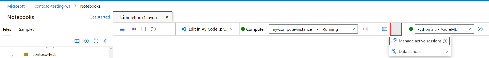
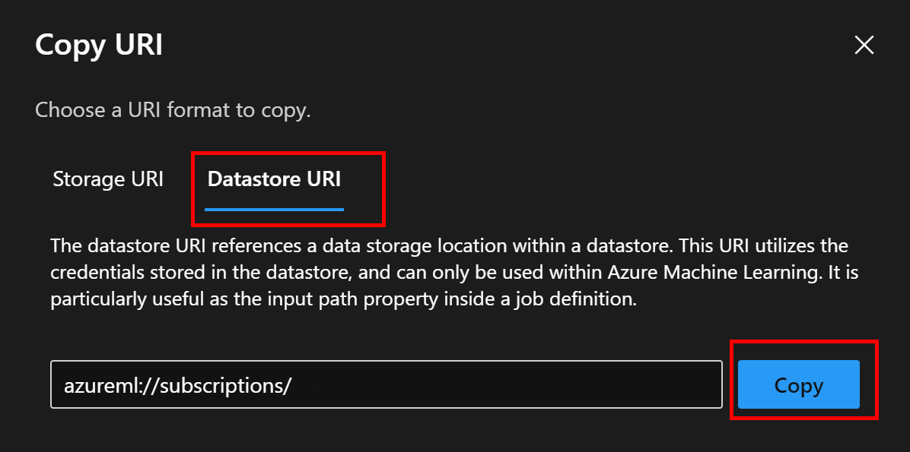

###### Azure Machine Learning 入門 (L100)

# 7. ノートブック

- [7. ノートブック](#7-ノートブック)
  - [1. セッション管理](#1-セッション管理)
  - [2. セキュリティのベストプラクティス](#2-セキュリティのベストプラクティス)
  - [3. ノートブックの実行](#3-ノートブックの実行)
  - [4. ターミナルの使用](#4-ターミナルの使用)
  - [5. データへのアクセス](#5-データへのアクセス)
    - [5.1. データ資産へのアクセス (Azure Machine Learning SDK for Python を使用)](#51-データ資産へのアクセス-azure-machine-learning-sdk-for-python-を使用)
      - [5.1.1. 例](#511-例)
    - [5.2. データ資産へのアクセス (mltable Python ライブラリ を使用)](#52-データ資産へのアクセス-mltable-python-ライブラリ-を使用)
      - [5.2.1. 前提](#521-前提)
      - [5.2.2. テーブル資産](#522-テーブル資産)
      - [5.2.3. ファイル資産](#523-ファイル資産)
      - [5.2.4. フォルダー資産](#524-フォルダー資産)
    - [5.3. 外部データへのアクセス (mltable Python ライブラリ を使用)](#53-外部データへのアクセス-mltable-python-ライブラリ-を使用)
      - [5.3.1. 前提](#531-前提)
      - [5.3.2. 一般的な形式](#532-一般的な形式)
      - [5.3.3. 例](#533-例)
    - [5.4. 外部データへのアクセス (fspec を使用)](#54-外部データへのアクセス-fspec-を使用)
      - [5.4.1. 前提](#541-前提)
      - [5.4.2. Studio UI からデータストア URI をコピー する](#542-studio-ui-からデータストア-uri-をコピー-する)
      - [5.4.3. Python のコードに貼り付ける](#543-python-のコードに貼り付ける)
      - [5.4.4. データにアクセスする](#544-データにアクセスする)
      - [5.4.5. 応用例](#545-応用例)
    - [5.5. 外部データのダウンロード (azcopy ユーティリティ を使用)](#55-外部データのダウンロード-azcopy-ユーティリティ-を使用)
    - [5.6. ジョブ内におけるデータへのアクセス (Azure Machine Learning Python SDK v2 を使用)](#56-ジョブ内におけるデータへのアクセス-azure-machine-learning-python-sdk-v2-を使用)
      - [5.6.1. ジョブへのデータ入力](#561-ジョブへのデータ入力)
      - [5.6.2. ジョブからのデータ出力](#562-ジョブからのデータ出力)
  - [6. コンピューティング インスタンスをリモート ノートブック サーバーとして構成する](#6-コンピューティング-インスタンスをリモート-ノートブック-サーバーとして構成する)
  - [7. モデルのトレーニング](#7-モデルのトレーニング)
  - [8. クイックスタート＆ガイド](#8-クイックスタートガイド)
  - [9. チュートリアル](#9-チュートリアル)
  - [10. サンプル](#10-サンプル)
  - [11. 参考資料](#11-参考資料)


---

[スタジオ | Azure Machine Learning とは - Azure Machine Learning | Microsoft Learn](https://learn.microsoft.com/ja-jp/azure/machine-learning/overview-what-is-azure-machine-learning#studio)

> スタジオに直接統合されているマネージド Jupyter Notebook サーバーで独自のコードを記述して実行します。


---


## 1. セッション管理

* [ノートブック セッション | コンピューティング セッションを管理する方法 - Azure Machine Learning | Microsoft Learn](https://learn.microsoft.com/ja-jp/azure/machine-learning/how-to-manage-compute-sessions#notebook-sessions)

> セッション管理パネルで、ノートブック セッションのセクションでリンクされたノートブック名を選ぶと、以前の状態のノートブックを再び開くことができます。
> 
> ノートブック セッションは、Azure Machine Learning スタジオでノートブック タブを閉じても、アクティブな状態に保たれます。 そのため、ノートブックを再び開くと、以前に定義した変数や実行状態にアクセスできます - この場合、アクティブなノートブック セッションの恩恵を受けることになります。
> 
> ただし、多過ぎるアクティブなノートブック セッションを維持すると、コンピューティングのパフォーマンスが低下することがあります。 そのため、セッション管理パネルを使って、不要になったノートブック セッションをシャットダウンする必要があります。
> 
> ターミナル ツール バーの [アクティブなセッションの管理] を選んでセッション管理パネルを開き、不要になったセッションをシャットダウンします。 次の図では、ヒントにアクティブなノートブック セッションの数が表示されていることがわかります。

[](./assets/images/notebook-sessions-button.png)


---


## 2. セキュリティのベストプラクティス

* [Azure ML Studio ノートブック | 安全なコードのベスト プラクティス - Azure Machine Learning | Microsoft Learn](https://learn.microsoft.com/ja-jp/azure/machine-learning/concept-secure-code-best-practice#azure-ml-studio-notebooks)

> Azure Machine Learning Studio は、ブラウザーでホストされるノートブック環境を備えています。 ノートブックのセルから、悪質なコードを含んだ [HTML](https://developer.mozilla.org/ja/docs/Web/HTML) ドキュメントや HTML [フラグメント](https://developer.mozilla.org/ja/docs/Web/API/DocumentFragment)が出力される可能性があります。 出力が[レンダリング](https://developer.mozilla.org/ja/docs/Web/Performance/How_browsers_work#%E3%83%AC%E3%83%B3%E3%83%80%E3%83%AA%E3%83%B3%E3%82%B0)されたときにそのコードが実行されるおそれがあります。
> 
> 考えられる脅威:
> 
> * [クロスサイト スクリプティング (XSS)](https://learn.microsoft.com/ja-jp/archive/msdn-magazine/2012/january/asp-net-security-securing-your-asp-net-applications#%E3%82%AF%E3%83%AD%E3%82%B9%E3%82%B5%E3%82%A4%E3%83%88-%E3%82%B9%E3%82%AF%E3%83%AA%E3%83%97%E3%83%86%E3%82%A3%E3%83%B3%E3%82%B0)
> * [クロスサイト リクエスト フォージェリ (CSRF)](https://learn.microsoft.com/ja-jp/archive/msdn-magazine/2012/january/asp-net-security-securing-your-asp-net-applications#%E3%82%AF%E3%83%AD%E3%82%B9%E3%82%B5%E3%82%A4%E3%83%88-%E3%83%AA%E3%82%AF%E3%82%A8%E3%82%B9%E3%83%88-%E3%83%95%E3%82%A9%E3%83%BC%E3%82%B8%E3%82%A7%E3%83%AA-csrf)
> 
> Azure Machine Learning によって提供されている軽減策:
> 
> * **コード セルの出力** は、[iframe](https://developer.mozilla.org/ja/docs/Web/HTML/Element/iframe) 内にサンドボックス化されています。 iframe によってスクリプトは、親 [DOM](https://developer.mozilla.org/ja/docs/Web/API/Document_Object_Model/Introduction) や [Cookie](https://developer.mozilla.org/ja/docs/Glossary/Cookie)、[セッション ストレージ](https://developer.mozilla.org/ja/docs/Web/API/Window/sessionStorage)にはアクセスできないようになっています。
> * **Markdown セル** の内容は、[dompurify](https://github.com/cure53/DOMPurify) ライブラリを使用して消去されます。 そうすることで、[マークダウン](https://ja.wikipedia.org/wiki/Markdown) セルがレンダリングされて悪質なスクリプトが実行されるのを防止しています。
> * **画像の URL** と **Markdown リンク** は、Microsoft が所有するエンドポイントに送信され、そこで悪質な値がないかチェックされます。 悪質な値が検出された場合、その要求はエンドポイントによって拒否されます。
> 
> 推奨アクション:
> 
> * Studio にアップロードするファイルは、事前にその内容が信頼できることを確認します。 アップロードしようとしているのが信頼のおけるファイルであることを確認する必要があります。
> * 外部アプリケーションを開くリンクを選択すると、そのアプリケーションを信頼するように求められます。


---


## 3. ノートブックの実行

https://learn.microsoft.com/ja-jp/azure/machine-learning/how-to-run-jupyter-notebooks


---


## 4. ターミナルの使用

https://learn.microsoft.com/ja-jp/azure/machine-learning/how-to-access-terminal


---


## 5. データへのアクセス

```
1. データ資産へのアクセス (Azure Machine Learning SDK for Python を使用)
2. データ資産へのアクセス (mltable Python ライブラリ を使用)
3. 外部データへのアクセス (mltable Python ライブラリ を使用)
4. 外部データへのアクセス (fspec を使用)
5. 外部データのダウンロード (azcopy ユーティリティ を使用)
6. ジョブ内におけるデータへのアクセス (Azure Machine Learning Python SDK v2 を使用)
```

### 5.1. [データ資産へのアクセス (Azure Machine Learning SDK for Python を使用)](https://learn.microsoft.com/ja-jp/python/api/overview/azure/ml/?view=azure-ml-py#dataset)

> Dataset クラスは、Azure Machine Learning 内のデータを探索および管理するための基本リソースです。 概要統計を使用してデータを探索し、データセットを AML ワークスペースに保存して、バージョン管理と再現性の機能を利用できます。 データセットは、トレーニング中にモデルから簡単に使用できます。

#### 5.1.1. 例

```python
from azureml.core import Dataset

dataset = Dataset.Tabular.from_delimited_files(path = [(datastore, 'train-dataset/tabular/iris.csv')])
dataset.take(3).to_pandas_dataframe()
```


### 5.2. [データ資産へのアクセス (mltable Python ライブラリ を使用)](https://learn.microsoft.com/ja-jp/azure/machine-learning/how-to-access-data-interactive#reading-data-assets)

#### 5.2.1. 前提

```bash
pip install -U mltable
```

#### 5.2.2. [テーブル資産](https://learn.microsoft.com/ja-jp/azure/machine-learning/how-to-access-data-interactive#table-asset)

```python
import mltable
from azure.ai.ml import MLClient
from azure.identity import DefaultAzureCredential

ml_client = MLClient.from_config(credential=DefaultAzureCredential())
data_asset = ml_client.data.get(name="<name_of_asset>", version="<version>")

tbl = mltable.load(f'azureml:/{data_asset.id}')
df = tbl.to_pandas_dataframe()
df.head()
```

#### 5.2.3. [ファイル資産](https://learn.microsoft.com/ja-jp/azure/machine-learning/how-to-access-data-interactive#file-asset)

```python
import mltable
from azure.ai.ml import MLClient
from azure.identity import DefaultAzureCredential

ml_client = MLClient.from_config(credential=DefaultAzureCredential())
data_asset = ml_client.data.get(name="<name_of_asset>", version="<version>")

path = {
    'file': data_asset.path
}

tbl = mltable.from_delimited_files(paths=[path])
df = tbl.to_pandas_dataframe()
df.head()
```

#### 5.2.4. [フォルダー資産](https://learn.microsoft.com/ja-jp/azure/machine-learning/how-to-access-data-interactive#folder-asset)

```python
import mltable
from azure.ai.ml import MLClient
from azure.identity import DefaultAzureCredential

ml_client = MLClient.from_config(credential=DefaultAzureCredential())
data_asset = ml_client.data.get(name="<name_of_asset>", version="<version>")

path = {
    'folder': data_asset.path
}

tbl = mltable.from_delimited_files(paths=[path])
df = tbl.to_pandas_dataframe()
df.head()
```


### 5.3. [外部データへのアクセス (mltable Python ライブラリ を使用)](https://learn.microsoft.com/ja-jp/azure/machine-learning/how-to-access-data-interactive?tabs=adls#materialize-data-into-pandas-using-mltable-library)

#### 5.3.1. 前提

```bash
pip install -U mltable
```

#### 5.3.2. 一般的な形式

```python
import mltable

# define a path or folder or pattern
path = {
    'file': '<supported_path>'
    # alternatives
    # 'folder': '<supported_path>'
    # 'pattern': '<supported_path>'
}

# create an mltable from paths
tbl = mltable.from_delimited_files(paths=[path])
# alternatives
# tbl = mltable.from_parquet_files(paths=[path])
# tbl = mltable.from_json_lines_files(paths=[path])
# tbl = mltable.from_delta_lake(paths=[path])

# materialize to pandas
df = tbl.to_pandas_dataframe()
df.head()
```

#### 5.3.3. 例

* [CSV ファイルの読み取り (ADLS gen2)](https://learn.microsoft.com/ja-jp/azure/machine-learning/how-to-access-data-interactive?tabs=adls#read-a-csv-file)
* [CSV ファイルの読み取り (Blob Storage)](https://learn.microsoft.com/ja-jp/azure/machine-learning/how-to-access-data-interactive?tabs=blob#read-a-csv-file)
* [CSV ファイルの読み取り (Azure ML データストア)](https://learn.microsoft.com/ja-jp/azure/machine-learning/how-to-access-data-interactive?tabs=datastore#read-a-csv-file)
* [CSV ファイルの読み取り (HTTP サーバー)](https://learn.microsoft.com/ja-jp/azure/machine-learning/how-to-access-data-interactive?tabs=http#read-a-csv-file)
* [フォルダー内の Parquet ファイルを読み取る (ADLS gen2)](https://learn.microsoft.com/ja-jp/azure/machine-learning/how-to-access-data-interactive?tabs=adls#read-parquet-files-in-a-folder)
* [フォルダー内の Parquet ファイルを読み取る (Blob Storage)](https://learn.microsoft.com/ja-jp/azure/machine-learning/how-to-access-data-interactive?tabs=blob#read-parquet-files-in-a-folder)
* [フォルダー内の Parquet ファイルを読み取る (Azure ML データストア)](https://learn.microsoft.com/ja-jp/azure/machine-learning/how-to-access-data-interactive?tabs=datastore#read-parquet-files-in-a-folder)
* [フォルダー内の Parquet ファイルを読み取る (HTTP サーバー)](https://learn.microsoft.com/ja-jp/azure/machine-learning/how-to-access-data-interactive?tabs=http#read-parquet-files-in-a-folder)


### 5.4. [外部データへのアクセス (fspec を使用)](https://learn.microsoft.com/ja-jp/azure/machine-learning/how-to-access-data-interactive?tabs=adls#access-data-from-a-datastore-uri-like-a-filesystem-preview)

#### 5.4.1. 前提

```bash
pip install -U azureml-fsspec
```

#### 5.4.2. Studio UI からデータストア URI をコピー する

> データストア URI 形式を記憶するのではなく、次の手順に従って、Studio UI からデータストア URI をコピーして貼り付けることができます:
> 
> 1. 左側のメニューから [データ] を選択し、[データストア] タブを選択します。
> 2. データストア名を選択し、[参照] を選択します。
> 3. Pandas に読み込むファイル/フォルダーを見つけ、その横にある省略符号 (...) を選択します。 メニューから [URI のコピー] を選択します。 ノートブック/スクリプトにコピーするデータストア URI を選択できます。
> [](./assets/images/datastore_uri_copy.png)

#### 5.4.3. Python のコードに貼り付ける

```python
uri = 'azureml://subscriptions/{subscription}/resourcegroups/{resource_group}/workspaces/{workspace}/datastores/{datastore_name}/paths/{path_on_datastore}'
```

#### 5.4.4. データにアクセスする

```python
import pandas as pd

df = pd.read_csv("/".join(uri, "<filename>.csv"))
df.head()
```

#### 5.4.5. 応用例

* [CSV ファイルのフォルダーを Pandas に読み取る](https://learn.microsoft.com/ja-jp/azure/machine-learning/how-to-access-data-interactive?tabs=adls#read-a-folder-of-csv-files-into-pandas)
* [Dask への CSV ファイルの読み取り](https://learn.microsoft.com/ja-jp/azure/machine-learning/how-to-access-data-interactive?tabs=adls#reading-csv-files-into-dask)
  * 参考: [Dask](https://www.dask.org/)
* [Parquet ファイルのフォルダーを Pandas に読み取る](https://learn.microsoft.com/ja-jp/azure/machine-learning/how-to-access-data-interactive?tabs=adls#read-a-folder-of-parquet-files-into-pandas)
  * 参考: [What is Apache Parquet?](https://www.databricks.com/glossary/what-is-parquet)
* [Azure Databricks ファイルシステムからデータにアクセスする (dbfs)](https://learn.microsoft.com/ja-jp/azure/machine-learning/how-to-access-data-interactive?tabs=adls#accessing-data-from-your-azure-databricks-filesystem-dbfs)
  * 参考:
    * [Azure Databricks | Microsoft Azure](https://azure.microsoft.com/ja-jp/products/databricks/)
    * [Azure Databricks とは - Azure Databricks | Microsoft Learn](https://learn.microsoft.com/ja-jp/azure/databricks/introduction/)
* [pillow による画像の読み取り](https://learn.microsoft.com/ja-jp/azure/machine-learning/how-to-access-data-interactive?tabs=adls#reading-images-with-pillow)
* [PyTorch カスタム データセットの例](https://learn.microsoft.com/ja-jp/azure/machine-learning/how-to-access-data-interactive?tabs=adls#pytorch-custom-dataset-example)
* [fspec - All modules for which code is available](https://filesystem-spec.readthedocs.io/en/stable/_modules/index.html)


### 5.5. [外部データのダウンロード (azcopy ユーティリティ を使用)](https://learn.microsoft.com/ja-jp/azure/machine-learning/how-to-access-data-interactive#downloading-data-using-the-azcopy-utility)

```bash
mkdir /home/azureuser/data
```

```bash
azcopy login
```

```bash
SOURCE=https://<account_name>.blob.core.windows.net/<container>/<path>
DEST=/home/azureuser/data
azcopy cp $SOURCE $DEST
```


### 5.6. [ジョブ内におけるデータへのアクセス (Azure Machine Learning Python SDK v2 を使用)](https://learn.microsoft.com/ja-jp/azure/machine-learning/how-to-read-write-data-v2?tabs=python)

#### 5.6.1. [ジョブへのデータ入力](https://learn.microsoft.com/ja-jp/azure/machine-learning/how-to-read-write-data-v2?tabs=python#read-data-in-a-job)

```python
from azure.ai.ml import command
from azure.ai.ml.entities import Data
from azure.ai.ml import Input
from azure.ai.ml.constants import AssetTypes
from azure.ai.ml import MLClient

ml_client = MLClient.from_config()

# Possible Asset Types for Data:
# AssetTypes.URI_FILE
# AssetTypes.URI_FOLDER
# AssetTypes.MLTABLE

# Possible Paths for Data:
# Blob: https://<account_name>.blob.core.windows.net/<container_name>/<folder>/<file>
# Datastore: azureml://datastores/paths/<folder>/<file>
# Data Asset: azureml:<my_data>:<version>

my_job_inputs = {
    "input_data": Input(type=AssetTypes.URI_FOLDER, path="<path>")
}

job = command(
    code="./src",  # local path where the code is stored
    command="ls ${{inputs.input_data}}",
    inputs=my_job_inputs,
    environment="AzureML-sklearn-0.24-ubuntu18.04-py37-cpu:latest",
    compute="cpu-cluster",
)

# submit the command
returned_job = ml_client.jobs.create_or_update(job)
# get a URL for the status of the job
returned_job.services["Studio"].endpoint
```

#### 5.6.2. [ジョブからのデータ出力](https://learn.microsoft.com/ja-jp/azure/machine-learning/how-to-read-write-data-v2?tabs=python#write-data-in-a-job)

```python
from azure.ai.ml import command
from azure.ai.ml.entities import Data
from azure.ai.ml import Input, Output
from azure.ai.ml.constants import AssetTypes

# Possible Asset Types for Data:
# AssetTypes.URI_FILE
# AssetTypes.URI_FOLDER
# AssetTypes.MLTABLE

# Possible Paths for Data:
# Blob: https://<account_name>.blob.core.windows.net/<container_name>/<folder>/<file>
# Datastore: azureml://datastores/paths/<folder>/<file>
# Data Asset: azureml:<my_data>:<version>

my_job_inputs = {
    "raw_data": Input(type=AssetTypes.URI_FOLDER, path="<path>")
}

my_job_outputs = {
    "prep_data": Output(type=AssetTypes.URI_FOLDER, path="<path>")
}

job = command(
    code="./src",  # local path where the code is stored
    command="python process_data.py --raw_data ${{inputs.raw_data}} --prep_data ${{outputs.prep_data}}",
    inputs=my_job_inputs,
    outputs=my_job_outputs,
    environment="<environment_name>:<version>",
    compute="cpu-cluster",
)

# submit the command
returned_job = ml_client.create_or_update(job)
# get a URL for the status of the job
returned_job.services["Studio"].endpoint
```


---

## 6. [コンピューティング インスタンスをリモート ノートブック サーバーとして構成する](https://learn.microsoft.com/ja-jp/azure/machine-learning/how-to-set-up-vs-code-remote?tabs=studio#configure-compute-instance-as-remote-notebook-server)

省略

---


## 7. モデルのトレーニング

* [ML モデルのトレーニング - Azure Machine Learning | Microsoft Learn](https://learn.microsoft.com/ja-jp/azure/machine-learning/how-to-train-model?tabs=python)


---


## 8. クイックスタート＆ガイド

* [クイック スタート: ノートブックを実行する - Azure Machine Learning | Microsoft Learn](https://learn.microsoft.com/ja-jp/azure/machine-learning/quickstart-run-notebooks)
* [ワークスペースで Jupyter Notebook を実行する - Azure Machine Learning | Microsoft Learn](https://learn.microsoft.com/ja-jp/azure/machine-learning/how-to-run-jupyter-notebooks)


---


## 9. チュートリアル

* [チュートリアル: Python スクリプトを使ってみる (v1) - Azure Machine Learning | Microsoft Learn](https://learn.microsoft.com/ja-jp/azure/machine-learning/v1/tutorial-1st-experiment-hello-world)
* [チュートリアル: Jupyter Notebook でサンプルをトレーニングしてデプロイする - Azure Machine Learning | Microsoft Learn](https://learn.microsoft.com/ja-jp/azure/machine-learning/v1/tutorial-train-deploy-notebook)
* [チュートリアル:ノートブックを使用して予測モデルを作成する (パート 1/2) - Azure Machine Learning | Microsoft Learn](https://learn.microsoft.com/ja-jp/azure/machine-learning/v1/tutorial-power-bi-custom-model)
  * [チュートリアル:Power BI で Azure Machine Learning モデルを使用する - Azure Machine Learning | Microsoft Learn](https://learn.microsoft.com/ja-jp/power-bi/connect-data/service-aml-integrate?context=azure%2Fmachine-learning%2Fcontext%2Fml-context)
* [MachineLearningNotebooks/tutorials at master · Azure/MachineLearningNotebooks](https://github.com/Azure/MachineLearningNotebooks/tree/master/tutorials)


---


## 10. サンプル

* [さまざまなコンピューティング ターゲット上でのトレーニング](https://github.com/Azure/MachineLearningNotebooks/blob/master/how-to-use-azureml/training)
* [ML フレームワークを使用したトレーニング](https://github.com/Azure/MachineLearningNotebooks/blob/master/how-to-use-azureml/ml-frameworks)


---


## 11. 参考資料

* [対話型開発時に Azure クラウド ストレージからデータにアクセスする - Azure Machine Learning | Microsoft Learn](https://learn.microsoft.com/ja-jp/azure/machine-learning/how-to-access-data-interactive)
* [Azure/MachineLearningNotebooks: Python notebooks with ML and deep learning examples with Azure Machine Learning | Microsoft](https://github.com/Azure/MachineLearningNotebooks)
* [Azure/azureml-examples: Official community-driven Azure Machine Learning examples, tested with GitHub Actions.](https://github.com/Azure/azureml-examples)
* [ノートブック コードを Python スクリプトに変換する - Azure Machine Learning | Microsoft Learn](https://learn.microsoft.com/ja-jp/azure/machine-learning/v1/how-to-convert-ml-experiment-to-production)
