###### Azure Machine Learning 入門 (L100)

# 8. 自動 ML (AutoML)

- [8. 自動 ML (AutoML)](#8-自動-ml-automl)
  - [1. 自動 ML](#1-自動-ml)
    - [1.1. 背景](#11-背景)
    - [1.2. しくみ](#12-しくみ)
    - [1.3. AutoML を使用する場合](#13-automl-を使用する場合)
    - [1.4. トレーニング、検証、テストのデータ](#14-トレーニング検証テストのデータ)
    - [1.5. 特徴エンジニアリング](#15-特徴エンジニアリング)
    - [1.6. アンサンブル モデル](#16-アンサンブル-モデル)
    - [1.7. AutoML と ONNX](#17-automl-と-onnx)
    - [1.8. L200 に向けた次のステップ](#18-l200-に向けた次のステップ)
      - [1.8.1. ガイド](#181-ガイド)
      - [1.8.2. チュートリアル](#182-チュートリアル)
      - [1.8.3. サンプル](#183-サンプル)
      - [1.8.4. Python SDK](#184-python-sdk)
  - [2. モデルの評価](#2-モデルの評価)
    - [2.1. 回帰メトリック](#21-回帰メトリック)
    - [2.2. 分類メトリック](#22-分類メトリック)
    - [2.3. イメージ モデルのメトリック (プレビュー)](#23-イメージ-モデルのメトリック-プレビュー)
    - [2.4. 画像分類メトリック](#24-画像分類メトリック)
    - [2.5. オブジェクト検出とインスタンス セグメント化のメトリック](#25-オブジェクト検出とインスタンス-セグメント化のメトリック)
    - [2.6. オブジェクト検出とインスタンス セグメント化のエポックレベル メトリック](#26-オブジェクト検出とインスタンス-セグメント化のエポックレベル-メトリック)
  - [3. モデルの説明](#3-モデルの説明)
    - [3.1. モデルの解釈可能性](#31-モデルの解釈可能性)
      - [3.1.1. 解釈可能性の対象](#311-解釈可能性の対象)
        - [3.1.1.1. コンピューティング先](#3111-コンピューティング先)
        - [3.1.1.2. 機械学習モデル](#3112-機械学習モデル)
      - [3.1.2. 解釈可能性の手法](#312-解釈可能性の手法)
        - [3.1.2.1. Python SDK v2 / CLI v2 の責任ある AI ダッシュボード でサポートされている手法](#3121-python-sdk-v2--cli-v2-の責任ある-ai-ダッシュボード-でサポートされている手法)
        - [3.1.2.2. Python SDK v1 でサポートされている手法](#3122-python-sdk-v1-でサポートされている手法)
        - [3.1.2.3. Python 解釈可能性パッケージを使用した説明 (プレビュー)](#3123-python-解釈可能性パッケージを使用した説明-プレビュー)
    - [3.2. 自動 ML でのモデル説明 (プレビュー)](#32-自動-ml-でのモデル説明-プレビュー)
      - [3.2.1. トレーニング中](#321-トレーニング中)
        - [3.2.1.1. モデル説明](#3211-モデル説明)
        - [3.2.1.2. 視覚化](#3212-視覚化)
      - [3.2.2. 推論中](#322-推論中)
  - [4. 自動ML からモデル説明の流れ](#4-自動ml-からモデル説明の流れ)
  - [4. ガイド](#4-ガイド)
  - [5. チュートリアル](#5-チュートリアル)
  - [6. ラーニング](#6-ラーニング)
  - [7. 参考資料](#7-参考資料)

---

## 1. [自動 ML](https://learn.microsoft.com/ja-JP/azure/machine-learning/concept-automated-ml)

### 1.1. 背景

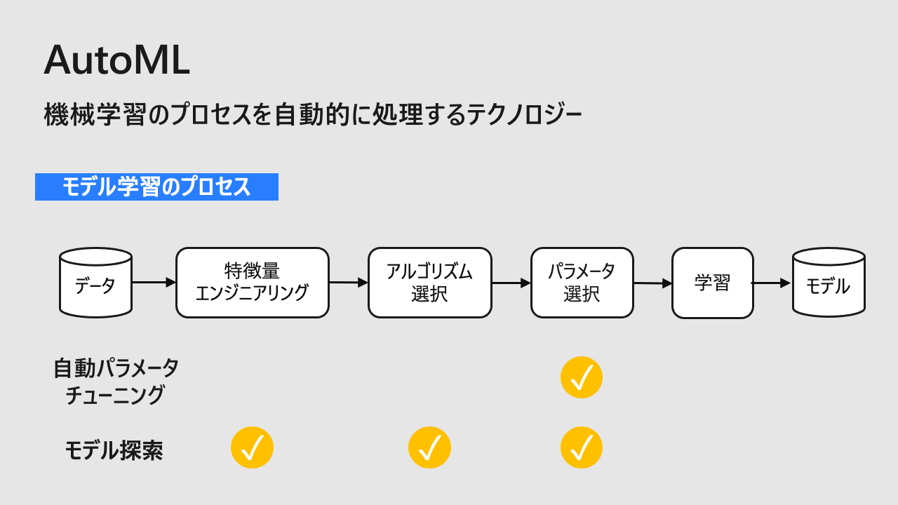
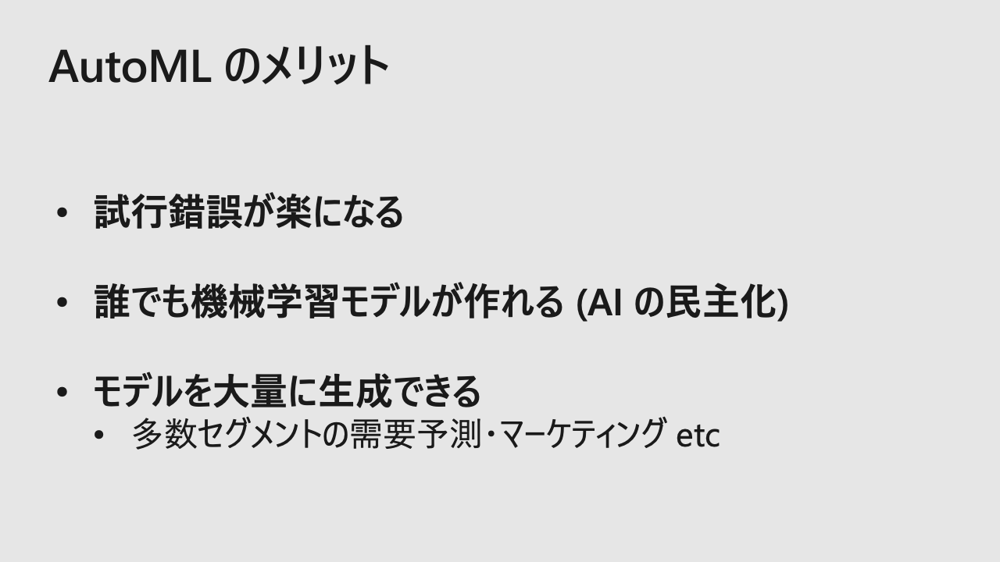
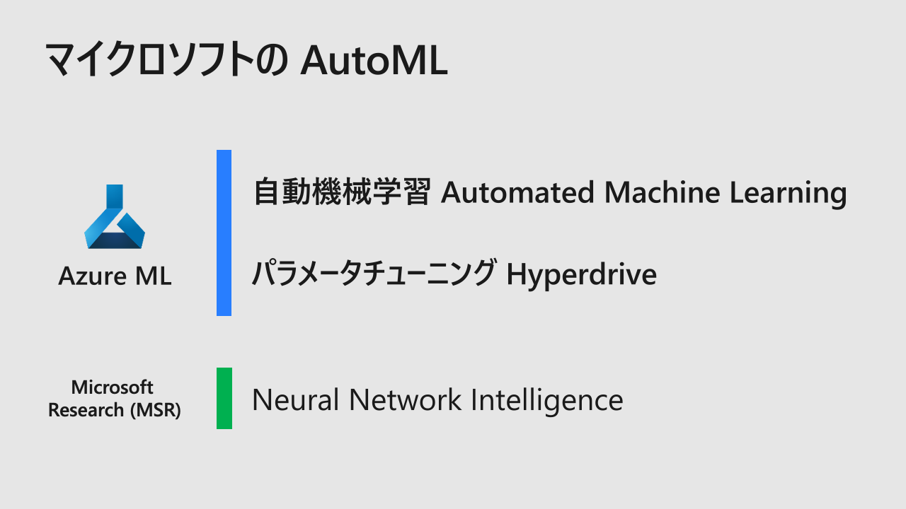
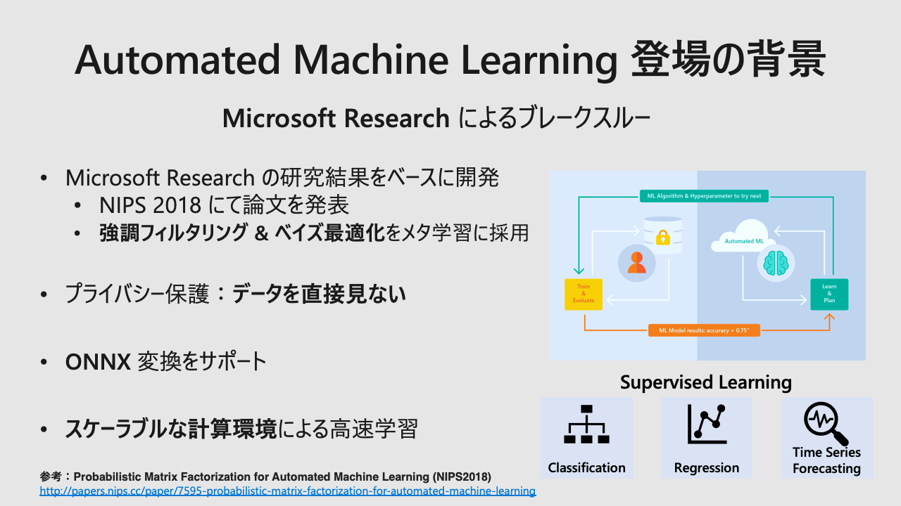

### 1.2. [しくみ](https://learn.microsoft.com/ja-jp/azure/machine-learning/concept-automated-ml#how-does-automl-work)

> トレーニング中、Azure Machine Learning は、さまざまなアルゴリズムとパラメーターを試行する多数のパイプラインを並列に作成します。 サービスは、機能選択と組み合わせた ML アルゴリズムを介して反復し、それぞれの反復で、トレーニング スコアを含むモデルを生成します。 最適化するメトリックのスコアが高いほど、モデルはデータに "適合している" と見なされます。 実験に定義されている終了基準に到達すると停止します。

### 1.3. [AutoML を使用する場合](https://learn.microsoft.com/ja-jp/azure/machine-learning/concept-automated-ml#when-to-use-automl-classification-regression-forecasting-computer-vision--nlp)

> 指定したターゲット メトリックを使用して自分の代わりに Azure Machine Learning にモデルのトレーニングと調整を行わせる場合は、自動 ML を適用します。

* [回帰](https://learn.microsoft.com/ja-jp/azure/machine-learning/concept-automated-ml#regression)
  * 例: [ハードウェア パフォーマンス予測](https://github.com/Azure/azureml-examples/blob/main/sdk/python/jobs/automl-standalone-jobs/automl-regression-task-hardware-performance/automl-regression-task-hardware-performance.ipynb)
* [分類](https://learn.microsoft.com/ja-jp/azure/machine-learning/concept-automated-ml#classification)
  * 例: [銀行マーケティング](https://github.com/Azure/azureml-examples/blob/main/sdk/python/jobs/automl-standalone-jobs/automl-classification-task-bankmarketing/automl-classification-task-bankmarketing.ipynb)
* [時系列予測](https://learn.microsoft.com/ja-jp/azure/machine-learning/concept-automated-ml#time-series-forecasting)
  * 例: [エネルギー需要予測](https://github.com/Azure/azureml-examples/blob/main/sdk/python/jobs/automl-standalone-jobs/automl-forecasting-task-energy-demand/automl-forecasting-task-energy-demand-advanced.ipynb)
* [Computer Vision](https://learn.microsoft.com/ja-jp/azure/machine-learning/concept-automated-ml#computer-vision)
* [自然言語処理: NLP](https://learn.microsoft.com/ja-jp/azure/machine-learning/concept-automated-ml#natural-language-processing-nlp)

### 1.4. [トレーニング、検証、テストのデータ](https://learn.microsoft.com/ja-jp/azure/machine-learning/concept-automated-ml#training-validation-and-test-data)

> 自動 ML では、**トレーニング データ** を与えて ML モデルをトレーニングします。実行するモデル検証の種類を指定できます。 自動 ML では、トレーニングの一環としてモデルが検証されます。 つまり、自動 ML では **検証データ** を利用し、適用されているアルゴリズムに基づき、モデルのハイパーパラメーターを調整し、トレーニング データに最適な組み合わせを見つけます。 ただし、調整が繰り返されるとき、同じ検証データが使用され、モデルの評価が偏ります。これは、モデルは向上を継続するものであり、検証データに合わせるためです。
> 
> このような偏りが最終的な推奨モデルに適用されないように、自動 ML では **テスト データ** を利用し、自動 ML から実験の最後に推奨される最終モデルが評価されます。 自動 ML 実験の構成でテスト データを与えるとき、実験の最後に既定でこの推奨モデルがテストされます (プレビュー)。

### 1.5. [特徴エンジニアリング](https://learn.microsoft.com/ja-jp/azure/machine-learning/concept-automated-ml#feature-engineering)

> 特徴エンジニアリングは、データに関するドメインの知識を活用して、ML アルゴリズムの学習を支援する機能を作成するプロセスです。 Azure Machine Learning では、特徴エンジニアリングを容易にするために、**スケーリング** と **正規化** の手法が適用されます。 これらの手法と特徴エンジニアリングは、まとめて **特徴量化** と呼ばれています。
> 
> 自動機械学習の実験において、特徴量化は自動的に適用されますが、データに基づいてカスタマイズすることもできます。 [特徴量化の内容](https://learn.microsoft.com/ja-jp/azure/machine-learning/how-to-configure-auto-features#featurization)と、[AutoML がいかにしてモデルのオーバーフィットと不均衡データを回避するか](https://learn.microsoft.com/ja-jp/azure/machine-learning/concept-manage-ml-pitfalls)について学習してください。

### 1.6. [アンサンブル モデル](https://learn.microsoft.com/ja-jp/azure/machine-learning/concept-automated-ml#ensemble)

> 自動機械学習では、既定で有効になっているアンサンブル モデルがサポートされています。 アンサンブル学習では、1 つのモデルを使用するのではなく、複数のモデルを組み合わせることによって、機械学習の結果と予測パフォーマンスが改善されます。 

> 自動機械学習では、モデルの結合に**投票**と**スタッキング**の両方のアンサンブル方法を使用します。
> 
> * **投票**: 予測されたクラス確率 (分類タスクの場合) または予測された回帰ターゲット (回帰タスクの場合) の加重平均に基づいて予測します。
> * **スタッキング**: スタッキングは異種のモデルを結合し、個々のモデルの出力に基づいてメタモデルをトレーニングします。 現在の既定のメタモデルは、分類タスクの場合は LogisticRegression、回帰/予測タスクの場合は ElasticNet です。

> 初期アンサンブルが並べ替えられた [Caruana のアンサンブル選択アルゴリズム](http://www.niculescu-mizil.org/papers/shotgun.icml04.revised.rev2.pdf)を使用して、アンサンブル内で使用するモデルを決定します。

> 自動化された機械学習の既定のアンサンブル設定を変更するには、[AutoML パッケージ](https://learn.microsoft.com/ja-jp/python/api/azure-ai-ml/azure.ai.ml.automl)に関するページを参照してください。

### 1.7. [AutoML と ONNX](https://learn.microsoft.com/ja-jp/azure/machine-learning/concept-automated-ml#automl--onnx)

> Azure Machine Learning では、自動化された ML を使用して Python モデルを構築し、それを ONNX 形式に変換できます。 ONNX 形式になったモデルは、さまざまなプラットフォームやデバイスで実行することができます。 [ONNX での ML モデルの能率化](https://learn.microsoft.com/ja-jp/azure/machine-learning/concept-onnx)に関する詳細をご覧ください。
> 
> ONNX 形式に変換する方法については、[この Jupyter ノートブックの例](https://github.com/Azure/azureml-examples/tree/main/v1/python-sdk/tutorials/automl-with-azureml/classification-bank-marketing-all-features)を参照してください。 [ONNX でサポートされているアルゴリズム](https://learn.microsoft.com/ja-jp/azure/machine-learning/how-to-configure-auto-train#supported-algorithms)についてご確認ください。

### 1.8. L200 に向けた次のステップ

#### 1.8.1. ガイド

* ノーコード/ローコード
    - [スタジオ UI を使用して自動 ML を設定する - Azure Machine Learning | Microsoft Learn](https://learn.microsoft.com/ja-jp/azure/machine-learning/how-to-use-automated-ml-for-ml-models)
* コードファースト
    - [Python で AutoML を設定する (v2) - Azure Machine Learning | Microsoft Learn](https://learn.microsoft.com/ja-jp/azure/machine-learning/how-to-configure-auto-train)
    - [Computer Vision 用に AutoML を設定する - Azure Machine Learning | Microsoft Learn](https://learn.microsoft.com/ja-jp/azure/machine-learning/how-to-auto-train-image-models?tabs=cli)
    - [自動 ML モデルのトレーニング コードを表示する方法 - Azure Machine Learning AutoML | Microsoft Learn](https://learn.microsoft.com/ja-jp/azure/machine-learning/how-to-generate-automl-training-code)

#### 1.8.2. チュートリアル

* ノーコード/ローコード
    - [チュートリアル: コードなし分類モデルを AutoML でトレーニングする - Azure Machine Learning | Microsoft Learn](https://learn.microsoft.com/ja-jp/azure/machine-learning/tutorial-first-experiment-automated-ml)
* コードファースト
    - [チュートリアル: AutoML - オブジェクト検出モデルのトレーニング - Azure Machine Learning | Microsoft Learn](https://learn.microsoft.com/ja-jp/azure/machine-learning/tutorial-auto-train-image-models?tabs=cli)

#### 1.8.3. サンプル

[azureml-examples/sdk/python/jobs/automl-standalone-jobs at main · Azure/azureml-examples](https://github.com/Azure/azureml-examples/tree/main/sdk/python/jobs/automl-standalone-jobs)

#### 1.8.4. Python SDK

[azure.ai.ml.automl package | Microsoft Learn](https://learn.microsoft.com/ja-jp/python/api/azure-ai-ml/azure.ai.ml.automl?view=azure-python)

---

## 2. [モデルの評価](https://learn.microsoft.com/ja-jp/azure/machine-learning/how-to-understand-automated-ml)

> 自動 ML では、モデルごとに、モデルのパフォーマンスを測定するのに役立つ評価メトリックとグラフが生成されます。

    1. 回帰メトリック
    2. 分類メトリック
    3. イメージ モデルのメトリック (プレビュー)
    4. 画像分類メトリック
    5. オブジェクト検出とインスタンス セグメント化のメトリック
    6. オブジェクト検出とインスタンス セグメント化のエポックレベル メトリック

### 2.1. [回帰メトリック](https://learn.microsoft.com/ja-jp/azure/machine-learning/how-to-understand-automated-ml#regressionforecasting-metrics)

| #   | メトリック | Metric |
| --- | --------- | ------ |
| 1 | 説明分散 | [Explained variance](https://scikit-learn.org/0.22/modules/generated/sklearn.metrics.explained_variance_score.html) |
| 2 | 平均絶対誤差 | [Mean absolute error](https://scikit-learn.org/0.22/modules/generated/sklearn.metrics.mean_absolute_error.html) |
| 3 | 平均絶対パーセント誤差 (MAPE) | Mean absolute percentage error |
| 4 | Median absolute error | [Median absolute error](https://scikit-learn.org/0.22/modules/generated/sklearn.metrics.median_absolute_error.html) |
| 4 | R^2 (the coefficient of determination) | [R^2 (the coefficient of determination)](https://scikit-learn.org/0.22/modules/generated/sklearn.metrics.r2_score.html) |
| 5 | 平均平方二乗誤差 (RMSE) | [Root mean squared error](https://scikit-learn.org/0.22/modules/generated/sklearn.metrics.mean_squared_error.html) |
| 6 | 対数平均平方二乗誤差 | [Root mean squared log error](https://scikit-learn.org/0.22/modules/generated/sklearn.metrics.mean_squared_log_error.html) |
| 7 | スピアマンの相関 | [Spearman correlation](https://docs.scipy.org/doc/scipy-1.5.2/reference/generated/scipy.stats.spearmanr.html) |

| #   | メトリックとグラフ | Metric and graph |
| --- | --------------- | ---------------- |
| 8 | [残差](https://learn.microsoft.com/ja-jp/azure/machine-learning/how-to-understand-automated-ml#residuals) | [Residuals](https://learn.microsoft.com/en-us/azure/machine-learning/how-to-understand-automated-ml#residuals) |
| 9 | [予測と True](https://learn.microsoft.com/ja-jp/azure/machine-learning/how-to-understand-automated-ml#predicted-vs-true) | [Predicted vs. true](https://learn.microsoft.com/en-us/azure/machine-learning/how-to-understand-automated-ml#predicted-vs-true) |
| 10 | [予測期間 (プレビュー)](https://learn.microsoft.com/ja-jp/azure/machine-learning/how-to-understand-automated-ml#forecast-horizon-preview) | [Forecast horizon](https://learn.microsoft.com/en-us/azure/machine-learning/how-to-understand-automated-ml#forecast-horizon-preview) |

### 2.2. 分類メトリック

| #   | メトリック | Metric |
| --- | --------- | ------ |
| 1 | AUC (Area under the Receiver Operating Characteristic Curve) | [AUC](https://scikit-learn.org/0.22/modules/generated/sklearn.metrics.roc_auc_score.html) |
| 2 | 精度 | [Accuracy](https://scikit-learn.org/0.22/modules/generated/sklearn.metrics.accuracy_score.html) |
| 3 | 平均適合率 | [Average precision](https://scikit-learn.org/0.22/modules/generated/sklearn.metrics.average_precision_score.html) |
| 4 | バランスの取れた精度 | [Balanced accuracy](https://scikit-learn.org/0.22/modules/generated/sklearn.metrics.recall_score.html) |
| 5 | F1 スコア | [F1 score](https://scikit-learn.org/0.22/modules/generated/sklearn.metrics.f1_score.html) |
| 6 | log_loss | [log_loss](https://scikit-learn.org/0.22/modules/generated/sklearn.metrics.log_loss.html) |
| 7 | 正規化されたマクロ再現率 | Normalized macro recall |
| 8 | Matthews 相関係数 | [Matthews correlation](https://scikit-learn.org/0.22/modules/generated/sklearn.metrics.matthews_corrcoef.html) |
| 9 | 精度 | [Precision](https://scikit-learn.org/0.22/modules/generated/sklearn.metrics.precision_score.html) |
| 10 | リコール | [Recall](https://scikit-learn.org/0.22/modules/generated/sklearn.metrics.recall_score.html) |
| 11 | 加重精度 | [Weighted accuracy](https://scikit-learn.org/0.22/modules/generated/sklearn.metrics.accuracy_score.html) |

| #   | メトリックとグラフ | Metric and graph |
| --- | --------------- | ---------------- |
| 12 | [混同行列](https://learn.microsoft.com/ja-jp/azure/machine-learning/how-to-understand-automated-ml#confusion-matrix) | [Confusion matrix](https://learn.microsoft.com/en-us/azure/machine-learning/how-to-understand-automated-ml#confusion-matrix) |
| 13 | [ROC 曲線](https://learn.microsoft.com/ja-jp/azure/machine-learning/how-to-understand-automated-ml#roc-curve) | [ROC curve](https://learn.microsoft.com/en-us/azure/machine-learning/how-to-understand-automated-ml#roc-curve) |
| 14 | [適合率 - 再現率曲線](https://learn.microsoft.com/ja-jp/azure/machine-learning/how-to-understand-automated-ml#precision-recall-curve) | [Precision-recall curve](https://learn.microsoft.com/en-us/azure/machine-learning/how-to-understand-automated-ml#precision-recall-curve) |
| 15 | [累積ゲイン曲線](https://learn.microsoft.com/ja-jp/azure/machine-learning/how-to-understand-automated-ml#cumulative-gains-curve) | [Cumulative gains curve](https://learn.microsoft.com/en-us/azure/machine-learning/how-to-understand-automated-ml#cumulative-gains-curve) |
| 16 | [リフト曲線](https://learn.microsoft.com/ja-jp/azure/machine-learning/how-to-understand-automated-ml#lift-curve) | [Lift curve](https://learn.microsoft.com/en-us/azure/machine-learning/how-to-understand-automated-ml#lift-curve) |
| 17 | [較正曲線](https://learn.microsoft.com/ja-jp/azure/machine-learning/how-to-understand-automated-ml#calibration-curve) | [Calibration curve](https://learn.microsoft.com/en-us/azure/machine-learning/how-to-understand-automated-ml#calibration-curve) |

### 2.3. [イメージ モデルのメトリック (プレビュー)](https://learn.microsoft.com/ja-jp/azure/machine-learning/how-to-understand-automated-ml#metrics-for-image-models-preview)

### 2.4. [画像分類メトリック](https://learn.microsoft.com/ja-jp/azure/machine-learning/how-to-understand-automated-ml#image-classification-metrics)

| #   | メトリック | Metric |
| --- | --------- | ------ |
| 1 | [画像分類のためのエポックレベルのメトリック](https://learn.microsoft.com/ja-jp/azure/machine-learning/how-to-understand-automated-ml#epoch-level-metrics-for-image-classification) | [Epoch-level metrics for image classification](https://learn.microsoft.com/en-us/azure/machine-learning/how-to-understand-automated-ml#epoch-level-metrics-for-image-classification) |
| 2 | [画像分類の概要メトリック](https://learn.microsoft.com/ja-jp/azure/machine-learning/how-to-understand-automated-ml#summary-metrics-for-image-classification) | [Summary metrics for image classification](https://learn.microsoft.com/en-us/azure/machine-learning/how-to-understand-automated-ml#summary-metrics-for-image-classification) |

### 2.5. [オブジェクト検出とインスタンス セグメント化のメトリック](https://learn.microsoft.com/ja-jp/azure/machine-learning/how-to-understand-automated-ml#object-detection-and-instance-segmentation-metrics)

| #   | メトリック | Metric |
| --- | --------- | ------ |
| 1 | パスカル VOC メトリック | [Pascal VOC](http://host.robots.ox.ac.uk/pascal/VOC/voc2012/htmldoc/devkit_doc.html#SECTION00044000000000000000) metrics |
| 2 | COCO メトリック | [COCO](https://cocodataset.org/#detection-eval) metrics |

> 注意: 'coco' 法を使用している場合、**適合率**、**再現率**、**ラベル単位のメトリックのエポックレベル メトリック**は<ins>使用できません</ins>。

### 2.6. [オブジェクト検出とインスタンス セグメント化のエポックレベル メトリック](https://learn.microsoft.com/ja-jp/azure/machine-learning/how-to-understand-automated-ml#epoch-level-metrics-for-object-detection-and-instance-segmentation)

---

## 3. モデルの説明

    1. モデルの解釈可能性
    2. 自動 ML でのモデル説明

### 3.1. [モデルの解釈可能性](https://learn.microsoft.com/ja-jp/azure/machine-learning/how-to-machine-learning-interpretability)

#### 3.1.1. 解釈可能性の対象

##### 3.1.1.1. [コンピューティング先](https://learn.microsoft.com/ja-jp/azure/machine-learning/how-to-machine-learning-interpretability#local-and-remote-compute-target)

> `azureml.interpret` パッケージは、ローカルおよびリモート両方のコンピューティング先で動作するように設計されています。
> パッケージをローカルで実行した場合、SDK 関数はどの Azure サービスにもアクセスしません。

##### 3.1.1.2. [機械学習モデル](https://learn.microsoft.com/ja-jp/azure/machine-learning/how-to-machine-learning-interpretability#supported-machine-learning-models)

> SDK の azureml.interpret パッケージでは、次のデータセット形式でトレーニングされたモデルがサポートされています。
> 
> * numpy.array
> * pandas.DataFrame
> * iml.datatypes.DenseData
> * scipy.sparse.csr_matrix

#### 3.1.2. [解釈可能性の手法](https://learn.microsoft.com/ja-jp/azure/machine-learning/how-to-machine-learning-interpretability#supported-model-interpretability-techniques)

##### 3.1.2.1. [Python SDK v2 / CLI v2 の責任ある AI ダッシュボード でサポートされている手法](https://learn.microsoft.com/ja-jp/azure/machine-learning/how-to-machine-learning-interpretability#supported-in-responsible-ai-dashboard-in-python-sdk-v2-and-cli-v2)

* Mimic Explainer ([Global Surrogate](https://christophm.github.io/interpretable-ml-book/global.html)) + [SHAP](https://github.com/slundberg/shap) tree

##### 3.1.2.2. [Python SDK v1 でサポートされている手法](https://learn.microsoft.com/ja-jp/azure/machine-learning/how-to-machine-learning-interpretability#supported-in-python-sdk-v1)

* SHAP Tree Explainer
* SHAP [Deep Explainer](https://papers.nips.cc/paper/7062-a-unified-approach-to-interpreting-model-predictions)
* SHAP Linear Explainer
* SHAP Kernel Explainer
* Mimic Explainer (Global Surrogate)
* Permutation Feature Importance (PFI) Explainer

[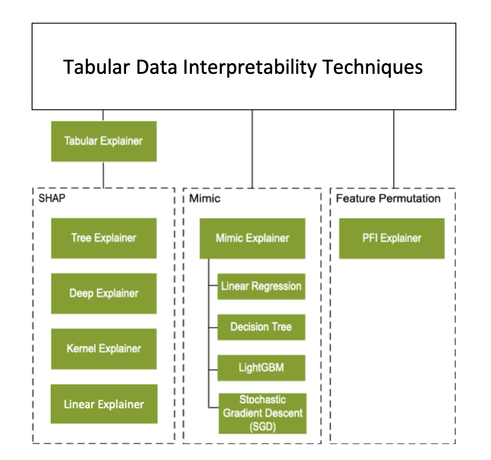](./assets/images/interpretability-architecture.png)

##### 3.1.2.3. [Python 解釈可能性パッケージを使用した説明 (プレビュー)](https://learn.microsoft.com/ja-jp/azure/machine-learning/how-to-machine-learning-interpretability-aml)

### 3.2. [自動 ML でのモデル説明 (プレビュー)](https://learn.microsoft.com/ja-jp/azure/machine-learning/v1/how-to-machine-learning-interpretability-automl)

#### 3.2.1. トレーニング中

##### 3.2.1.1. モデル説明
* [最良モデル](https://learn.microsoft.com/ja-jp/azure/machine-learning/v1/how-to-machine-learning-interpretability-automl#interpretability-during-training-for-the-best-model)
    1. [最適な実行からエンジニアリングされた特徴量の重要度をダウンロードする](https://learn.microsoft.com/ja-jp/azure/machine-learning/v1/how-to-machine-learning-interpretability-automl#download-the-engineered-feature-importances-from-the-best-run)
    2. [最適な実行から生の特徴量の重要度をダウンロードする](https://learn.microsoft.com/ja-jp/azure/machine-learning/v1/how-to-machine-learning-interpretability-automl#download-the-raw-feature-importances-from-the-best-run)
* [任意のモデル](https://learn.microsoft.com/ja-jp/azure/machine-learning/v1/how-to-machine-learning-interpretability-automl#interpretability-during-training-for-any-model)
    1. [トレーニングから他の AutoML モデルを取得する](https://learn.microsoft.com/ja-jp/azure/machine-learning/v1/how-to-machine-learning-interpretability-automl#retrieve-any-other-automl-model-from-training)
    2. [モデル説明を設定する](https://learn.microsoft.com/ja-jp/azure/machine-learning/v1/how-to-machine-learning-interpretability-automl#set-up-the-model-explanations)
    3. [特徴量の重要度のための Mimic Explainer を初期化する](https://learn.microsoft.com/ja-jp/azure/machine-learning/v1/how-to-machine-learning-interpretability-automl#initialize-the-mimic-explainer-for-feature-importance)
    4. [Mimic Explainer を使用してエンジニアリングされた特徴量の重要度を計算および視覚化する](https://learn.microsoft.com/ja-jp/azure/machine-learning/v1/how-to-machine-learning-interpretability-automl#use-mimic-explainer-for-computing-and-visualizing-engineered-feature-importance)
    5. [Mimic Explainer を使用して生の特徴量の重要度を計算および視覚化する](https://learn.microsoft.com/ja-jp/azure/machine-learning/v1/how-to-machine-learning-interpretability-automl#use-mimic-explainer-for-computing-and-visualizing-raw-feature-importance)

##### 3.2.1.2. 視覚化
* [トレーニング時にデータのパターンと説明を発見するために視覚化する | 自動 ML でのモデル説明 (プレビュー) - Azure Machine Learning | Microsoft Learn](https://learn.microsoft.com/ja-jp/azure/machine-learning/v1/how-to-machine-learning-interpretability-automl#visualize-to-discover-patterns-in-data-and-explanations-at-training-time)
    - [グローバル説明 (モデルの動作全体)](https://learn.microsoft.com/ja-jp/azure/machine-learning/how-to-machine-learning-interpretability-aml#understand-entire-model-behavior-global-explanation)
    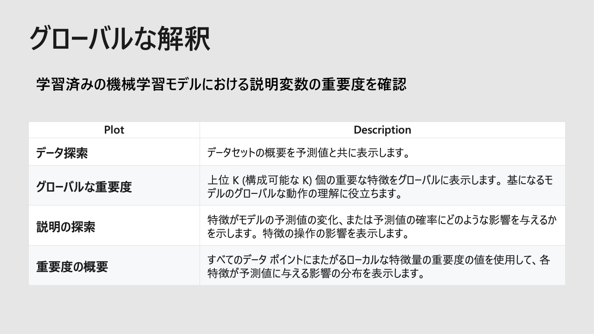
    - [ローカル説明 (個々の予測)](https://learn.microsoft.com/ja-jp/azure/machine-learning/how-to-machine-learning-interpretability-aml#understand-individual-predictions-local-explanation)
    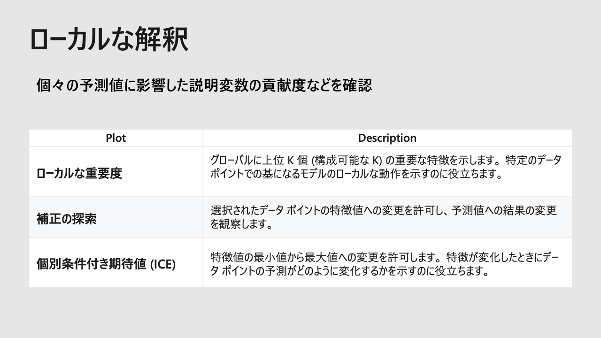
    - 共通
        - [Azure Machine Learning Studio での視覚化](https://learn.microsoft.com/ja-jp/azure/machine-learning/how-to-machine-learning-interpretability-aml#visualization-in-azure-machine-learning-studio)

#### 3.2.2. [推論中](https://learn.microsoft.com/ja-jp/azure/machine-learning/v1/how-to-machine-learning-interpretability-automl#interpretability-during-inference)

1. [モデルとスコアリング Explainer を登録する](https://learn.microsoft.com/ja-jp/azure/machine-learning/v1/how-to-machine-learning-interpretability-automl#register-the-model-and-the-scoring-explainer)
2. [サービスを設定するための conda の依存関係を作成する](https://learn.microsoft.com/ja-jp/azure/machine-learning/v1/how-to-machine-learning-interpretability-automl#create-the-scoring-script)
3. [スコアリング スクリプトを作成する](https://learn.microsoft.com/ja-jp/azure/machine-learning/v1/how-to-machine-learning-interpretability-automl#create-the-scoring-script)
4. [サービスをデプロイする](https://learn.microsoft.com/ja-jp/azure/machine-learning/v1/how-to-machine-learning-interpretability-automl#deploy-the-service)
5. [テスト データでの推論](https://learn.microsoft.com/ja-jp/azure/machine-learning/v1/how-to-machine-learning-interpretability-automl#inference-with-test-data)

> 注意: 解釈可能性、最適なモデルの説明は、次のアルゴリズムを **最適なモデル** または **アンサンブル** として推奨する自動 ML の予測実験では<ins>使用できません</ins>。
> 
> * TCNForecaster
> * AutoArima
> * ExponentialSmoothing
> * Prophet
> * Average
> * Naive
> * Seasonal Average
> * Seasonal Naive

---

## 4. 自動ML からモデル説明の流れ

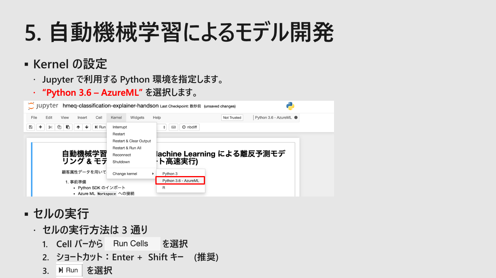
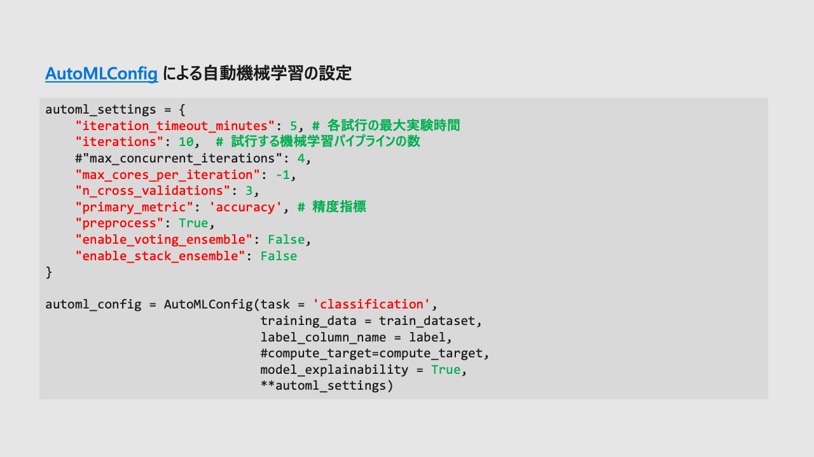
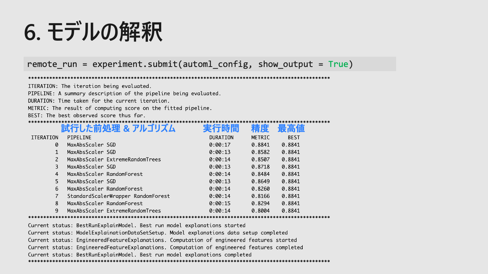
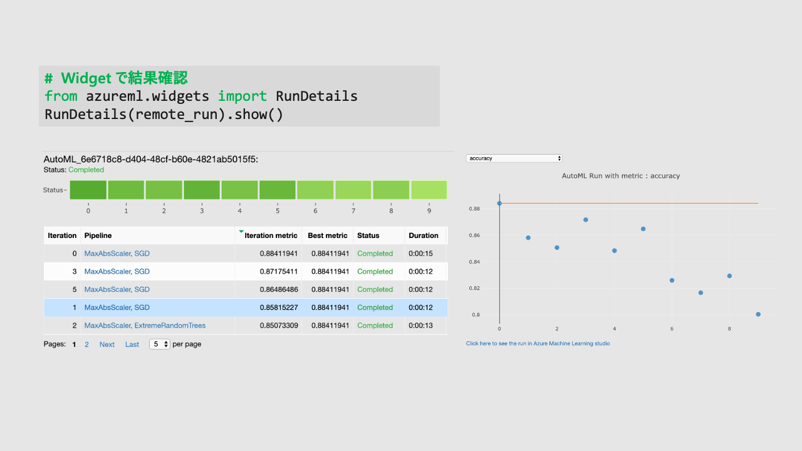
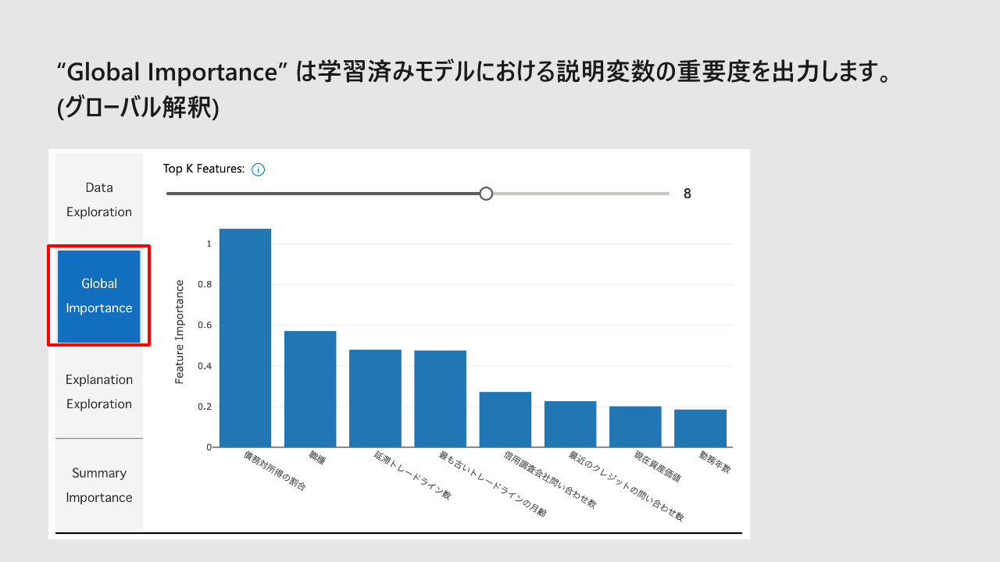
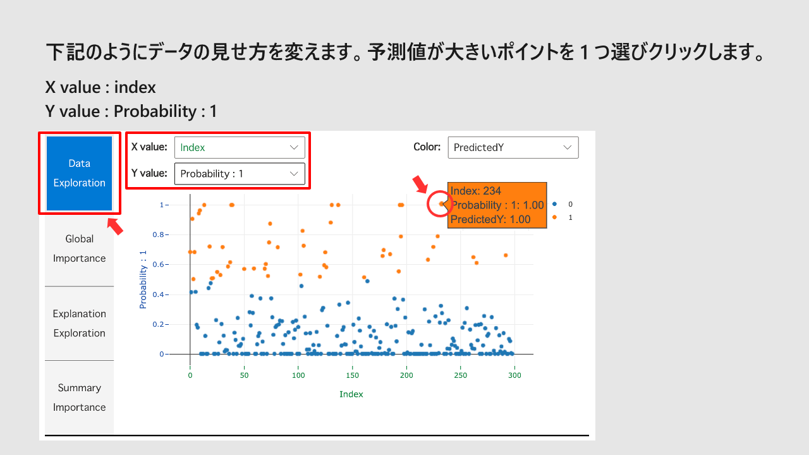
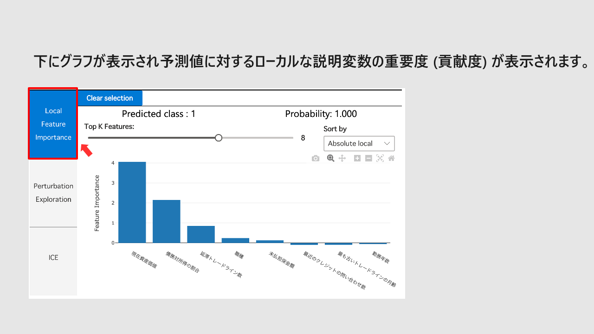

---

## 4. ガイド

* [スタジオ UI を使用して自動 ML を設定する - Azure Machine Learning | Microsoft Learn](https://learn.microsoft.com/ja-jp/azure/machine-learning/how-to-use-automated-ml-for-ml-models)
* [Computer Vision タスクのデータを準備する - Azure Machine Learning | Microsoft Learn](https://learn.microsoft.com/ja-jp/azure/machine-learning/how-to-prepare-datasets-for-automl-images)
* [Python で AutoML を設定する (v2) - Azure Machine Learning | Microsoft Learn](https://learn.microsoft.com/ja-jp/azure/machine-learning/how-to-configure-auto-train)
* Computer Vision 用に AutoML を設定する
  * [CLI 利用](https://learn.microsoft.com/ja-jp/azure/machine-learning/how-to-auto-train-image-models?tabs=cli)
  * [Python SDK 利用](https://learn.microsoft.com/ja-jp/azure/machine-learning/how-to-auto-train-image-models?tabs=python)
* AutoML を使用して画像内の小さなオブジェクトを検出する
  * [CLI 利用](https://learn.microsoft.com/ja-jp/azure/machine-learning/how-to-use-automl-small-object-detect?tabs=CLI-v2)
  * [Python SDK 利用](https://learn.microsoft.com/ja-jp/azure/machine-learning/how-to-use-automl-small-object-detect?tabs=SDK-v2)
* NLP の AutoML を設定します
  * [CLI 利用](https://learn.microsoft.com/ja-jp/azure/machine-learning/how-to-auto-train-nlp-models?tabs=cli)
  * [Python SDK 利用](https://learn.microsoft.com/ja-jp/azure/machine-learning/how-to-auto-train-nlp-models?tabs=python)
* [時系列予測用に AutoML を設定する - Azure Machine Learning | Microsoft Learn](https://learn.microsoft.com/ja-jp/azure/machine-learning/how-to-auto-train-forecast)

---

## 5. チュートリアル

* [チュートリアル: コードなし分類モデルを AutoML でトレーニングする - Azure Machine Learning | Microsoft Learn](https://learn.microsoft.com/ja-jp/azure/machine-learning/tutorial-first-experiment-automated-ml)
* [チュートリアル:需要予測と AutoML - Azure Machine Learning | Microsoft Learn](https://learn.microsoft.com/ja-jp/azure/machine-learning/tutorial-automated-ml-forecast)
* [チュートリアル: AutoML - オブジェクト検出モデルのトレーニング - Azure Machine Learning | Microsoft Learn](https://learn.microsoft.com/ja-jp/azure/machine-learning/tutorial-auto-train-image-models?tabs=cli)

---

## 6. ラーニング

| #   | モジュール | 所要時間 |
| --- | -------- | ------- |
| 1 | [Azure Machine Learning で自動機械学習を使用する](https://learn.microsoft.com/ja-jp/training/modules/use-automated-machine-learning/) | 47分 |
| 2 | [Azure Machine Learning service で機械学習モデルの選択を自動化する](https://learn.microsoft.com/ja-jp/training/modules/automate-model-selection-with-azure-automl/) | 25分 |
| 3 | [自動機械学習の最適な分類モデルを見つける](https://learn.microsoft.com/ja-jp/training/modules/find-best-classification-model-automated-machine-learning/) | 37分 |

---

## 7. 参考資料

* [自動 ML とは AutoML - Azure Machine Learning | Microsoft Learn](https://learn.microsoft.com/ja-JP/azure/machine-learning/concept-automated-ml)
* [AutoML 実験結果の評価 - Azure Machine Learning | Microsoft Learn](https://learn.microsoft.com/ja-jp/azure/machine-learning/how-to-understand-automated-ml)
* [自動 ML でのモデル説明 (プレビュー) - Azure Machine Learning | Microsoft Learn](https://learn.microsoft.com/ja-jp/azure/machine-learning/v1/how-to-machine-learning-interpretability-automl)
* [AutoML での予測に関するよくある質問 - Azure Machine Learning | Microsoft Learn](https://learn.microsoft.com/ja-jp/azure/machine-learning/how-to-automl-forecasting-faq)
* [MachineLearningNotebooks/how-to-use-azureml/automated-machine-learning at master · Azure/MachineLearningNotebooks](https://github.com/Azure/MachineLearningNotebooks/tree/master/how-to-use-azureml/automated-machine-learning)
* [interpretml/interpret-community: Interpret Community extends Interpret repository with additional interpretability techniques and utility functions to handle real-world datasets and workflows.](https://github.com/interpretml/interpret-community)
* [Interpretable Machine Learning](https://christophm.github.io/interpretable-ml-book/)
