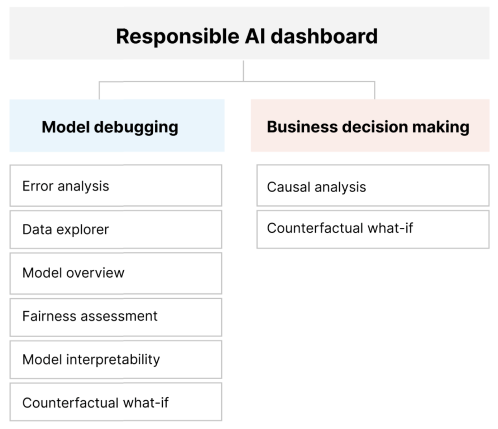
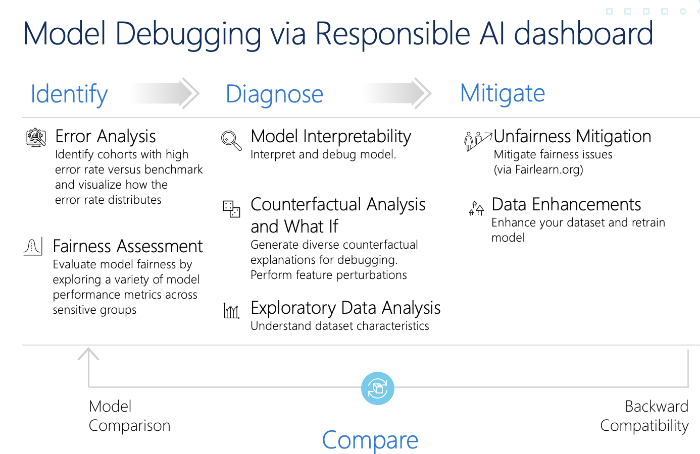
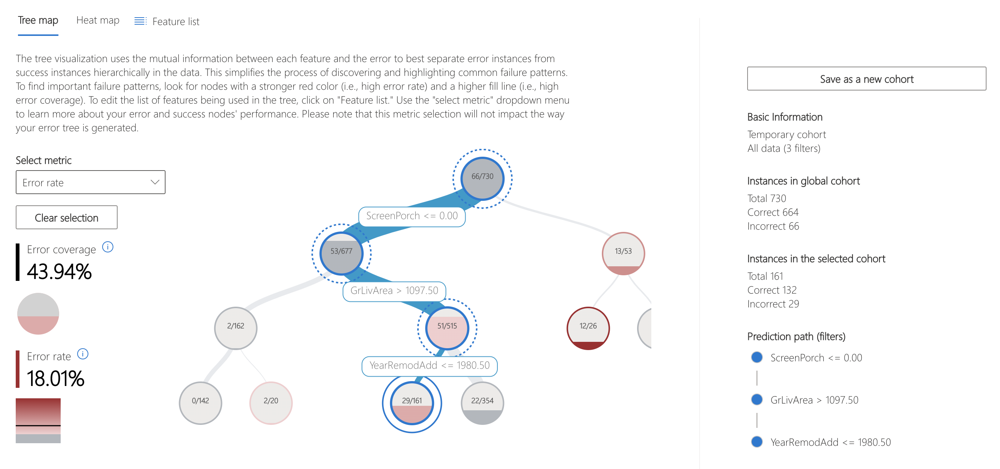
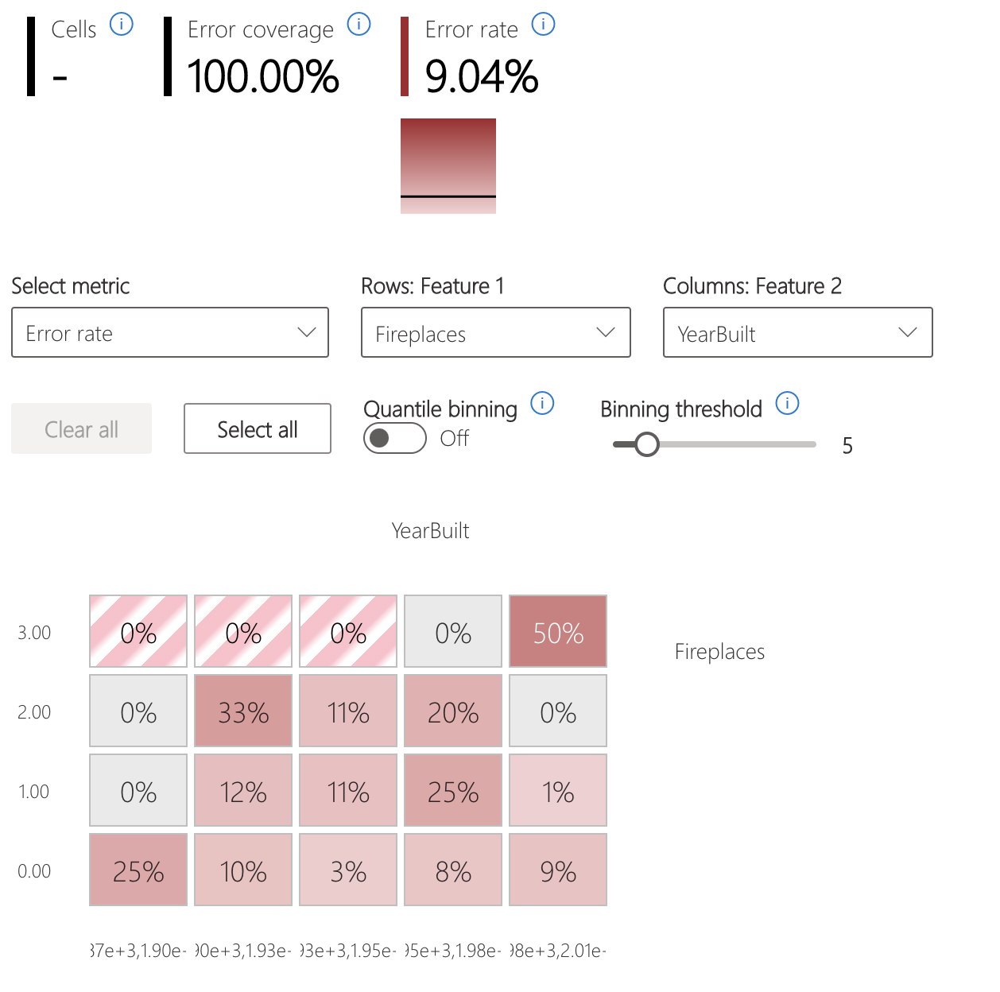
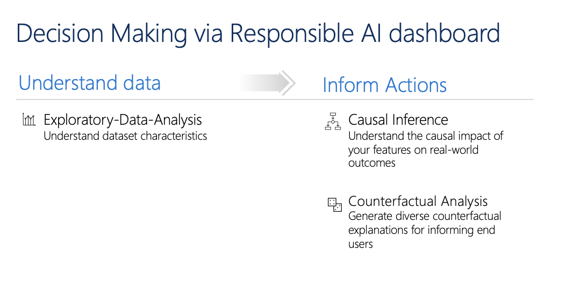

###### Azure Machine Learning 入門 (L100)

# 9. 責任ある AI (Responsible AI)

- [9. 責任ある AI (Responsible AI)](#9-責任ある-ai-responsible-ai)
  - [1. Microsoft の責任ある AI の基本原則](#1-microsoft-の責任ある-ai-の基本原則)
    - [1.1. 公平性 (Fairness)](#11-公平性-fairness)
    - [1.2. 信頼性と安全性 (Reliability \& Safety)](#12-信頼性と安全性-reliability--safety)
    - [1.3. プライバシーとセキュリティ (Privacy \& Security)](#13-プライバシーとセキュリティ-privacy--security)
    - [1.4. 包括性 (inclusiveness)](#14-包括性-inclusiveness)
    - [1.5. 透明性 (Transparency)](#15-透明性-transparency)
    - [1.6. アカウンタビリティ (Accountability)](#16-アカウンタビリティ-accountability)
  - [2. 責任ある AI ダッシュボード](#2-責任ある-ai-ダッシュボード)
    - [2.1. 責任ある AI ダッシュボードを使用する理由](#21-責任ある-ai-ダッシュボードを使用する理由)
      - [2.1.1. 責任ある AI スコアカード](#211-責任ある-ai-スコアカード)
    - [2.2. 責任ある AI ダッシュボードを使用する必要があるユーザー](#22-責任ある-ai-ダッシュボードを使用する必要があるユーザー)
    - [2.3. モデルのデバッグ のための 責任ある AI ダッシュボードのコンポーネント (Model debugging)](#23-モデルのデバッグ-のための-責任ある-ai-ダッシュボードのコンポーネント-model-debugging)
      - [2.3.1. 特定/識別 (Identify)](#231-特定識別-identify)
        - [2.3.1.1. モデルの概要 (Model overview)](#2311-モデルの概要-model-overview)
        - [2.3.1.2. エラー分析 (Error analysis)](#2312-エラー分析-error-analysis)
          - [2.3.1.2.1. エラー率が高いコーホートを明らかにするデシジョン ツリー (エラー ツリー)](#23121-エラー率が高いコーホートを明らかにするデシジョン-ツリー-エラー-ツリー)
          - [2.3.1.2.2. 入力特徴がコーホート全体のエラー率にどのように影響するかを視覚化するヒートマップ (エラー ヒートマップ)](#23122-入力特徴がコーホート全体のエラー率にどのように影響するかを視覚化するヒートマップ-エラー-ヒートマップ)
        - [2.3.1.3. 公平性分析 (Fairness assessment)](#2313-公平性分析-fairness-assessment)
      - [2.3.2. 診断 (Diagnose)](#232-診断-diagnose)
        - [2.3.2.1. モデルの解釈可能性 (Model interpretability)](#2321-モデルの解釈可能性-model-interpretability)
        - [2.3.2.2. 反事実分析と What-If (Counterfactual Analysis and What If)](#2322-反事実分析と-what-if-counterfactual-analysis-and-what-if)
        - [2.3.2.3. データ分析 (Data explorer / Exploratory Data Analysis)](#2323-データ分析-data-explorer--exploratory-data-analysis)
      - [2.3.3. 軽減 (Mitigate)](#233-軽減-mitigate)
        - [2.3.3.1. 不公平の軽減 (Unfairness mitigation)](#2331-不公平の軽減-unfairness-mitigation)
          - [2.3.3.1.1. 削減](#23311-削減)
          - [2.3.3.1.2. 後処理](#23312-後処理)
        - [2.3.3.2. データの強化 (Data Enhancements)](#2332-データの強化-data-enhancements)
    - [2.4. ビジネス上の意思決定 のための 責任ある AI ダッシュボードのコンポーネント (Business decision making)](#24-ビジネス上の意思決定-のための-責任ある-ai-ダッシュボードのコンポーネント-business-decision-making)
      - [2.4.1. データを理解する (Understand data)](#241-データを理解する-understand-data)
        - [2.4.1.1. データ分析 (Exploratory-Data-Analysis)](#2411-データ分析-exploratory-data-analysis)
      - [2.4.2. 必要なアクションを知る (Inform Actions)](#242-必要なアクションを知る-inform-actions)
        - [2.4.2.1. 因果関係推論 (Causal Inference)](#2421-因果関係推論-causal-inference)
        - [2.4.2.2. 反事実分析 (Counterfactual Analysis)](#2422-反事実分析-counterfactual-analysis)
    - [2.5. サポートされているシナリオと制限事項](#25-サポートされているシナリオと制限事項)
  - [3. ラーニング](#3-ラーニング)
  - [4. 参考資料](#4-参考資料)


---

## 1. Microsoft の責任ある AI の基本原則

責任ある AI へのアプローチをガイドする 6つの基本原則


```
1. 公平性 (Fairness)
2. 信頼性と安全性 (Reliability & Safety)
3. プライバシーとセキュリティ (Privacy & Security)
4. 包括性 (inclusiveness)
5. 透明性 (Transparency)
6. アカウンタビリティ (Accountability)
```

### 1.1. [公平性](https://learn.microsoft.com/ja-jp/azure/machine-learning/concept-responsible-ai#fairness-and-inclusiveness) ([Fairness](https://learn.microsoft.com/en-us/azure/machine-learning/concept-responsible-ai#fairness-and-inclusiveness))

> AI システムはすべての人を公平に扱う必要があります

> **Azure Machine Learning での公平性と包括性**: [責任ある AI ダッシュボード](https://learn.microsoft.com/ja-jp/azure/machine-learning/concept-responsible-ai-dashboard)の[公平性評価](https://learn.microsoft.com/ja-jp/azure/machine-learning/concept-fairness-ml)コンポーネントを使うと、データ サイエンティストと開発者は、性別、民族性、年齢などの観点から定義された機密グループ全体でモデルの公平性を評価できるようになります。


### 1.2. [信頼性と安全性](https://learn.microsoft.com/ja-jp/azure/machine-learning/concept-responsible-ai#reliability-and-safety) ([Reliability & Safety](https://learn.microsoft.com/en-us/azure/machine-learning/concept-responsible-ai#reliability-and-safety))

> AI システムは信頼でき安全に実行する必要があります

> **Azure Machine Learning における信頼性と安全性**: [責任ある AI ダッシュボード](https://learn.microsoft.com/ja-jp/azure/machine-learning/concept-responsible-ai-dashboard)の[エラー分析](https://learn.microsoft.com/ja-jp/azure/machine-learning/concept-error-analysis)コンポーネントにより、データ サイエンティストと開発者は次のことが可能になります。
> * モデルに対するエラーの分散について詳しく理解する。
> * 全体的なベンチマークよりもエラー率が高いデータのコーホート (サブセット) を特定する。


### 1.3. [プライバシーとセキュリティ](https://learn.microsoft.com/ja-jp/azure/machine-learning/concept-responsible-ai#privacy-and-security) ([Privacy & Security](https://learn.microsoft.com/en-us/azure/machine-learning/concept-responsible-ai#privacy-and-security))

> AI システムは安全であり、プライバシーを尊重する必要があります

> **Azure Machine Learning におけるプライバシーとセキュリティ**: Azure Machine Learning では、管理者と開発者が、会社のポリシーに[準拠したセキュリティで保護された構成を作成](https://learn.microsoft.com/ja-jp/azure/machine-learning/concept-enterprise-security)できます。 Azure Machine Learning と Azure プラットフォームを使用すると、次のことができます。
> * ユーザー アカウントまたはグループでリソースと操作へのアクセスを制限する。
> * 受信および送信のネットワーク通信を制限する。
> * 転送中および保存中のデータを暗号化する。
> * 脆弱性をスキャンする。
> * 構成ポリシーを適用および監査する。


### 1.4. [包括性](https://learn.microsoft.com/ja-jp/azure/machine-learning/concept-responsible-ai#fairness-and-inclusiveness) ([inclusiveness](https://learn.microsoft.com/en-us/azure/machine-learning/concept-responsible-ai#fairness-and-inclusiveness))

> AI システムはあらゆる人に力を与え、人々を結びつける必要があります

> **Azure Machine Learning での公平性と包括性**: [責任ある AI ダッシュボード](https://learn.microsoft.com/ja-jp/azure/machine-learning/concept-responsible-ai-dashboard)の[公平性評価](https://learn.microsoft.com/ja-jp/azure/machine-learning/concept-fairness-ml)コンポーネントを使うと、データ サイエンティストと開発者は、性別、民族性、年齢などの観点から定義された機密グループ全体でモデルの公平性を評価できるようになります。

### 1.5. [透明性](https://learn.microsoft.com/ja-jp/azure/machine-learning/concept-responsible-ai#transparency) ([Transparency](https://learn.microsoft.com/en-us/azure/machine-learning/concept-responsible-ai#transparency))

> AI システムは理解しやすい必要があります

> 透明性の重要な部分は、_"解釈可能性"_、つまり AI システムとそのコンポーネントの動作の有効な説明です。

> **Azure Machine Learning における透明性**: [責任ある AI ダッシュボード](https://learn.microsoft.com/ja-jp/azure/machine-learning/concept-responsible-ai-dashboard)の [モデルの解釈可能性](https://learn.microsoft.com/ja-jp/azure/machine-learning/how-to-machine-learning-interpretability)と[反事実条件 What-If](https://learn.microsoft.com/ja-jp/azure/machine-learning/concept-counterfactual-analysis) の各コンポーネントを使い、データ サイエンティストと開発者は、モデルの予測について人間が理解できる説明を生成できます。


### 1.6. [アカウンタビリティ](https://learn.microsoft.com/ja-jp/azure/machine-learning/concept-responsible-ai#accountability) ([Accountability](https://learn.microsoft.com/en-us/azure/machine-learning/concept-responsible-ai#accountability))

> AI システムにはアカウンタビリティが必要です

> AI システムを設計してデプロイする人たちは、そのシステムがどのように動作するかについて説明責任があります。

> **Azure Machine Learning における説明責任**: [Machine Learning Operations (MLOps)](https://learn.microsoft.com/ja-jp/azure/machine-learning/concept-model-management-and-deployment) は、 AI ワークフローの効率を高める DevOps の原則とプラクティスに基づいています。 Azure Machine Learning には、AI システムの説明責任を高める次の MLOps 機能が用意されています。
> * どこからでもモデルの登録、パッケージ化、デプロイを行う。 モデルの使用に必要な関連メタデータを追跡することもできます。
> * エンドツーエンドの機械学習ライフサイクルのためのガバナンス データを取得します。 ログに記録される系列情報には、モデルを公開しているユーザー、変更が行われた理由、モデルが運用環境にいつデプロイされたか、または使用されたかを含めることができます。
> * 機械学習ライフサイクルにおけるイベントについて通知とアラートを行います。 例として、実験の完了、モデルの登録、モデル デプロイ、データ ドリフト検知などがあります。
> * 運用上の問題や機械学習に関連する問題についてアプリケーションを監視します。 トレーニングと推論の間でのモデル入力の比較、モデル固有のメトリックの調査、および機械学習インフラストラクチャに対する監視とアラートの提供を行います。

> MLOps 機能に加えて、Azure Machine Learning の[責任ある AI スコアカード](https://learn.microsoft.com/ja-jp/azure/machine-learning/concept-responsible-ai-scorecard)により、利害関係者間のコミュニケーションを可能にすることで説明責任を生み出します。 このスコアカードにより、AI データとモデルの正常性について、開発者がモデルの正常性に関する分析情報を簡単に構成し、ダウンロードして、技術者と非技術者の利害関係者と共有できるため、さらに説明責任を生み出すことができます。 これらの分析情報を共有することは、信頼の構築に役立ちます。

> 機械学習プラットフォームでは、さらに、次の方法でビジネス上の意思決定を通知することで意思決定が可能になります。
> * 利害関係者が結果に対する因果関係処理効果を理解するのに役立つ、履歴データのみを使用したデータ駆動型分析情報。 たとえば、"薬は患者の血圧にどのように影響するか"。これらの分析情報は、[責任ある AI ダッシュボード](https://learn.microsoft.com/ja-jp/azure/machine-learning/concept-responsible-ai-dashboard)の[因果関係推論](https://learn.microsoft.com/ja-jp/azure/machine-learning/concept-causal-inference)コンポーネントを通じて提供されます。
> * "次に AI から異なる結果を得るためにどうすればよいのか?" などのユーザーの質問に回答し、対応できるようにするためのモデル駆動型分析情報。 このような分析情報は、[責任ある AI ダッシュボード](https://learn.microsoft.com/ja-jp/azure/machine-learning/concept-responsible-ai-dashboard)の[反事実条件 What-If](https://learn.microsoft.com/ja-jp/azure/machine-learning/concept-counterfactual-analysis) コンポーネントを介してデータ サイエンティストに提供されます。


---


## 2. 責任ある AI ダッシュボード

```
1. 責任ある AI ダッシュボードを使用する理由
2. 責任ある AI ダッシュボードを使用する必要があるユーザー
3. モデルのデバッグ のための 責任ある AI ダッシュボードのコンポーネント
4. ビジネス上の意思決定 のための 責任ある AI ダッシュボードのコンポーネント
5. サポートされているシナリオと制限事項
```

### 2.1. [責任ある AI ダッシュボードを使用する理由](https://learn.microsoft.com/ja-jp/azure/machine-learning/concept-responsible-ai-dashboard#reasons-for-using-the-responsible-ai-dashboard)

> 責任ある AI の特定領域では個々のツールが進歩していますが、データ サイエンティストは、多くの場合、モデルとデータを総合的に評価するために、さまざまなツールを使用する必要があります。 たとえば、モデルの解釈可能性と公平性の評価を一緒に使用する必要がある場合があります。
> 
> データ サイエンティストが 1 つのツールで公平性の問題を検出した場合、軽減策の手順を実行する前に、どのデータまたはモデルの要因が問題の根本にあるのか理解するために、別のツールに移動する必要があります。 次の要因により、この困難なプロセスがさらに複雑になります。
> 
> ツールを見つけて学習するための中心的な場所がなく、新しい手法を調べて学習するのにかかる時間が長くなる。
> 異なるツールが相互通信できない。 データ サイエンティストは、データセット、モデル、その他のメタデータをツール間で渡す場合に、それらをラングリングする必要があります。
> メトリックと視覚化は簡単には比較できず、結果を共有するのが困難である。
> 責任ある AI ダッシュボードは、この現状に挑戦します。 これは、断片化されたエクスペリエンスを 1 か所にまとめる、包括的でありながらカスタマイズ可能なツールです。 これにより、モデルのデバッグとデータドリブンの意思決定のための単一のカスタマイズ可能なフレームワークにシームレスにオンボードできます。
> 
> 責任ある AI ダッシュボードを使用すると、データセット コーホートを作成し、それらのコホートをサポートされているすべてのコンポーネントに渡し、特定されたコホートのモデルの正常性を確認できます。 さらに、さまざまな事前構築済みのコーホートでサポートされているすべてのコンポーネントの分析情報を比較して、非集計分析を実行し、モデルの盲点を見つけることができます。
> 
> これらの分析情報を他の利害関係者と共有する準備ができたら、[責任ある AI PDF スコアカード](https://learn.microsoft.com/ja-jp/azure/machine-learning/how-to-responsible-ai-scorecard)を使用して情報を簡単に抽出できます。 PDF レポートをコンプライアンス レポートに添付するか、同僚と共有して信頼を築き、承認を得ます。

#### 2.1.1. [責任ある AI スコアカード](https://learn.microsoft.com/ja-jp/azure/machine-learning/concept-responsible-ai-scorecard)

> Azure Machine Learning エコシステムを使用する最大の利点の 1 つは、Azure Machine Learning実行履歴でのモデルとデータの分析情報のアーカイブ (将来のクイック リファレンス用) にあります。 そのインフラストラクチャの一部として、機械学習モデルとそれに対応する責任ある AI ダッシュボードに付随する責任ある AI スコアカードを導入して、ML プロフェッショナルがデータとモデルの正常性レコードを簡単に生成して共有できるようにします。

### 2.2. [責任ある AI ダッシュボードを使用する必要があるユーザー](https://learn.microsoft.com/ja-jp/azure/machine-learning/concept-responsible-ai-dashboard#people-who-should-use-the-responsible-ai-dashboard)

> * デプロイ前に機械学習モデルをデバッグして改善する必要がある機械学習のプロフェッショナルとデータ サイエンティスト
> * モデルの正常性レコードを製品マネージャーおよびビジネス利害関係者と共有して、信頼関係を築き、デプロイの許可を受ける必要がある機械学習のプロフェッショナルとデータ サイエンティスト
> * デプロイ前に機械学習モデルを確認する製品マネージャーとビジネス利害関係者
> * 公平性と信頼性の問題を把握するために機械学習モデルを確認するリスク責任者
> * モデルの決定をユーザーに説明したり、結果の改善を支援したりする AI ソリューションのプロバイダー
> * 規制機関や監査者と共に機械学習モデルを確認する必要がある規制が厳しい分野のプロフェッショナル

[](./assets/images/dashboard.png)

### 2.3. [モデルのデバッグ のための 責任ある AI ダッシュボードのコンポーネント](https://learn.microsoft.com/ja-jp/azure/machine-learning/concept-responsible-ai-dashboard#model-debugging) ([Model debugging](https://learn.microsoft.com/en-us/azure/machine-learning/concept-responsible-ai-dashboard#model-debugging))

[](./assets/images/model-debugging.png)

#### 2.3.1. 特定/識別 (Identify)

##### 2.3.1.1. モデルの概要 (Model overview)

> モデルの概要コンポーネントは、パフォーマンスをより適切に調査できるようにするために、モデル予測分布の高レベルのビューでモデル評価メトリックを集計します。 このコンポーネントでは、センシティブ グループに対するモデル パフォーマンスの詳細を強調することで、グループの公平性評価を行うこともできます。

##### 2.3.1.2. [エラー分析](https://learn.microsoft.com/ja-jp/azure/machine-learning/concept-error-analysis) ([Error analysis](https://learn.microsoft.com/en-us/azure/machine-learning/concept-error-analysis))

> エラー分析コンポーネントは、モデルのエラー分布をより深く理解し、データの誤ったコーホート (サブグループ) をすばやく特定するのに役立ちます。

> 責任ある AI ダッシュボードのエラー分析コンポーネントを使用すると、機械学習の従事者はモデルの失敗分布をより深く理解でき、データの誤ったコーホートをすばやく特定できるようになります。 このコンポーネントにより、全体的なベンチマーク エラー率に対してエラー率が高いデータのコーホートが特定されます。 これは次の方法を通じてモデル ライフサイクル ワークフローの識別段階に貢献します。
> 
> * エラー率が高いコーホートを明らかにするデシジョン ツリー。
> * 入力特徴がコーホート全体のエラー率にどのように影響するかを視覚化するヒートマップ。
> 
> エラーの不一致は、トレーニング データ内の特定の人口統計グループや頻繁に観察されない入力コーホートに対してシステムのパフォーマンスが低い場合に発生する可能性があります。
> 
> このコンポーネントの機能は、モデル エラー プロファイルを生成する[エラー分析](https://learn.microsoft.com/ja-jp/azure/machine-learning/concept-error-analysis)パッケージから提供されます。
> 
> 次のことを行う必要がある場合は、エラー分析を使用します。
> * モデルの失敗がデータセット全体で、および複数の入力と特徴のディメンション間でどのように分散されるかについて深く理解する。
> * ターゲットを絞った軽減策を通知するために、集計したパフォーマンスのメトリックを分解して誤ったコーホートを自動的に検出する。

###### 2.3.1.2.1. [エラー率が高いコーホートを明らかにするデシジョン ツリー (エラー ツリー)](https://learn.microsoft.com/ja-jp/azure/machine-learning/concept-error-analysis#error-tree)

> バイナリ ツリーの視覚化では、ベンチマーク データが解釈可能なサブグループ (エラー率が予想外に高いか、低い) に自動的にパーティション分割されます。 言い換えると、ツリーでは入力特徴を使用して、モデル エラーが成功から最大限に分離されます。 データ サブグループを定義しているノードごとに、ユーザーは次の情報を調査できます。
> * **エラー率**: モデルが正しくないノード内のインスタンスの一部。 これは、赤色の彩度によって示されます。
> * **エラー カバレッジ**: そのノードに該当するすべてのエラーの一部。 これは、ノードのフィル レートによって示されます。
> * **データ表現**: エラー ツリーの各ノード内のインスタンスの数。 これは、ノードへの受信エッジの太さと、ノード内のインスタンスの合計数によって示されます。

[](./assets/images/error-analysis-tree.png)

###### 2.3.1.2.2. [入力特徴がコーホート全体のエラー率にどのように影響するかを視覚化するヒートマップ (エラー ヒートマップ)](https://learn.microsoft.com/ja-jp/azure/machine-learning/concept-error-analysis#error-heatmap)

> ビューは、入力特徴の 1 次元または 2 次元グリッドに基づいてデータをスライスします。 ユーザーは、分析のために関心のある入力解析を選択できます。
> 
> ヒートマップでは、濃い赤色を使用してエラーの多いセルを視覚化し、それらの領域にユーザーの注意を引きます。 これは、エラー テーマがパーティション間で異なる場合 (これは実際に頻繁に発生します) に特に便利です。

[](./assets/images/error-analysis-heatmap.png)


##### 2.3.1.3. [公平性分析](https://learn.microsoft.com/ja-jp/azure/machine-learning/concept-fairness-ml) ([Fairness assessment](https://learn.microsoft.com/en-us/azure/machine-learning/concept-fairness-ml))

> 公平性コンポーネントは、性別、人種、年齢などの機密性の高い属性の観点からグループを定義します。 次に、モデル予測がこれらのグループに与える影響と、差異を軽減する方法を評価します。 グループ全体での予測値とモデル パフォーマンス メトリックの値の分布が調べられ、モデルのパフォーマンスが評価されます。
> 
> ダッシュボードのこのコンポーネントの機能は、[Fairlearn](https://fairlearn.org/) パッケージから提供されます。


> AI によって発生する 2 つの一般的な種類の危害を次に示します。
> * 割り当ての害: AI システムによって、特定のグループの機会、リソース、または情報が増減されます。 たとえば、雇用、入学許可、融資などで、特定のグループの人が、他のグループより、適切な候補としてモデルで選択されやすくなる場合があります。
> * サービス品質の害: AI システムによる対応のよさが、ユーザーのグループによって異なります。 たとえば、音声認識システムでは、女性に対する対応が男性より悪くなる場合があります。
> 
> AI システムの不公平な動作を減らすには、これらの害を評価し、軽減する必要があります。

> 評価段階では、公平性は "不均衡メトリック" によって定量化されます。 これらのメトリックでは、比率または相違として、グループ間のモデルの動作を評価および比較できます。 責任ある AI ダッシュボードでは、2 つのクラスの不均衡メトリックがサポートされています。
> * **モデルのパフォーマンスにおける不均衡**: これらのメトリックのセットでは、データのサブグループ間での、選択されたパフォーマンス メトリックの値の不均衡 (差異) が計算されます。 次に例をいくつか示します。
>   * 正解率の不均衡
>   * エラー率の不均衡
>   * 精度の不均衡
>   * リコールの不均衡
>   * 平均絶対誤差 (MAE) の不均衡
> * **選択率における不均衡**: このメトリックには、サブグループ間での選択率 (好意的な予測) の差が含まれます。 この例としては、ローン承認率の不均衡があります。 選択率とは、各クラスで 1 として分類されるデータ ポイントの割合 (二項分類)、または予測値の分散 (回帰) を意味します。


#### 2.3.2. 診断 (Diagnose)

##### 2.3.2.1. [モデルの解釈可能性](https://learn.microsoft.com/ja-jp/azure/machine-learning/how-to-machine-learning-interpretability) ([Model interpretability](https://learn.microsoft.com/en-us/azure/machine-learning/how-to-machine-learning-interpretability))

> 解釈可能性コンポーネントは、人間が理解可能な機械学習モデルの予測の説明を生成し、モデルの動作に対する複数のビューを提供します。 
> * グローバルな説明 (たとえば、ローン配賦モデルの全体的な動作に影響する特徴量は何ですか?)
> * ローカル (局所的) な説明 (たとえば、申請者のローン申請が承認または却下されたのはなぜですか?)
> * 選択したコーホートまたはデータ ポイントに対するモデルの説明 (たとえば、低所得の申請者に対するローン配賦モデルの全体的な動作に影響する特徴は何ですか?)
> 
> ダッシュボードのこのコンポーネントの機能は、[InterpretML](https://interpret.ml/) パッケージから提供されます。


> 次のことが必要なときは、解釈可能性を使用します。
> * 予測に最も重要な特徴を理解することで、AI システムの予測がどの程度信頼できるかを判断します。
> * 最初にモデルを理解し、モデルで正常な特徴量が使われているか、それとも単に誤った相関関係が使われているかを特定することで、モデルのデバッグにアプローチします。
> * モデルで、機密性の高い特徴量やそれらとの関連性が高い特徴量に基づいて予測が行われているどうかを理解することで、不公平性の可能性のある原因を明らかにします。
> * 結果を示すローカルな説明を生成することで、モデルの決定をユーザーが信頼できるようにします。
> * AI システムの規制監査を行ってモデルを検証し、モデルの決定が人間に与える影響を監視します。

> 責任ある AI ダッシュボードのクラスとメソッドを使用し、SDK v2 と CLI v2 を使用すると、次のことができます。
> * モデル全体 (グローバルな説明) や個々のデータ ポイント (ローカルな説明) の特徴量の重要度の値を生成し、モデルの予測を説明する。
> * 実際の大規模なデータセットに関するモデルの解釈可能性を実現する。
> * 対話型の視覚化ダッシュボードを使用して、トレーニング時のデータと説明のパターンを検出する。
> 
> SDK v1 のクラスとメソッドを使うと、次のことができます。
> * モデル全体や個々のデータポイントの特徴量の重要度の値を生成し、モデルの予測を説明する。
> * トレーニングおよび推論中の実際の大規模データセットに関するモデルの解釈可能性を実現する。
> * 対話型の視覚化ダッシュボードを使用して、トレーニング時のデータと説明のパターンを検出する。

##### 2.3.2.2. [反事実分析と What-If](https://learn.microsoft.com/ja-jp/azure/machine-learning/concept-counterfactual-analysis) ([Counterfactual Analysis and What If](https://learn.microsoft.com/en-us/azure/machine-learning/concept-counterfactual-analysis))

> 反事実条件 What-If コンポーネントを使うと、特徴の変更や摂動にどのように反応するかという観点から、機械学習モデルを理解し、デバッグすることができます。

> このコンポーネントは、エラー診断を改善するための 2 つの機能で構成されています。
> - 特定のポイントへの最小限の変更によってモデルの予測が変更される一連の例を生成する。 つまり、この例ではモデル予測が逆の最も近いデータ ポイントを示しています。
> - モデルが特徴の変化にどのように反応するかを把握するために、個々のデータ ポイントに対して対話型のカスタム What-If 摂動を有効にする。
> 
> ダッシュボードのこのコンポーネントの機能は、[DiCE](https://github.com/interpretml/DiCE) パッケージから提供されます。

> What-if 反事実条件は、アクションの入力を変更した場合にモデルが何を予測するかという質問に対処します。 これらを使うと、入力 (特徴) の変更にどのように反応するかという観点から、機械学習モデルを理解し、デバッグすることができます。

> 反事実分析はモデルを"問い合わせて"、特定のデータ ポイントに対するどのような変更がモデルの決定を反転させるかを判断します。

> 責任ある AI ダッシュボードの "反事実分析と What-If " コンポーネントには次の 2 つの機能があります。
> * 特定のポイントに対する最小限の変更でモデルの予測を変更する (逆のモデル予測を持つ最も近いデータ ポイントを示す) 一連の例を生成する。
> * ユーザーが独自の What-If の摂動を生成して、モデルが特徴の変更にどのように反応するかを理解できるようにする。
> 
> 責任ある AI ダッシュボードの反事実分析コンポーネントの上位の差別化要因の 1 つは、有効で論理的な反事実の例について、変化する特徴とその許容範囲を特定できることです。

> 以下を行う必要がある場合は、What-If 反事実条件を使用します。
> * 性別、民族性などの機密性の高い属性を摂動し、モデルの予測が変化するかどうかを観察することによって、意思決定エバリュエーターとしての公平性と信頼性の基準を調べます。
> * 特定の入力インスタンスを詳細にデバッグします。
> * ソリューションをユーザーに提供し、モデルから望ましい結果を得るために何ができるかを判断します。

> 反事実条件を生成するために、DiCE ではモデルに依存しない手法がいくつか実装されています。現在サポートされているメソッドは次のとおりです。
> * **ランダム化検索**: このメソッドでは、あるクエリポイントの近くのポイントをランダムにサンプリングし、予測されたラベルが目的のクラスであるポイントとして反事実条件を返します。
> * **遺伝的検索**: このメソッドでは、クエリポイントへの近接性を最適化するという目的、できるだけ特徴を変更しないという目的、生成された反事実条件間の多様性を得ようとする目的を組み合わせて、遺伝的アルゴリズムを使用してポイントをサンプリングします。
> * **KD ツリー検索**: このアルゴリズムは、トレーニング データセットから反事実条件を返します。 距離関数に基づいてトレーニング データ ポイントの上に KD ツリーを構築し、目的の予測ラベルを生成する特定のクエリ ポイントに最も近いポイントを返します。

##### 2.3.2.3. [データ分析](https://learn.microsoft.com/ja-jp/azure/machine-learning/concept-data-analysis) ([Data explorer / Exploratory Data Analysis](https://learn.microsoft.com/en-us/azure/machine-learning/concept-data-analysis))

> データ分析では、予測と実際のそれぞれの結果、エラー グループ、特定の特徴に基づいてデータセットが視覚化されます。 これにより、過大表現および過小表現の問題を特定するとともに、データセット内でデータがどのようにクラスター化されているかを確認できます。

> 責任ある AI ダッシュボードのデータ分析コンポーネントを使用すると、予測と実際のそれぞれの結果、エラー グループ、特定の特徴量に基づいてデータセットを視覚化できます。 これにより、過大表現および過小表現の問題を特定し、データセット内でデータがどのようにクラスター化されているかを確認できます。 データの視覚化は、集計プロットまたは個々のデータ ポイントで構成されます。

> 次のことを行う必要がある場合は、データ分析を使用します。
> * さまざまなフィルターを選択してデータをさまざまなディメンション (コーホートとも呼ばれます) にスライスすることで、データセットの統計情報を探索する。
> * さまざまなコーホートと特徴量グループ間でのデータセットの分布を把握する。
> * 公平性、エラー分析、因果関係 (他のダッシュボード コンポーネントから派生) に関連する検出結果がデータセットの分布の結果であるかどうかを判断する。
> * 表現の問題、ラベル ノイズ、特徴量ノイズ、ラベル バイアスや同様のファクターから発生するエラーを軽減するために、より多くのデータを収集する領域を決定する。


#### 2.3.3. 軽減 (Mitigate)

> 軽減手順は、[Fairlearn](https://fairlearn.org/) などのスタンドアロン ツールを通じて利用できます。 詳細については、 [不公平軽減アルゴリズム](https://fairlearn.org/v0.7.0/user_guide/mitigation.html)に関する記事を参照してください。

##### 2.3.3.1. [不公平の軽減](https://learn.microsoft.com/ja-jp/azure/machine-learning/concept-fairness-ml#mitigation-algorithms) (Unfairness mitigation)

Fairlearn オープンソース パッケージには、 **削減** および **後処理** という 2 種類の不公平性軽減アルゴリズムが含まれています。

###### 2.3.3.1.1. 削減

> アルゴリズムでは、標準のブラックボックス機械学習推定器 (LightGBM モデルなど) が利用され、一連の再重み付けされたトレーニング データセットを使用して、再トレーニングされたモデルのセットが生成されます。
> 
> たとえば、特定の性別の応募者について、重みを加減してモデルが再トレーニングされ、性別グループ間での格差が削減されます。 その後、ユーザーはビジネス ルールとコストの計算に基づいて、精度 (または他のパフォーマンス メトリック) と不均衡の間で最適なトレードオフを提供するモデルを選択できます。

| # | アルゴリズム | 説明 | 機械学習タスク | 微妙な特徴 | サポートされる[不均衡の制約](https://learn.microsoft.com/ja-jp/azure/machine-learning/concept-fairness-ml#parity-constraints-for-mitigating-unfairness) |
| --- | --- | --- | --- | --- | --- |
| 1 | `ExponentiatedGradient` | 「[公平な分類のための削減アプローチ](https://arxiv.org/abs/1803.02453)」で説明されている公平な分類のためのブラックボックス アプローチ。 | 二項分類 | Categorical | 人口統計の不均衡、均等な確率 |
| 2 | `GridSearch` | 「[公平な分類のための削減アプローチ](https://arxiv.org/abs/1803.02453)」で説明されているブラックボックス アプローチ。 | 二項分類 | Binary | 人口統計の不均衡、均等な確率 |
| 3 | `GridSearch` | 境界グループの損失に対するアルゴリズムを使用する公正回帰のグリッド検索バリエーションを実装するブラックボックス アプローチ (「[公正回帰: 定量的な定義と削減に基づくアルゴリズム](https://arxiv.org/abs/1905.12843)」)。 | 回帰 | Binary | 境界グループの損失 |

###### 2.3.3.1.2. 後処理

> アルゴリズムは、既存の分類子と微妙な特徴を入力として受け取ります。 その後、分類子の予測の変換を導出して、指定された公平性の制約を適用します。 後処理アルゴリズムの 1 つである、しきい値の最適化の最大の利点は、モデルを再トレーニングする必要がないことによる、シンプルさと柔軟性です。

| # | アルゴリズム | 説明 | 機械学習タスク | 微妙な特徴 | サポートされる[不均衡の制約](https://learn.microsoft.com/ja-jp/azure/machine-learning/concept-fairness-ml#parity-constraints-for-mitigating-unfairness) |
| --- | --- | --- | --- | --- | --- |
| 1 | `ThresholdOptimizer` | ホワイトペーパー「[教師あり学習での機会の均等性](https://arxiv.org/abs/1610.02413)」に基づく後処理アルゴリズム。 この手法は、既存の分類子と機密センシティブ特徴を入力として受け取ります。 その後、指定された不均衡の制約を適用するために、分類子の予測の単調な変換を導出します。 | 二項分類 | Categorical | 人口統計の不均衡、均等な確率 |


##### 2.3.3.2. データの強化 (Data Enhancements)

N/A


### 2.4. [ビジネス上の意思決定 のための 責任ある AI ダッシュボードのコンポーネント](https://learn.microsoft.com/ja-jp/azure/machine-learning/concept-responsible-ai-dashboard#responsible-decision-making) ([Business decision making](https://learn.microsoft.com/en-us/azure/machine-learning/concept-responsible-ai-dashboard#responsible-decision-making))

[](./assets/images/decision-making.png)

#### 2.4.1. データを理解する (Understand data)

##### 2.4.1.1. データ分析 (Exploratory-Data-Analysis)

> データ分析コンポーネントをここで再利用して、データの分布を把握し、過大表現および過小表現を識別できます。 データ探索は意思決定の重要な部分です。これは、データ探索により、データ内で過小表現されているコーホートに関して、情報に基づき意思決定を行うことができないためです。


#### 2.4.2. 必要なアクションを知る (Inform Actions)

##### 2.4.2.1. 因果関係推論 (Causal Inference)

> 結果に対する因果関係処理効果を理解するのに役立つ、履歴データのみを使用したデータ駆動型分析情報。 次に例を示します。
> 
> "薬は患者の血圧にどのように影響しますか?"
> 
> "特定の顧客にプロモーション価値を提供することは、収益にどのような影響を与えますか?"
> 
> これらの分析情報は、ダッシュボードの[因果関係推論](https://learn.microsoft.com/ja-jp/azure/machine-learning/concept-causal-inference)コンポーネントを通じて提供されます。

> 因果関係推論コンポーネントは、介入がある場合に実際の結果がどのように変化するかを推定します。 また、さまざまな介入に対する特徴反応をシミュレートし、特定の介入の恩恵を受ける母集団コーホートを判断するルールを作成することで、有望な介入を構築するのにも役立ちます。 これらの機能を集合的に使用することで、新しいポリシーを適用し、実際の変化に影響を与えることができます。
> 
> このコンポーネントの機能は、[EconML](https://github.com/Microsoft/EconML) パッケージから提供されます。このパッケージは、機械学習を通じて観測データから異種処理効果を推定します。

##### 2.4.2.2. 反事実分析 (Counterfactual Analysis)

> "次に AI から異なる結果を得るためにどうすればよいのか?" などのユーザーの質問に回答し、対応できるようにするためのモデル駆動型分析情報。 これらの分析情報は、[反事実条件 What-If](https://learn.microsoft.com/ja-jp/azure/machine-learning/concept-counterfactual-analysis) コンポーネントを介してデータ サイエンティストに提供されます。

> 反事実条件 What-If コンポーネントを使うと、特徴の変更や摂動にどのように反応するかという観点から、機械学習モデルを理解し、デバッグすることができます。

> 反事実分析コンポーネントをここで再利用して、反対のモデル予測につながるデータ ポイントの特徴に適用される最小限の変更を生成できます。 たとえば、Taylor は、年収が 10,000 ドル増え、クレジット カードが 2 枚少なかったら、AI からローン承認を受けた可能性があります。
> 
> この情報をユーザーに提供すると、ユーザーの視点が通知されます。 これにより、今後 AI から目的の結果を得るためにどのようなアクションを実行できるかが教育されます。
> 
> このコンポーネントの機能は [DiCE](https://github.com/interpretml/DiCE) パッケージから提供されます。


### 2.5. [サポートされているシナリオと制限事項](https://learn.microsoft.com/ja-jp/azure/machine-learning/concept-responsible-ai-dashboard#supported-scenarios-and-limitations)

> * 責任ある AI ダッシュボードでは、現在、表形式の構造化データでトレーニングされた回帰と分類 (バイナリおよびマルチクラス) モデルがサポートされています。
> * 現在、責任ある AI ダッシュボードでは、sklearn (scikit-learn) フレーバーのみで Azure Machine Learning に登録されている MLflow モデルがサポートされています。 scikit-learn モデルでは `predict()/predict_proba()` メソッドを実装する必要があります。またはこのモデルは、`predict()/predict_proba()` メソッドを実行するクラス内にラップする必要があります。 モデルは、コンポーネント環境で読み込み可能で、pickleable である必要があります。
> * 責任ある AI ダッシュボードでは現在、ダッシュボード UI で最大 5K のデータ ポイントが視覚化されます。 ダッシュボードに渡す前に、データセットを 5k 以下にダウンサンプリングする必要があります。
> * Responsible AI ダッシュボードへのデータセット入力は、Parquet 形式の pandas DataFrames である必要があります。 NumPy および SciPy スパース データは現在サポートされていません。
> * 責任ある AI ダッシュボードは現在、数値またはカテゴリの特徴をサポートしています。 カテゴリ特徴の場合、ユーザーは特徴名を明示的に指定する必要があります。
> * 現在、責任ある AI ダッシュボードでは、10,000 個を超える列を含むデータセットはサポートされていません。


---


## 3. ラーニング

| #   | モジュール | 所要時間 |
| --- | -------- | ------- |
| 1 | [Azure Machine Learning を使用したモデルの不公平性の検出と緩和](https://learn.microsoft.com/ja-jp/azure/machine-learning/) | 45 分 |


---


## 4. 参考資料

* [Microsoft の責任ある AI の原則](https://www.microsoft.com/ja-jp/ai/responsible-ai)
* [Microsoft の責任ある AI へのアプローチ](https://www.microsoft.com/ja-jp/ai/our-approach)
* [AI Business School の人工知能コース](https://www.microsoft.com/ja-jp/ai/ai-business-school)
* [責任ある AI のリソース – Microsoft AI](https://www.microsoft.com/ja-jp/ai/responsible-ai-resources)
* [MachineLearningNotebooks/rai-loan-decision.ipynb at master · Azure/MachineLearningNotebooks](https://github.com/Azure/MachineLearningNotebooks/blob/master/how-to-use-azureml/responsible-ai/visualize-upload-loan-decision/rai-loan-decision.ipynb)
* [AI 開発のための人間のデータの手動収集 - Azure Machine Learning | Microsoft Learn](https://learn.microsoft.com/ja-jp/azure/machine-learning/concept-sourcing-human-data)