###### Azure Machine Learning 入門 (L100)

# 3. データã®æº–å‚™

- [3. データã®æº–å‚™](#3-データã®æº–å‚™)
  - [1. データã®æ¦‚念](#1-データã®æ¦‚念)
    - [1.1. URI](#11-uri)
  - [2. データå‹ã®ãƒ¦ãƒ¼ã‚¹ ケース](#2-データå‹ã®ãƒ¦ãƒ¼ã‚¹-ケース)
    - [2.1. ファイルå‹ã¯ã©ã®ã‚ˆã†ãªå ´åˆã«ä½¿ç”¨ã—ã¾ã™ã‹?](#21-ファイルå‹ã¯ã©ã®ã‚ˆã†ãªå ´åˆã«ä½¿ç”¨ã—ã¾ã™ã‹)
    - [2.2. フォルダーå‹ã¯ã©ã®ã‚ˆã†ãªå ´åˆã«ä½¿ç”¨ã—ã¾ã™ã‹?](#22-フォルダーå‹ã¯ã©ã®ã‚ˆã†ãªå ´åˆã«ä½¿ç”¨ã—ã¾ã™ã‹)
    - [2.3. テーブルå‹ã¯ã©ã®ã‚ˆã†ãªå ´åˆã«ä½¿ç”¨ã—ã¾ã™ã‹?](#23-テーブルå‹ã¯ã©ã®ã‚ˆã†ãªå ´åˆã«ä½¿ç”¨ã—ã¾ã™ã‹)
  - [3. Azure Blob Storage ã¸ã®ã‚¢ãƒƒãƒ—ロード (ãƒãƒ³ã‚ºã‚ªãƒ³)](#3-azure-blob-storage-ã¸ã®ã‚¢ãƒƒãƒ—ロード-ãƒãƒ³ã‚ºã‚ªãƒ³)
    - [3.1. 手順(例)](#31-手順例)
  - [4. データ資産ã®ä½œæˆ (ãƒãƒ³ã‚ºã‚ªãƒ³)](#4-データ資産ã®ä½œæˆ-ãƒãƒ³ã‚ºã‚ªãƒ³)
    - [4.1. 手順(例)](#41-手順例)
  - [5. データã¸ã®ãƒ©ãƒ™ãƒ«ä»˜ã‘](#5-データã¸ã®ãƒ©ãƒ™ãƒ«ä»˜ã‘)
    - [5.1. ç”»åƒã®ãƒ©ãƒ™ãƒ«ä»˜ã‘](#51-ç”»åƒã®ãƒ©ãƒ™ãƒ«ä»˜ã‘)
      - [5.1.1. ç”»åƒã®ãƒ©ãƒ™ãƒ«ä»˜ã‘プロジェクトã®ä½œæˆã‚¹ãƒ†ãƒƒãƒ—](#511-ç”»åƒã®ãƒ©ãƒ™ãƒ«ä»˜ã‘プロジェクトã®ä½œæˆã‚¹ãƒ†ãƒƒãƒ—)
        - [5.1.1.1. プロジェクトã®ä½œæˆã¨è©³ç´°æƒ…å ±ã®å…¥åŠ›](#5111-プロジェクトã®ä½œæˆã¨è©³ç´°æƒ…å ±ã®å…¥åŠ›)
        - [5.1.1.2. (オプション) 従業員ã®è¿½åŠ  (ベンダーã¸ã®ã‚¢ã‚¦ãƒˆã‚½ãƒ¼ã‚·ãƒ³ã‚°)](#5112-オプション-従業員ã®è¿½åŠ -ベンダーã¸ã®ã‚¢ã‚¦ãƒˆã‚½ãƒ¼ã‚·ãƒ³ã‚°)
        - [5.1.1.3. データセットã®é¸æŠã¾ãŸã¯ä½œæˆ](#5113-データセットã®é¸æŠã¾ãŸã¯ä½œæˆ)
        - [5.1.1.4. (オプション) 増分更新ã®æ§‹æˆ](#5114-オプション-増分更新ã®æ§‹æˆ)
        - [5.1.1.5. ラベル カテゴリã®è¿½åŠ ](#5115-ラベル-カテゴリã®è¿½åŠ )
        - [5.1.1.6. (オプション) ラベル付ã‘ã®æ‰‹é †ã®èª¬æ˜](#5116-オプション-ラベル付ã‘ã®æ‰‹é †ã®èª¬æ˜)
        - [5.1.1.7. (オプション) ラベル付ã‘ã®å“è³ªç®¡ç† (プレビュー)](#5117-オプション-ラベル付ã‘ã®å“質管ç†-プレビュー)
        - [5.1.1.8. (オプション) ML ã«ã‚ˆã‚‹ãƒ©ãƒ™ãƒ«ä»˜ã‘](#5118-オプション-ml-ã«ã‚ˆã‚‹ãƒ©ãƒ™ãƒ«ä»˜ã‘)
    - [5.2. テキストã®ãƒ©ãƒ™ãƒ«ä»˜ã‘](#52-テキストã®ãƒ©ãƒ™ãƒ«ä»˜ã‘)
      - [5.2.1. テキストã®ãƒ©ãƒ™ãƒ«ä»˜ã‘プロジェクトã®ä½œæˆã‚¹ãƒ†ãƒƒãƒ—](#521-テキストã®ãƒ©ãƒ™ãƒ«ä»˜ã‘プロジェクトã®ä½œæˆã‚¹ãƒ†ãƒƒãƒ—)
        - [5.2.1.1. プロジェクトã®ä½œæˆã¨è©³ç´°æƒ…å ±ã®å…¥åŠ›](#5211-プロジェクトã®ä½œæˆã¨è©³ç´°æƒ…å ±ã®å…¥åŠ›)
        - [5.2.1.2. (オプション) 従業員ã®è¿½åŠ  (ベンダーã¸ã®ã‚¢ã‚¦ãƒˆã‚½ãƒ¼ã‚·ãƒ³ã‚°)](#5212-オプション-従業員ã®è¿½åŠ -ベンダーã¸ã®ã‚¢ã‚¦ãƒˆã‚½ãƒ¼ã‚·ãƒ³ã‚°)
        - [5.2.1.3. データセットã®é¸æŠã¾ãŸã¯ä½œæˆ](#5213-データセットã®é¸æŠã¾ãŸã¯ä½œæˆ)
        - [5.2.1.4. (オプション) 増分更新ã®æ§‹æˆ](#5214-オプション-増分更新ã®æ§‹æˆ)
        - [5.2.1.5. ラベル カテゴリã®è¿½åŠ ](#5215-ラベル-カテゴリã®è¿½åŠ )
        - [5.2.1.6. (オプション) ラベル付ã‘ã®æ‰‹é †ã®èª¬æ˜](#5216-オプション-ラベル付ã‘ã®æ‰‹é †ã®èª¬æ˜)
        - [5.2.1.7. (オプション) ラベル付ã‘ã®å“è³ªç®¡ç† (プレビュー)](#5217-オプション-ラベル付ã‘ã®å“質管ç†-プレビュー)
        - [5.2.1.8. (オプション) ML ã«ã‚ˆã‚‹ãƒ©ãƒ™ãƒ«ä»˜ã‘](#5218-オプション-ml-ã«ã‚ˆã‚‹ãƒ©ãƒ™ãƒ«ä»˜ã‘)
    - [5.3. ラベル付ã‘プロジェクトã®å®Ÿè¡Œã¨ç›£è¦–](#53-ラベル付ã‘プロジェクトã®å®Ÿè¡Œã¨ç›£è¦–)
      - [5.3.1. ダッシュボードã§ã®é€²è¡ŒçŠ¶æ³ã®è¡¨ç¤º](#531-ダッシュボードã§ã®é€²è¡ŒçŠ¶æ³ã®è¡¨ç¤º)
      - [5.3.2. ラベル付ã‘ã•ã‚ŒãŸãƒ‡ãƒ¼ã‚¿ã¨åˆæ„ラベルã®ç¢ºèª](#532-ラベル付ã‘ã•ã‚ŒãŸãƒ‡ãƒ¼ã‚¿ã¨åˆæ„ラベルã®ç¢ºèª)
      - [5.3.3. 詳細ã®è¡¨ç¤ºã¨å¤‰æ›´](#533-詳細ã®è¡¨ç¤ºã¨å¤‰æ›´)
    - [5.4. ラベル付ã‘ツールã®ä½¿ã„æ–¹](#54-ラベル付ã‘ツールã®ä½¿ã„æ–¹)
    - [5.5. ラベルã®è¿½åŠ ](#55-ラベルã®è¿½åŠ )
    - [5.6. ラベルã®ã‚¨ã‚¯ã‚¹ãƒãƒ¼ãƒˆ](#56-ラベルã®ã‚¨ã‚¯ã‚¹ãƒãƒ¼ãƒˆ)
      - [5.6.1. ç”»åƒãƒ©ãƒ™ãƒ«ã®ã‚¨ã‚¯ã‚¹ãƒãƒ¼ãƒˆ](#561-ç”»åƒãƒ©ãƒ™ãƒ«ã®ã‚¨ã‚¯ã‚¹ãƒãƒ¼ãƒˆ)
      - [5.6.2. テキストラベルã®ã‚¨ã‚¯ã‚¹ãƒãƒ¼ãƒˆ](#562-テキストラベルã®ã‚¨ã‚¯ã‚¹ãƒãƒ¼ãƒˆ)
    - [5.7. ラベル付ã‘ã®ã‚¢ã‚¦ãƒˆã‚½ãƒ¼ã‚·ãƒ³ã‚°](#57-ラベル付ã‘ã®ã‚¢ã‚¦ãƒˆã‚½ãƒ¼ã‚·ãƒ³ã‚°)
  - [6. データ資産 (データセット) ã®ãƒãƒ¼ã‚¸ãƒ§ãƒ³ç®¡ç†ã¨è¿½è·¡](#6-データ資産-データセット-ã®ãƒãƒ¼ã‚¸ãƒ§ãƒ³ç®¡ç†ã¨è¿½è·¡)
  - [7. データ ドリフトã®ç›£è¦–](#7-データ-ドリフトã®ç›£è¦–)
  - [8. データ準備ã®åŠ¹ç‡åŒ–](#8-データ準備ã®åŠ¹ç‡åŒ–)
  - [9. ラーニング](#9-ラーニング)
  - [10. å‚考リンク](#10-å‚考リンク)

---

## 1. データã®æ¦‚念

[データ | Azure Machine Learning 用èªé›† - Azure Machine Learning | Microsoft Learn](https://learn.microsoft.com/ja-jp/azure/machine-learning/azure-machine-learning-glossary#data)

> Azure Machine Learning ã§ã¯ã€ã•ã¾ã–ã¾ãªç¨®é¡ã® [データ](https://learn.microsoft.com/ja-jp/azure/machine-learning/concept-data) を利用ã§ãã¾ã™ã€‚
> 
> * URI (ローカル/クラウド ストレージ内ã®å ´æ‰€)
>   * `uri_folder`
>   * `uri_file`
> * テーブル (表形å¼ãƒ‡ãƒ¼ã‚¿ã®æŠ½è±¡åŒ–)
>   * `mltable`
> * プリミティブ
>   * `string`
>   * `boolean`
>   * `number`
> 
> ã»ã¨ã‚“ã©ã®ã‚·ãƒŠãƒªã‚ªã§ã¯ã€[URI](https://learn.microsoft.com/ja-jp/azure/machine-learning/concept-data#uri) (`uri_folder` ãŠã‚ˆã³ `uri_file`) を使用ã—ã¾ã™ã€‚ã“ã‚Œã¯ã€ã‚¹ãƒˆãƒ¬ãƒ¼ã‚¸ã‚’ãƒã‚¦ãƒ³ãƒˆã™ã‚‹ã‹ã€ãƒãƒ¼ãƒ‰ã«ãƒ€ã‚¦ãƒ³ãƒ­ãƒ¼ãƒ‰ã™ã‚‹ã“ã¨ã§ã€ã‚¸ãƒ§ãƒ–内ã®ã‚³ãƒ³ãƒ”ューティング ãƒãƒ¼ãƒ‰ã®ãƒ•ã‚¡ã‚¤ãƒ«ã‚·ã‚¹ãƒ†ãƒ ã«ç°¡å˜ã«ãƒãƒƒãƒ—ã§ãるストレージ内ã®å ´æ‰€ã§ã™ã€‚
> 
> `mltable` ã¯ã€AutoML ジョブã€ä¸¦åˆ—ジョブã€ãŠã‚ˆã³ã„ãã¤ã‹ã®é«˜åº¦ãªã‚·ãƒŠãƒªã‚ªã§ä½¿ç”¨ã•ã‚Œã‚‹è¡¨å½¢å¼ãƒ‡ãƒ¼ã‚¿ã®æŠ½è±¡åŒ–ã§ã™ã€‚ Azure Machine Learning を使用ã—始ã‚ãŸã°ã‹ã‚Šã§ã€AutoML を使用ã—ã¦ã„ãªã„å ´åˆã¯ã€URI ã‹ã‚‰å§‹ã‚ã‚‹ã“ã¨ã‚’å¼·ããŠå‹§ã‚ã—ã¾ã™ã€‚

### 1.1. [URI](https://learn.microsoft.com/ja-jp/azure/machine-learning/concept-data#uri)

> URI (Uniform Resource Identifier) ã¯ã€ãƒ­ãƒ¼ã‚«ãƒ« コンピューター上ã®ã‚¹ãƒˆãƒ¬ãƒ¼ã‚¸ã®å ´æ‰€ã€Azure ストレージã€ã¾ãŸã¯å…¬é–‹ã•ã‚Œã¦ã„ã‚‹ http(s) ã®å ´æ‰€ã‚’表ã—ã¾ã™ã€‚

| # | ä¿å­˜å…ˆ | URI ã®ä¾‹ |
| --- | --- | --- |
| 1 | ローカル コンピューター | `./home/username/data/my_data` |
| 2 | 公開ã•ã‚Œã¦ã„ã‚‹ http(s) サーãƒãƒ¼ | `https://raw.githubusercontent.com/pandas-dev/pandas/main/doc/data/titanic.csv` |
| 3 | BLOB ストレージ | `wasbs://<containername>@<accountname>.blob.core.windows.net/<folder>/` |
| 4 | Azure Data Lake (gen2) | `abfss://<file_system>@<account_name>.dfs.core.windows.net/<folder>/<file>.csv` |
| 5 | Azure Data Lake (gen1) | `adl://<accountname>.azuredatalakestore.net/<folder1>/<folder2>` |
| 6 | Azure ML データストア | `azureml://datastores/<data_store_name>/paths/<folder1>/<folder2>/<folder3>/<file>.parquet` |

---

## 2. [データå‹](https://learn.microsoft.com/ja-jp/azure/machine-learning/concept-data#data-types)ã®ãƒ¦ãƒ¼ã‚¹ ケース

### 2.1. ファイルå‹ã¯ã©ã®ã‚ˆã†ãªå ´åˆã«ä½¿ç”¨ã—ã¾ã™ã‹?

> ファイルã®ç¨®é¡ã¯ã€ã»ã¨ã‚“ã©ã®ã‚·ãƒŠãƒªã‚ªã§ã€ä»»æ„ã®ç¨®é¡ã® 1 ã¤ã®ãƒ‡ãƒ¼ã‚¿ ファイル (表形å¼ãƒ‡ãƒ¼ã‚¿ã‚’å«ã‚€) ã‚’æ“作ã™ã‚‹å ´åˆã«æ¨å¥¨ã•ã‚Œã¾ã™ã€‚ã“ã®ç¨®é¡ã§ã¯ã€ãƒ­ãƒ¼ã‚«ãƒ« コンピューター上ã®ã‚¹ãƒˆãƒ¬ãƒ¼ã‚¸ã®å ´æ‰€ã€æ¥ç¶šã•ã‚ŒãŸãƒ‡ãƒ¼ã‚¿ã‚¹ãƒˆã‚¢ã€BLOB/ADLS ストレージã€ã¾ãŸã¯ä¸€èˆ¬å…¬é–‹ã•ã‚Œã¦ã„ã‚‹ http(s) ã®å ´æ‰€ã® URI ã§ãƒ•ã‚¡ã‚¤ãƒ«ã®å ´æ‰€ã‚’指定ã§ãã¾ã™ã€‚サãƒãƒ¼ãƒˆã•ã‚Œã¦ã„ã‚‹ URI ã«ã¯å¤šãã®ç¨®é¡ãŒã‚ã‚Šã¾ã™ã€‚Azure Machine Learning CLI v2 ã¾ãŸã¯ Python SDK v2 ã§ã¯ã€ã“ã®ãƒ‡ãƒ¼ã‚¿å‹ã¯ uri_file ã¨å‘¼ã°ã‚Œã¾ã™ã€‚

### 2.2. フォルダーå‹ã¯ã©ã®ã‚ˆã†ãªå ´åˆã«ä½¿ç”¨ã—ã¾ã™ã‹?

> フォルダーã®ç¨®é¡ã«ã¯ã€ãƒ•ã‚¡ã‚¤ãƒ«ã®ç¨®é¡ã¨åŒã˜æ©Ÿèƒ½ã¨ãƒ¦ãƒ¼ã‚¹ ケースãŒã‚ã‚Šã¾ã™ãŒã€ãƒ•ã‚©ãƒ«ãƒ€ãƒ¼ã®å ´æ‰€ã‚’指定ã™ã‚‹ã¨ãã«ä½¿ç”¨ã•ã‚Œã¾ã™ã€‚Azure Machine Learning CLI v2 ã¾ãŸã¯ Python SDK v2 ã§ã¯ã€ã“ã®ãƒ‡ãƒ¼ã‚¿å‹ã¯ uri_folder ã¨å‘¼ã°ã‚Œã¾ã™ã€‚

### 2.3. テーブルå‹ã¯ã©ã®ã‚ˆã†ãªå ´åˆã«ä½¿ç”¨ã—ã¾ã™ã‹?

> テーブルå‹ã¯ã€å…±æœ‰ã‚’容易ã«ã™ã‚‹ãŸã‚ã«ã‚¹ã‚­ãƒ¼ãƒå®šç¾©ã‚’抽象化ã™ã‚‹å¿…è¦ãŒã‚る高度ãªã‚·ãƒŠãƒªã‚ªã«æœ€ã‚‚役立ã¡ã¾ã™ã€‚å†åˆ©ç”¨å¯èƒ½ãªè³‡ç”£ã«ã‚­ãƒ£ãƒ—ãƒãƒ£ã™ã‚‹è¤‡é›‘ãªå¤‰æ›ã¨ã‚¹ã‚­ãƒ¼ãƒãŒã‚ã‚‹å ´åˆã«ä½¿ç”¨ã™ã‚‹å¿…è¦ãŒã‚ã‚Šã¾ã™ã€‚よりå˜ç´”ãªè¡¨å½¢å¼ãƒ‡ãƒ¼ã‚¿ã®å ´åˆã¯ã€[ファイル] 㨠[フォルダー] ã®ç¨®é¡ã‚’ãŠå‹§ã‚ã—ã¾ã™ã€‚テーブルã®ç¨®é¡ã‚’é¸æŠã—ãŸå ´åˆã€Azure Machine Learning CLI v2 ã¾ãŸã¯ Python SDK v2 ã§ã¯ã€ã“ã®ãƒ‡ãƒ¼ã‚¿å‹ã¯ mltable ã¨å‘¼ã°ã‚Œã¾ã™ã€‚

---

## 3. Azure Blob Storage ã¸ã®ã‚¢ãƒƒãƒ—ロード (ãƒãƒ³ã‚ºã‚ªãƒ³)

_👋ã“ã®ãƒãƒ£ãƒ—ターã§ã¯ãƒãƒ³ã‚ºã‚ªãƒ³ã‚’è¡Œã„ã¾ã™ã€‚ä¸æ˜ç‚¹ç­‰ã‚ã‚‹å ´åˆã¯è³ªå•ã—ã¦ãã ã•ã„。(ãƒã‚¤ã‚¯ã‚’オンã«ã—ã€ç”»é¢å…±æœ‰ã‚’ã—ã¦ãã ã•ã„。)_

### 3.1. 手順(例)

Step 1 (Figure 3.1-1)

Step 2 (Figure 3.1-2)

Step 3 (Figure 3.1-3)
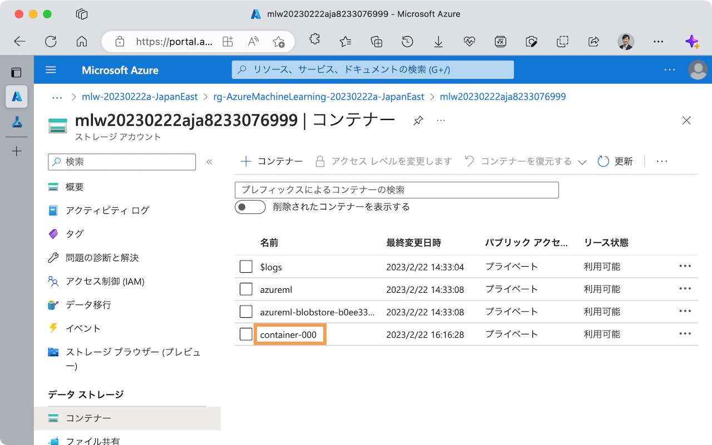

Step 4 (Figure 3.1-4)

Step 5 (Figure 3.1-5)

Step 6 (Figure 3.1-6)

Step 7 (Figure 3.1-7)

Step 8 (Figure 3.1-8)

Step 9 (Figure 3.1-9)
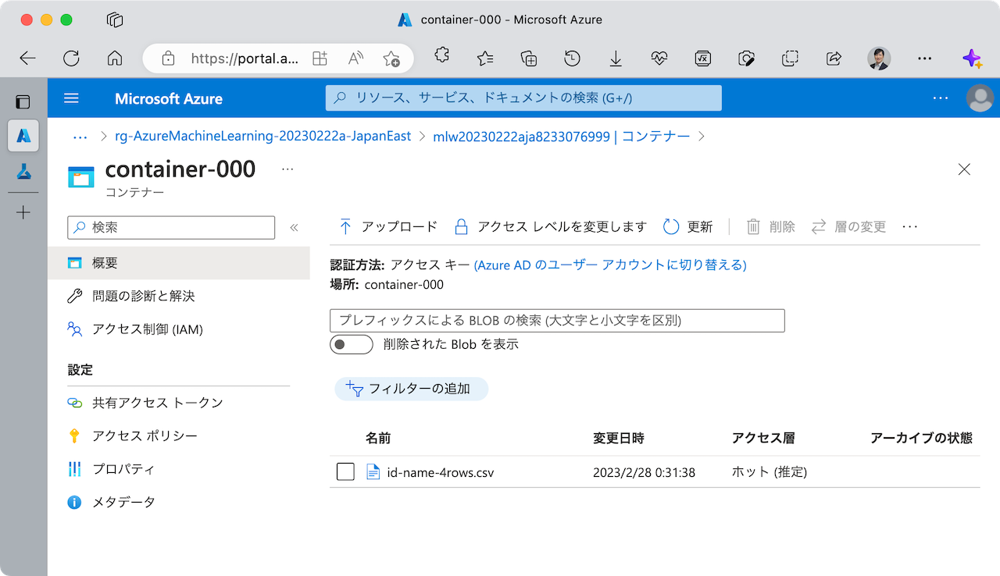

---

## 4. [データ資産ã®ä½œæˆ](https://learn.microsoft.com/ja-jp/azure/machine-learning/how-to-create-data-assets?tabs=cli) (ãƒãƒ³ã‚ºã‚ªãƒ³)

> Azure ML データ資産ã¯ã€Web ブラウザーã®ãƒ–ックãƒãƒ¼ã‚¯ (ãŠæ°—ã«å…¥ã‚Š) ã«ä¼¼ã¦ã„ã¾ã™ã€‚ 最も頻ç¹ã«ä½¿ç”¨ã•ã‚Œã‚‹ãƒ‡ãƒ¼ã‚¿ã‚’指ã™é•·ã„ストレージ パス (URI) を覚ãˆã‚‹ä»£ã‚ã‚Šã«ã€ãƒ‡ãƒ¼ã‚¿è³‡ç”£ã‚’作æˆã—ã€ãƒ•ãƒ¬ãƒ³ãƒ‰ãƒªåを使ã£ã¦ãã®è³‡ç”£ã«ã‚¢ã‚¯ã‚»ã‚¹ã§ãã¾ã™ã€‚

> 対話å‹ã‚»ãƒƒã‚·ãƒ§ãƒ³ (ãƒãƒ¼ãƒˆãƒ–ックãªã©) やジョブã§ãƒ‡ãƒ¼ã‚¿ã«ã‚¢ã‚¯ã‚»ã‚¹ã™ã‚‹ã ã‘ã®å ´åˆã€æœ€åˆã«ãƒ‡ãƒ¼ã‚¿è³‡ç”£ã‚’作æˆã™ã‚‹å¿…è¦ã¯**ã‚ã‚Šã¾ã›ã‚“**。 ストレージ URI を使用ã—ã¦ãƒ‡ãƒ¼ã‚¿ã«ã‚¢ã‚¯ã‚»ã‚¹ã§ãã¾ã™ã€‚

補足: ãŸã¨ãˆã°ã€ **データã®ãƒ©ãƒ™ãƒ«ä»˜ã‘** ã‚’ã™ã‚‹éš›ã«ã€ãƒ‡ãƒ¼ã‚¿è³‡ç”£ãŒä½œæˆã•ã‚Œã¦ã„ã‚‹å¿…è¦ãŒã‚ã‚Šã¾ã™ã€‚ (データã®ãƒ©ãƒ™ãƒ«ä»˜ã‘プロジェクトを作æˆã™ã‚‹ä¸­ã§ãƒ‡ãƒ¼ã‚¿è³‡ç”£ã‚’作æˆã™ã‚‹ã“ã¨ã‚‚ã§ãã¾ã™ã€‚) ã“ã®å ´åˆã€Azure ML v2 ã®ãƒ‡ãƒ¼ã‚¿è³‡ç”£ã«ã¯å¯¾å¿œã—ã¦ãŠã‚‰ãšã€Azure ML v1 ã®ãƒ‡ãƒ¼ã‚¿è³‡ç”£ (データセット) ã®ã¿ã«å¯¾å¿œã—ã¦ã„ã‚‹ã“ã¨ã«ç•™æ„ã—ã¦ãã ã•ã„。

_👋ã“ã®ãƒãƒ£ãƒ—ターã§ã¯ãƒãƒ³ã‚ºã‚ªãƒ³ã‚’è¡Œã„ã¾ã™ã€‚ä¸æ˜ç‚¹ç­‰ã‚ã‚‹å ´åˆã¯è³ªå•ã—ã¦ãã ã•ã„。(ãƒã‚¤ã‚¯ã‚’オンã«ã—ã€ç”»é¢å…±æœ‰ã‚’ã—ã¦ãã ã•ã„。)_

### 4.1. 手順(例)

Step 1 (Figure 4.1-1)

Step 2 (Figure 4.1-2)
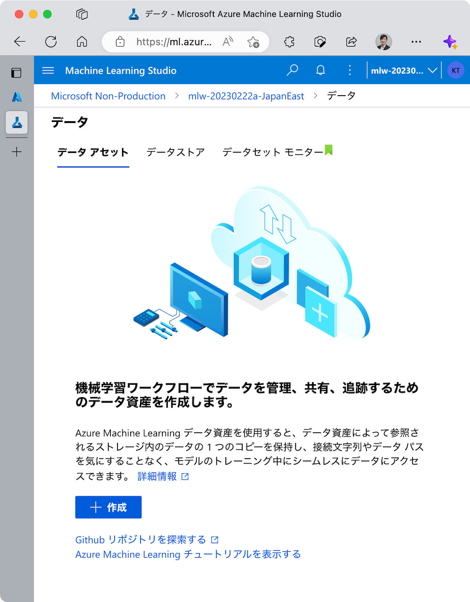

Step 3 (Figure 4.1-3)

Step 4 (Figure 4.1-4)

Step 5 (Figure 4.1-5)
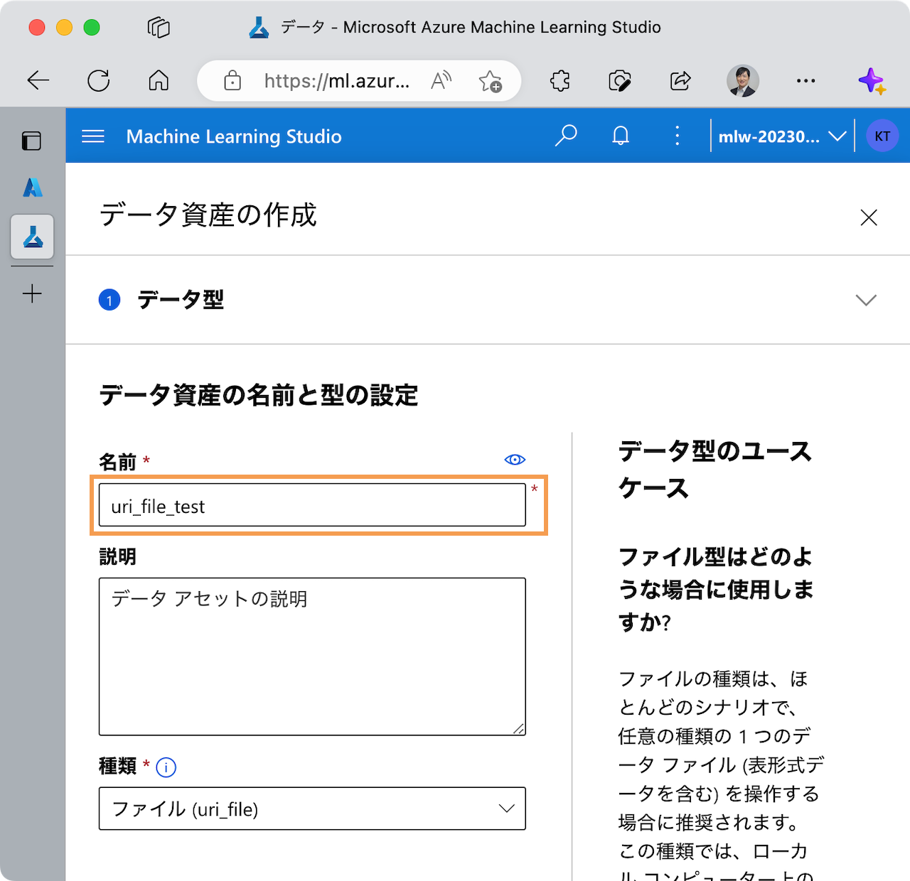

Step 6 (Figure 4.1-6)
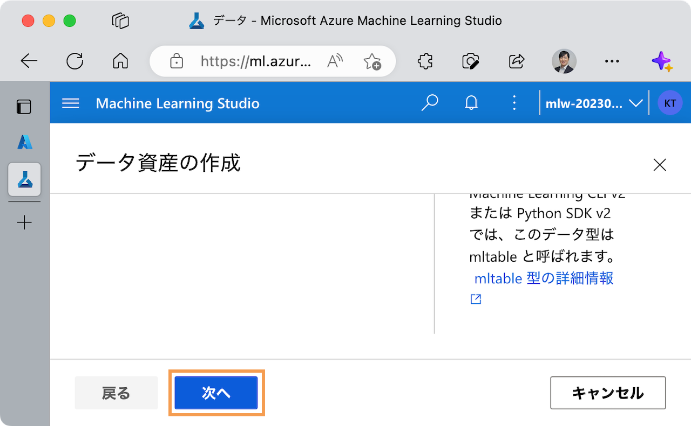

Step 7 (Figure 4.1-7)
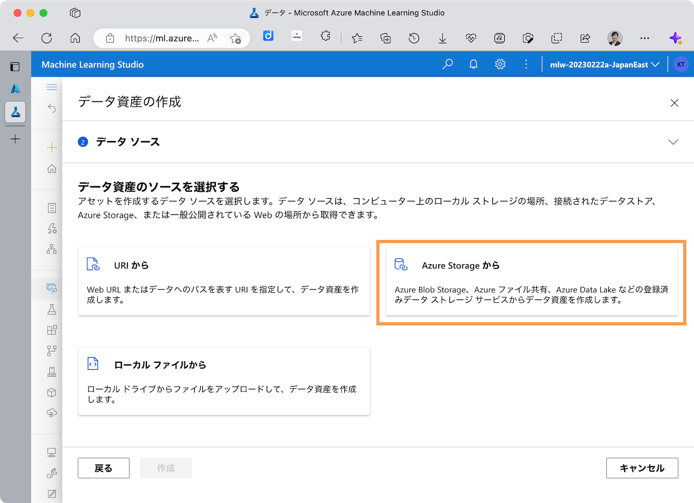

Step 8 (Figure 4.1-8)
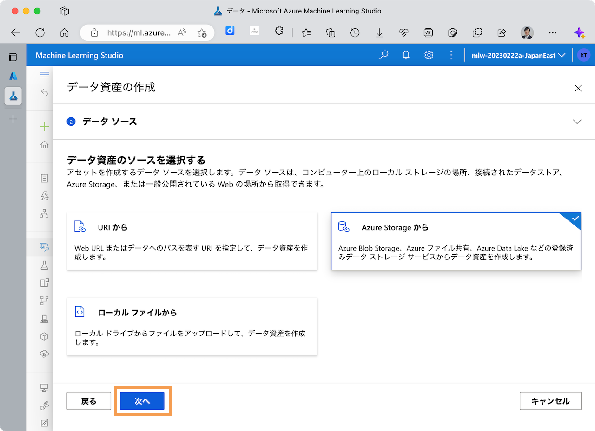

Step 9 (Figure 4.1-9)

Step 10 (Figure 4.1-10)

Step 11 (Figure 4.1-11)
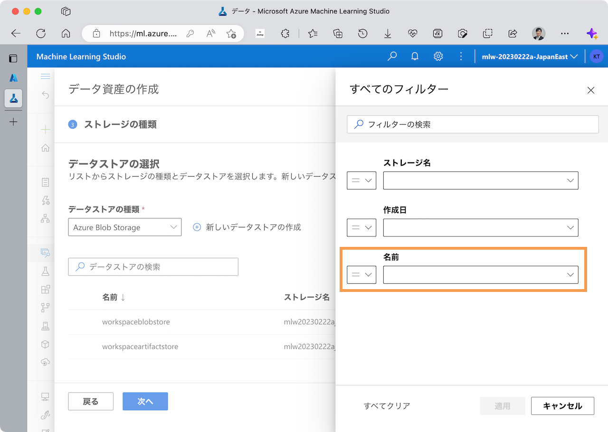

Step 12 (Figure 4.1-12)
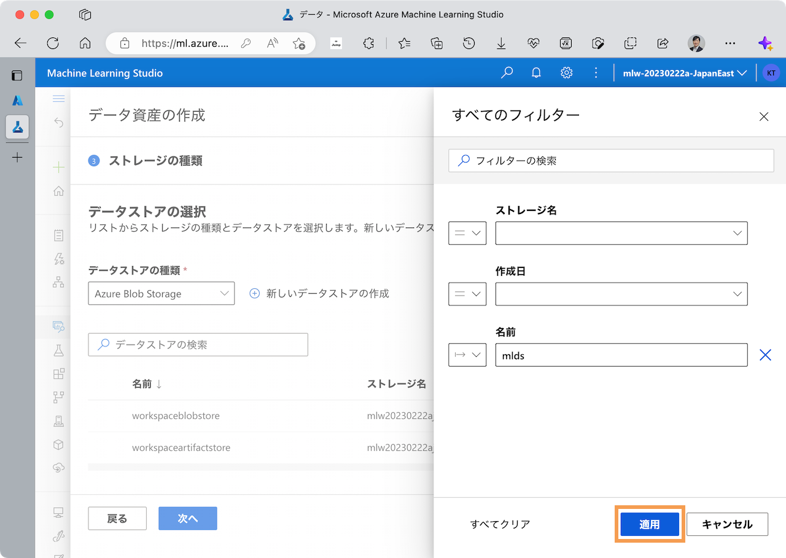

Step 13 (Figure 4.1-13)

Step 14 (Figure 4.1-14)
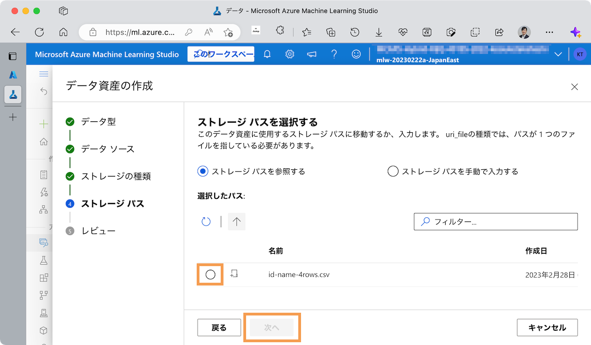

Step 15 (Figure 4.1-15)

Step 16 (Figure 4.1-16)

Step 17 (Figure 4.1-17)

Step 18 (Figure 4.1-18)
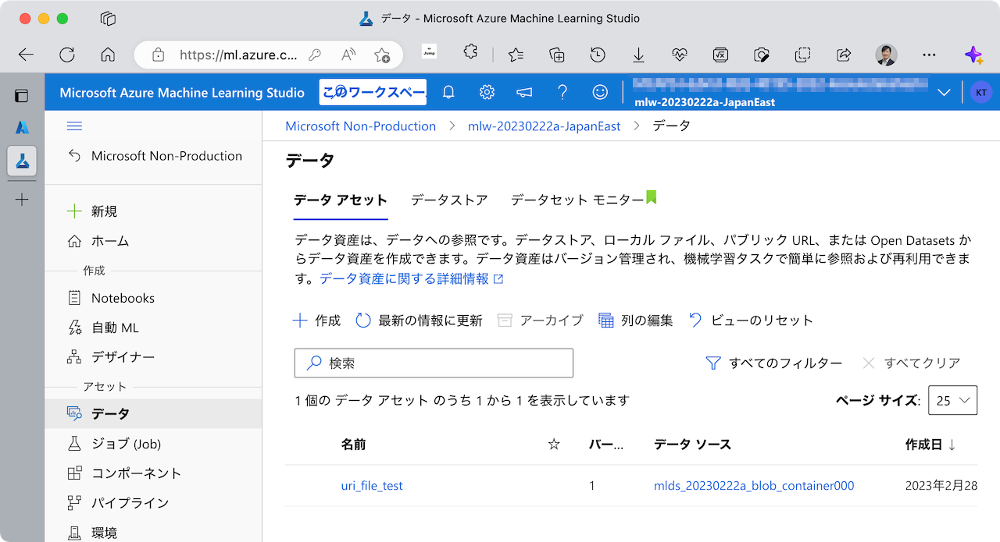

---

## 5. データã¸ã®ãƒ©ãƒ™ãƒ«ä»˜ã‘

### 5.1. [ç”»åƒã®ãƒ©ãƒ™ãƒ«ä»˜ã‘](https://learn.microsoft.com/ja-jp/azure/machine-learning/how-to-create-image-labeling-projects)

> Azure Machine Learning ã®ãƒ‡ãƒ¼ã‚¿ã®ãƒ©ãƒ™ãƒ«ä»˜ã‘ã¯ã€ä»¥ä¸‹ã®ã‚ˆã†ã«ã€ãƒ‡ãƒ¼ã‚¿ã®ãƒ©ãƒ™ãƒ«ä»˜ã‘プロジェクトを作æˆã€ç®¡ç†ã€ç›£è¦–ã™ã‚‹ãƒ„ールã§ã™ã€‚
> 
> * データã€ãƒ©ãƒ™ãƒ«ã€ãƒãƒ¼ãƒ  メンãƒãƒ¼ã‚’調整ã—ã¦ã€ãƒ©ãƒ™ãƒ«ä»˜ã‘タスクを効ç‡çš„ã«ç®¡ç†ã™ã‚‹ã€‚
> * 進行状æ³ã‚’追跡ã—ã€æœªå®Œäº†ã®ãƒ©ãƒ™ãƒ«ä»˜ã‘タスクã®ã‚­ãƒ¥ãƒ¼ã‚’維æŒã™ã‚‹ã€‚
> * プロジェクトを開始ãŠã‚ˆã³åœæ­¢ã—ã€ãƒ©ãƒ™ãƒ«ä»˜ã‘ã®é€²è¡ŒçŠ¶æ³ã‚’制御ã™ã‚‹ã€‚
> * ラベル付ãã®ãƒ‡ãƒ¼ã‚¿ã‚’確èªã—ã€Azure Machine Learning データセットã¨ã—ã¦ã‚¨ã‚¯ã‚¹ãƒãƒ¼ãƒˆã™ã‚‹ã€‚
>
> ç”»åƒãƒ‡ãƒ¼ã‚¿ã«ã¯ã€".jpg"ã€".jpeg"ã€".png"ã€".jpe"ã€".jfif"ã€".bmp"ã€".tif"ã€".tiff"ã€".dcm"ã€".dicom" ã®ã„ãšã‚Œã‹ã®ç¨®é¡ã®ãƒ•ã‚¡ã‚¤ãƒ«ã‚’使用ã§ãã¾ã™ã€‚

> ã“ã®ã‚¿ã‚¹ã‚¯ã‚’補助ã™ã‚‹ãŸã‚ã«ã€æ”¯æ´ä»˜ã機械学習データ ラベル付ã‘ã€ã¤ã¾ã‚Šäººé–“å‚åŠ å‹ (Human in the loop) ã®ãƒ©ãƒ™ãƒ«ä»˜ã‘を使用ã—ã¾ã™ã€‚
> 
> 分é¡ã€ç‰©ä½“検出 (境界ボックス)ã€ã‚¤ãƒ³ã‚¹ã‚¿ãƒ³ã‚¹ã®ã‚»ã‚°ãƒ¡ãƒ³ãƒˆåŒ– (ãƒãƒªã‚´ãƒ³) ã‚’è¡Œã†ãŸã‚ã®ãƒ©ãƒ™ãƒ«ã‚’設定ã—ã¾ã™ã€‚

#### 5.1.1. [ç”»åƒã®ãƒ©ãƒ™ãƒ«ä»˜ã‘プロジェクトã®ä½œæˆ](https://learn.microsoft.com/ja-jp/azure/machine-learning/how-to-create-image-labeling-projects#create-an-image-labeling-project)ステップ

Figure 5.1.1-1
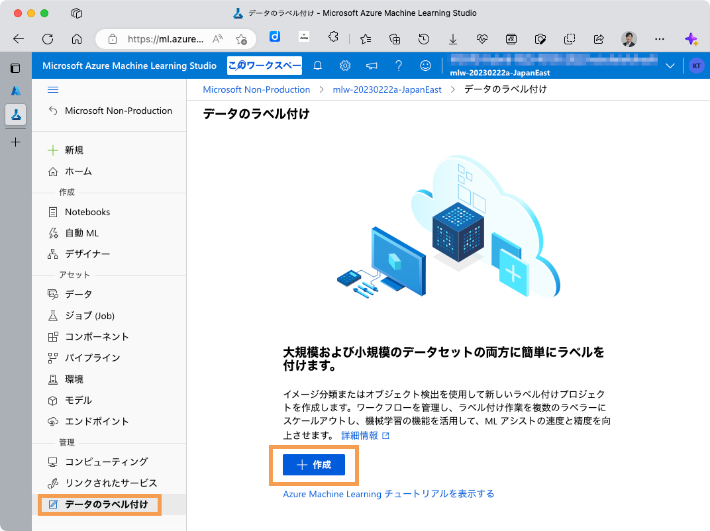

##### 5.1.1.1. [プロジェクトã®ä½œæˆã¨è©³ç´°æƒ…å ±ã®å…¥åŠ›](https://learn.microsoft.com/ja-jp/azure/machine-learning/how-to-create-image-labeling-projects#create-an-image-labeling-project)

Figure 5.1.1.1-1
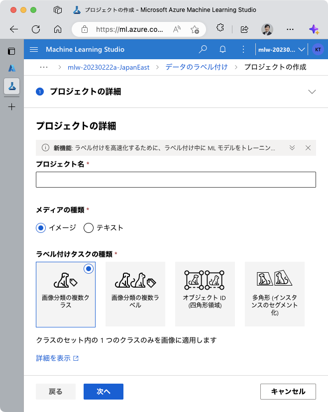

- プロジェクトå
- メディアã®ç¨®é¡
  - イメージ (ã“ã¡ã‚‰ã‚’é¸æŠ)
  - テキスト
- ラベル付ã‘タスクã®ç¨®é¡
  - ç”»åƒåˆ†é¡ã®è¤‡æ•°ã‚¯ãƒ©ã‚¹
    - > クラスã®ã‚»ãƒƒãƒˆå†…ã® 1 ã¤ã®ã‚¯ãƒ©ã‚¹ã®ã¿ã‚’ç”»åƒã«é©ç”¨ã—ã¾ã™
  - ç”»åƒåˆ†é¡ã®è¤‡æ•°ãƒ©ãƒ™ãƒ«
    - > クラスã®ã‚»ãƒƒãƒˆå†…ã® 1 ã¤ã¾ãŸã¯è¤‡æ•°ã®ãƒ©ãƒ™ãƒ«ã‚’ç”»åƒã«é©ç”¨ã—ã¾ã™ã€‚ãŸã¨ãˆã°ã€çŠ¬ã®å†™çœŸã«ã¯ã€çŠ¬ã¨æ˜¼é–“ã®ä¸¡æ–¹ã®ãƒ©ãƒ™ãƒ«ãŒä»˜ã‘られる場åˆãŒã‚ã‚Šã¾ã™ã€‚
  - オブジェクト ID (四角形領域)
    - > ç”»åƒå†…ã®å„オブジェクトã«ã‚¯ãƒ©ã‚¹ã¨å¢ƒç•Œãƒœãƒƒã‚¯ã‚¹ã‚’割り当ã¦ã¾ã™
  - 多角形 (インスタンスã®ã‚»ã‚°ãƒ¡ãƒ³ãƒˆåŒ–)
    - > イメージã«ãƒãƒªã‚´ãƒ³ã‚’æç”»ã—ã€ãã‚Œã«ãƒ©ãƒ™ãƒ« クラスを割り当ã¦ã‚‹

Figure 5.1.1.1-2
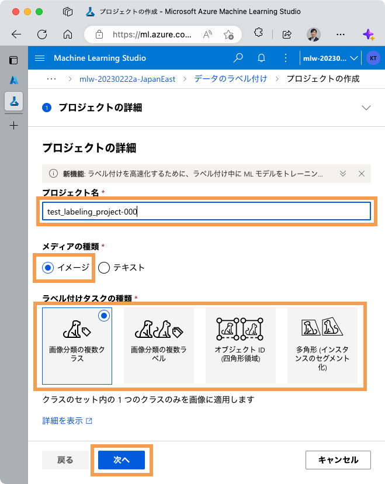

##### 5.1.1.2. (オプション) [従業員ã®è¿½åŠ  (ベンダーã¸ã®ã‚¢ã‚¦ãƒˆã‚½ãƒ¼ã‚·ãƒ³ã‚°)](https://learn.microsoft.com/ja-jp/azure/machine-learning/how-to-create-image-labeling-projects#add-workforce-optional)

- Azure Marketplace ã§ãƒ™ãƒ³ãƒ€ãƒ¼ã®ãƒ©ãƒ™ãƒ«ä»˜ã‘会社を利用ã™ã‚‹ã‹ã©ã†ã‹ã‚’é¸æŠ
- ç¾åœ¨é¸æŠã§ãるベンダー:
  - [iSoftStone Inc](https://www.isoftstoneinc.com/)
  - [Quadrant Resource](https://www.quadrantresource.com/)

Figure 5.1.1.2-1
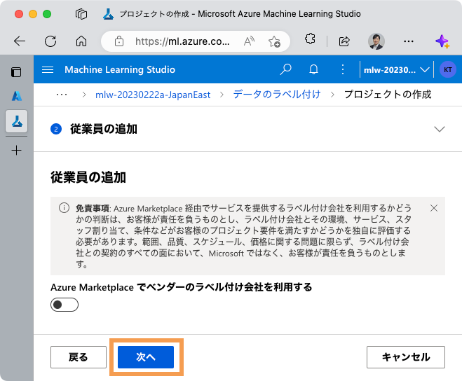

##### 5.1.1.3. [データセットã®é¸æŠã¾ãŸã¯ä½œæˆ](https://learn.microsoft.com/ja-jp/azure/machine-learning/how-to-create-image-labeling-projects#specify-the-data-to-label)

> 注æ„: 1 ã¤ã®ãƒ—ロジェクト㫠50 万個を超ãˆã‚‹ãƒ•ã‚¡ã‚¤ãƒ«ã‚’å«ã‚ã‚‹ã“ã¨ã¯ã§ãã¾ã›ã‚“。 データセットã®ãƒ•ã‚¡ã‚¤ãƒ«æ•°ãŒã“れを超ãˆã‚‹å ´åˆã¯ã€æœ€åˆã® 50 万件ã®ãƒ•ã‚¡ã‚¤ãƒ«ã ã‘ãŒèª­ã¿è¾¼ã¾ã‚Œã¾ã™ã€‚

Figure 5.1.1.3-1

##### 5.1.1.4. (オプション) [増分更新ã®æ§‹æˆ](https://learn.microsoft.com/ja-jp/azure/machine-learning/how-to-create-image-labeling-projects#configure-incremental-refresh)

> ã”使用ã®ãƒ‡ãƒ¼ã‚¿ã‚»ãƒƒãƒˆã§ã¯æ–°ã—ã„データãƒã‚¤ãƒ³ãƒˆãŒå®šæœŸçš„ã«ãƒã‚§ãƒƒã‚¯ã•ã‚Œã¾ã™ã€‚æ–°ã—ã„データãƒã‚¤ãƒ³ãƒˆãŒã‚ã£ãŸå ´åˆã€ãƒ—ロジェクトã®æ–°ã—ã„タスクã¨ã—ã¦è¿½åŠ ã•ã‚Œã¾ã™ã€‚

Figure 5.1.1.4-1
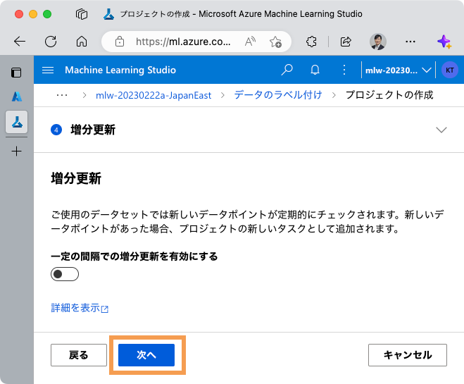

##### 5.1.1.5. [ラベル カテゴリã®è¿½åŠ ](https://learn.microsoft.com/ja-jp/azure/machine-learning/how-to-create-image-labeling-projects#specify-label-classes)

- > å˜ç´”ãªãƒªã‚¹ãƒˆã‚’作æˆã™ã‚‹ã«ã¯ã€[+ ラベル カテゴリã®è¿½åŠ ] ã‚’é¸æŠã—ã¦å„ラベルを作æˆã—ã¾ã™ã€‚
- > ç•°ãªã‚‹ã‚°ãƒ«ãƒ¼ãƒ—ã«ãƒ©ãƒ™ãƒ«ã‚’作æˆã™ã‚‹ã«ã¯ã€[+ ラベル カテゴリã®è¿½åŠ ] ã‚’é¸æŠã—ã¦æœ€ä¸Šä½ãƒ¬ãƒ™ãƒ«ã®ãƒ©ãƒ™ãƒ«ã‚’作æˆã—ã¾ã™ã€‚ 次ã«ã€å„最上ä½ãƒ¬ãƒ™ãƒ«ã®ä¸‹ã«ã‚ã‚‹ + ã‚’é¸æŠã—ã¦ã€ãã®ã‚«ãƒ†ã‚´ãƒªã®æ¬¡ã®ãƒ¬ãƒ™ãƒ«ã®ãƒ©ãƒ™ãƒ«ã‚’作æˆã—ã¾ã™ã€‚ ä»»æ„ã®ã‚°ãƒ«ãƒ¼ãƒ—ã«å¯¾ã—ã¦æœ€å¤§ 6 ã¤ã®ãƒ¬ãƒ™ãƒ«ã‚’作æˆã§ãã¾ã™ã€‚
- ラベルã®ä¸€æ‹¬ç·¨é›†ã‚‚ã§ãã¾ã™ã€‚区切り記å·ã¨ã—㦠コンãƒ, タブ, 改行, コロン, セミコロン ã®ã„ãšã‚Œã‹ã‚’指定ã—ã¾ã™ã€‚

Figure 5.1.1.5-1

Figure 5.1.1.5-2

##### 5.1.1.6. (オプション) [ラベル付ã‘ã®æ‰‹é †ã®èª¬æ˜](https://learn.microsoft.com/ja-jp/azure/machine-learning/how-to-create-image-labeling-projects#describe-the-image-labeling-task)

> 手順ã¯ã€äººé–“ã®ãƒ©ãƒ™ãƒ©ãƒ¼ãŒã‚¿ã‚¹ã‚¯ã‚’ç†è§£ã—よã†ã¨ã™ã‚‹ã¨ãã«ä½¿ç”¨ã•ã‚Œã¾ã™ã€‚ラベルã®æ˜ç¢ºãªå®šç¾©ã¨ã‚µãƒ³ãƒ—ルを指定ã™ã‚‹ã¨ã€æœ€é©ãªçµæœãŒå¾—られã¾ã™ã€‚

Figure 5.1.1.6-1

##### 5.1.1.7. (オプション) [ラベル付ã‘ã®å“è³ªç®¡ç† (プレビュー)](https://learn.microsoft.com/ja-jp/azure/machine-learning/how-to-create-image-labeling-projects#quality-control-preview)

- 複数ã®ãƒ©ãƒ™ãƒ©ãƒ¼ã®åˆæ„ã«ã‚ˆã‚‹ãƒ©ãƒ™ãƒ«ä»˜ã‘。
- > 最å°ãƒ©ãƒ™ãƒ©ãƒ¼: ãã®ã‚¢ã‚»ãƒƒãƒˆã®ãƒ©ãƒ™ãƒ«ä»˜ã‘ã‚’ã—ãŸã€ãƒ©ãƒ™ãƒ«ä»˜ã‘担当者 (Labelers) ã®æœ€å°‘人数ã¯åˆæ„ã•ã‚Œã¦ã„ã‚‹ã‚‚ã®ã¨è€ƒãˆã‚‰ã‚Œã¦ã„ã¾ã™ã€‚1〜50 人。
- > 最大ラベラー: 個別ã®è³‡ç”£ã«ãƒ©ãƒ™ãƒ«ã‚’付ã‘ã‚‹ã“ã¨ãŒã§ãるラベラーã®æœ€å¤§æ•°ã€‚1〜50 人。
- > é …ç›®ãŒãƒ©ãƒ™ãƒ©ãƒ¼ã®æœ€å¤§æ•°ã«é€ã‚‰ã‚Œã¦ã‚‚åˆæ„ã«é”ã—ãªã„å ´åˆã€ãã®çŠ¶æ…‹ã¯ `Needs Review` ã«ãªã‚Šã€ãƒ—ロジェクト所有者ãŒé …ç›®ã®ãƒ©ãƒ™ãƒ«ä»˜ã‘ã®è²¬ä»»ã‚’æŒã¤ã“ã¨ã«ãªã‚Šã¾ã™ã€‚
- > 注æ„: インスタンスã®ã‚»ã‚°ãƒ¡ãƒ³ãƒˆåŒ–プロジェクトã§ã¯ã€åˆæ„ラベル付ã‘を使用ã§ãã¾ã›ã‚“。
- > プロジェクトã®é–‹å§‹å¾Œã«ã“れらã®è¨­å®šã‚’変更ã™ã‚‹ã“ã¨ã¯ã§ãã¾ã›ã‚“。

Figure 5.1.1.7-1
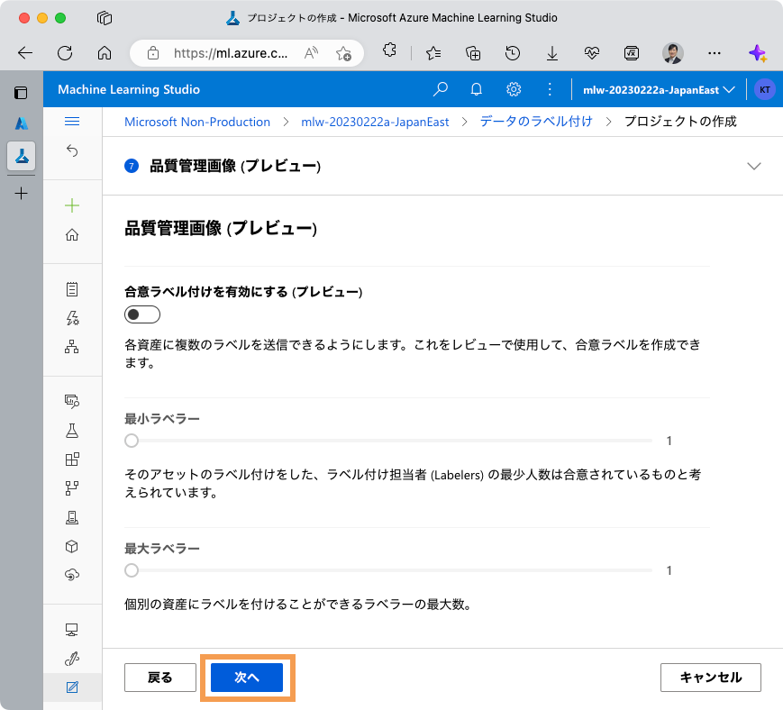

##### 5.1.1.8. (オプション) [ML ã«ã‚ˆã‚‹ãƒ©ãƒ™ãƒ«ä»˜ã‘](https://learn.microsoft.com/ja-jp/azure/machine-learning/how-to-create-image-labeling-projects#use-ml-assisted-data-labeling)

- > ラベラーãŒãƒ¬ãƒ“ューã™ã‚‹ãŸã‚ã«ã€ãƒ©ãƒ™ãƒ«ä»˜ã‘å‰ã®ãƒ‡ãƒ¼ã‚¿ã«å¯¾ã—ã¦ãƒ¢ãƒ‡ãƒ«ã‚’トレーニングã™ã‚‹ ML Assist ã«ã‚ˆã‚‹ãƒ©ãƒ™ãƒ«ä»˜ã‘を有効ã«ã™ã‚‹ã“ã¨ã«ã‚ˆã‚Šã€ãƒ©ãƒ™ãƒ«ä»˜ã‘プロジェクトを高速化ã—ã¾ã™ã€‚
- > 支æ´ä»˜ã機械学習ラベル付ã‘ã¯ã€2 ã¤ã®ãƒ•ã‚§ãƒ¼ã‚ºã§æ§‹æˆã•ã‚Œã¾ã™ã€‚
  > - [クラスタリング](https://learn.microsoft.com/ja-jp/azure/machine-learning/how-to-create-image-labeling-projects#clustering)
  > - [事å‰ãƒ©ãƒ™ãƒ«ä»˜ã‘](https://learn.microsoft.com/ja-jp/azure/machine-learning/how-to-create-image-labeling-projects#prelabeling)
- コンピューティング先: 既定ã®ä½¿ç”¨ ã¾ãŸã¯ カスタãƒã‚¤ã‚º
  - > 既定ã®ä½¿ç”¨: ã“ã®ã‚ªãƒ—ションã§ã¯ã€æ—¢å®šã®ãƒ©ãƒ™ãƒ«ä»˜ã‘コンピューティング クラスターãŒæ—¢ã«å­˜åœ¨ã™ã‚‹å ´åˆã¯ãã‚ŒãŒä½¿ç”¨ã•ã‚Œã€ãれ以外ã®å ´åˆã¯ã€æ”¯æ´æ”¯æ´ä»˜ã機械学習ラベル付ã‘を使用ã™ã‚‹ãŸã‚ã«ã€æ—¢å®šã®ã‚³ãƒ³ãƒ”ューティング クラスターãŒä½œæˆã•ã‚Œã¾ã™ã€‚[カスタãƒã‚¤ã‚º] オプションをé¸æŠã—ã¦ã€ã‚«ã‚¹ã‚¿ãƒ  コンピューティング クラスターをé¸æŠã¾ãŸã¯ä½œæˆã™ã‚‹ã“ã¨ã‚‚ã§ãã¾ã™ã€‚
  - > カスタãƒã‚¤ã‚º: GPU コンピューティング クラスターã®é¸æŠ ã¾ãŸã¯ 作æˆ

Figure 5.1.1.8-1

Figure 5.1.1.8-2
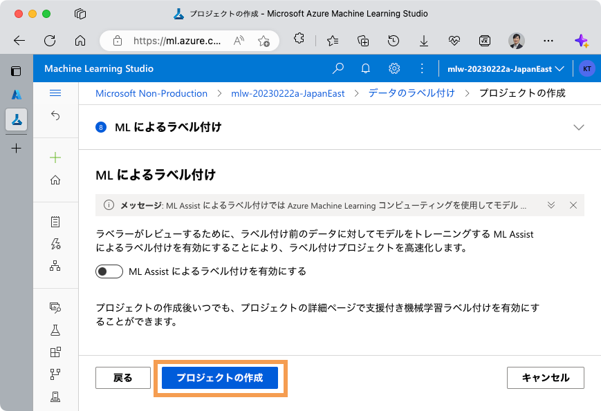

Figure 5.1.1.8-3

> 支æ´ä»˜ã機械学習ラベル付ã‘ã¯ã€ã„ãã¤ã‹ã®é …ç›®ãŒãƒ©ãƒ™ãƒ«ä»˜ã‘ã•ã‚ŒãŸå¾Œã€è‡ªå‹•çš„ã«é–‹å§‹ã—ã¾ã™ã€‚ ã“ã®è‡ªå‹•ã—ãã„値ã¯ã€ãƒ—ロジェクトã«ã‚ˆã£ã¦ç•°ãªã‚Šã¾ã™ã€‚ ãŸã ã—ã€ãƒ©ãƒ™ãƒ«ä»˜ã‘ã•ã‚ŒãŸãƒ‡ãƒ¼ã‚¿ãŒãƒ—ロジェクトã«å«ã¾ã‚Œã¦ã„ã‚Œã°ã€æ”¯æ´ä»˜ã機械学習トレーニングã®å®Ÿè¡Œã‚’手動ã§é–‹å§‹ã§ãã¾ã™ã€‚

### 5.2. [テキストã®ãƒ©ãƒ™ãƒ«ä»˜ã‘](https://learn.microsoft.com/ja-jp/azure/machine-learning/how-to-create-text-labeling-projects)

#### 5.2.1. テキストã®ãƒ©ãƒ™ãƒ«ä»˜ã‘プロジェクトã®ä½œæˆã‚¹ãƒ†ãƒƒãƒ—

Figure 5.2.1-1
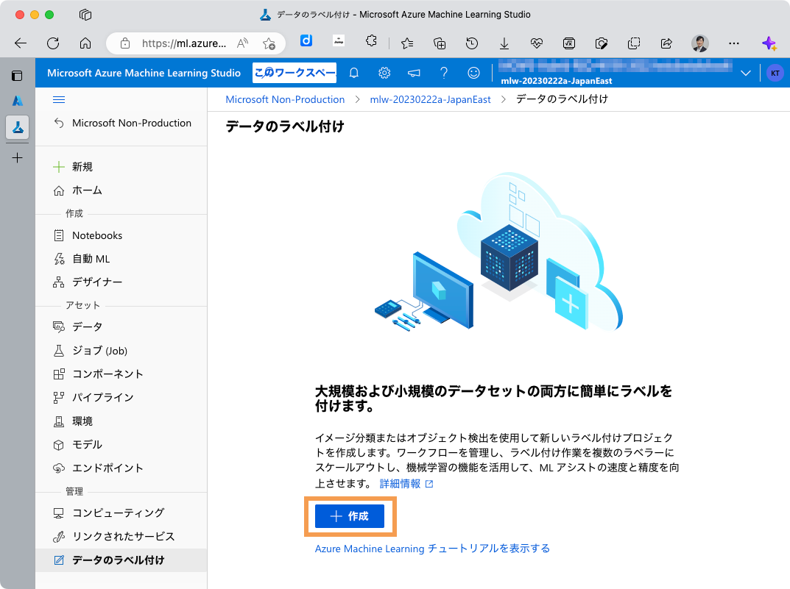

##### 5.2.1.1. [プロジェクトã®ä½œæˆã¨è©³ç´°æƒ…å ±ã®å…¥åŠ›](https://learn.microsoft.com/ja-jp/azure/machine-learning/how-to-create-text-labeling-projects#create-a-text-labeling-project)

- プロジェクトå
- メディアã®ç¨®é¡
  - イメージ
  - テキスト (ã“ã¡ã‚‰ã‚’é¸æŠ)
- ラベル付ã‘タスクã®ç¨®é¡
  - テキスト分é¡ãƒãƒ«ãƒã‚¯ãƒ©ã‚¹
    - > クラスã®ã‚»ãƒƒãƒˆå†…ã® 1 ã¤ã®ãƒ©ãƒ™ãƒ«ã®ã¿ã‚’テキストã«é©ç”¨ã—ã¾ã™
  - テキスト分é¡ã®è¤‡æ•°ãƒ©ãƒ™ãƒ«
    - > 一連ã®ã‚¯ãƒ©ã‚¹ã® 1 ã¤ã¾ãŸã¯è¤‡æ•°ã®ãƒ©ãƒ™ãƒ«ã‚’テキストã«é©ç”¨ã—ã¾ã™
  - テキスト固有表ç¾èªè­˜
    - > テキスト㫠1 ã¤ä»¥ä¸Šã®ã‚¨ãƒ³ãƒ†ã‚£ãƒ†ã‚£ã§æ³¨é‡ˆã‚’付ã‘ã¾ã™

Figure 5.2.1.1-1

##### 5.2.1.2. (オプション) [従業員ã®è¿½åŠ  (ベンダーã¸ã®ã‚¢ã‚¦ãƒˆã‚½ãƒ¼ã‚·ãƒ³ã‚°)](https://learn.microsoft.com/ja-jp/azure/machine-learning/how-to-create-text-labeling-projects#add-workforce-optional)

- Azure Marketplace ã§ãƒ™ãƒ³ãƒ€ãƒ¼ã®ãƒ©ãƒ™ãƒ«ä»˜ã‘会社を利用ã™ã‚‹ã‹ã©ã†ã‹ã‚’é¸æŠ
- ç¾åœ¨é¸æŠã§ãるベンダー:
  - [iSoftStone Inc](https://www.isoftstoneinc.com/)
  - [Quadrant Resource](https://www.quadrantresource.com/)

Figure 5.2.1.2-1

##### 5.2.1.3. [データセットã®é¸æŠã¾ãŸã¯ä½œæˆ](https://learn.microsoft.com/ja-jp/azure/machine-learning/how-to-create-text-labeling-projects#select-or-create-a-dataset)

> 注æ„: 1 ã¤ã®ãƒ—ロジェクト㫠50 万個を超ãˆã‚‹ãƒ•ã‚¡ã‚¤ãƒ«ã‚’å«ã‚ã‚‹ã“ã¨ã¯ã§ãã¾ã›ã‚“。 データセットã®ãƒ•ã‚¡ã‚¤ãƒ«æ•°ãŒã“れを超ãˆã‚‹å ´åˆã¯ã€æœ€åˆã® 50 万件ã®ãƒ•ã‚¡ã‚¤ãƒ«ã ã‘ãŒèª­ã¿è¾¼ã¾ã‚Œã¾ã™ã€‚

Figure 5.2.1.3-1
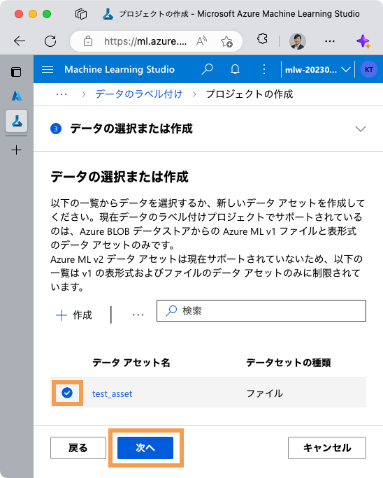

##### 5.2.1.4. (オプション) [増分更新ã®æ§‹æˆ](https://learn.microsoft.com/ja-jp/azure/machine-learning/how-to-create-text-labeling-projects#configure-incremental-refresh)

> ã”使用ã®ãƒ‡ãƒ¼ã‚¿ã‚»ãƒƒãƒˆã§ã¯æ–°ã—ã„データãƒã‚¤ãƒ³ãƒˆãŒå®šæœŸçš„ã«ãƒã‚§ãƒƒã‚¯ã•ã‚Œã¾ã™ã€‚æ–°ã—ã„データãƒã‚¤ãƒ³ãƒˆãŒã‚ã£ãŸå ´åˆã€ãƒ—ロジェクトã®æ–°ã—ã„タスクã¨ã—ã¦è¿½åŠ ã•ã‚Œã¾ã™ã€‚

Figure 5.2.1.4-1

##### 5.2.1.5. [ラベル カテゴリã®è¿½åŠ ](https://learn.microsoft.com/ja-jp/azure/machine-learning/how-to-create-text-labeling-projects#specify-label-categories)

- > å˜ç´”ãªãƒªã‚¹ãƒˆã‚’作æˆã™ã‚‹ã«ã¯ã€[+ ラベル カテゴリã®è¿½åŠ ] ã‚’é¸æŠã—ã¦å„ラベルを作æˆã—ã¾ã™ã€‚
- > ç•°ãªã‚‹ã‚°ãƒ«ãƒ¼ãƒ—ã«ãƒ©ãƒ™ãƒ«ã‚’作æˆã™ã‚‹ã«ã¯ã€[+ ラベル カテゴリã®è¿½åŠ ] ã‚’é¸æŠã—ã¦æœ€ä¸Šä½ãƒ¬ãƒ™ãƒ«ã®ãƒ©ãƒ™ãƒ«ã‚’作æˆã—ã¾ã™ã€‚ 次ã«ã€å„最上ä½ãƒ¬ãƒ™ãƒ«ã®ä¸‹ã«ã‚ã‚‹ + ã‚’é¸æŠã—ã¦ã€ãã®ã‚«ãƒ†ã‚´ãƒªã®æ¬¡ã®ãƒ¬ãƒ™ãƒ«ã®ãƒ©ãƒ™ãƒ«ã‚’作æˆã—ã¾ã™ã€‚ ä»»æ„ã®ã‚°ãƒ«ãƒ¼ãƒ—ã«å¯¾ã—ã¦æœ€å¤§ 6 ã¤ã®ãƒ¬ãƒ™ãƒ«ã‚’作æˆã§ãã¾ã™ã€‚
- ラベルã®ä¸€æ‹¬ç·¨é›†ã‚‚ã§ãã¾ã™ã€‚区切り記å·ã¨ã—㦠コンãƒ, タブ, 改行, コロン, セミコロン ã®ã„ãšã‚Œã‹ã‚’指定ã—ã¾ã™ã€‚

Figure 5.2.1.5-1

Figure 5.2.1.5-2
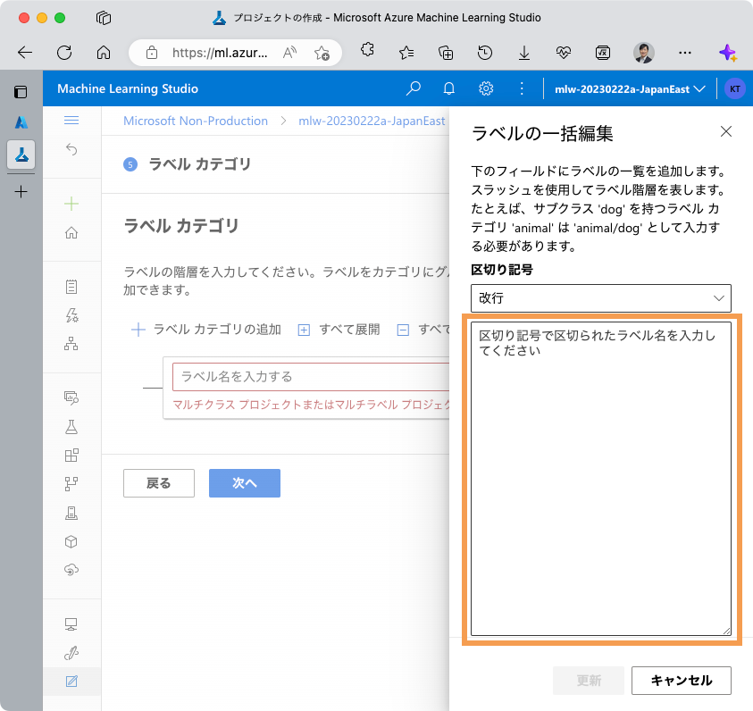

Figure 5.2.1.5-3
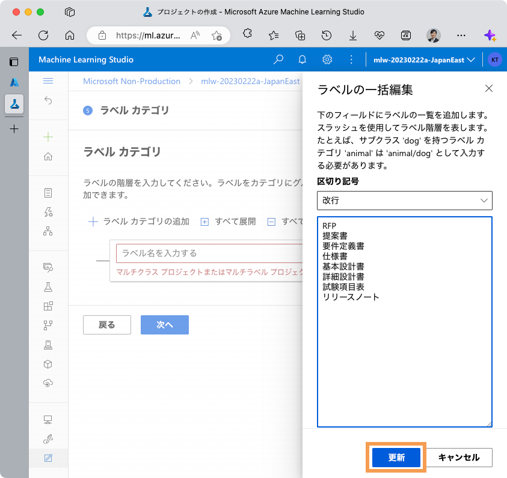

Figure 5.2.1.5-4
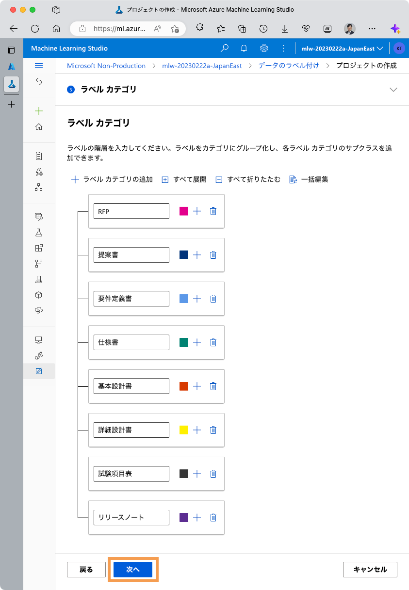

##### 5.2.1.6. (オプション) [ラベル付ã‘ã®æ‰‹é †ã®èª¬æ˜](https://learn.microsoft.com/ja-jp/azure/machine-learning/how-to-create-text-labeling-projects#describe-the-text-labeling-task)

> 手順ã¯ã€äººé–“ã®ãƒ©ãƒ™ãƒ©ãƒ¼ãŒã‚¿ã‚¹ã‚¯ã‚’ç†è§£ã—よã†ã¨ã™ã‚‹ã¨ãã«ä½¿ç”¨ã•ã‚Œã¾ã™ã€‚ラベルã®æ˜ç¢ºãªå®šç¾©ã¨ã‚µãƒ³ãƒ—ルを指定ã™ã‚‹ã¨ã€æœ€é©ãªçµæœãŒå¾—られã¾ã™ã€‚

Figure 5.2.1.6-1
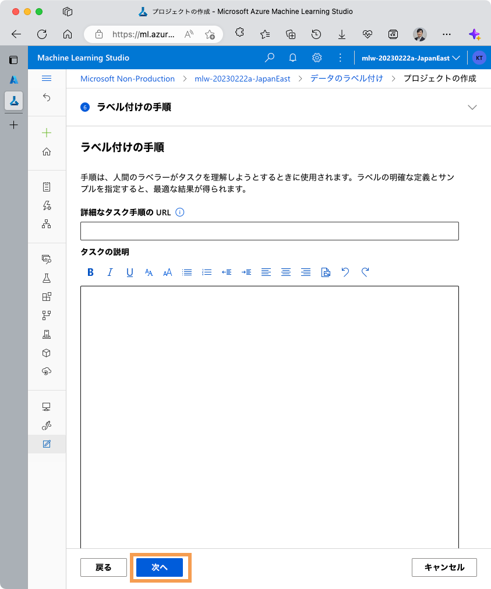

##### 5.2.1.7. (オプション) [ラベル付ã‘ã®å“è³ªç®¡ç† (プレビュー)](https://learn.microsoft.com/ja-jp/azure/machine-learning/how-to-create-text-labeling-projects#quality-control-preview)

- 複数ã®ãƒ©ãƒ™ãƒ©ãƒ¼ã®åˆæ„ã«ã‚ˆã‚‹ãƒ©ãƒ™ãƒ«ä»˜ã‘。
- > 最å°ãƒ©ãƒ™ãƒ©ãƒ¼: ãã®ã‚¢ã‚»ãƒƒãƒˆã®ãƒ©ãƒ™ãƒ«ä»˜ã‘ã‚’ã—ãŸã€ãƒ©ãƒ™ãƒ«ä»˜ã‘担当者 (Labelers) ã®æœ€å°‘人数ã¯åˆæ„ã•ã‚Œã¦ã„ã‚‹ã‚‚ã®ã¨è€ƒãˆã‚‰ã‚Œã¦ã„ã¾ã™ã€‚1〜50 人。
- > 最大ラベラー: 個別ã®è³‡ç”£ã«ãƒ©ãƒ™ãƒ«ã‚’付ã‘ã‚‹ã“ã¨ãŒã§ãるラベラーã®æœ€å¤§æ•°ã€‚1〜50 人。
- > é …ç›®ãŒãƒ©ãƒ™ãƒ©ãƒ¼ã®æœ€å¤§æ•°ã«é€ã‚‰ã‚Œã¦ã‚‚åˆæ„ã«é”ã—ãªã„å ´åˆã€ãã®çŠ¶æ…‹ã¯ `Needs Review` ã«ãªã‚Šã€ãƒ—ロジェクト所有者ãŒé …ç›®ã®ãƒ©ãƒ™ãƒ«ä»˜ã‘ã®è²¬ä»»ã‚’æŒã¤ã“ã¨ã«ãªã‚Šã¾ã™ã€‚
- > 注æ„: インスタンスã®ã‚»ã‚°ãƒ¡ãƒ³ãƒˆåŒ–プロジェクトã§ã¯ã€åˆæ„ラベル付ã‘を使用ã§ãã¾ã›ã‚“。
- > プロジェクトã®é–‹å§‹å¾Œã«ã“れらã®è¨­å®šã‚’変更ã™ã‚‹ã“ã¨ã¯ã§ãã¾ã›ã‚“。

Figure 5.2.1.7-1

##### 5.2.1.8. (オプション) [ML ã«ã‚ˆã‚‹ãƒ©ãƒ™ãƒ«ä»˜ã‘](https://learn.microsoft.com/ja-jp/azure/machine-learning/how-to-create-text-labeling-projects#use-ml-assisted-data-labeling)

- > ラベラーãŒãƒ¬ãƒ“ューã™ã‚‹ãŸã‚ã«ã€ãƒ©ãƒ™ãƒ«ä»˜ã‘å‰ã®ãƒ‡ãƒ¼ã‚¿ã«å¯¾ã—ã¦ãƒ¢ãƒ‡ãƒ«ã‚’トレーニングã™ã‚‹ ML Assist ã«ã‚ˆã‚‹ãƒ©ãƒ™ãƒ«ä»˜ã‘を有効ã«ã™ã‚‹ã“ã¨ã«ã‚ˆã‚Šã€ãƒ©ãƒ™ãƒ«ä»˜ã‘プロジェクトを高速化ã—ã¾ã™ã€‚
- 支æ´ä»˜ã機械学習ラベル付ã‘ã¯ã€(ç”»åƒã®ãƒ©ãƒ™ãƒ«ä»˜ã‘ã¨ç•°ãªã‚Š) å˜ä¸€ã®ãƒ•ã‚§ãƒ¼ã‚ºã§æ§‹æˆã•ã‚Œã¾ã™ã€‚
  > - [事å‰ãƒ©ãƒ™ãƒ«ä»˜ã‘](https://learn.microsoft.com/ja-jp/azure/machine-learning/how-to-create-text-labeling-projects#pre-labeling)
- コンピューティング先: 既定ã®ä½¿ç”¨ ã¾ãŸã¯ カスタãƒã‚¤ã‚º
  - > 既定ã®ä½¿ç”¨: ã“ã®ã‚ªãƒ—ションã§ã¯ã€æ—¢å®šã®ãƒ©ãƒ™ãƒ«ä»˜ã‘コンピューティング クラスターãŒæ—¢ã«å­˜åœ¨ã™ã‚‹å ´åˆã¯ãã‚ŒãŒä½¿ç”¨ã•ã‚Œã€ãれ以外ã®å ´åˆã¯ã€æ”¯æ´æ”¯æ´ä»˜ã機械学習ラベル付ã‘を使用ã™ã‚‹ãŸã‚ã«ã€æ—¢å®šã®ã‚³ãƒ³ãƒ”ューティング クラスターãŒä½œæˆã•ã‚Œã¾ã™ã€‚[カスタãƒã‚¤ã‚º] オプションをé¸æŠã—ã¦ã€ã‚«ã‚¹ã‚¿ãƒ  コンピューティング クラスターをé¸æŠã¾ãŸã¯ä½œæˆã™ã‚‹ã“ã¨ã‚‚ã§ãã¾ã™ã€‚
  - > カスタãƒã‚¤ã‚º: GPU コンピューティング クラスターã®é¸æŠ ã¾ãŸã¯ 作æˆ

Figure 5.2.1.8-1

Figure 5.2.1.8-2
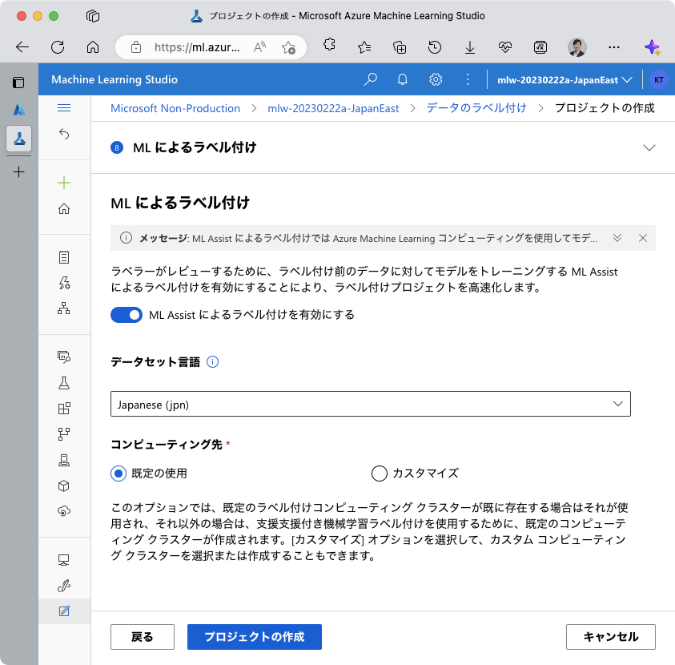

Figure 5.2.1.8-3

Figure 5.2.1.8-4

> 支æ´ä»˜ã機械学習ラベル付ã‘ã¯ã€ã„ãã¤ã‹ã®é …ç›®ãŒãƒ©ãƒ™ãƒ«ä»˜ã‘ã•ã‚ŒãŸå¾Œã€è‡ªå‹•çš„ã«é–‹å§‹ã—ã¾ã™ã€‚ ã“ã®è‡ªå‹•ã—ãã„値ã¯ã€ãƒ—ロジェクトã«ã‚ˆã£ã¦ç•°ãªã‚Šã¾ã™ã€‚ ãŸã ã—ã€ãƒ©ãƒ™ãƒ«ä»˜ã‘ã•ã‚ŒãŸãƒ‡ãƒ¼ã‚¿ãŒãƒ—ロジェクトã«å«ã¾ã‚Œã¦ã„ã‚Œã°ã€æ”¯æ´ä»˜ã機械学習トレーニングã®å®Ÿè¡Œã‚’手動ã§é–‹å§‹ã§ãã¾ã™ã€‚

### 5.3. ラベル付ã‘プロジェクトã®å®Ÿè¡Œã¨ç›£è¦–

基本的㫠[ç”»åƒã®ãƒ©ãƒ™ãƒ«ä»˜ã‘プロジェクト](https://learn.microsoft.com/ja-jp/azure/machine-learning/how-to-create-image-labeling-projects#run-and-monitor-the-project) 㨠[テキストã®ãƒ©ãƒ™ãƒ«ä»˜ã‘プロジェクト](https://learn.microsoft.com/ja-jp/azure/machine-learning/how-to-create-text-labeling-projects#run-and-monitor-the-project) ã¨ã§å…±é€šã§ã™ã€‚

#### 5.3.1. ダッシュボードã§ã®é€²è¡ŒçŠ¶æ³ã®è¡¨ç¤º

[ç”»åƒã®ãƒ©ãƒ™ãƒ«ä»˜ã‘プロジェクト](https://learn.microsoft.com/ja-jp/azure/machine-learning/how-to-create-image-labeling-projects#dashboard)

Figure 5.3.1-1
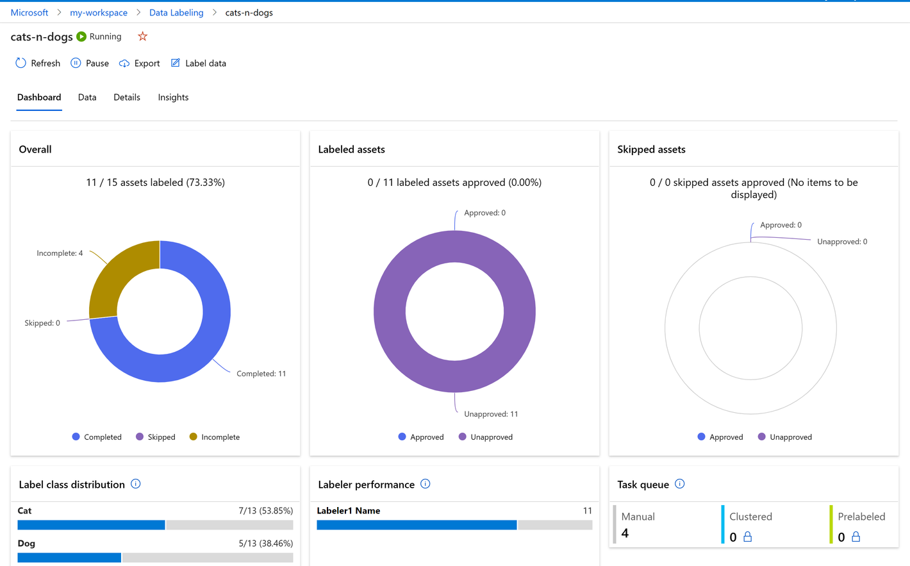

[テキストã®ãƒ©ãƒ™ãƒ«ä»˜ã‘プロジェクト](https://learn.microsoft.com/ja-jp/azure/machine-learning/how-to-create-text-labeling-projects#dashboard)

Figure 5.3.1-2

> 進行状æ³ã‚°ãƒ©ãƒ•ã«ã¯ã€ãƒ©ãƒ™ãƒ«ä»˜ã‘ã•ã‚ŒãŸé …ç›®ã€ã‚¹ã‚­ãƒƒãƒ—ã•ã‚ŒãŸé …ç›®ã€ãƒ¬ãƒ“ューãŒå¿…è¦ãªé …ç›®ã€ã¾ãŸã¯ã¾ã ãã‚ŒãŒè¡Œã‚ã‚Œã¦ã„ãªã„é …ç›®ã®æ•°ãŒè¡¨ç¤ºã•ã‚Œã¾ã™ã€‚

> グラフã®ä¸‹ã«ã€å®Œäº†ã—ãŸã‚¿ã‚¹ã‚¯ã®ãƒ©ãƒ™ãƒ«ã®åˆ†å¸ƒãŒè¡¨ç¤ºã•ã‚Œã¾ã™ã€‚ プロジェクトã®ç¨®é¡ã«ã‚ˆã£ã¦ã¯ã€1 ã¤ã®é …ç›®ã«è¤‡æ•°ã®ãƒ©ãƒ™ãƒ«ã‚’付ã‘ã‚‹ã“ã¨ãŒã§ãã¾ã™ã€‚ ã—ãŸãŒã£ã¦ã€ãƒ©ãƒ™ãƒ«ã®åˆè¨ˆæ•°ãŒé …ç›®ã®åˆè¨ˆæ•°ã‚’超ãˆã‚‹å ´åˆãŒã‚ã‚Šã¾ã™ã€‚
> 
> ã¾ãŸã€ãƒ©ãƒ™ãƒ©ãƒ¼ã®åˆ†å¸ƒã¨ã€ãƒ©ãƒ™ãƒ«ä»˜ã‘ã—ãŸé …ç›®ã®æ•°ã‚‚表示ã•ã‚Œã¾ã™ã€‚

> ML ã«ã‚ˆã‚‹ãƒ©ãƒ™ãƒ«ä»˜ã‘を有効ã«ã—ãŸå ´åˆã¯ã€ä¸‹ã«ã‚¹ã‚¯ãƒ­ãƒ¼ãƒ«ã—ã¦ã€ML ã«ã‚ˆã‚‹ãƒ©ãƒ™ãƒ«ä»˜ã‘ã®çŠ¶æ…‹ã‚’確èªã™ã‚‹ã“ã¨ãŒã§ãã¾ã™ã€‚

#### 5.3.2. ラベル付ã‘ã•ã‚ŒãŸãƒ‡ãƒ¼ã‚¿ã¨åˆæ„ラベルã®ç¢ºèª

> [データ] タブã§ã¯ã€ãƒ‡ãƒ¼ã‚¿ã‚»ãƒƒãƒˆã‚’表示ã—ã¦ã€ãƒ©ãƒ™ãƒ«ä»˜ã‘ã•ã‚ŒãŸãƒ‡ãƒ¼ã‚¿ã‚’確èªã§ãã¾ã™ã€‚ ラベルを表示ã™ã‚‹ã«ã¯ã€ãƒ©ãƒ™ãƒ«ä»˜ã‘ã•ã‚ŒãŸãƒ‡ãƒ¼ã‚¿ã‚’スクロールã—ã¾ã™ã€‚ é–“é•ã£ã¦ãƒ©ãƒ™ãƒ«ä»˜ã‘ã•ã‚ŒãŸãƒ‡ãƒ¼ã‚¿ãŒè¡¨ç¤ºã•ã‚ŒãŸå ´åˆã¯ã€ãれをé¸ã‚“㧠[æ‹’å¦] ã‚’é¸ã¶ã“ã¨ã§ã€ãƒ©ãƒ™ãƒ«ã‚’削除ã—ã€ãƒ‡ãƒ¼ã‚¿ã‚’ラベルãªã—ã®ã‚­ãƒ¥ãƒ¼ã«æˆ»ã™ã“ã¨ãŒã§ãã¾ã™ã€‚

[ç”»åƒã®ãƒ©ãƒ™ãƒ«ä»˜ã‘プロジェクト](https://learn.microsoft.com/ja-jp/azure/machine-learning/how-to-create-image-labeling-projects#data-tab)

Figure 5.3.2-1

[テキストã®ãƒ©ãƒ™ãƒ«ä»˜ã‘プロジェクト](https://learn.microsoft.com/ja-jp/azure/machine-learning/how-to-create-text-labeling-projects#data)

Figure 5.3.2-2

共通

Figure 5.3.2-3
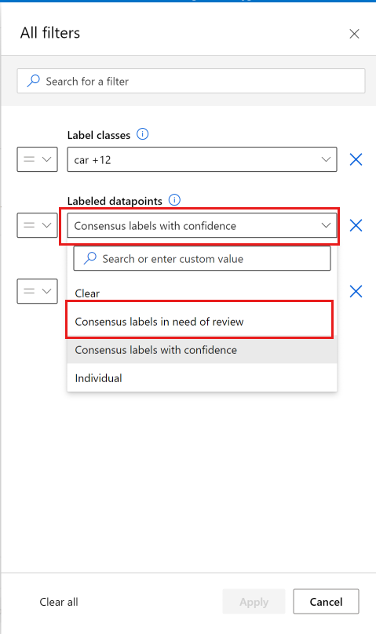

[ç”»åƒã®ãƒ©ãƒ™ãƒ«ä»˜ã‘プロジェクト](https://learn.microsoft.com/ja-jp/azure/machine-learning/how-to-create-image-labeling-projects#data-tab)

Figure 5.3.2-4

[テキストã®ãƒ©ãƒ™ãƒ«ä»˜ã‘プロジェクト](https://learn.microsoft.com/ja-jp/azure/machine-learning/how-to-create-text-labeling-projects#data)

Figure 5.3.2-5
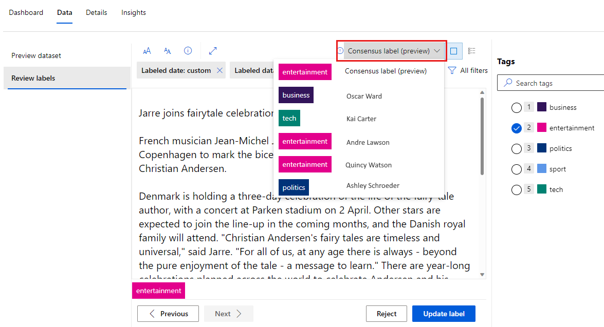

#### 5.3.3. [詳細ã®è¡¨ç¤ºã¨å¤‰æ›´](https://learn.microsoft.com/ja-jp/azure/machine-learning/how-to-create-image-labeling-projects#details-tab)

> プロジェクトã®è©³ç´°ã‚’表示ã—ã€å¤‰æ›´ã—ã¾ã™ã€‚ ã“ã®ã‚¿ãƒ–ã§ã¯ã€æ¬¡ã®ã“ã¨ãŒã§ãã¾ã™ã€‚
> * プロジェクトã®è©³ç´°ã¨å…¥åŠ›ãƒ‡ãƒ¼ã‚¿ã‚»ãƒƒãƒˆã‚’表示ã™ã‚‹
> * 一定ã®é–“éš”ã§ã®å¢—分更新を有効ã¾ãŸã¯ç„¡åŠ¹ã«ã™ã‚‹ã‹ã€å³æ™‚æ›´æ–°ã‚’è¦æ±‚ã™ã‚‹
> * プロジェクトã§ã®ãƒ©ãƒ™ãƒ«ä»˜ãã®å‡ºåŠ›ã‚’æ ¼ç´ã™ã‚‹ãŸã‚ã«ä½¿ç”¨ã™ã‚‹ã‚¹ãƒˆãƒ¬ãƒ¼ã‚¸ コンテナーã®è©³ç´°ã‚’表示ã™ã‚‹
> * プロジェクトã«ãƒ©ãƒ™ãƒ«ã‚’追加ã™ã‚‹
> * ラベルã«ä»˜ã‘る指示を編集ã™ã‚‹
> * 支æ´ä»˜ã機械学習ラベル付ã‘ã®è¨­å®šã‚’変更ã—ã€ãƒ©ãƒ™ãƒ«ä»˜ã‘タスクを開始ã™ã‚‹

### 5.4. [ラベル付ã‘ツールã®ä½¿ã„æ–¹](https://learn.microsoft.com/ja-jp/azure/machine-learning/how-to-label-data#label-text)

* [ç”»åƒåˆ†é¡ã‚¿ã‚¹ã‚¯](https://learn.microsoft.com/ja-jp/azure/machine-learning/how-to-label-data#image-tasks)
* [テキスト分é¡ã‚¿ã‚¹ã‚¯](https://learn.microsoft.com/ja-jp/azure/machine-learning/how-to-label-data#label-text)

### 5.5. [ラベルã®è¿½åŠ ](https://learn.microsoft.com/ja-jp/azure/machine-learning/how-to-create-image-labeling-projects#add-new-labels-to-a-project)

Figure 5.5-1

### 5.6. ラベルã®ã‚¨ã‚¯ã‚¹ãƒãƒ¼ãƒˆ

#### 5.6.1. [ç”»åƒãƒ©ãƒ™ãƒ«ã®ã‚¨ã‚¯ã‚¹ãƒãƒ¼ãƒˆ](https://learn.microsoft.com/ja-jp/azure/machine-learning/how-to-create-image-labeling-projects#export-the-labels)

> ç”»åƒãƒ©ãƒ™ãƒ«ã¯ä»¥ä¸‹ã¨ã—ã¦ã‚¨ã‚¯ã‚¹ãƒãƒ¼ãƒˆã§ãã¾ã™ã€‚
> * COCO å½¢å¼ã€‚ COCO ファイルã¯ã€Azure Machine Learning ワークスペースã®æ—¢å®šã® BLOB ストアã«ã‚ã‚‹ Labeling/export/coco 内ã®ãƒ•ã‚©ãƒ«ãƒ€ãƒ¼ã«ä½œæˆã•ã‚Œã¾ã™ã€‚
> * ラベル付ã Azure Machine Learning データセット。

> エクスãƒãƒ¼ãƒˆã—㟠Azure Machine Learning データセットã«ã¯ã€Machine Learning ã® [データセット] セクションã§ã‚¢ã‚¯ã‚»ã‚¹ã—ã¾ã™ã€‚

Figure 5.6.1-1
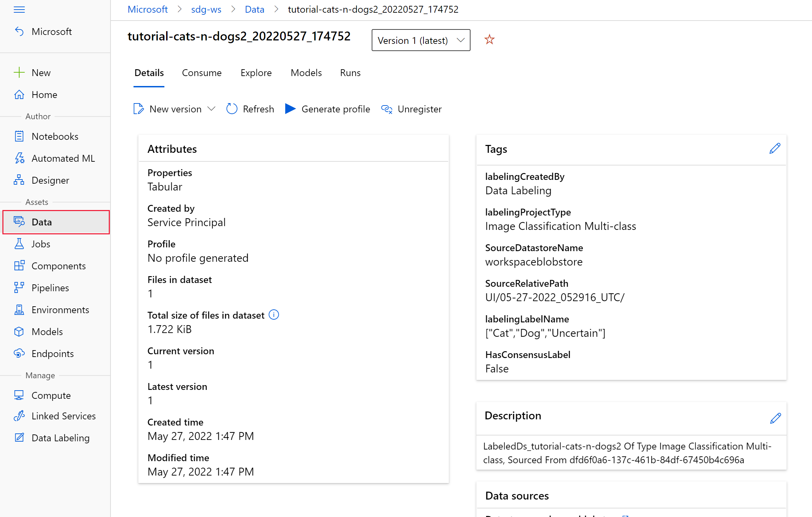

> データセットã®è©³ç´°ãƒšãƒ¼ã‚¸ã«ã¯ã€Python ã‹ã‚‰ãƒ©ãƒ™ãƒ«ã«ã‚¢ã‚¯ã‚»ã‚¹ã™ã‚‹ãŸã‚ã®ã‚µãƒ³ãƒ—ル コードも表示ã•ã‚Œã¾ã™ã€‚

> ラベル付ãデータを Azure Machine Learning データセットã«ã‚¨ã‚¯ã‚¹ãƒãƒ¼ãƒˆã—ãŸå¾Œã€[AutoML を使ã£ã¦ã€ãƒ©ãƒ™ãƒ«ä»˜ãデータã§ãƒˆãƒ¬ãƒ¼ãƒ‹ãƒ³ã‚°ã•ã‚ŒãŸ Computer Vision モデルを作æˆã§ãã¾ã™](https://learn.microsoft.com/ja-jp/azure/machine-learning/how-to-auto-train-image-models?tabs=cli#training-and-validation-data)。

#### 5.6.2. [テキストラベルã®ã‚¨ã‚¯ã‚¹ãƒãƒ¼ãƒˆ](https://learn.microsoft.com/ja-jp/azure/machine-learning/how-to-create-text-labeling-projects#export-the-labels)

> テキスト固有表ç¾èªè­˜ä»¥å¤–ã®ã™ã¹ã¦ã®ç¨®é¡ã®ãƒ—ロジェクトã§ã¯ã€æ¬¡ã‚’エクスãƒãƒ¼ãƒˆã§ãã¾ã™ã€‚
> * CSV ファイル。 Azure Machine Learning ワークスペースã«ã‚ˆã‚Šã€Labeling/export/csv 内ã®ãƒ•ã‚©ãƒ«ãƒ€ãƒ¼ã« CSV ファイルãŒä½œæˆã•ã‚Œã¾ã™ã€‚
> * [ラベル付ã Azure Machine Learning データセット](https://learn.microsoft.com/ja-jp/azure/machine-learning/v1/how-to-use-labeled-dataset)。
> 
> テキスト固有表ç¾èªè­˜ã®å ´åˆã€æ¬¡ã‚’エクスãƒãƒ¼ãƒˆã§ãã¾ã™ã€‚
> * [ラベル付ã Azure Machine Learning データセット (v1)](https://learn.microsoft.com/ja-jp/azure/machine-learning/v1/how-to-use-labeled-dataset)。
> * CoNLL ファイル。 ã“ã®ã‚¨ã‚¯ã‚¹ãƒãƒ¼ãƒˆã§ã¯ã€ã‚³ãƒ³ãƒ”ューティング リソースを割り当ã¦ã‚‹å¿…è¦ãŒã‚ã‚Šã¾ã™ã€‚ エクスãƒãƒ¼ãƒˆ プロセスã¯ã‚ªãƒ•ãƒ©ã‚¤ãƒ³ã§å®Ÿè¡Œã•ã‚Œã€å®Ÿé¨“ã®å®Ÿè¡Œã®ä¸€ç’°ã¨ã—ã¦ãƒ•ã‚¡ã‚¤ãƒ«ãŒç”Ÿæˆã•ã‚Œã¾ã™ã€‚ ファイルをダウンロードã™ã‚‹æº–å‚™ãŒæ•´ã†ã¨ã€å³ä¸Šã«é€šçŸ¥ãŒè¡¨ç¤ºã•ã‚Œã¾ã™ã€‚ ãã®é€šçŸ¥ã‚’é¸æŠã™ã‚‹ã¨ã€ãƒ•ã‚¡ã‚¤ãƒ«ã¸ã®ãƒªãƒ³ã‚¯ãŒè¡¨ç¤ºã•ã‚Œã¾ã™ã€‚

### 5.7. [ラベル付ã‘ã®ã‚¢ã‚¦ãƒˆã‚½ãƒ¼ã‚·ãƒ³ã‚°](https://learn.microsoft.com/ja-jp/azure/machine-learning/how-to-outsource-data-labeling)

1. [ベンダーé¸å®š](https://learn.microsoft.com/ja-jp/azure/machine-learning/how-to-outsource-data-labeling#review)
2. [契約](https://learn.microsoft.com/ja-jp/azure/machine-learning/how-to-outsource-data-labeling#enter-into-a-contract)
3. [アクセスã®æœ‰åŠ¹åŒ–](https://learn.microsoft.com/ja-jp/azure/machine-learning/how-to-outsource-data-labeling#enable-access)

> é‡è¦: ラベル付ã‘会社ã¨ãŠå®¢æ§˜ã«ã‚ˆã‚‹ã‚„ã‚Šå–ã‚Šã®ã™ã¹ã¦ã®å´é¢ (範囲ã€å“質ã€ã‚¹ã‚±ã‚¸ãƒ¥ãƒ¼ãƒ«ã€ä¾¡æ ¼ã«é–¢ã™ã‚‹å•é¡Œã‚’å«ã‚€ãŒã“ã‚Œã«é™å®šã•ã‚Œãªã„) ã«ã¤ã„ã¦ã¯ã€Microsoft ã§ã¯ãªããŠå®¢æ§˜ãŒè²¬ä»»ã‚’è² ã†ã‚‚ã®ã¨ã—ã¾ã™ã€‚

---

## 6. [データ資産 (データセット) ã®ãƒãƒ¼ã‚¸ãƒ§ãƒ³ç®¡ç†ã¨è¿½è·¡](https://learn.microsoft.com/ja-jp/azure/machine-learning/v1/how-to-version-track-datasets)

Figure 6-1

Figure 6-2
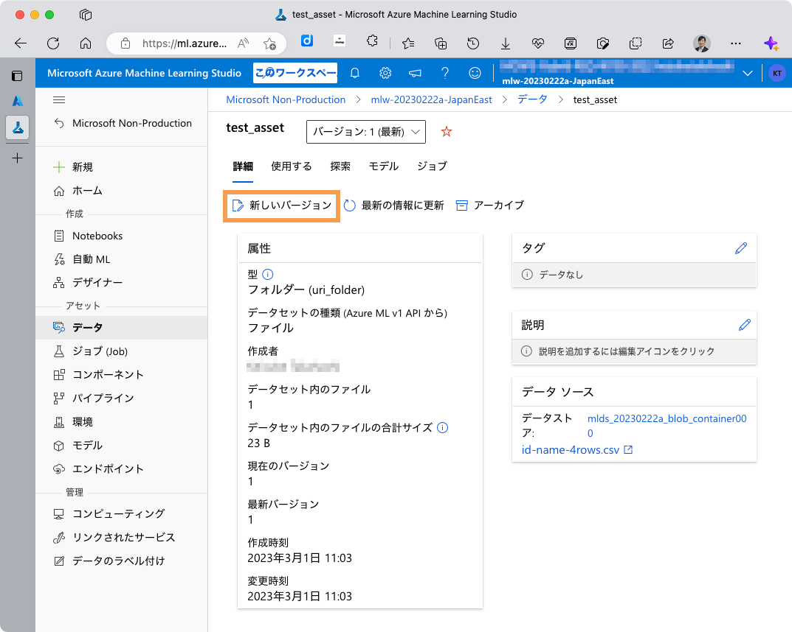

Figure 6-3
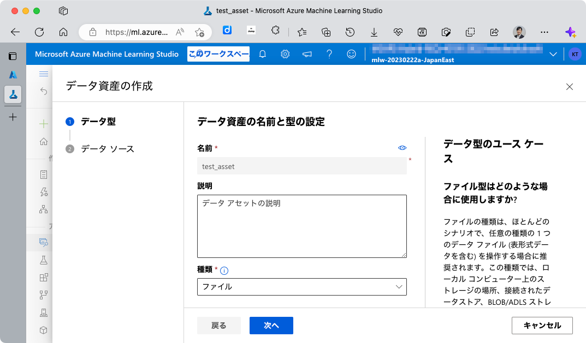

Figure 6-4

Figure 6-5
[データ資産ã®ä½œæˆ](https://learn.microsoft.com/ja-jp/azure/machine-learning/how-to-create-data-assets?tabs=cli) ã§ã€ä»¥ä¸‹ã®ã‚ˆã†ã«èª¬æ˜ã—ã¾ã—ãŸã€‚

> Azure ML データ資産ã¯ã€Web ブラウザーã®ãƒ–ックãƒãƒ¼ã‚¯ (ãŠæ°—ã«å…¥ã‚Š) ã«ä¼¼ã¦ã„ã¾ã™ã€‚ 最も頻ç¹ã«ä½¿ç”¨ã•ã‚Œã‚‹ãƒ‡ãƒ¼ã‚¿ã‚’指ã™é•·ã„ストレージ パス (URI) を覚ãˆã‚‹ä»£ã‚ã‚Šã«ã€ãƒ‡ãƒ¼ã‚¿è³‡ç”£ã‚’作æˆã—ã€ãƒ•ãƒ¬ãƒ³ãƒ‰ãƒªåを使ã£ã¦ãã®è³‡ç”£ã«ã‚¢ã‚¯ã‚»ã‚¹ã§ãã¾ã™ã€‚

データ資産ã®ãƒãƒ¼ã‚¸ãƒ§ãƒ³ã«ã¤ã„ã¦ã‚‚ã€ãã®ã¨ãã®çŠ¶æ…‹ã«å¯¾ã™ã‚‹ãƒ–ックãƒãƒ¼ã‚¯ã®ã‚ˆã†ãªã‚¤ãƒ¡ãƒ¼ã‚¸ã«ãªã‚Šã¾ã™ã€‚

---

## 7. [データ ドリフトã®ç›£è¦–](https://learn.microsoft.com/ja-jp/azure/machine-learning/v1/how-to-monitor-datasets)

Figure 7-1

> Azure Machine Learning [データセット モニター](https://learn.microsoft.com/ja-jp/azure/machine-learning/v1/how-to-monitor-datasets#dataset-monitors) (プレビュー) を使用ã™ã‚‹ã¨ã€æ¬¡ã®ã“ã¨ã‚’実行ã§ãã¾ã™ã€‚
> * [データã®ãƒ‰ãƒªãƒ•ãƒˆ](https://learn.microsoft.com/ja-jp/azure/machine-learning/v1/how-to-monitor-datasets#what-is-data-drift)を分æã—ã¦ã€æ™‚é–“ã®çµŒéã¨å…±ã«ã©ã®ã‚ˆã†ã«å¤‰åŒ–ã™ã‚‹ã‹ã‚’把æ¡ã™ã‚‹ã€‚
> * モデル データを監視ã—ã¦ã€ãƒˆãƒ¬ãƒ¼ãƒ‹ãƒ³ã‚°ç”¨ãƒ‡ãƒ¼ã‚¿ã‚»ãƒƒãƒˆã¨ä¾›çµ¦ãƒ‡ãƒ¼ã‚¿ã‚»ãƒƒãƒˆã®é•ã„を確èªã™ã‚‹ã€‚ デプロイã•ã‚ŒãŸãƒ¢ãƒ‡ãƒ«ã‹ã‚‰ãƒ¢ãƒ‡ãƒ« データをå集ã™ã‚‹ã“ã¨ã‹ã‚‰å§‹ã‚ã¾ã™ã€‚
> * æ–°ã—ã„データを監視ã—ã¦ã€[ベースライン データセットã¨ã‚¿ãƒ¼ã‚²ãƒƒãƒˆ データセット](https://learn.microsoft.com/ja-jp/azure/machine-learning/v1/how-to-monitor-datasets#baseline-and-target-datasets)ã®é•ã„を確èªã™ã‚‹ã€‚
> * データã®ç‰¹å¾´ã‚’プロファイリングã—ã¦ã€[時間ã®çµŒéã¨å…±ã«çµ±è¨ˆçš„ãªç‰¹æ€§ãŒã©ã®ã‚ˆã†ã«å¤‰åŒ–ã™ã‚‹ã‹ã‚’追跡](https://learn.microsoft.com/ja-jp/azure/machine-learning/v1/how-to-monitor-datasets#understand-data-drift-results)ã™ã‚‹ã€‚
> * [データ ドリフトã«é–¢ã™ã‚‹ã‚¢ãƒ©ãƒ¼ãƒˆ](https://learn.microsoft.com/ja-jp/azure/machine-learning/v1/how-to-monitor-datasets#metrics-alerts-and-events)を設定ã—ã¦ã€æ½œåœ¨çš„ãªå•é¡Œã‚’早期ã«è­¦å‘Šã™ã‚‹ã€‚
> * é常ã«å¤šãã®ãƒ‰ãƒªãƒ•ãƒˆãŒãƒ‡ãƒ¼ã‚¿ã«ç™ºç”Ÿã—ãŸã¨åˆ¤æ–­ã—ãŸå ´åˆã«ã€ æ–°ã—ã„ãƒãƒ¼ã‚¸ãƒ§ãƒ³ã®ãƒ‡ãƒ¼ã‚¿ã‚»ãƒƒãƒˆã‚’ä½œæˆ ã™ã‚‹ã€‚
> * モニターã®ä½œæˆã«ã¯ã€Azure Machine Learning ã®ãƒ‡ãƒ¼ã‚¿ã‚»ãƒƒãƒˆãŒä½¿ç”¨ã•ã‚Œã¾ã™ã€‚**データセットã«ã¯ timestamp 列ãŒå«ã¾ã‚Œã¦ã„ã‚‹å¿…è¦ãŒã‚ã‚Šã¾ã™**。

データセット モニターã®ä½œæˆã‚¹ãƒ†ãƒƒãƒ—ã¯ä»¥ä¸‹ã®é€šã‚Šã§ã™ã€‚
1. ターゲット データセットã®é¸æŠ
2. ベースライン データセットã®é¸æŠ
3. モニターã®è¨­å®š

---

## 8. データ準備ã®åŠ¹ç‡åŒ–

Azure ã®å„種サービスを組ã¿åˆã‚ã›ã‚‹ã“ã¨ã§ã€ãƒ‡ãƒ¼ã‚¿ã®æº–備を効ç‡åŒ–ã™ã‚‹ã“ã¨ãŒã§ãã¾ã™ã€‚よã用ã„られるサービスã¯ä»¥ä¸‹ã®é€šã‚Šã§ã™ã€‚

| # | サービス | 主ãªç”¨é€” |
| --- | --- | --- |
| 1 | [Azure Event Hubs](https://azure.microsoft.com/ja-jp/products/event-hubs) ã¾ãŸã¯ [Azure IoT Hub](https://azure.microsoft.com/ja-jp/products/iot-hub) | データã®ã‚­ãƒ¥ãƒ¼ã‚¤ãƒ³ã‚° |
| 2 | [Azure Stream Analytics](https://azure.microsoft.com/ja-jp/products/stream-analytics) | キューã‹ã‚‰ã®ãƒ‡ãƒ¼ã‚¿å–å¾—ã¨åŠ å·¥ |
| 3 | [Azure Data Factory](https://azure.microsoft.com/ja-jp/products/data-factory) ã¾ãŸã¯ [Azure Synapse Analytics](https://azure.microsoft.com/ja-jp/products/synapse-analytics/) Pipelines | [ETL](https://learn.microsoft.com/ja-jp/azure/architecture/data-guide/relational-data/etl#extract-transform-and-load-etl-process) ã¾ãŸã¯ [ELT](https://learn.microsoft.com/ja-jp/azure/architecture/data-guide/relational-data/etl#extract-load-and-transform-elt) |
| 4 | [Azure Cosmos DB](https://azure.microsoft.com/ja-jp/products/cosmos-db) | [NoSQL データベース](https://learn.microsoft.com/ja-jp/dotnet/architecture/cloud-native/relational-vs-nosql-data) |

Figure 8-1

引用元: [Azure Synapse を使用ã—ãŸåˆ†æã®ã‚¨ãƒ³ãƒ‰ ツー エンド - Azure Architecture Center | Microsoft Learn](https://learn.microsoft.com/ja-jp/azure/architecture/example-scenario/dataplate2e/data-platform-end-to-end?tabs=portal)

---

## 9. ラーニング

| #   | モジュール | 所è¦æ™‚é–“ |
| ---:| -------- | ------- |
| 1 | [機械学習用ã®ãƒ‡ãƒ¼ã‚¿ã®æ¦‚è¦](https://learn.microsoft.com/ja-jp/training/modules/introduction-to-data-for-machine-learning/) | 45 分 |
| 2 | [Azure Machine Learning ã§ãƒ‡ãƒ¼ã‚¿ã‚’使用ã§ãるよã†ã«ã™ã‚‹](https://learn.microsoft.com/ja-jp/training/modules/make-data-available-azure-machine-learning/) | 39 分 |
| 3 | [Azure Machine Learning ã§ã®ãƒ‡ãƒ¼ã‚¿ã®æ“作](https://learn.microsoft.com/ja-jp/training/modules/work-with-data-in-aml/) | 45 分 |
| 4 | [Azure Machine Learning データ ラベル付ã‘ツールを使用ã—ã¦ãƒ©ãƒ™ãƒ«ä»˜ã‘ã•ã‚ŒãŸãƒ‡ãƒ¼ã‚¿ã‚»ãƒƒãƒˆã‚’作æˆã™ã‚‹](https://learn.microsoft.com/ja-jp/training/modules/create-labeled-dataset-using-azure-machine-learning-data-labeling-tools/)| 30 分 |
| 5 | [Azure Machine Learning を使用ã—ã¦ãƒ‡ãƒ¼ã‚¿ ドリフトを監視ã™ã‚‹](https://learn.microsoft.com/ja-jp/training/modules/monitor-data-drift-with-azure-machine-learning/) | 42 分|
| 6 | [Azure ã§ã®ãƒ‡ãƒ¼ã‚¿ ストレージ手法をé¸æŠã™ã‚‹](https://learn.microsoft.com/ja-jp/training/modules/choose-storage-approach-in-azure/) | 30 分 |
| 7 | [Azure ストレージ サービスã«ã¤ã„ã¦](https://learn.microsoft.com/ja-jp/training/modules/azure-storage-fundamentals/) | 27 分 |
| 8 | [Azure Storage アカウントã®ä½œæˆ](https://learn.microsoft.com/ja-jp/training/modules/create-azure-storage-account/) | 30 分 |
| 9 | [Azure Blob Storage ã®æ§‹æˆ](https://learn.microsoft.com/ja-jp/training/modules/configure-blob-storage/) | 36 分 |
| 10 | [Azure Blob Storage を調ã¹ã‚‹](https://learn.microsoft.com/ja-jp/training/modules/explore-azure-blob-storage/) | 31 分 |
| 11 | [Azure Blob Storage ã®ãƒ©ã‚¤ãƒ•ã‚µã‚¤ã‚¯ãƒ«ã‚’管ç†ã™ã‚‹](https://learn.microsoft.com/ja-jp/training/modules/manage-azure-blob-storage-lifecycle/) | 21 分 |
| 12 | [Azure Storage Explorer を使用ã—ã¦ãƒ‡ãƒ¼ã‚¿ã‚’アップロードã€ãƒ€ã‚¦ãƒ³ãƒ­ãƒ¼ãƒ‰ã€ç®¡ç†ã™ã‚‹](https://learn.microsoft.com/ja-jp/training/modules/upload-download-and-manage-data-with-azure-storage-explorer/) | 37 分 |
| 13 | [複数ã®ãƒ—ロトコルを使用ã—㦠Azure Blob Storage ã‹ã‚‰ãƒ‡ãƒ¼ã‚¿ã«ã‚¢ã‚¯ã‚»ã‚¹ã™ã‚‹](https://learn.microsoft.com/ja-jp/training/modules/access-data-azure-blob-storage-multiple-protocols/) | 36 分 |
| 14 | [Azure Storage ã¸ã®ã‚¢ãƒ—リã®æ¥ç¶š](https://learn.microsoft.com/ja-jp/training/modules/connect-an-app-to-azure-storage/) | 1 時間 5 分 |
| 15 | [Azure Blob Storage ã®ä½¿ç”¨](https://learn.microsoft.com/ja-jp/training/modules/work-azure-blob-storage/) | 33 分 |
| 16 | [Azure Blob ストレージを使用ã—ã¦ã‚¢ãƒ—リケーション データを格ç´ã™ã‚‹](https://learn.microsoft.com/ja-jp/training/modules/store-app-data-with-azure-blob-storage/) | 50 分 |
| 17 | [Azure Blob Storage ã®ãƒ‘フォーãƒãƒ³ã‚¹æŒ‡æ¨™ã‚’分æã™ã‚‹](https://learn.microsoft.com/ja-jp/training/modules/analyze-azure-blob-storage-performance-indicators/) | 46 分 |
| 18 | [Azure Blob Storage コンテナーã‹ã‚‰ãƒ¡ãƒˆãƒªãƒƒã‚¯ã‚’å集ã™ã‚‹](https://learn.microsoft.com/ja-jp/training/modules/gather-metrics-blob-storage/) | 1 時間 1 分 |
| 19 | [Azure Storage ã®ç›£è¦–ã€è¨ºæ–­ã€ãƒˆãƒ©ãƒ–ルシューティング](https://learn.microsoft.com/ja-jp/training/modules/monitor-diagnose-and-troubleshoot-azure-storage/) | 41 分 |
| 20 | [Blob Storage アプリ㨠ETag ãŠã‚ˆã³ BLOB リースã§ã‚³ãƒ³ã‚«ãƒ¬ãƒ³ã‚·ãƒ¼ã‚’サãƒãƒ¼ãƒˆã™ã‚‹](https://learn.microsoft.com/ja-jp/training/modules/support-concurrency-blob-storage/) | 50 分 |
| 21 | [Azure Blob Storage を使用ã—ã¦ã‚³ã‚¹ãƒˆã‚’最é©åŒ–ã™ã‚‹](https://learn.microsoft.com/ja-jp/training/modules/optimize-your-cost-azure-blob-storage/) | 45 分 |
| 22 | [Azure Data Lake Storage ã®æ¦‚è¦](https://learn.microsoft.com/ja-jp/training/modules/intro-to-azure-data-lake-storage/) | 34 分 |
| 23 | [éリレーショナルデータ用ã«ãƒ‡ãƒ¼ã‚¿ ストレージ ソリューションを設計ã™ã‚‹](https://learn.microsoft.com/ja-jp/training/modules/design-data-storage-solution-for-non-relational-data/) | 33 分 |

| #   | ラーニング パス | 所è¦æ™‚é–“ |
| ---:| ------------ | ------- |
| 1 | [Azure Machine Learning ã§ã®ãƒ‡ãƒ¼ã‚¿ã®æ“作](https://learn.microsoft.com/ja-jp/training/paths/work-data-azure-machine-learning/) | 39 分 |
| 2 | [AZ-104:Azure ã§ã®ã‚¹ãƒˆãƒ¬ãƒ¼ã‚¸ã®å®Ÿè£…ã¨ç®¡ç†](https://learn.microsoft.com/ja-jp/training/paths/az-104-manage-storage/) | 4 時間 16 分 |
| 3 | [Azure ã«ãƒ‡ãƒ¼ã‚¿ã‚’æ ¼ç´ã™ã‚‹](https://learn.microsoft.com/ja-jp/training/paths/store-data-in-azure/) | 3 時間 40 分 |
| 4 | [Azure Data Lake Storage Gen2 を使用ã—ãŸå¤§è¦æ¨¡ãªãƒ‡ãƒ¼ã‚¿å‡¦ç†](https://learn.microsoft.com/ja-jp/training/paths/data-processing-with-azure-adls/) | 1 時間 50 分 |

---

## 10. å‚考リンク

* [ストレージ アカウントã®æ¦‚è¦](https://learn.microsoft.com/ja-jp/azure/storage/common/storage-account-overview)
* [ストレージ アカウントを作æˆã™ã‚‹](https://learn.microsoft.com/ja-jp/azure/storage/common/storage-account-create?tabs=azure-portal)
* [Azure Blob Storage ã®æ¦‚è¦](https://learn.microsoft.com/ja-jp/azure/storage/blobs/storage-blobs-introduction)
* [Azure Data Lake Storage Gen2](https://learn.microsoft.com/ja-jp/azure/storage/blobs/data-lake-storage-introduction)
* [データ レイクã¨ã¯](https://learn.microsoft.com/ja-jp/azure/architecture/data-guide/scenarios/data-lake)
* [Azure ã§ã®ãƒ“ッグ データ ストレージ テクãƒãƒ­ã‚¸ã®é¸æŠ](https://learn.microsoft.com/ja-jp/azure/architecture/data-guide/technology-choices/data-storage)
* [データ ストア モデルã«ã¤ã„ã¦](https://learn.microsoft.com/ja-jp/azure/architecture/guide/technology-choices/data-store-overview)
* [アプリケーション㮠Azure データ ストアをé¸æŠã™ã‚‹](https://learn.microsoft.com/ja-jp/azure/architecture/guide/technology-choices/data-store-decision-tree)
* [データ ストアã®é¸æŠæ¡ä»¶](https://learn.microsoft.com/ja-jp/azure/architecture/guide/technology-choices/data-store-considerations)
* [ストレージ オプションを確èªã™ã‚‹](https://learn.microsoft.com/ja-jp/azure/cloud-adoption-framework/ready/considerations/storage-options)
