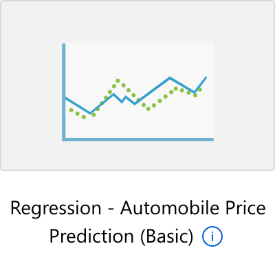

# 4. デザイナー(ハンズオン)

- [4. デザイナー(ハンズオン)](#4-デザイナーハンズオン)
  - [1. 事前準備](#1-事前準備)
  - [2. 組み込みサンプルを動かしてみよう](#2-組み込みサンプルを動かしてみよう)
    - [2.1. 組み込みサンプル (Azure Machine Learning Studio \> デザイナー 表示順)](#21-組み込みサンプル-azure-machine-learning-studio--デザイナー-表示順)
    - [2.2. 学びのヒント](#22-学びのヒント)
  - [3. チュートリアルをやってみよう](#3-チュートリアルをやってみよう)
    - [3.1. 回帰モデルのトレーニング](#31-回帰モデルのトレーニング)
    - [3.2. モデルのデプロイ](#32-モデルのデプロイ)
      - [3.2.1. 制限事項](#321-制限事項)
  - [4. 無料のオンライン トレーニングをやってみよう](#4-無料のオンライン-トレーニングをやってみよう)
  - [5. 参考リンク](#5-参考リンク)

---

## 1. 事前準備

* Azure Machine Learning リソースを作成 (なければ)
* Azure Machine Learning Studio を起動
* ワークスペースを作成 (なければ)
* コンピューティングを作成 (なければ)

---

## 2. [組み込みサンプル](https://learn.microsoft.com/ja-jp/azure/machine-learning/samples-designer)を動かしてみよう

### 2.1. 組み込みサンプル (Azure Machine Learning Studio > デザイナー 表示順)

| # | アイコン | Sample Title | サンプル タイトル | タスクまたはカテゴリ | 説明 | ガイド(英語) | こんな人にオススメ |
| ---:| --- | --- | --- | --- | --- | --- | --- |
| 1 |  | Image Classification using DenseNet | DenseNet を使用した画像の分類 | Computer Vision | Computer Vision コンポーネントを使用して、[PyTorch](https://learn.microsoft.com/ja-jp/azure/machine-learning/component-reference/train-pytorch-model) [DenseNet](https://cvml-expertguide.net/terms/dl/cnn-backbone/densenet/) を基にした画像の分類モデルを構築します。 | なし | PyTorch での画像分類に興味がある人 |
| 2 |  | Binary Classification using Vowpal Wabbit Model - Adult Income Prediction | Vowpal Wabbit モデルを使用した二項分類 - 成人の収入予測 | ユーティリティ | [Vowpal Wabbit](https://learn.microsoft.com/ja-jp/azure/machine-learning/component-reference/train-vowpal-wabbit-model) は、オンライン、ハッシュ、allreduce、リダクション、learning2search、アクティブ、対話型学習などの手法を使用した機械学習のフロンティアをプッシュする機械学習システムです。 このサンプルでは、Vowpal Wabbit モデルを使用して[二項分類](https://ja.wikipedia.org/wiki/%E4%BA%8C%E9%A0%85%E5%88%86%E9%A1%9E)モデルを作成する方法を示します。 | なし |  |
| 3 |  | Wide & Deep based Recommendation - Restaurant Rating Prediction | [ワイド & ディープ ベースの推奨](https://learn.microsoft.com/ja-jp/azure/machine-learning/component-reference/score-wide-and-deep-recommender)事項 - レストラン評価の予測 | レコメンダー | レストランとユーザーの特徴量および評価から、レストラン レコメンダー エンジンを構築します。 | なし |  |
| 4 |  | Regression - Automobile Price Prediction (Basic) | 回帰 - 自動車価格の予測 (基本) | 回帰 | [線形回帰](https://learn.microsoft.com/ja-jp/azure/machine-learning/component-reference/linear-regression)を使用して自動車の価格を予測します。 | [あり](https://github.com/Azure/MachineLearningDesigner/blob/master/articles/samples/regression-automobile-price-prediction-basic.md) | **すべての初学者** |
| 5 |  | Regression - Automobile Price Prediction (Advanced) | 回帰 - 自動車価格の予測 (詳細) | 回帰 | [デシジョン フォレスト](https://learn.microsoft.com/ja-jp/azure/machine-learning/component-reference/decision-forest-regression)と[ブースト デシジョンツリー リグレッサー](https://learn.microsoft.com/ja-jp/azure/machine-learning/component-reference/boosted-decision-tree-regression)を使用して、自動車の価格を予測します。 モデルを比較して、最適なアルゴリズムを見つけてください。 | [あり](https://github.com/Azure/MachineLearningDesigner/blob/master/articles/samples/regression-automobile-price-prediction-compare-algorithms.md) | Basic で一通り学び終えた人 |
| 6 |  | Binary Classification with Feature Selection - Income Prediction | 特徴の選択による二項分類 - 収入の予測 | 分類 | [2 クラスのブースト デシジョン ツリー](https://learn.microsoft.com/ja-jp/azure/machine-learning/component-reference/two-class-boosted-decision-tree)を使用して、収入を高または低として予測します。 [ピアソンの相関関係を使用して、特徴を選択](https://learn.microsoft.com/ja-jp/azure/machine-learning/component-reference/filter-based-feature-selection)します。 | [あり](https://github.com/Azure/MachineLearningDesigner/blob/master/articles/samples/binary-classification-feature-selection-income-prediction.md) |  |
| 7 |  | Binary Classification with custom Python script - Credit Risk Prediction | カスタム Python スクリプトを使用した二項分類 - 信用リスクの予測 | 分類 | クレジット申込書を高リスクまたは低リスクとして分類します。 [Python スクリプトの実行コンポーネント](https://learn.microsoft.com/ja-jp/azure/machine-learning/component-reference/execute-python-script)を使用して、データを重み付けします。 | [あり](https://github.com/Azure/MachineLearningDesigner/blob/master/articles/samples/binary-classification-python-credit-prediction.md) | Python のスクリプトをコンポーネントとして組み込みたい人 |
| 8 |  | Binary Classification - Customer Relationship Prediction | 二項分類 - 顧客関係の予測 | 分類 | [2 クラス ブースト デシジョン ツリー](https://learn.microsoft.com/ja-jp/azure/machine-learning/component-reference/two-class-boosted-decision-tree)を使用して、顧客離反を予測します。 偏りのあるデータをサンプリングするには、[SMOTE](https://learn.microsoft.com/ja-jp/azure/machine-learning/component-reference/smote) を使用します。 | [あり](https://github.com/Azure/MachineLearningDesigner/blob/master/articles/samples/binary-classification-customer-relationship-prediction.md) | オーバーサンプリングに興味がある人 |
| 9 |  | Use custom R script - Flight Delay Prediction | カスタム R スクリプトの使用 - フライトの遅延予測 | ユーティリティ | カスタマイズされた [R スクリプトを使用](https://learn.microsoft.com/ja-jp/azure/machine-learning/component-reference/execute-r-script)して、予定されている旅客便が 15 分以上遅れるかどうかを予測します。 | [あり](https://github.com/Azure/MachineLearningDesigner/blob/master/articles/samples/r-script-flight-delay-prediction.md) | R のスクリプトをコンポーネントとして組み込みたい人 |
| 10 |  | Text Classification - Wikipedia SP 500 Dataset | テキスト分類 - Wikipedia SP 500 データセット | 分類 | [多クラス ロジスティック回帰](https://learn.microsoft.com/ja-jp/azure/machine-learning/component-reference/multiclass-logistic-regression)を使用して、Wikipedia の記事から会社の種類を分類します。 | [あり](https://github.com/Azure/MachineLearningDesigner/blob/master/articles/samples/text-classification-wiki.md) | 特徴選択を深掘りしたい人 |
| 11 |  | Cross Validation for Binary Classification - Adult Income Prediction | 二項分類のクロス検証 - 成人の収入予測 | ユーティリティ | [クロス検証](https://learn.microsoft.com/ja-jp/azure/machine-learning/component-reference/cross-validate-model)を使用して、成人の収入予測のための二項分類器を作成します。 | なし | 汎化性能の評価を学びたい人 |
| 12 |  | Permutation Feature Importance | 順列の特徴量の重要度 | ユーティリティ | [順列の特徴量の重要度](https://learn.microsoft.com/ja-jp/azure/machine-learning/component-reference/permutation-feature-importance)を使用して、テスト データセットの重要度スコアを計算します。 | なし |  |
| 13 |  | Recommendation - Movie Rating Tweets | レコメンデーション - 映画の評価ツイート | レコメンダー | 映画とユーザーの特徴と評価から映画レコメンダー エンジンを作成します。 | なし | レコメンデーションに興味がある人 |
| 14 |  | Tune Parameters for Binary Classification - Adult Income Prediction | 二項分類のパラメーターの調整 - 成人の収入予測 | ユーティリティ | [モデルのハイパーパラメーターの調整](はいhttps://learn.microsoft.com/ja-jp/azure/machine-learning/component-reference/tune-model-hyperparameters)を使用して、バイナリ分類器の作成に最適なハイパーパラメーターを見つけます。 | なし | ハイパーパラメータチューニングに興味がある人 |
| 15 |  | Multiclass Classification - Letter Recognition | 多クラス分類 - 文字認識 | 分類 | 一連の二項分類器を作成して、手書きの文字を分類します。 | なし |  |

### 2.2. 学びのヒント

* どのようなコンポーネントが使用されていますか？
* コンポーネント同士は、どのように接続されていますか？
* パラメータはどのように設定されていますか？パラメータを変更したらどうなりますか？
* データはどのように処理されていますか？

---

## 3. [チュートリアル](https://learn.microsoft.com/ja-jp/azure/machine-learning/tutorial-designer-automobile-price-train-score#set-the-default-compute-target)をやってみよう

    チュートリアル
    ├─ 1. 回帰モデルのトレーニング
    └─ 2. モデルのデプロイ

### 3.1. [回帰モデルのトレーニング](https://learn.microsoft.com/ja-jp/azure/machine-learning/tutorial-designer-automobile-price-train-score)

1. [新しいパイプラインを作成する](https://learn.microsoft.com/ja-jp/azure/machine-learning/tutorial-designer-automobile-price-train-score#create-a-new-pipeline)
   1. [新しいワークスペースを作成する](https://learn.microsoft.com/ja-jp/azure/machine-learning/tutorial-designer-automobile-price-train-score#create-a-new-workspace)
   2. [パイプラインを作成する](https://learn.microsoft.com/ja-jp/azure/machine-learning/tutorial-designer-automobile-price-train-score#create-the-pipeline)
   3. [既定のコンピューティング先を設定する](https://learn.microsoft.com/ja-jp/azure/machine-learning/tutorial-designer-automobile-price-train-score#set-the-default-compute-target)
2. [データをインポートする](https://learn.microsoft.com/ja-jp/azure/machine-learning/tutorial-designer-automobile-price-train-score#import-data)
   1. [データの視覚化](https://learn.microsoft.com/ja-jp/azure/machine-learning/tutorial-designer-automobile-price-train-score#visualize-the-data)
3. [データを準備する](https://learn.microsoft.com/ja-jp/azure/machine-learning/)
   1. [列の削除](https://learn.microsoft.com/ja-jp/azure/machine-learning/tutorial-designer-automobile-price-train-score#remove-a-column)
   2. [見つからないデータのクリーンアップ](https://learn.microsoft.com/ja-jp/azure/machine-learning/tutorial-designer-automobile-price-train-score#clean-missing-data)
4. [機械学習モデルをトレーニングする](https://learn.microsoft.com/ja-jp/azure/machine-learning/tutorial-designer-automobile-price-train-score#train-a-machine-learning-model)
   1. [データを分割する](https://learn.microsoft.com/ja-jp/azure/machine-learning/tutorial-designer-automobile-price-train-score#split-the-data)
   2. [モデルをトレーニングする](https://learn.microsoft.com/ja-jp/azure/machine-learning/tutorial-designer-automobile-price-train-score#train-the-model)
   3. [Score Model (モデルのスコア付け) コンポーネントを追加する](https://learn.microsoft.com/ja-jp/azure/machine-learning/tutorial-designer-automobile-price-train-score#add-the-score-model-component)
   4. [Evaluate Model (モデルの評価) コンポーネントを追加する](https://learn.microsoft.com/ja-jp/azure/machine-learning/tutorial-designer-automobile-price-train-score#add-the-evaluate-model-component)
   5. [パイプラインを送信する](https://learn.microsoft.com/ja-jp/azure/machine-learning/tutorial-designer-automobile-price-train-score#submit-the-pipeline)
   6. [スコア付けラベルを確認する](https://learn.microsoft.com/ja-jp/azure/machine-learning/tutorial-designer-automobile-price-train-score#view-scored-labels)
5. [機械学習モデルを評価する](https://learn.microsoft.com/ja-jp/azure/machine-learning/tutorial-designer-automobile-price-train-score#evaluate-models)

### 3.2. [モデルのデプロイ](https://learn.microsoft.com/ja-jp/azure/machine-learning/tutorial-designer-automobile-price-deploy)

1. [リアルタイム推論パイプラインを作成](https://learn.microsoft.com/ja-jp/azure/machine-learning/tutorial-designer-automobile-price-deploy#create-a-real-time-inference-pipeline)
2. [推論クラスターを作成](https://learn.microsoft.com/ja-jp/azure/machine-learning/tutorial-designer-automobile-price-deploy#create-an-inferencing-cluster)
3. [リアルタイム エンドポイントをデプロイ](https://learn.microsoft.com/ja-jp/azure/machine-learning/tutorial-designer-automobile-price-deploy#deploy-the-real-time-endpoint)
4. [リアルタイム エンドポイントをテスト](https://learn.microsoft.com/ja-jp/azure/machine-learning/tutorial-designer-automobile-price-deploy#test-the-real-time-endpoint)
5. [リアルタイム エンドポイントを更新](https://learn.microsoft.com/ja-jp/azure/machine-learning/tutorial-designer-automobile-price-deploy#update-the-real-time-endpoint)

#### 3.2.1. [制限事項](https://learn.microsoft.com/ja-jp/azure/machine-learning/tutorial-designer-automobile-price-deploy#limitations)

> * データストアのアクセス制限により、推論パイプラインに **データのインポート** または **データのエクスポート** コンポーネントが含まれている場合、リアルタイム エンドポイントへのデプロイ時にこれらは <ins>自動的に削除</ins>されます。
> * リアルタイム推論パイプラインにデータセットがあり、それをリアルタイム エンドポイントにデプロイする場合、現在、このフローでは <ins>BLOB データストアから登録されたデータセットのみ</ins>がサポートされています。 他の型データストアのデータセットを使用する場合は、[列の選択] を使用して、すべての列を選択する設定で初期データセットに接続し、[列をファイルとして選択] データセットの出力を登録した後、リアルタイム推論パイプラインの初期データセットを、この新しく登録されたデータセットに置き換えることができます。
> * 推論グラフに、"Web サービス入力" コンポーネントと同じポートに接続されていない "データの手動入力" コンポーネントが含まれている場合、HTTP 呼び出し処理中に "データの手動入力" コンポーネントは実行されません。 回避策は、その "データの手動入力" コンポーネントの出力をデータセットとして登録し、推論パイプラインのドラフトで、"データの手動入力" コンポーネントを登録済みのデータセットに置き換えることです。

---

## 4. 無料のオンライン トレーニングをやってみよう

注意: 各モジュールにおける「演習」では、 **管理者アクセス権が与えられている Azure サブスクリプション** が必要です。[無料アカウント](https://azure.microsoft.com/ja-jp/free/)も使用可能です。

| #   | モジュール | 所要時間 |
| ---:| -------- | ------- |
| 1 | [Azure Machine Learning デザイナーを使用して回帰モデルを作成する](https://learn.microsoft.com/ja-jp/training/modules/create-regression-model-azure-machine-learning-designer/) | 1時間20分 |
| 2 | [Azure Machine Learning デザイナーを使用して分類モデルを作成する](https://learn.microsoft.com/ja-jp/training/modules/create-classification-model-azure-machine-learning-designer/) | 1時間27分 |
| 3 | [Azure Machine Learning デザイナーを使用してクラスタリング モデルを作成する](https://learn.microsoft.com/ja-jp/training/modules/create-clustering-model-azure-machine-learning-designer/) | 49分 |

---

## 5. 参考リンク

* [Azure Machine Learning デザイナーのアルゴリズムとコンポーネントのリファレンス](https://learn.microsoft.com/ja-jp/azure/machine-learning/component-reference/component-reference)
