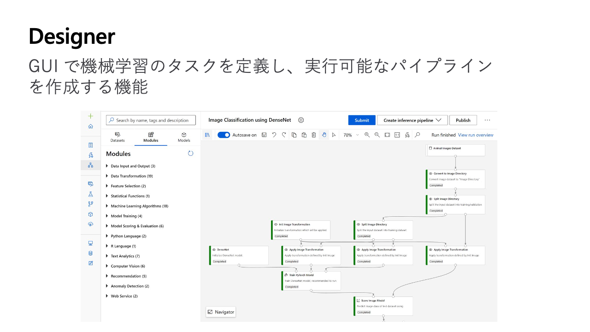
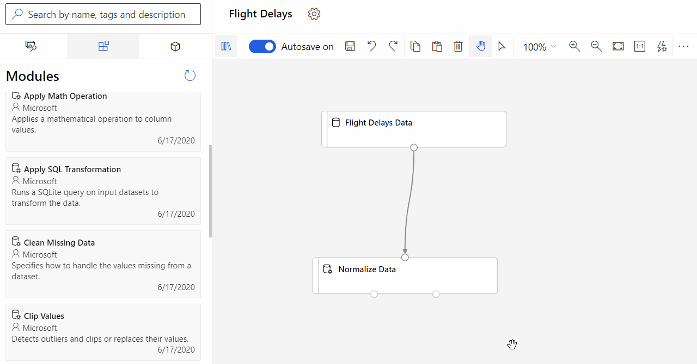
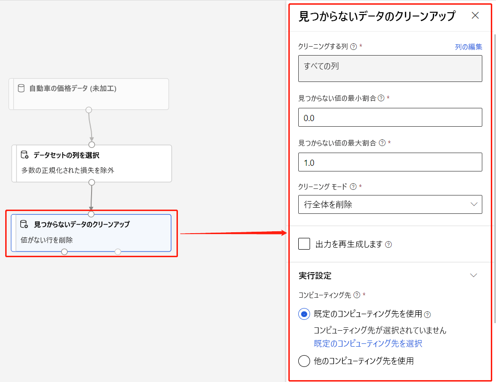
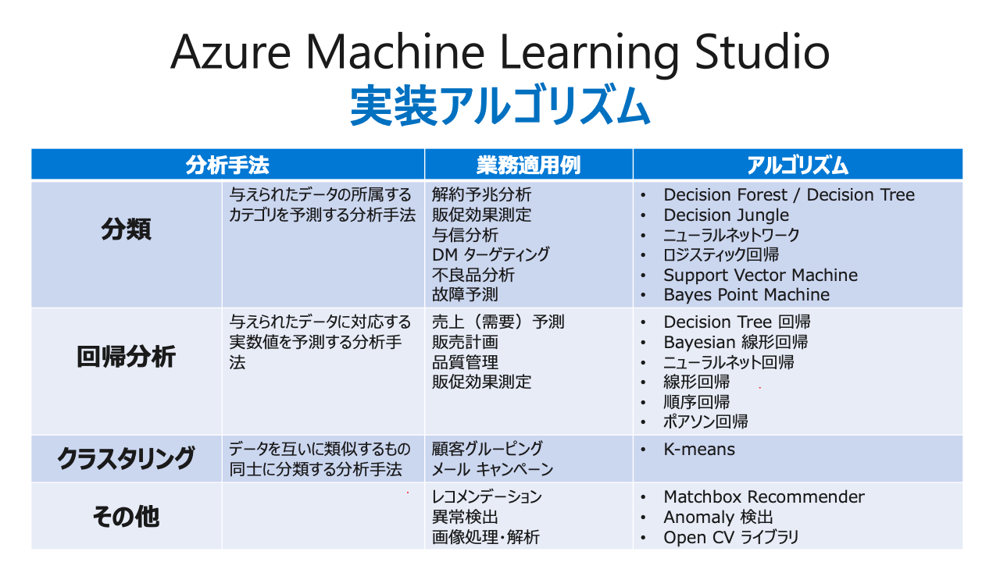
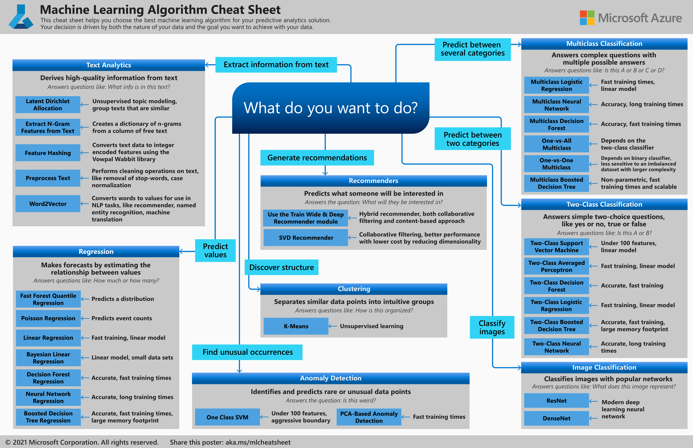

###### Azure Machine Learning 入門 (L100)

# 4. デザイナー

- [4. デザイナー](#4-デザイナー)
  - [1. パイプライン](#1-パイプライン)
    - [1.1. 関連キーワード](#11-関連キーワード)
  - [2. データ](#2-データ)
    - [2.1. 関連キーワード](#21-関連キーワード)
  - [3. (事前構築済み)コンポーネント](#3-事前構築済みコンポーネント)
    - [3.1. データ準備コンポーネント](#31-データ準備コンポーネント)
      - [3.1.1. データの入力と出力](#311-データの入力と出力)
      - [3.1.2. データの変換](#312-データの変換)
      - [3.1.3. 特徴選択](#313-特徴選択)
      - [3.1.4. 統計関数](#314-統計関数)
    - [3.2. 機械学習のアルゴリズム](#32-機械学習のアルゴリズム)
      - [3.2.1. 回帰](#321-回帰)
      - [3.2.2. 分類](#322-分類)
        - [3.2.2.1. 2クラス分類](#3221-2クラス分類)
        - [3.2.2.2. 他クラス分類](#3222-他クラス分類)
      - [3.2.3. クラスタリング](#323-クラスタリング)
    - [3.3. モデルを構築および評価するためのコンポーネント](#33-モデルを構築および評価するためのコンポーネント)
      - [3.3.1. モデル トレーニング](#331-モデル-トレーニング)
      - [3.3.2. モデルのスコアリングと評価](#332-モデルのスコアリングと評価)
      - [3.3.3. Python 言語](#333-python-言語)
      - [3.3.4. R スクリプトの実行](#334-r-スクリプトの実行)
      - [3.3.5. Text Analytics](#335-text-analytics)
      - [3.3.6. Computer Vision](#336-computer-vision)
      - [3.3.7. レコメンデーション](#337-レコメンデーション)
      - [3.3.8. 異常検出](#338-異常検出)
    - [3.4. Web サービス コンポーネント](#34-web-サービス-コンポーネント)
      - [3.4.1. Web サービスの入出力](#341-web-サービスの入出力)
  - [4. 組み込みサンプル](#4-組み込みサンプル)
    - [4.1. サンプル パイプライン](#41-サンプル-パイプライン)
      - [4.1.1. 回帰](#411-回帰)
      - [4.1.2. 分類](#412-分類)
      - [4.1.3. Computer Vision](#413-computer-vision)
      - [4.1.4. レコメンダー](#414-レコメンダー)
      - [4.1.5. ユーティリティ](#415-ユーティリティ)
    - [4.2. サンプル データセット](#42-サンプル-データセット)
  - [5. コンピューティング リソース](#5-コンピューティング-リソース)
  - [6. アルゴリズムの選択](#6-アルゴリズムの選択)
  - [7. チュートリアル](#7-チュートリアル)
    - [7.1. 回帰モデルのトレーニング](#71-回帰モデルのトレーニング)
    - [7.2. モデルのデプロイ](#72-モデルのデプロイ)
      - [7.2.1. 制限事項](#721-制限事項)
  - [8. ラーニング](#8-ラーニング)
  - [9. 参考リンク](#9-参考リンク)

---

## 1. [パイプライン](https://learn.microsoft.com/ja-jp/azure/machine-learning/concept-designer#pipeline)

> パイプラインは、ユーザーによって接続された **データ資産** と **分析コンポーネント** で構成されます。 パイプラインには多くの用途があります。1 つのモデルをトレーニングするパイプラインや、複数のモデルをトレーニングするパイプラインを作成できます。 リアルタイムまたはバッチで予測を行うパイプラインや、データをクリーンアップするだけのパイプラインを作成できます。 パイプラインを使用して、作業を再利用し、プロジェクトを整理することができます。

### 1.1. 関連キーワード

* [ドラフト](https://learn.microsoft.com/ja-jp/azure/machine-learning/concept-designer#pipeline-draft)
* [ジョブ](https://learn.microsoft.com/ja-jp/azure/machine-learning/concept-designer#pipeline-job)
* [デプロイ(配置)](https://learn.microsoft.com/ja-jp/azure/machine-learning/concept-designer#deploy)
    - [チュートリアル: デザイナー - コードのないモデルをデプロイする - Azure Machine Learning | Microsoft Learn](https://learn.microsoft.com/ja-jp/azure/machine-learning/tutorial-designer-automobile-price-deploy)
* [発行](https://learn.microsoft.com/ja-jp/azure/machine-learning/concept-designer#publish)

---

## 2. [データ](https://learn.microsoft.com/ja-jp/azure/machine-learning/concept-designer#data)

> 機械学習データ資産によって、データへのアクセスと操作がより容易になります。 デザイナーには、実験に利用できるいくつかのサンプル データ資産が含まれています。 必要に応じて、データ資産をさらに登録することができます。

### 2.1. 関連キーワード

* データ アセット
* データストア
* データセット モニター (プレビュー)

---

## 3. [(事前構築済み)コンポーネント](https://learn.microsoft.com/ja-jp/azure/machine-learning/concept-designer#component)

> コンポーネントとは、データに対して実行できるアルゴリズムのことです。 デザイナーには、データのイングレス機能や、プロセスのトレーニング、スコアリング、検証などのいくつかのコンポーネントが用意されています。
> 
> コンポーネントに一連のパラメーターが含まれている場合、これらを使用してコンポーネントの内部アルゴリズムを構成することができます。 キャンバスでコンポーネントを選択すると、コンポーネントのパラメーターは、キャンバス右側の [プロパティ] ウィンドウに表示されます。 このウィンドウでパラメーターを変更することにより、モデルを微調整できます。 デザイナーでは、個々のコンポーネントに対してコンピューティング リソースを設定できます。

    (事前構築済み)コンポーネント
    ├─ 1. データ準備コンポーネント
    ├─ 2. 機械学習のアルゴリズム
    ├─ 3. モデルを構築および評価するためのコンポーネント
    └─ 4. Web サービス コンポーネント

### 3.1. [データ準備コンポーネント](https://learn.microsoft.com/ja-jp/azure/machine-learning/component-reference/component-reference#data-preparation-components)

    (事前構築済み)コンポーネント
    └─ 1. データ準備コンポーネント
        ├─ 1. データの入力と出力
        ├─ 2. データの変換
        ├─ 3. 特徴選択
        └─ 4. 統計関数

#### 3.1.1. データの入力と出力

| #   | コンポーネント   | Component    | 概要 |
| ---:| -------------- | ------------ | --- |
| 1 | [データのインポート](https://learn.microsoft.com/ja-jp/azure/machine-learning/component-reference/import-data) | Import Data | 既存のクラウド データ サービスのデータを機械学習パイプラインに読み込みます。次のソースから読み込んだデータがサポートされます。<li>HTTP を使用する URL<li>データストア) を使用する Azure クラウド ストレージ (Azure BLOB コンテナー, Azure ファイル共有, Azure Data Lake, Azure Data Lake Gen2, Azure SQL データベース, Azure PostgreSQL) |
| 2 | [データのエクスポート](https://learn.microsoft.com/ja-jp/azure/machine-learning/component-reference/export-data) | Export Data | パイプラインからの結果、中間データ、および作業データをクラウド ストレージの宛先に保存します。このコンポーネントは、次のクラウド データ サービスにデータをエクスポートする作業を支援します。<li>Azure BLOB コンテナー<li>Azure ファイル共有<li>Azure Data Lake Storage Gen1<li>Azure Data Lake Storage Gen2<li>Azure SQL データベース |
| 3 | [データの手動入力](https://learn.microsoft.com/ja-jp/azure/machine-learning/component-reference/enter-data-manually) | Enter Data Manually | 値を入力して小さなデータセットを作成します。データセットには、複数の列を含めることができます。次のような用途に使用できます。<li>テスト用に少数の値のセットを生成する。<li>ラベルの簡単なリストを作成する。<li>データセットに挿入する列名のリストを入力する。 |

#### 3.1.2. データの変換

| #   | コンポーネント   | Component    | 概要 |
| ---:| -------------- | ------------ | --- |
| 1 | [データセット内の列の選択](https://learn.microsoft.com/ja-jp/azure/machine-learning/component-reference/select-columns-in-dataset) | Select Columns in Dataset | データベースのビューやプロジェクションのように、列のサブセットが作成されます。このコンポーネントは、ダウンストリーム演算で利用できる列を制限する必要があるときに、あるいは不要な列を削除し、データセットのサイズを減らす場合に役立ちます。 |
| 2 | [列変換の選択](https://learn.microsoft.com/ja-jp/azure/machine-learning/component-reference/select-columns-transform) | Select Columns Transform | 一連の列を作成して保存します。 次に、Apply Transformation (変換の適用) コンポーネントを使用してそれらの選択を新しいデータに適用します。特定の列を必要とするスコアリングなどのタスクに役立ちます。 |
| 3 | [算術演算の適用](https://learn.microsoft.com/ja-jp/azure/machine-learning/component-reference/apply-math-operation) | Apply Math Operation | 入力データセットの数値列に適用される計算を作成します。算術演算には、数学関数、三角関数、丸め関数、およびガンマ関数や誤差関数など、データ サイエンスで使用される特殊な関数があります。演算を定義してパイプラインを実行すると、データセットに値が追加されます。 |
| 4 | [SQL 変換の適用](https://learn.microsoft.com/ja-jp/azure/machine-learning/component-reference/apply-sql-transformation) | Apply SQL Transformation | 次のことを実行できます。<li>結果のテーブルを作成し、データセットを移植可能なデータベースに保存する。<li>データ型に対してカスタム変換を実行するか、集計を作成する。<li>SQL クエリ ステートメントを実行してデータをフィルター処理または変更し、クエリ結果をデータ テーブルとして返す。 このコンポーネントで使用される SQL エンジンは SQLite です。実行には多くのメモリが必要となり、`Out of memory` エラーが発生する可能性があります。 お使いのコンピューターに十分な RAM があることを確認してください。 |
| 5 | [パーティションとサンプル](https://learn.microsoft.com/ja-jp/azure/machine-learning/component-reference/partition-and-sample) | Partition and Sample | データセットでサンプリングを実行するか、またはデータセットからパーティションを作成します。サンプリングは、値の同じ比率を維持しながら、データセットのサイズを小さくできるため、機械学習で重要なツールです。  |
| 6 | [見つからないデータのクリーンアップ](https://learn.microsoft.com/ja-jp/azure/machine-learning/component-reference/clean-missing-data) | Clean Missing Data | 欠損値を削除、置換、または推測します。次のような複数の種類の操作をサポートしています。<li>欠損値をプレースホルダー、平均値、またはその他の値で置換する<li>欠損値がある行と列を完全に削除する<li>統計的手法に基づいて値を推測する |
| 7 | [重複する行の削除](https://learn.microsoft.com/ja-jp/azure/machine-learning/component-reference/remove-duplicate-rows) | Remove Duplicate Rows | データセットから重複の可能性があるものを削除します。行が重複しているかどうかの基準を設定するには、キーとして使用する単一の列または列のセットを指定します。 2 つの行は、すべてのキー列の値が等しい場合にのみ、重複していると見なされます。 |
| 8 | [メタデータの編集](https://learn.microsoft.com/ja-jp/azure/machine-learning/component-reference/edit-metadata) | Edit Metadata | データセット内の列に関連付けられているメタデータを変更します。データセットの値とデータ型が変更されます。 一般的なメタデータの変更には以下が含まれます。<li>ブール値または数値の列をカテゴリ値として扱う。<li>クラス ラベル、または分類や予測する値がどの列に含まれているかを示す。<li>列をフィーチャーとしてマークする。<li>日付/時刻の値を数値に、またはその逆に変更する。<li>列名を変更する。 |
| 9 | [インジケーター値への変換](https://learn.microsoft.com/ja-jp/azure/machine-learning/component-reference/convert-to-indicator-values) | Convert to Indicator Values | カテゴリの値を含む列を、一連のバイナリ インジケーター列に変換します。 |
| 10 | [クリップの値](https://learn.microsoft.com/ja-jp/azure/machine-learning/component-reference/clip-values) | Clip Values | 指定したしきい値を上回るか下回るデータ値を識別し、必要に応じて平均、定数、またはその他の代替値に置き換えます。 |
| 11 | [データの正規化](https://learn.microsoft.com/ja-jp/azure/machine-learning/component-reference/normalize-data) | Normalize Data | 正規化によってデータセットを変換します。モデルで使用されるすべての数値列にわたって適用されるスケール内に値を保持しながら、ソース データで一般的な分布と比率を維持する新しい値を作成します。数値を変換するために、いくつかのオプションが提供されます。<li>すべての値を 0-1 スケールに変換したり、絶対値ではなく、パーセンタイル順位として表すことで、値を変換したりすることができます。<li>1 つの列、または同じデータセット内の複数の列に正規化を適用できます。<li>パイプラインを繰り返す必要があったり、同じ正規化の手順を他のデータに適用したりする場合は、正規化の変換として手順を保存し、同じスキーマを含む他のデータセットに適用することができます。 |
| 12 | [データをビンにグループ化する](https://learn.microsoft.com/ja-jp/azure/machine-learning/component-reference/group-data-into-bins) | Group Data into Bins | データの "ビン分割" またはグループ化 ("量子化" と呼ばれることもあります) は、機械学習用の数値データを準備するうえで重要なツールです。 これは、次のようなシナリオで役立ちます。<li>連続する数値の列に含まれる一意の値が多すぎて、効果的にモデル化することができません。 そのため、自動または手動で値をグループに割り当てて、より小さな個別の範囲のセットを作成します。<li>数値の列を特定の範囲を表すカテゴリ値に置き換えます。たとえば、ユーザーの人口統計に対して 1-15、16-22、23-30 などのカスタム範囲を指定することによって、年齢の列の値をグループ化することができます。<li>データセットには、予想範囲を大きく超えるいくつかの極値が含まれています。これらの値は、トレーニング済みモデルに大きな影響を与えます。 モデルの偏りを軽減するために、分位点メソッドを使用して、データを一様分布に変換することができます。 Group Data into Bins (データのビンへのグループ化) コンポーネントでは、このメソッドを使用して、ほぼ同じ数のサンプルが各ビンに入るように、理想的なビンの場所とビンの幅が決定されます。 次に、選択した正規化メソッドに応じて、ビンの値はパーセンタイルに変換されるか、ビン番号にマップされます。 |
| 13 | [SMOTE](https://learn.microsoft.com/ja-jp/azure/machine-learning/component-reference/smote) | SMOTE | 機械学習に使用するデータセット内の小数派のケースの数を増やします。SMOTE は、単純に既存のケースを複製するよりも、まれなケースの数を増やす方法として適しています。この SMOTE の実装では、マジョリティ ケースの数は変更されません。 SMOTE を適用する前に、欠損値のクリーニングやその他の変換の適用を行ってデータを修正すると、多くの場合、より良い結果が得られます。 実際のデータセットに対して SMOTE が有効でない場合は、次のような他の方法を検討できます。<li>マイノリティ ケースをオーバーサンプリングしたりマジョリティ ケースをアンダーサンプリングしたりする方法。<li>クラスタリング、バギング、またはアダプティブ ブーストを使用して学習者を直接的に支援するアンサンブル手法。 |
| 14 | [列の追加](https://learn.microsoft.com/ja-jp/azure/machine-learning/component-reference/add-columns) | Add Columns | 2 つのデータセットを連結します。 入力として指定した 2 つのデータセットのすべての列を結合し、単一のデータセットを作成します。 |
| 15 | [行の追加](https://learn.microsoft.com/ja-jp/azure/machine-learning/component-reference/add-rows) | Add Rows | 2 つのデータセットを連結します。 連結では、2 番目のデータセットの行が最初のデータセットの末尾に追加されます。行の連結は、次のようなシナリオで役立ちます。<li>一連の評価統計を生成した後、レポート作成を容易にするためにそれらを 1 つの表に結合する。<li>さまざまなデータセットを使用していて、それらのデータセットを結合して最終的なデータセットを作成する。 2 つのデータセットの行を連結するには、それぞれの行のスキーマがまったく同じである必要があります。 つまり、列の数と列内のデータの型が同じである必要があります。 |
| 16 | [データの結合](https://learn.microsoft.com/ja-jp/azure/machine-learning/component-reference/join-data) | Join Data | データベーススタイルの結合操作を用いて 2 つのデータセットをマージします。2 つのデータセットに対して結合を実行するには、それらをキー列で関連付ける必要があります。 複数の列を使用した複合キーもサポートされています。 |
| 17 | [データの分割](https://learn.microsoft.com/ja-jp/azure/machine-learning/component-reference/split-data) | Split Data | データセットを 2 つの異なるセットに分割します。データをトレーニング用とテスト用のセットに分割する必要がある場合に便利です。 また、データの分割方法をカスタマイズすることもできます。 一部のオプションでは、データのランダム化がサポートされます。 その他のものは、特定のデータ型またはモデルの種類に合わせて調整されます。 |
| 18 | [CSV への変換](https://learn.microsoft.com/ja-jp/azure/machine-learning/component-reference/convert-to-csv) | Convert to CSV | R または Python スクリプトのモジュールでダウンロード、エクスポート、または共有できる CSV 形式にデータセットを変換するために使用します。 データセットを CSV に変換して外部ツールで使用すると便利なときがあります。 次に例を示します。<li>CSV ファイルをダウンロードして Excel で開いたり、リレーショナル データベースにインポートしたりします。<li>CSV ファイルをクラウド ストレージに保存し、Power BI からそれに接続して視覚エフェクトを作成します。<li>CSV 形式を使用して、R や Python で使用するためにデータを準備します。 |
| 19 | [データセットへの変換](https://learn.microsoft.com/ja-jp/azure/machine-learning/component-reference/convert-to-dataset) | Convert to Dataset | パイプラインのデータをデザイナーの内部形式に変換します。データのセットに対して何らかの正規化やクリーニングを実行し、その変更が他のパイプラインで確実に使用されるようにしたい場合には、データをこのデータセット形式に保存することをお勧めします。 |

#### 3.1.3. 特徴選択

| #   | コンポーネント   | Component    | スコア計算 | 特徴量と目標値の間の関連付け測定 | メトリック |
| ---:| -------------- | ------------ | --- | --- | --- |
| 1 | [フィルターに基づく特徴選択](https://learn.microsoft.com/ja-jp/azure/machine-learning/component-reference/filter-based-feature-selection) | Filter Based Feature Selection | モデル作成前 | 行う | <li>ピアソンの相関<li>カイ二乗 |
| 2 | [順列の特徴量の重要度](https://learn.microsoft.com/ja-jp/azure/machine-learning/component-reference/permutation-feature-importance) | Permutation Feature Importance | モデル作成後 | 行われない | 回帰: <li>Precision (適合率)<li>Recall (再現率)<li>Mean Absolute Error (平均絶対誤差)<li>Root Mean Squared Error (二乗平均平方根誤差)<li>Relative Absolute Error (相対絶対誤差)<li>Relative Squared Error (相対二乗誤差)<li>Coefficient of Determination (決定係数) 分類: <li>Accuracy (正確度/正解率)<li>Precision (適合率)<li>Recall (再現率)

#### 3.1.4. 統計関数

| #   | コンポーネント   | Component    | 概要 |
| ---:| -------------- | ------------ | --- |
| 1 | [データの集計](https://learn.microsoft.com/ja-jp/azure/machine-learning/component-reference/summarize-data) | Summarize Data | 各列の重要なスコアを計算し、入力として提供された各変数 (データ列) の要約統計の行を返します。 |

### 3.2. [機械学習のアルゴリズム](https://learn.microsoft.com/ja-jp/azure/machine-learning/component-reference/component-reference#machine-learning-algorithms)

    (事前構築済み)コンポーネント
    └─ 2. 機械学習のアルゴリズム
        ├─ 1. 回帰
        ├─ 2. 分類
        └─ 3. クラスタリング

#### 3.2.1. 回帰

| #   | コンポーネント   | Component    | 概要 |
| ---:| -------------- | ------------ | --- |
| 1 | [ポワソン回帰](https://learn.microsoft.com/ja-jp/azure/machine-learning/component-reference/poisson-regression) | Poisson Regression | 特殊な種類の回帰分析で、一般的にはカウントをモデル化するのに使用されます。 |
| 2 | [線形回帰](https://learn.microsoft.com/ja-jp/azure/machine-learning/component-reference/linear-regression) | Linear Regression | シンプルなモデルが必要なときに適した選択です。 |
| 3 | [ニューラル ネットワーク回帰](https://learn.microsoft.com/ja-jp/azure/machine-learning/component-reference/neural-network-regression) | Neural Network Regression | 従来型の回帰モデルでは解に適合できない問題に適しています。 |
| 4 | [デシジョン フォレスト回帰](https://learn.microsoft.com/ja-jp/azure/machine-learning/component-reference/decision-forest-regression) | Decision Forest Regression | ノンパラメトリックなモデルです。デシジョン ツリーには、次の利点があります。 <li>トレーニング時と予測時における計算とメモリ使用量の両方の点で効率に優れている。<li>非線形の決定境界を表すことができる。<li>統合された特徴選択と分類が行われ、ノイズの多い特徴が存在する状況での回復性がある。 |
| 5 | [高速フォレスト分位点回帰](https://learn.microsoft.com/ja-jp/azure/machine-learning/component-reference/fast-forest-quantile-regression) | Fast Forest Quantile Regression | ノンパラメトリック分布の予測に使用できるという利点があります。 1 つの平均予測値を取得するのではなく、予測された値の分布をより詳細に把握する場合に便利です。 |
| 6 | [ブースト デシジョン ツリー回帰](https://learn.microsoft.com/ja-jp/azure/machine-learning/component-reference/boosted-decision-tree-regression) | Boosted Decision Tree Regression | 適用範囲が狭いという小さなリスクがありますが、精度を上げる傾向があります。 |

#### 3.2.2. 分類

##### 3.2.2.1. 2クラス分類

| #   | コンポーネント   | Component    | 概要 |
| ---:| -------------- | ------------ | --- |
| 1 | [2 クラス ロジスティック回帰](https://learn.microsoft.com/ja-jp/azure/machine-learning/component-reference/two-class-logistic-regression) | Two-Class Logistic Regression | ロジスティック回帰は、統計学において、ある結果が起こる確率を予測する手段としてよく知られている手法で、特に分類タスクで広く使われています。 |
| 2 | [2 クラス サポート ベクター マシン](https://learn.microsoft.com/ja-jp/azure/machine-learning/component-reference/two-class-support-vector-machine) | Two Class Support Vector Machine | サポート ベクター マシンは、機械学習アルゴリズムの中でも最も初期のものであり、情報検索からテキストや画像の分類まで、さまざまな用途で SVM モデルは使用されてきました。 |
| 3 | [2 クラス平均化パーセプトロン](https://learn.microsoft.com/ja-jp/azure/machine-learning/component-reference/two-class-averaged-perceptron) | Two-Class Averaged Perceptron | 単純なパーセプトロン モデルは線形分離可能なパターンを学習するのに適しています。 高速であり、ケースを順次処理するため、継続的なトレーニングで使用できます。 |
| 4 | [2 クラス ニューラル ネットワーク](https://learn.microsoft.com/ja-jp/azure/machine-learning/component-reference/two-class-neural-network) | Two-Class Neural Network | 2 つの値だけを持つターゲットを予測するのに使用できるニューラル ネットワーク モデルを作成します。 |
| 5 | [2 クラス デシジョン フォレスト](https://learn.microsoft.com/ja-jp/azure/machine-learning/component-reference/two-class-decision-forest) | Two-Class Decision Forest | デシジョン フォレストは、高速な教師ありアンサンブル モデルです。 一般に、デシジョン ツリーには、分類タスクに関して多くの利点があります。<li>非線形の決定境界を捕捉できる。<li>計算とメモリ使用量の効率的なため、大量のデータをトレーニングして予測できる。<li>トレーニング プロセスと分類プロセスに特徴選択が統合されている。<li>ツリーは、ノイズの多いデータや多数の特徴に対応できる。<li>ノンパラメトリック モデルであるため、さまざまな分布のデータを扱うことができる。 ただし単純なデシジョン ツリーではデータのオーバーフィットが生じることがあり、ツリー アンサンブルに比べ汎化性能が低くなります。 |
| 6 | [2 クラス ブースト デシジョン ツリー](https://learn.microsoft.com/ja-jp/azure/machine-learning/component-reference/two-class-boosted-decision-tree) | Two-Class Boosted Decision Tree | 一般に、ブースト デシジョン ツリーは、適切に構成されていれば、多様な機械学習タスクで最良のパフォーマンスが一番簡単に得られる手法です。 ただしメモリの使用量が最も多い学習器の 1 つでもあり、現在の実装では、すべてのデータがメモリに保持されます。 そのため、いくつかの線形学習器で処理できる大規模なデータセットが、ブースト デシジョン ツリー モデルでは処理できない可能性があります。 このコンポーネントは、LightGBM アルゴリズムに基づいています。単一のデシジョン ツリーと比べ、カバレッジと正確性が優れています。 |

##### 3.2.2.2. 他クラス分類

| #   | コンポーネント   | Component    | 概要 |
| ---:| -------------- | ------------ | --- |
| 1 | [多クラス ロジスティック回帰](https://learn.microsoft.com/ja-jp/azure/machine-learning/component-reference/multiclass-logistic-regression) | Multiclass Logistic Regression | 複数の値を予測するのに使用できるロジスティック回帰モデルを作成します。 |
| 2 | [多クラス ニューラル ネットワーク](https://learn.microsoft.com/ja-jp/azure/machine-learning/component-reference/multiclass-neural-network) | Multiclass Neural Network | この種のニューラル ネットワークは、数字または文字の認識、ドキュメントの分類、パターン認識などの複雑なコンピューター ビジョン タスクで使用できます。 |
| 3 | [One vs.One Multiclass](https://learn.microsoft.com/ja-jp/azure/machine-learning/component-reference/one-vs-one-multiclass) | One vs. One Multiclass | このコンポーネントでは sklearn の [OneVsOneClassifier](https://scikit-learn.org/stable/modules/generated/sklearn.multiclass.OneVsOneClassifier.html) が使用されます。 |
| 4 | [1 対全多クラス](https://learn.microsoft.com/ja-jp/azure/machine-learning/component-reference/one-vs-all-multiclass) | One vs. All Multiclass | このコンポーネントでは sklearn の [OneVsRestClassifier](https://scikit-learn.org/stable/modules/generated/sklearn.multiclass.OneVsRestClassifier.html) が使用されます。 |
| 5 | [多クラス デシジョン フォレスト](https://learn.microsoft.com/ja-jp/azure/machine-learning/component-reference/multiclass-decision-forest) | Multiclass Decision Forest | デシジョン ツリーは、一般的にノンパラメトリック モデルであるため、さまざまな分布のデータをサポートします。 デシジョン ツリーには、次のような多くの利点があります。<li>非線形の決定境界を表すことができる。<li>トレーニング時と予測時における計算とメモリ使用量の点で効率に優れている。<li>統合された特徴選択と分類が行われる。<li>ノイズの多い特徴が存在する状況での回復性がある。 一般に、アンサンブル モデルは、単一のデシジョン ツリーと比べ、カバレッジと正確性が優れています。 |
| 6 | [多クラスの増幅デシジョン ツリー](https://learn.microsoft.com/ja-jp/azure/machine-learning/component-reference/multiclass-boosted-decision-tree) | Multiclass Boosted Decision Tree | ブースト デシジョン ツリー アルゴリズムに基づく機械学習モデルを作成します。 |

#### 3.2.3. クラスタリング

| #   | コンポーネント   | Component    | 概要 |
| ---:| -------------- | ------------ | --- |
| 1 | [K-Means クラスタリング](https://learn.microsoft.com/ja-jp/azure/machine-learning/component-reference/k-means-clustering) | K-Means Clustering | K-Means は、最も単純であり、よく知られている "教師なし" 学習アルゴリズムの 1 つです。 以下のようなさまざまな機械学習タスクにこのアルゴリズムを使用できます。<li>異常データの検出。<li>テキスト ドキュメントのクラスタリング。<li>他の分類法または回帰法を使用する前のデータセットの分析。 |

### 3.3. モデルを構築および評価するためのコンポーネント

    (事前構築済み)コンポーネント
    └─ 3. モデルを構築および評価するためのコンポーネント
        ├─ 1. モデル トレーニング
        ├─ 2. モデルのスコアリングと評価
        ├─ 3. Python 言語
        ├─ 4. R スクリプトの実行
        ├─ 5. Text Analytics
        ├─ 6. Computer Vision
        ├─ 7. レコメンデーション
        └─ 8. 異常検出

#### 3.3.1. モデル トレーニング

| #   | コンポーネント   | Component    | 概要 |
| ---:| -------------- | ------------ | --- |
| 1 | [モデルのトレーニング](https://learn.microsoft.com/ja-jp/azure/machine-learning/component-reference/train-model) | Train Model | 分類または回帰モデルをトレーニングします。トレーニングは、モデルを定義してそのパラメーターを設定した後に行います。トレーニングには、タグ付けされたデータが必要です。既存のモデルを新しいデータで再トレーニングすることもできます。 ML モデルを説明するための解釈可能性パッケージの使用がサポートされています。 |
| 2 | [クラスタリング モデルのトレーニング](https://learn.microsoft.com/ja-jp/azure/machine-learning/component-reference/train-clustering-model) | Train Clustering Model | K-Means Clustering (K-Means クラスタリング) コンポーネントを使用して既に構成済みのトレーニングされていないクラスタリング モデルを取得し、ラベル付きまたはラベルなしデータセットを使用してそのモデルをトレーニングします。 このコンポーネントは、予測に使用できるトレーニング済みモデルと、トレーニング データの各ケースに対するクラスター割り当てセットの両方を作成します。 |
| 3 | [PyTorch モデルのトレーニング](https://learn.microsoft.com/ja-jp/azure/machine-learning/component-reference/train-pytorch-model) | Train Pytorch Model | DenseNet などの Pytorch モデルをトレーニングします。単一ノードと分散の両方のトレーニングをサポートしています。 |
| 4 | [モデルのハイパーパラメーターの調整](https://learn.microsoft.com/ja-jp/azure/machine-learning/component-reference/tune-model-hyperparameters) | Tune Model Hyperparameters | さまざまな設定の組み合わせを使い、複数のモデルをビルドおよびテストします。 その後、すべてのモデルについてメトリックを比較し、設定の組み合わせを求めます。 テストの終了時にはモデルごとの正確性が記載されたレポートが表示され、メトリックの結果を確認できます。 |

#### 3.3.2. モデルのスコアリングと評価

| #   | コンポーネント   | Component    | 概要 |
| ---:| -------------- | ------------ | --- |
| 1 | [変換の適用](https://learn.microsoft.com/ja-jp/azure/machine-learning/component-reference/apply-transformation) | Apply Transformation | 事前に計算された変換に基づいて入力データセットを変更します。 このコンポーネントは、推論パイプラインで変換を更新する必要がある場合に必要になります。 |
| 2 | [クラスターへのデータの割り当て](https://learn.microsoft.com/ja-jp/azure/machine-learning/component-reference/assign-data-to-clusters) | Assign Data to Clusters | K-Means クラスタリング アルゴリズムでトレーニングされたクラスタリング モデルを介して予測を生成します。新しい各データ ポイントの推定の割り当てを含むデータセットを返します。 |
| 3 | [モデルのクロス検証](https://learn.microsoft.com/ja-jp/azure/machine-learning/component-reference/cross-validate-model) | Cross Validate Model | データセットの変動性と、そのデータによりトレーニングされたモデルの信頼性の両方を評価するために機械学習でよく使用される重要な手法です。 ||
| 4 | [モデルの評価](https://learn.microsoft.com/ja-jp/azure/machine-learning/component-reference/evaluate-model) | Evaluate Model | 業界標準の一連の評価メトリックが計算されます。返されるメトリックは、評価するモデルの種類によって異なります。 |
| 5 | [画像モデルのスコア付け](https://learn.microsoft.com/ja-jp/azure/machine-learning/component-reference/score-image-model) | Score Image Model | 入力画像データに対してトレーニングされた画像モデルを使用して予測を生成するには、このコンポーネントを使用します。 |
| 6 | [モデルのスコア付け](https://learn.microsoft.com/ja-jp/azure/machine-learning/component-reference/score-model) | Score Model | トレーニングされた分類または回帰モデルを使用して予測を生成するには、このコンポーネントを使用します。 |

#### 3.3.3. Python 言語

| #   | コンポーネント   | Component    | 概要 |
| ---:| -------------- | ------------ | --- |
| 1 | [Python スクリプトの実行](https://learn.microsoft.com/ja-jp/azure/machine-learning/component-reference/execute-python-script) | Execute Python Script | Python コードを実行します。Python を使用すると、既存のコンポーネントではサポートされない次のようなタスクを実行できます。<li>`matplotlib` を使用してデータを可視化する。<li>Python ライブラリを使用してワークスペース内のデータセットとモデルを列挙する。<li>[データのインポート](https://learn.microsoft.com/ja-jp/azure/machine-learning/component-reference/import-data) コンポーネントではサポートされていないソースからデータを読み取り、読み込み、操作する。<li>独自のディープ ラーニング コードを実行する。 Python の現行バージョンは次のとおりです。 Python 3.6 の Anaconda 4.5 以上のディストリビューション |
| 2 | [Python モデルの作成](https://learn.microsoft.com/ja-jp/azure/machine-learning/component-reference/create-python-model) | Create Python Model | Python スクリプトから未トレーニングのモデルを作成します。Azure Machine Learning デザイナー環境の Python パッケージに含まれるいずれかの学習器を、モデル作成のベースにできます。 モデルを作成した後は、Azure Machine Learning の他の学習器と同じように、モデルのトレーニングを使用してデータセットでモデルをトレーニングできます。 |

#### 3.3.4. R スクリプトの実行

| #   | コンポーネント   | Component    | 概要 |
| ---:| -------------- | ------------ | --- |
| 1 | [R 言語](https://learn.microsoft.com/ja-jp/azure/machine-learning/component-reference/execute-r-script) | Execute R Script | R を使用すると、既存のコンポーネントではサポートされていない次のようなタスクを実行できます。<li>カスタム データ変換を作成する<li>独自のメトリックを使用して予測を評価する<li>デザイナーでスタンドアロン コンポーネントとして実装されていないアルゴリズムを使用してモデルをビルドする R の CRAN (包括的な R アーカイブ ネットワーク) ディストリビューションが使用されます。現在使用されているバージョンは CRAN 3.5.1 です。 |

#### 3.3.5. Text Analytics

| #   | コンポーネント   | Component    | 概要 |
| ---:| -------------- | ------------ | --- |
| 1 | [テキストの前処理](https://learn.microsoft.com/ja-jp/azure/machine-learning/component-reference/preprocess-text) | Preprocess Text | 英語テキストをクリーンして簡素化します。 次の一般的なテキスト処理操作がサポートされています。<li>ストップワードの削除<li>正規表現を使用して特定の対象文字列を検索して置換する<li>レンマ化 (複数の関連する単語を 1 つの正規形式に変換する)<li>大文字と小文字の正規化<li>数字、特殊文字、および繰り返し文字のシーケンス (たとえば、"aaaa") など、特定のクラスの文字の削除<li>電子メールと URL の識別と削除 |
| 2 | [テキストからの N Gram 特徴抽出](https://learn.microsoft.com/ja-jp/azure/machine-learning/component-reference/extract-n-gram-features-from-text) | Extract N Gram Features from Text | 非構造化テキスト データの "特徴を抽出" します。 ボキャブラリには、N-gram 辞書と、分析の一部として生成される用語の頻度スコアが含まれています。 |
| 3 | [Latent Dirichlet Allocation](https://learn.microsoft.com/ja-jp/azure/machine-learning/component-reference/latent-dirichlet-allocation) | Latent Dirichlet Allocation | Latent Dirichlet Allocation (LDA, 潜在的ディリクレ配分法) は、類似したテキストを検索するために自然言語処理でよく使用されます。 もう 1 つの一般的な用語は "トピック モデリング" です。 アルゴリズムによって、トピックのグループを識別するために使用される確率モデルが生成されます。 確率モデルを使用して、既存のトレーニング ケースまたはモデルに入力として提供する新しいケースを分類することができます。 |
| 4 | [単語からベクトルへの変換](https://learn.microsoft.com/ja-jp/azure/machine-learning/component-reference/convert-word-to-vector) | Convert Word to Vector | 言語モデルを使用して、ワードをベクター空間にマップします。 ワードの埋め込みは、テキスト分類やセンチメント分析などの NLP ダウンストリーム タスクの初期入力として使用できます。 さまざまな単語埋め込みテクノロジの中で、広く使用されている 3 つの方法が実装されています。 Word2Vec と FastText の 2 つはオンライン トレーニング モデルです。 もう 1 つは事前トレーニング済みのモデルの glove-wiki-gigaword-100 です。 |
| 5 | [特徴ハッシュ](https://learn.microsoft.com/ja-jp/azure/machine-learning/component-reference/feature-hashing) | Feature Hashing | 可変長の英語テキスト ドキュメントを等長の数値特徴ベクトルとして表して、次元削減を実現できます。 |
| 6 | [Train Vowpal Wabbit Model (Vowpal Wabbit モデルのトレーニング)](https://learn.microsoft.com/ja-jp/azure/machine-learning/component-reference/train-vowpal-wabbit-model) | Train Vowpal Wabbit Model | Vowpal Wabbit を使用して機械学習モデルを作成します。 |
| 7 | [Score Vowpal Wabbit Model (Vowpal Wabbit モデルのスコアリング)](https://learn.microsoft.com/ja-jp/azure/machine-learning/component-reference/score-vowpal-wabbit-model) | Score Vowpal Wabbit Model | 既存のトレーニングされた Vowpal Wabbit モデルを使用して入力データ セットのスコアを生成します。 |

#### 3.3.6. Computer Vision

| #   | コンポーネント   | Component    | 概要 |
| ---:| -------------- | ------------ | --- |
| 1 | [イメージ変換の初期化](https://learn.microsoft.com/ja-jp/azure/machine-learning/component-reference/init-image-transformation) | Init Image Transformation | イメージ変換を初期化し、イメージを変換する方法を指定します。 |
| 2 | [イメージ ディレクトリへの変換](https://learn.microsoft.com/ja-jp/azure/machine-learning/component-reference/convert-to-image-directory) | Convert to Image Directory | 画像データセットを Image Directory データ型に変換します。 これらの拡張子を持つイメージ (小文字) はサポートされています: .jpg、.jpeg、.png、ppm、.bmp、. pgm、.tif、tiff、. webp。 また、1 つのフォルダーに複数の種類のイメージを含めることもできます。 各カテゴリ フォルダーに同じ数のイメージを含める必要はありません。拡張子が.zip、. tar、. gz、および bz2 のフォルダーまたは圧縮ファイルを使用できます。 圧縮ファイルは、パフォーマンスを高めるため推奨されます。 |
| 3 | [イメージ変換の適用](https://learn.microsoft.com/ja-jp/azure/machine-learning/component-reference/apply-image-transformation) | Apply Image Transformation | 以前に指定したイメージ変換に基づいて入力イメージ ディレクトリを変更します。 |
| 4 | [イメージ ディレクトリの分割](https://learn.microsoft.com/ja-jp/azure/machine-learning/component-reference/split-image-directory) | Split Image Directory | 画像データをトレーニング セットとテスト セットに分割する必要がある場合に特に便利です。 |
| 5 | [ResNet](https://learn.microsoft.com/ja-jp/azure/machine-learning/component-reference/resnet) | ResNet | この分類アルゴリズムは、教師あり学習手法であり、ラベル付きデータセットが必要です。ResNet の詳細については、[こちらの資料](https://pytorch.org/vision/stable/models.html#torchvision.models.resnext101_32x8d)を参照してください。 |
| 6 | [DenseNet](https://learn.microsoft.com/ja-jp/azure/machine-learning/component-reference/densenet) | DenseNet | この分類アルゴリズムは、教師あり学習手法であり、ラベル付きデータセットが必要となります。DenseNet の詳細については、「[Densely Connected Convolutional Networks](https://arxiv.org/abs/1608.06993)」 (高密度に接続された畳み込みネットワーク) という研究論文を参照してください。 |

#### 3.3.7. レコメンデーション

| #   | コンポーネント   | Component    | 概要 |
| ---:| -------------- | ------------ | --- |
| 1 | [SVD レコメンダーのトレーニング](https://learn.microsoft.com/ja-jp/azure/machine-learning/component-reference/train-svd-recommender) | Train SVD Recommender | 単一値分解 (SVD) アルゴリズムに基づいてレコメンデーション モデルをトレーニングできます。 ユーザー、項目、評価を表す 3 つの要素からなるデータセットを読み取ります。 これにより、トレーニング済みの SVD レコメンダーが返されます。 SVD レコメンダーは、ユーザーと項目の識別子、およびユーザーが項目に対して指定した評価マトリックスを使用します。 つまり、これは "協調レコメンダー" です。 |
| 2 | [SVD レコメンダーのスコア付け](https://learn.microsoft.com/ja-jp/azure/machine-learning/component-reference/score-svd-recommender) | Score SVD Recommender | 単一値分解 (SVD) アルゴリズムに基づくトレーニング済みのレコメンデーション モデルを使用して、予測を作成できます。 次の 2 種類の予測を生成できます。<li>特定のユーザーと項目の評価を予測する<li>ユーザーに項目を推奨する |
| 3 | [ワイドかつディープなレコメンダーのトレーニング](https://learn.microsoft.com/ja-jp/azure/machine-learning/component-reference/train-wide-and-deep-recommender) | Train Wide and Deep Recommender | Google によって提案されているワイド & ディープ ラーニング (Wide & Deep Learning) に基づいています。 ワイドかつディープなレコメンダーは、協調フィルタリングとコンテンツベースのアプローチを使用して、これらのアプローチを組み合わせています。 したがって、ハイブリッド レコメンダーと考えることができます。 |
| 4 | [ワイドかつディープなレコメンダーのスコア付け](https://learn.microsoft.com/ja-jp/azure/machine-learning/component-reference/score-wide-and-deep-recommender) | Score Wide and Deep Recommender | Google によるワイド & ディープ ラーニングに基づいて、トレーニングされた推奨モデルを基礎とした予測を作成する方法について説明します。 ワイドかつディープなレコメンダーでは、次の 2 種類の予測を生成できます。<li>特定のユーザーと項目の評価を予測する<li>特定のユーザーに項目を推奨する |
| 5 | [レコメンダーの評価](https://learn.microsoft.com/ja-jp/azure/machine-learning/component-reference/evaluate-recommender) | Evaluate Recommender | さまざまな種類のレコメンデーションを評価できます。 [平均の正規化減損累積利得 (NDCG)](https://ja.wikipedia.org/wiki/DCG#nDCG%EF%BC%88%E6%AD%A3%E8%A6%8F%E5%8C%96%E6%B8%9B%E6%90%8D%E7%B4%AF%E7%A9%8D%E5%88%A9%E5%BE%97%EF%BC%89) を計算し、それを出力データセットに返します。 |

#### 3.3.8. 異常検出

| #   | コンポーネント   | Component    | 概要 |
| ---:| -------------- | ------------ | --- |
| 1 | [PCA ベースの異常検出](https://learn.microsoft.com/ja-jp/azure/machine-learning/component-reference/pca-based-anomaly-detection) | PCA-Based Anomaly Detection | 有効なトランザクションなど、1 つのクラスからトレーニング データを簡単に取得できるが、対象となる異常の十分なサンプルを取得するのが困難なシナリオでモデルを構築するのに役立ちます。 |
| 2 | [異常検出モデルのトレーニング](https://learn.microsoft.com/ja-jp/azure/machine-learning/component-reference/train-anomaly-detection-model) | Train Anomaly Detection Model | 異常検出モデル用のパラメーター セットとラベル付けされていないデータセットを入力として受け取ります。 トレーニング済みの異常検出モデルがトレーニング データのラベル セットと共に返されます。 |

### 3.4. Web サービス コンポーネント

    (事前構築済み)コンポーネント
    └─ 4. Web サービス コンポーネント
        └─ 1. Web サービスの入出力

#### 3.4.1. [Web サービスの入出力](https://learn.microsoft.com/ja-jp/azure/machine-learning/component-reference/web-service-input-output)

| #   | コンポーネント   | Component    |
| ---:| -------------- | ------------ |
| 1 | Web サービスの入力 | Web Service Input |
| 2 | Web サービスの出力 | Web Service Output |

---

## 4. 組み込みサンプル

    組み込みサンプル
    ├─ 1. サンプル パイプライン
    └─ 2. サンプル データセット

### 4.1. [サンプル パイプライン](https://learn.microsoft.com/ja-jp/azure/machine-learning/samples-designer#use-sample-pipelines)

    組み込みサンプル
    └─ 1. サンプル パイプライン
        ├─ 1. 回帰
        ├─ 2. 分類
        ├─ 3. Computer Vision
        ├─ 4. レコメンダー
        └─ 5. ユーティリティ

#### 4.1.1. 回帰

| #   | サンプル タイトル | Sample title |
| ---:| -------------- | ------------ |
| 1 | 回帰 - 自動車価格の予測 (基本) | Regression - Automobile Price Prediction (Basic) |
| 2 | 回帰 - 自動車価格の予測 (詳細) | Regression - Automobile Price Prediction (Advanced) |

#### 4.1.2. 分類

| #   | サンプル タイトル | Sample title |
| ---:| -------------- | ------------ |
| 1 | 特徴の選択による二項分類 - 収入の予測 | Binary Classification with Feature Selection - Income Prediction |
| 2 | カスタム Python スクリプトを使用した二項分類 - 信用リスクの予測 | Binary Classification with custom Python script - Credit Risk Prediction |
| 3 | 二項分類 - 顧客関係の予測 | Binary Classification - Customer Relationship Prediction |
| 4 | テキスト分類 - Wikipedia SP 500 データセット | Text Classification - Wikipedia SP 500 Dataset |
| 5 | 多クラス分類 - 文字認識 | Multiclass Classification - Letter Recognition |

#### 4.1.3. Computer Vision

| #   | サンプル タイトル | Sample title |
| ---:| -------------- | ------------ |
| 1 | DenseNet を使用した画像の分類 | Image Classification using DenseNet |

#### 4.1.4. レコメンダー

| #   | サンプル タイトル | Sample title |
| ---:| -------------- | ------------ |
| 1 | ワイド & ディープ ベースの推奨事項 - レストラン評価の予測 | Wide & Deep based Recommendation - Restaurant Rating Prediction |
| 2 | レコメンデーション - 映画の評価ツイート | Recommendation - Movie Rating Tweets |

#### 4.1.5. ユーティリティ

| #   | サンプル タイトル | Sample title |
| ---:| -------------- | ------------ |
| 1 | Vowpal Wabbit モデルを使用した二項分類 - 成人の収入予測 | Binary Classification using Vowpal Wabbit Model - Adult Income Prediction |
| 2 | カスタム R スクリプトの使用 - フライトの遅延予測 | Use custom R script - Flight Delay Prediction |
| 3 | 二項分類のクロス検証 - 成人の収入予測 | Cross Validation for Binary Classification - Adult Income Prediction |
| 4 | 順列の特徴量の重要度 | Permutation Feature Importance |
| 5 | 二項分類のパラメーターの調整 - 成人の収入予測 | Tune Parameters for Binary Classification - Adult Income Prediction |

### 4.2. [サンプル データセット](https://learn.microsoft.com/ja-jp/azure/machine-learning/samples-designer#datasets)

    組み込みサンプル
    └─ 2. サンプル データセット

| #   | データセットの名前 | Dataset name |
| ---:| --------------- | ------------ |
| 1 | 米国国勢調査局提供の、成人収入に関する二項分類データセット | Adult Census Income Binary Classification dataset |
| 2 | 自動車価格データ (生データ) | Automobile price data (Raw) |
| 3 | CRM 強い欲求ラベルの共有 | CRM Appetency Labels Shared |
| 4 | CRM 離反ラベルの共有 | CRM Churn Labels Shared |
| 5 | CRM データセットの共有 | CRM Dataset Shared |
| 6 | CRM アップセリング ラベルの共有 | CRM Upselling Labels Shared |
| 7 | フライト遅延データ | Flight Delays Data |
| 8 | ドイツのクレジット カード UCI データセット | German Credit Card UCI dataset |
| 9 | IMDB 映画のタイトル | IMDB Movie Titles |
| 10 | 映画の評価 | Movie Ratings |
| 11 | 天候データセット | Weather Dataset |
| 12 | Wikipedia SP 500 データセット | Wikipedia SP 500 Dataset |
| 13 | レストラン特徴データ | Restaurant Feature Data |
| 14 | レストランの評価 | Restaurant Ratings |
| 15| レストラン顧客データ | Restaurant Customer Data |

---

## 5. [コンピューティング リソース](https://learn.microsoft.com/ja-jp/azure/machine-learning/concept-designer#compute)

> 自分のワークスペースからコンピューティング リソースを使用して、パイプラインを実行し、デプロイ済みのモデルをオンライン エンドポイントまたはパイプライン エンドポイント (バッチ推論用) としてホストします。

---

## 6. [アルゴリズムの選択](https://learn.microsoft.com/ja-jp/azure/machine-learning/how-to-select-algorithms)

> よくある質問は、「どの機械学習アルゴリズムを使用すればよいか」ということです。 選択するアルゴリズムは、主として、データ サイエンス シナリオの次の 2 つの異なる側面によって決まります。
> 
> **データを使って何をしたいか?** 具体的には、過去のデータから学習することによって回答を得たいビジネス上の質問は何かということです。
> 
> **データ サイエンス シナリオの要件は何か?** 具体的には、ソリューションでサポートする精度、トレーニング時間、線形性、パラメーターの数、特徴の数はどのくらいかということです。

> [Azure Machine Learning アルゴリズム チート シート](https://learn.microsoft.com/ja-jp/azure/machine-learning/algorithm-cheat-sheet)は、最初の考慮事項である、「データを使って何をしたいか」について検討するのに役立ちます。

---

## 7. チュートリアル

    チュートリアル
    ├─ 1. 回帰モデルのトレーニング
    └─ 2. モデルのデプロイ

### 7.1. [回帰モデルのトレーニング](https://learn.microsoft.com/ja-jp/azure/machine-learning/tutorial-designer-automobile-price-train-score)

1. [新しいパイプラインを作成する](https://learn.microsoft.com/ja-jp/azure/machine-learning/tutorial-designer-automobile-price-train-score#create-a-new-pipeline)
   1. [新しいワークスペースを作成する](https://learn.microsoft.com/ja-jp/azure/machine-learning/tutorial-designer-automobile-price-train-score#create-a-new-workspace)
   2. [パイプラインを作成する](https://learn.microsoft.com/ja-jp/azure/machine-learning/tutorial-designer-automobile-price-train-score#create-the-pipeline)
   3. [既定のコンピューティング先を設定する](https://learn.microsoft.com/ja-jp/azure/machine-learning/tutorial-designer-automobile-price-train-score#set-the-default-compute-target)
2. [データをインポートする](https://learn.microsoft.com/ja-jp/azure/machine-learning/tutorial-designer-automobile-price-train-score#import-data)
   1. [データの視覚化](https://learn.microsoft.com/ja-jp/azure/machine-learning/tutorial-designer-automobile-price-train-score#visualize-the-data)
3. [データを準備する](https://learn.microsoft.com/ja-jp/azure/machine-learning/)
   1. [列の削除](https://learn.microsoft.com/ja-jp/azure/machine-learning/tutorial-designer-automobile-price-train-score#remove-a-column)
   2. [見つからないデータのクリーンアップ](https://learn.microsoft.com/ja-jp/azure/machine-learning/tutorial-designer-automobile-price-train-score#clean-missing-data)
4. [機械学習モデルをトレーニングする](https://learn.microsoft.com/ja-jp/azure/machine-learning/tutorial-designer-automobile-price-train-score#train-a-machine-learning-model)
   1. [データを分割する](https://learn.microsoft.com/ja-jp/azure/machine-learning/tutorial-designer-automobile-price-train-score#split-the-data)
   2. [モデルをトレーニングする](https://learn.microsoft.com/ja-jp/azure/machine-learning/tutorial-designer-automobile-price-train-score#train-the-model)
   3. [Score Model (モデルのスコア付け) コンポーネントを追加する](https://learn.microsoft.com/ja-jp/azure/machine-learning/tutorial-designer-automobile-price-train-score#add-the-score-model-component)
   4. [Evaluate Model (モデルの評価) コンポーネントを追加する](https://learn.microsoft.com/ja-jp/azure/machine-learning/tutorial-designer-automobile-price-train-score#add-the-evaluate-model-component)
   5. [パイプラインを送信する](https://learn.microsoft.com/ja-jp/azure/machine-learning/tutorial-designer-automobile-price-train-score#submit-the-pipeline)
   6. [スコア付けラベルを確認する](https://learn.microsoft.com/ja-jp/azure/machine-learning/tutorial-designer-automobile-price-train-score#view-scored-labels)
5. [機械学習モデルを評価する](https://learn.microsoft.com/ja-jp/azure/machine-learning/tutorial-designer-automobile-price-train-score#evaluate-models)

### 7.2. [モデルのデプロイ](https://learn.microsoft.com/ja-jp/azure/machine-learning/tutorial-designer-automobile-price-deploy)

1. [リアルタイム推論パイプラインを作成](https://learn.microsoft.com/ja-jp/azure/machine-learning/tutorial-designer-automobile-price-deploy#create-a-real-time-inference-pipeline)
2. [推論クラスターを作成](https://learn.microsoft.com/ja-jp/azure/machine-learning/tutorial-designer-automobile-price-deploy#create-an-inferencing-cluster)
3. [リアルタイム エンドポイントをデプロイ](https://learn.microsoft.com/ja-jp/azure/machine-learning/tutorial-designer-automobile-price-deploy#deploy-the-real-time-endpoint)
4. [リアルタイム エンドポイントをテスト](https://learn.microsoft.com/ja-jp/azure/machine-learning/tutorial-designer-automobile-price-deploy#test-the-real-time-endpoint)
5. [リアルタイム エンドポイントを更新](https://learn.microsoft.com/ja-jp/azure/machine-learning/tutorial-designer-automobile-price-deploy#update-the-real-time-endpoint)

#### 7.2.1. [制限事項](https://learn.microsoft.com/ja-jp/azure/machine-learning/tutorial-designer-automobile-price-deploy#limitations)

> * データストアのアクセス制限により、推論パイプラインに **データのインポート** または **データのエクスポート** コンポーネントが含まれている場合、リアルタイム エンドポイントへのデプロイ時にこれらは <ins>自動的に削除</ins>されます。
> * リアルタイム推論パイプラインにデータセットがあり、それをリアルタイム エンドポイントにデプロイする場合、現在、このフローでは <ins>BLOB データストアから登録されたデータセットのみ</ins>がサポートされています。 他の型データストアのデータセットを使用する場合は、[列の選択] を使用して、すべての列を選択する設定で初期データセットに接続し、[列をファイルとして選択] データセットの出力を登録した後、リアルタイム推論パイプラインの初期データセットを、この新しく登録されたデータセットに置き換えることができます。
> * 推論グラフに、"Web サービス入力" コンポーネントと同じポートに接続されていない "データの手動入力" コンポーネントが含まれている場合、HTTP 呼び出し処理中に "データの手動入力" コンポーネントは実行されません。 回避策は、その "データの手動入力" コンポーネントの出力をデータセットとして登録し、推論パイプラインのドラフトで、"データの手動入力" コンポーネントを登録済みのデータセットに置き換えることです。

---

## 8. ラーニング

| #   | モジュール | 所要時間 |
| ---:| -------- | ------- |
| 1 | [Azure Machine Learning デザイナーを使用して回帰モデルを作成する](https://learn.microsoft.com/ja-jp/training/paths/create-no-code-predictive-models-azure-machine-learning/) | 1時間20分 |
| 2 | [Azure Machine Learning デザイナーを使用して分類モデルを作成する](https://learn.microsoft.com/ja-jp/training/modules/create-classification-model-azure-machine-learning-designer/?ns-enrollment-type=learningpath&ns-enrollment-id=learn.wwl.create-no-code-predictive-models-with-azure-machine-learning) | 1時間27分 |
| 3 | [Azure Machine Learning デザイナーを使用してクラスタリング モデルを作成する](https://learn.microsoft.com/ja-jp/training/modules/create-clustering-model-azure-machine-learning-designer/?ns-enrollment-type=learningpath&ns-enrollment-id=learn.wwl.create-no-code-predictive-models-with-azure-machine-learning) | 49分 |

---

## 9. 参考リンク

* [Azure Machine Learning デザイナーとは - Azure Machine Learning | Microsoft Learn](https://learn.microsoft.com/ja-jp/azure/machine-learning/concept-designer)
* [アルゴリズムおよびコンポーネント リファレンス - Azure Machine Learning | Microsoft Learn](https://learn.microsoft.com/ja-jp/azure/machine-learning/component-reference/component-reference#machine-learning-algorithms)
* [機械学習アルゴリズムの選択方法 - Azure Machine Learning | Microsoft Learn](https://learn.microsoft.com/ja-jp/azure/machine-learning/how-to-select-algorithms)
* [機械学習アルゴリズム チート シート - デザイナー - Azure Machine Learning | Microsoft Learn](https://learn.microsoft.com/ja-jp/azure/machine-learning/algorithm-cheat-sheet)
* [Azure/MachineLearningDesigner: This repo hosts samples of Azure Machine Learning designer.](https://github.com/Azure/MachineLearningDesigner)
