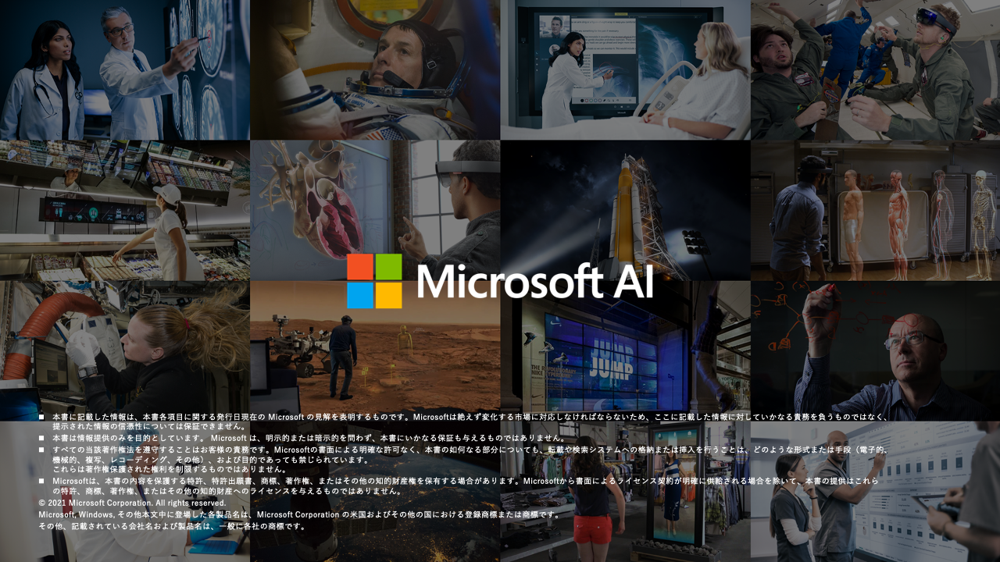

# クロージング

- [クロージング](#クロージング)
  - [ラーニング パス](#ラーニング-パス)
    - [経験者レベル (L300)](#経験者レベル-l300)
    - [エキスパートレベル (L400)](#エキスパートレベル-l400)
  - [アンケートへのご協力のお願い](#アンケートへのご協力のお願い)

---

## ラーニング パス

### 経験者レベル (L300)

* Azure Machine Learning Service in different scenarios
  * Azure Machine Learning service technical deck
* Advanced Hands-on Tutorials 
  * Build an Azure Machine Learning pipeline for batch scoring
* MLOps
  * Learn about Machine Learning Operations (MLOps) through the interactive demos
  * Introduction to machine learning operations (MLOps)
  * Learn how to manage assets, artifacts, and code with MLOps
  * Learn how to create event driven machine learning workflows
  * Learn how to support CI/CD with GitHub Actions
  * Getting started with MLOps workflow: Azure MLOps (V2) solution accelerator
  * Tutorial: Convert ML experiments to production Python code
  * Machine learning operations (MLOps) framework to upscale machine learning lifecycle with Azure Machine
* Architechtures
  * Modern analytics architecture with Azure Databricks
  * Analytics end-to-end with Azure Synapse
  * Many models machine learning (ML) at scale with Azure Machine Learning
  * MLOps for Python models using Azure Machine Learning
  * Oil and gas tank level forecasting
* Machine learning Solution Ideas
  * Create personalized marketing solutions in near real time
  * Predict length of stay and patient flow
* Responsible AI
  * Interpretability - Additional resource: install InterpretML and train a glassbox model
  * Fairness - Additional resource: install Fairelearn and try example model analysis notebooks

### エキスパートレベル (L400)

* Security
  * Enterprise security and governance for Azure Machine Learning
  * Tutorial: How to create a secure workspace
  * Tutorial: How to create a secure workspace by using template
* Workspace and Compute Resources
  * Plan to manage costs for Azure Machine Learning
* Create and Manage Workspaces
  * Move Azure Machine Learning workspaces between subscriptions
* Azure Machine Learning best practices
  * Organize and set up Azure Machine Learning environments
  * Azure Machine Learning best practices for enterprise security
  * Machine learning DevOps guide
  * Manage budgets, costs, and quota for Azure Machine Learning at organizational scale

---

## アンケートへのご協力のお願い

---

